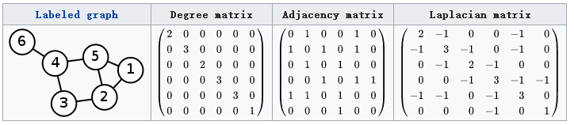

# The Basics

## 拉普拉斯算子

n维欧几里得空间中的一个二阶微分算子，定义为梯度的散度

在笛卡尔坐标系中是函数$f$所有$x_i$的非混合二阶偏导：
$$
\Delta f=\sum\limits_{i=1}^n \frac{\partial^2f}{\partial x_i^2}
$$
拉普拉斯算子也是该函数的黑塞矩阵的迹：
$$
(x+a)^n=\sum\limits_{k=0}^n 
\begin{pmatrix} 
n \\ 
k \\
\end{pmatrix}
x^k a^{n-k} \\
\Delta f=tr(H(f)).
$$
另外，满足▽·▽f=0 的函数f, 称为调和函数。

## 谱分解、特征分解、对角化

同一个概念

## 拉普拉斯矩阵

拉普拉斯矩阵(Laplacian matrix) 也叫做导纳矩阵、基尔霍夫矩阵或离散拉普拉斯算子，主要应用在图论中，作为一个图的矩阵表示。

对于图$G=(V, E)$，其Laplacian 矩阵定义为$L=D-A$，其中$L$是Laplacian 矩阵，$D$是顶点的度矩阵（对角矩阵），对角线上的元素以此为各个顶点的度，$A$是图的邻接矩阵。如下图所示

**常用的拉普拉斯矩阵实际有三种：**

1. $L=D-A$，**Combinatorial Laplacian**
2. $L^{sys}=D^{-1/2}LD^{-1/2}$，**Symmetric normalized Laplacian**
3. $L^{rw}=D^{-1}L$，**Random walk normalized Laplacian**

**拉普拉斯矩阵的性质：**

1. 拉普拉斯矩阵是半正定矩阵：
   * 实对称矩阵一定n个线性无关的特征向量；
   * 半正定矩阵的特征值一定非负；
   * 实对阵矩阵的特征向量总是可以化成两两相互正交的正交矩阵；
2. 特征值中0出现的次数就是图连通区域的个数；
3. 最小特征值是0，因为拉普拉斯矩阵每一行的和均为0；
4. 最小非零特征值是图的代数连通度。