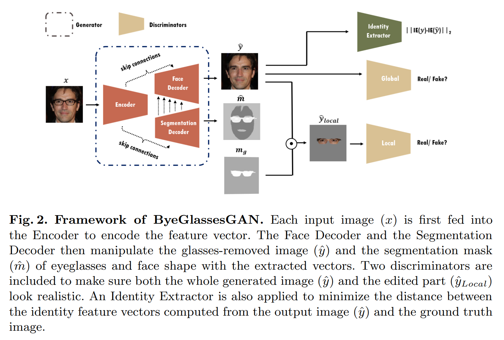

# ByeGlassesGAN

用于去掉眼镜的GAN框架

## 1 Introduction

blahblahblah

## 2 Related Work

blahblahblah

## 3 ByeGlassesGAN

提出一个用于预测眼镜位置并将其从源图像上移除的多任务学习方法。

### 3.1 Proposed Framwork

Figure 2展示了ByeGlassesGAN整体框架，其包含一个生成器，一个身份提取器和两个判别器。生成器(G)可以分成三个深度神经网络：编码器(E)，面部解码器(FD)和分割解码器(SD). 在这里我们假设训练数据包含一组人脸图片(x)和对应的去除眼镜后的图片(y)、对应眼镜区域的mask以及完整的面部形状。给定一张源人脸图片$x$，首先经过编码器编码特征向量。然后使用面部解码器根据编码得到的特征向量合成一张去掉眼镜的图片$\hat{y}$. 同时，分割解码器生成眼镜区域的mask$\hat{m}$. 但是在对这个baseline模型进行测试后我们发现尽管有很多效果良好的去除结果，但是当眼镜比较特别或人脸不是正脸的时候效果会下降。因此怀疑是否存在一个好的人脸表达可以帮助移除眼镜。由于移除眼睛可被视为一种人脸区域的图像修复任务，可以引入人脸和眼镜区域的语义分割mask到框架中。人脸形状的分割是引导FD（面部解码器）了解面部区域中的每个像素的角色并且相邻像素间应该保持一致性的很好的线索。实验后发现，让SD（分割编码器）预测面部形状的binary mask同样可以大幅度提高眼镜移除结果的效果。因此让SD不仅预测眼镜区域的binary mask，同时也预测面部形状的binary mask. 另外，从SD获取的信息同样使用跳跃连接与FD进行共享来知道FD合成图像。因此就有
$$
\hat{y}=FD(E(x)) \qquad (1)\\
\hat{m}=SD(E(x)) \qquad(2)
$$
其中$\hat{m}$是一个两通道的mask，一个通道代表眼镜区域，另一个代表人脸形状。而且为了保证合成输出$\hat{y}$的质量，使用一个全局判别器和一个局部判别器来保证合成图像$\hat{y}$和修复后的眼镜框区域$\hat{y}_{Local}$看起来真实。另外同样引入一个身份提取器来最小化输出图片($\hat{y}$)和gt图片($y$)身份特征向量的距离。

### 3.2 Objective Function

目标函数由四个loss函数组成，即对抗loss，像素loss，分割loss和id保持loss. 

**Adversarial Loss** 为了使生成的图片尽可能的真实，采用对抗学习的策略。这里使用了LSGAN的目标函数，因为与标准对抗loss相比，它可以让GAN的训练过程更稳定。使用了两种GANloss：$L_{GAN}^{Global}$和$L_{GAN}^{Local}$来训练判别器。公式（3）展示了全局对抗损失：
$$
L_{D}^{Global}=\mathbb{E}_{y\sim P_y}[(D_{Global}(y)-1)^2]+\mathbb{E}_{x\sim P_x}[(D_{Global}(\hat{y}))^2] \qquad (3)
$$
计算$L_{D}^{Local}$的时候，将公式（3）中的$y,\hat{y},D_{Global}$替换为$y_{Local},\hat{y}_{Local},D_{Local}$. $y_{Local}=y\odot m_g,\hat{y}_{Local}=\hat{y}\odot m_g$. $\odot$代表点积操作，$m_g$是眼镜区域mask的gt. 训练生成器时使用的GAN loss如下：
$$
L_G^{Global}=\mathbb{E}_{x\sim P_x}[(D_{Global}(\hat{y})-1)^2] \qquad(4)
$$
计算$L_G^{Local}$的时候，同样将$\hat{y},D_{Global}$替换为$\hat{y}_{Local},D_{Local}$.

**Per-pixel Loss** 计算生成图像$\hat{y}$和gt图像$y$间的$L_1$距离。像素loss强化了生成器的输入与gt的相似度。采用两种$L_1$loss，$L_{L_1}^{Global}$和$L_{L_1}^{Local}$. $L_{L_1}^{Local}$用于增强生成器在编辑区域的去除能力。全局L1loss定义为：
$$
L_{L_1}^{Global} = L1(\hat{y},y)=\mathbb{E}_{x\sim P_x}[\Vert y- \hat{y}\Vert_1] \qquad (5)
$$
计算$L_{L_1}^{Local}$的时候将$\hat{y},y$替换为$\hat{y}_{Local},y_{Local}$.

**Segmentation Loss** 由于我们希望ByeGlassesGAN能够预测用于眼镜清除的分割mask，所以对生成眼镜区域和面部形状的分割mask采用了二元交叉熵损失。其形式为：
$$
L_{Seg}=\mathbb{E}_{x\sim P_x}-(m\cdot log(\hat{m})+(1-m)\cdot log(1-\hat{m})) \qquad (6)
$$
其中$\hat{m}$是生成的musk，$m$代表分割musk的gt.

**Identity Perserving** 为了能够在去除眼镜后的图片中保留身份信息，使用了身份提取器(IE, Identity Extractor)，实际上是一个人脸分类器。

在生成器引入身份距离loss，用于最小化$IE(y)$和$IE(\hat{y})$间的距离。与感知loss类似，在使用身份提取器提取$y$和$\hat{y}$的特征之后，计算两个特征向量间的MSE，形式为：
$$
L_{ID}=\mathbb{E}_{x\sim P_x,y\sim P_y}[\Vert IE(\hat{y})-IE(y)\Vert _2] \qquad (7)
$$
这个loss激励移除眼镜后的图片$\hat{y}$与gt图片$y$在身份提取器模型的特征空间内共享相同的身份信息。

注意到IE是一个使用UMDFaces数据集预训练的ResNet34分类器。当训练身份分类器的手，将ResNet的layer4的输出变成512维特征向量，并使用ArcFace loss.

最终，生成器的完整loss函数为：
$$
L_G=\lambda _1L_{G}^{Global}+\lambda_2L_G^{Local}+\lambda_3L_{L_1}^{Global}+\lambda_4L_{L_1}^{Local}+\lambda_5L_{Seg}+\lambda_6L_{ID} \qquad(8)
$$

### 3.3 Network Architecture

这个基于GAN的眼镜去除框架包含一个生成器，两个判别器和一个身份提取器。生成器中有一个编码器(E)和两个解码器（面部解码器FD和分割解码器SD）。沿用ELEGANT的配置，编码器有5个卷积块构成，每个块包含一个卷积层接一个IN层和一个LeakyRelu激活函数。面部解码器FD和分割解码器SD都由5个反卷积块和一个输出块构成。每个反卷积块包含一个反卷积层接一个IN层和一个LeakyRelu激活函数。FD的输出块是一个反卷积层接一个Tanh激活函数，SD的输出块是一个反卷积层接一个Sigmoid激活函数。由于期望只修改原图中的眼镜区域，其他区域应该保持不变。使用U-NET架构作为ByeGlasses-GAN的生成器。在E-FD和E-SD的对应层间增加跳跃链接。与一般的编码解码器相比，U-NET可以大幅度降低信息的损失。另外，添加跳跃链接用于使FD利用SD获取的信息来重建图像。两个判别器所使用的网络架构是pix2pix中提出的PatchGAN.

## 4 Synthesis of Face Images with Eyeglasses

