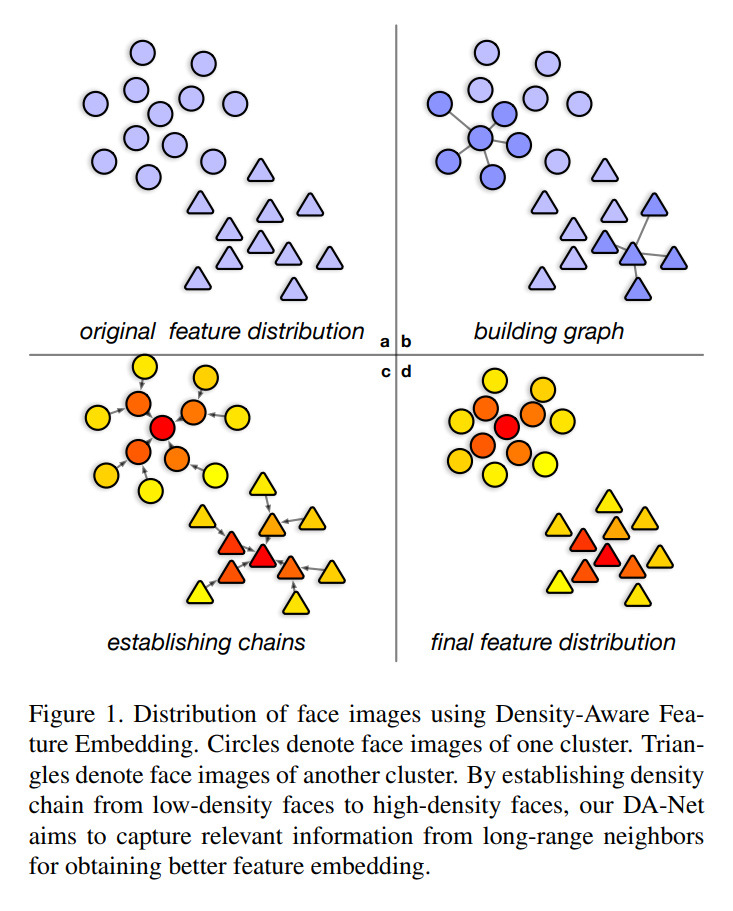
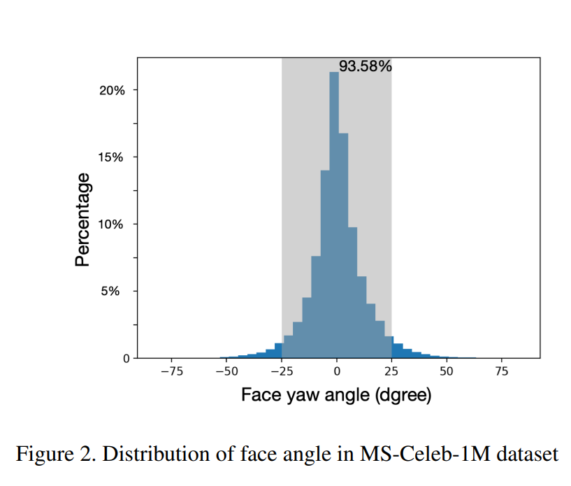
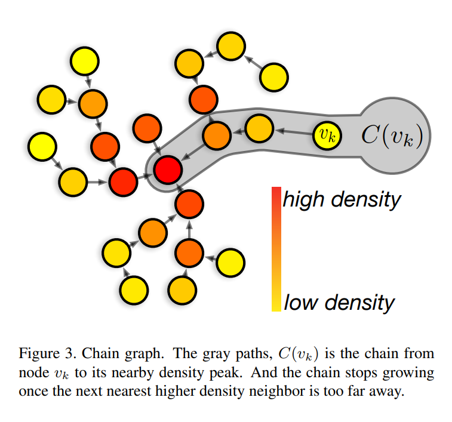
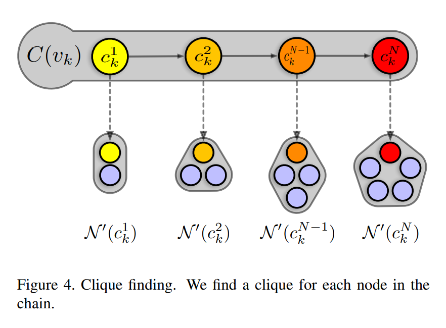

# Density-Aware Feature Embedding for Face Clustering

## Abstract

聚类在科研界和工业界有很多应用。但是传统的聚类方法，例如K-means，DBSCAN和HAC都采取了过于简单的假设，因此并不适用于人脸聚类。为了适应现实问题的分布，一种自然的方法是使用图卷积网络来曾倩用于聚类的特征。但是GCNs只能处理局部信息，它会忽略聚类族的全局特性。本位提出一种用于人脸聚类任务的密度感知的特征嵌入网络(DA-Net, Density-Aware Feature Embedding Network)，它利用局部与非局部信息来学习一个鲁棒的特征嵌入。具体来说，DA-Net利用GCNs来聚合局部特征，然后通过一个密度链来合并非局部信息，密度链是一个人脸的链，按密度从低到高排列。密度链会利用数据集中人脸图像的非均匀分布。然后将密度链传入一个LSTM来生成最终的特征嵌入。之后就可以用传统的聚类方法进行聚类。

## 1. Introduction

传统的非深度学习的聚类方法使用确定的全局超参数来对聚类行为进行决策。例如，DBSCAN依赖于一个阈值来决定两个节点是否属于同一个聚类，层次聚类方法同样使用某种准则来决定聚类的分裂和合并什么时候停止。但是这些方法在人脸图像数据集的复杂分布上的效果不好，因为每个人的图片分布的边界条件间的差异使其无法同时得到较好的聚类效果。

现有的非深度学习和深度学习方法都直接使用特征提取模块提取得到的视觉特征进行聚类，这会导致一些问题。具体来说，由于不同人的图片在姿态、光照、相机设置等方面的差异，不同人之间类内特征的分布通常是不同的，而视觉特征，无论是学习得到的还是人工设计的，在面对这种分布差异的时候仍不够鲁棒，致使这些聚类方法轻易将离群点划入聚类中。Figure 1(a)展示了一个例子，两个id的人脸图片很靠近，难以通过原始特征将其区分开。本文中，我们的的目的是使用其邻近图片的信息来学习图片的一种上下文感知的特征。学习得好的特征通过简化类内特征分布来促进人脸聚类效果。

标准的GCNs通常依赖于一阶邻居的连接关系，得到的特征仍然缺少较远距离特征的信息。为了将远处的特征也考虑进来，就得堆叠GCN层，涉及的节点数就呈几何级数增长，这个方法效率较低。举例说明，假设一个样本有10个邻居，那么在图中进行10步信息传递就会涉及到10^10个样本/节点，所需的内存和算力过于庞大。

由于将整个图都放到GCN框架中并不理想，就需要选择携带最重要信息的节点作为网络的输入。问题就转化为哪些节点应该被选中。由于拍照习惯和人脸检测模型能力，在较好条件下捕捉到的人脸，例如正脸，光照合适且中性表情，更有可能捕捉并放入数据集中，我们就称之为*标准脸*。这些人脸图片应该是我们最想选出的图片，也是包含与非局部信息相关性最高的部分。如Figure 2所示，可以看到大多数人脸的偏航角在0左右，具体来说，93.58%的人脸都在25度之内。那么剩下的问题就是如何找到有更高概率密度的特征。

尽管估计分布本身是不现实的，我们仍可以找到有更高密度的特征，因此可以提取到图中更重要的部分来表示非局部信息。基于上述局部增强特征和用标准特征表达非局部信息的动机，提出一个密度感知特征嵌入网络(DA-Net, Density-Aware Feature Embedding Network)用于在局部与非局部邻居间聚合相关的信息。为了明确非局部部分，在余下内容使用“远距离的”来指代。DA-Net有两个子网络：第一个是基于GCNs的局部小范围网络，其目标是根据局部邻居的上下文信息来学习特征嵌入。第二个是基于CNNs的远距离链网络，它将链上的知识作为一个学习路径进行聚合，从目标样本开始，逐渐移动到附近的密度峰值/标准特征。密度链的例子见Figure 1(c)

由上述讨论结果，密度更高的特征就是（拍摄）条件更好的人脸图片。因此，一张人脸图片与其附近的更高密度的人脸图片是同一个人的概率更大。那么，（密度）链倾向于描述一致的身份，也就是链上每个特征的图的最重要的部分。在id一致性的链上生成特征嵌入更有可能提升表达效果。这种方法所基于的假设为：聚类中心通过一个密度峰值来描述，其密度比它的邻居都要高一些，且与其他聚类中心距离较远。考虑一个样本临近的密度中心可以更好地发掘远距离和密度感知的信息。通过简化图到链的关系，这个网络只需要更新链上的特征，这样显著加速了训练和推理的过程。

总结：（1）与传统人脸聚类算法关注于对类间样本关系进行分类不同，本方法通过学习上下文感知特征嵌入，来改进人脸聚类问题，这种方法简化类间特征分布且对于大规模数据集可扩展。（2）特征嵌入基于密度导向的感受野。它同时捕捉局部邻近信息和远距离、类别级的信息。

## 2. Related Work

blahblahblah

## 3. Method

首先，对于每个样本构建一个密度感知的局部图，然后通过DA-Net来发掘图中的信息。DA-Net由一个局部子网络和一个远距离链子网络构成，其输出样本增强后的特征。将获取的样本特征嵌入输入到一个基于密度的聚类策略，生成最终的聚类结果。

### 3.1. Data Density

使用KNN图对人脸图片进行建模，其中每一张图片都表示成一个节点，连接到其最近的K个节点。对节点$v_i$，其K近邻表示为$\mathcal{N}(v_i)$. 为了利用分局部信息，有必要对整张图进行压缩并提取最重要的节点。令$f(v_i)$为节点$v_i$经过L2归一化后的CNN特征，我们认为在特征空间，每个人都会有一个分布。

给定第$l$人的概率密度函数$p_l(\cdot)$，$p_l(v_i)$的值代表第$l$人的节点$v_i$被选中的概率。实际上几乎无法查出具体的分布。观察到不同人的特征分布在大多数情况下都不重叠，使用数据密度$\rho(v_i)$来近似这个人的关注的概率。在合适的定义下，有渐进性质
$$
\rho(v_i) \to p_l(v_i) \quad \text{for} \quad |\mathcal{D}| \to \infin \qquad (1)
$$
其中$\mathcal{D}$是这个人的数据集合。这样，数据密度高的特征更可能是这个人，因此特征中包含了这个人重要的面部信息。

考虑节点$v_i$, 数据密度$\rho(v_i)$是根据$v_i$的邻居计算得到的，也就是$\mathcal{N}(v_i)$
$$
\rho(v_i)=\sum_{v_j\in \mathcal{N}(v_i)} \langle f(v_i), f(v_j) \rangle, \qquad (2)
$$
其中内积$\langle f(v_i), f(v_j) \rangle$衡量两个节点间的相似度。

### 3.2. Density-aware Graph Construction

DA-Net通过构建一个密度感知图来利用上下文信息。这个图捕捉类别级的结构，逐步将目标图片与其有更高密度的非局部邻居关联起来。对于节点$v_k$，首先从$v_k$到其附近的密度峰处生成一个链图。链图在多个步骤中增长，每一步按顺序向链图中添加一个节点。明确符号，将链定义为$C(v_k)=\{c_k^1, c_k^2,...,c_k^N\}$, 其中$c_k^i$是链上的节点，$c_k^1$就是$v_k$. 假设第$i$步添加的节点为$c_k^i$，那么$c_k^{i+1}$就是最近的更高密度节点：
$$
c_k^{i+1}=\arg \max_{v} \{ \langle f(c_k^i), f(v) \rangle, v\in \{u|\rho(u)>\rho(c_k^i)\} \}. \qquad (3)
$$
当下一个节点与链尾节点的内积小于某个特定的值就停止往链中添加节点。如Figure 3 所示，密度链从当前节点逐渐移动到最相关的密度峰处。3.1节中提到，与$c_k^1$邻近且密度更高的样本更可能成为标准特征，并且对应到同一个人。因此这些数据密度更高的样本在表示聚类结构和引导更新节点$c_k^1$特征的时候就更有用。

给定链图$\{ c_k^i \}_{i=1}^N$,  通过将链上的每个点的一个小集团附着在其上来对其进行扩展。小集团中的节点包括$c_k^i$和它最近的邻居$\mathcal{N}(c_k^i)$. 为了减少不想管邻居的影响，在小集团内部采取一个基于阈值的剪枝方法，被剪掉的节点表示为：
$$
\mathcal{N}'(c_k^i)=\{ v|\langle f(v),f(c_k^i) \rangle > \tau,v\in \mathcal{N}(c_k^i) \}, \qquad (4)
$$
其中$\tau$是根据原始特征的到的经验值。

### 3.3. Local Clique Network

局部集团网络基于GCN，其目标是更新链中每个节点的特征。如Figure 4所示，对每个节点，都采用其对应的小集团作为输入。给定小集团$\mathcal{N}'(c_k^i)$，定义邻接矩阵$A(c_k^i)\in \mathbb{R}^{|\mathcal{N}'(c_k^i)|\times |\mathcal{N}'(c_k^i)|}$, 其元素都是内积。初始特征矩阵由小集团中的所有原始特征拼接而成，表示为$F^0(c_k^i)\in \mathbb{R}^{|\mathcal{N}'(c_k^i)|\times d}$. GCN每层都更新特征矩阵：
$$
F^{l+1}(c_k^i)=\sigma (\alpha \cdot F^l(c_k^i)+(1-\alpha)\cdot D^{-1}(c_k^i)A(c_k^i)F^l(c_k^i)W^l), \qquad (5)
$$
其中$F^l(c_k^i)$是第$l$层GCN更新的$c_k^i$小集团的节点特征，$D(c_k^i)$是对角矩阵，其元素$D_{i,i}(c_k^i)=\sum_jA_{i,j}(c_k^i)$, $\sigma$是ReLU函数，$\alpha$是可学习参数用于控制更新的特征和其上下文信息见的平衡关系。直观上，这一公式描述了取小集团中原始特征加权平均，用$W^l$进行变换，与之前特征$F^l(c_k^i)$合并然后经过一个非线性激活的过程。这一流程与CNN模型类似，但是是在拥有不确定拓扑结构的图上进行操作的。这个方法通过将较大的图分解为多个小集团的方式，大幅度加速了训练和推理过程。使用$L$层的GCN，从$F^L(c_k^i)$中对应的行获取了节点$c_k^i$的嵌入特征，表示为$\phi(c_k^i)$.

### 3.4. Long-range Chain Network

远距离链网络基本上就是个CNN的注意力网络。对节点$v_k$，链特征表示为$\{\phi(c_k^1),\phi(c_k^2),...,\phi(c_k^N) \}$. 使用transformer架构更新节点特征，如Figure 5所示。Transformer使用query，key和value的三元组形式。首先估计一个query特征，这个query特征通常指明我们希望从样本中提取到什么。