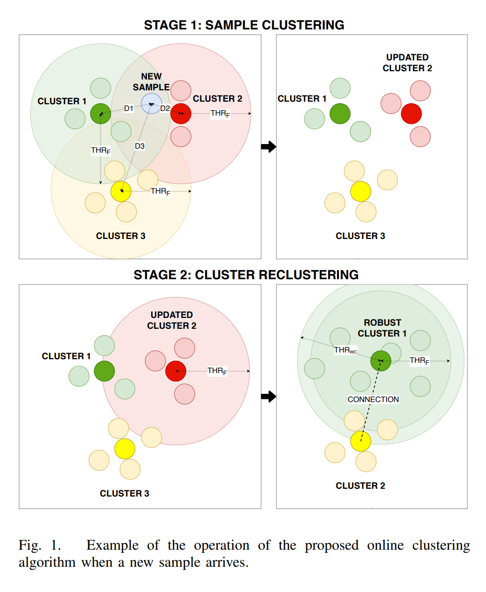
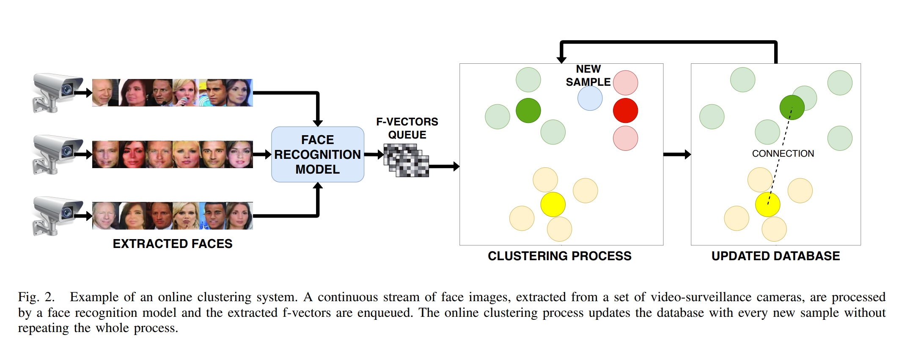
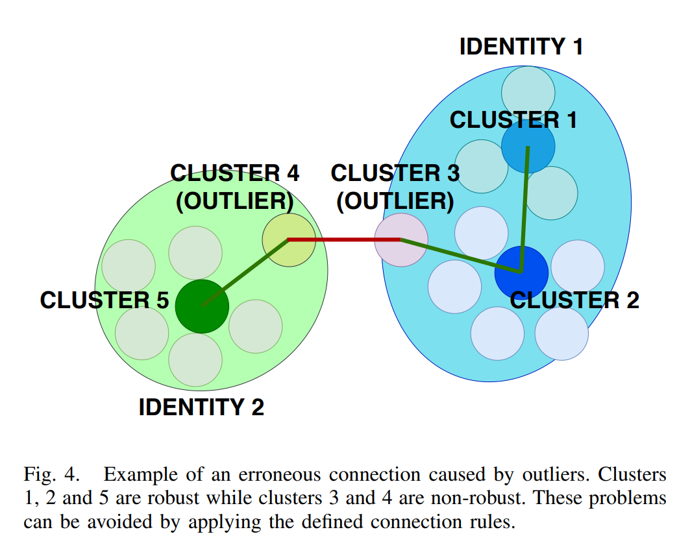

# Efficient Large-Scale Face Clustering Using an Online Mixture of Gaussians

## Abstract

解决大规模在线人脸聚类问题：给定一个连续的未知人脸的流，创建数据库并根据人脸id将其分类。每次新出现一张人脸图片数据库都要进行更新，而且解决方案必须高效精准而且可扩展。为此提出一个在线基于高斯混合的在线聚类方法(OGMC). 关键思想是每个id都可以通过不止一个分布或者聚类来表达。用提取到的人脸特征，OGMC生成一系列聚类族，根据邻接关系和鲁棒性，它们可能会连到一起。每次一个聚类更新一个新样本的时候，它的连接也同样会更新。通过这种方式，降低了聚类过程对顺序和数据规模的依赖，并且可以应对复杂的数据分布。

## I. INTRODUCTION

人脸聚类两个应用：1. 实时视频监控，维护并更新id的数据库，对位置进行控制或进行reid任务。2. 大型基础设施的人流监控，目的是产生“业绩指标”，例如“等待时间”、“人流量”、“人物画像(person showup profile)”、“队伍长度超限”和“区域占用”等，这些指标的计算是在数量不断增长的大量摄像头上进行的，因此也就需要更高级的计算可扩展性。

blahblahblah

大多数sota的聚类方法都是离线的，这些离线的方法不适合大规模的实时场景，因为每次新来一个样本就要进行一次聚类。而且其中大多数方法都无法处理复杂的数据分布。

为了解决这一问题，提出一个基于高斯混合的在线聚类方法(OGMC). 关键思想是每个id都可以通过不止一个分布或者聚类来表达。

## II. RELATED WORK

***A. Unconstrained Face Clustering***

blahblahblah

***B. Online Clustering***

在线聚类中，<Fully online clustering of evolving data streams into arbitrarily shaped clusters>的方法，样本聚成球状的静态小聚类，彼此连接以创建形状动态变化的大聚类。

人脸聚类同样有一些在线的方案。在<An online algorithm for constrained face clustering in videos>中，作者提出一种用于长视频的在线人脸聚类算法。将数据处理成不定长度的短片段序列，然后根据人脸表达和一些时间和空间的限制来创建聚类。对这种限制的依赖使这种方法不适合于非限制场景。

blahblahblah

## III. PROPOSED METHOD

***A. Problem Definition***

考虑在线聚类问题：给定一个连续的未知人脸流，创建一个数据库根据输入的人脸id对它们进行分组。每输入一张新的人脸图片，数据库都要进行更新，这样已有的id的信息是实时可获取的。在线聚类系统的例子见Figure 2. 考虑到时间效率和可扩展性，每次都重新生成整个数据库是不现实的，因此算法必须使用数据库中已有的信息来对新样本进行聚类并更新数据库。这样可以对这个问题进行建模：
$$
D_i=F(S_i,D_{i-1}) \qquad (1) \\
D_i=C_i,I_i 
$$
其中$D_i$是第i次循环中更新后的数据库，$F$是每次循环都会重复的聚类过程，$S_i$是第i个样本，代表归一化后的N维特征向量，$D_{i-1}$是上一次循环的数据库结果。数据库$D$是通过聚类$C$和它们对应的身份$I$来表示的。目标是对$F$进行建模最大化精度和可扩展性并最小化迭代时间。

***B. Expectation-Maximization Approach***

分成两个阶段：

* 样本聚类阶段：对新样本进行聚类，更新现有聚类或者创建一个新聚类
* （聚类）再聚类阶段：循环进行，尝试融合已有聚类

这个两阶段过程如Figure 1所示

***C. Cluster Connections***

因为要在非限制场景下应用，所以必须考虑到复杂的数据分布情况，因此也必须考虑一个id被多个聚类表示的可能性。例如，一个人的人脸属性也许会改变（如眼镜、胡子、头发、姿态、光照情况等），如果尝试将（一个人的）所有图片都聚到一个类中可能会导致由过低阈值和低质量中心引起的错误。

因此引入聚类连接的概念。两个聚类间的连接代表它们属于同一个id，但是却在特征空间中表达不同的分布。换句话说就是这两个聚类有较高的相似度，但是没有高到可以进行融合的程度。这样，这个算法通过创建相互连接的聚类树来解决复杂的数据分布。

进一步，根据这些连接，大幅度降低了对图片输入顺序的依赖，因为每当与一个新样本或者其他聚类进行融合的时候，这个聚类的连接都会进行检查和更新。

但是，如果对连接的数量不加控制，可能会导致不同id的离群点与聚类间连接的存在，见Figure 4. 为了解决这个问题，创造了鲁棒聚类的概念以及一些用于对连接进行控制的规则。如果一个聚类由至少$ns_r$个样本组成，则认为它是鲁棒的，这样就可以确定它不是一组离群点。连接的规则如下：

* 一个非鲁棒聚类最多只能有一个连接，且只能连接到一个鲁棒聚类上。通过这一规则，我们避开了离群点和一个id的非鲁棒成员间的冗余连接引起的错误连接，解决了Figure 4中展示的问题。
* 两个鲁棒聚类不可以融合到一起。将一个鲁棒聚类视为一个有效分布，其代表一个id样本的子集。因此将两个鲁棒聚类合到一起会导致该id表达变差，并导致信息损失。
* 一个鲁棒聚类会有一个连接的最大值$nc_{max}$. 加入这个限制是为了降低计算时间，特别是验证一个聚类的连接是否仍然有效的时间。
* 每次一个聚类进行融合或连接到其他新聚类时，都会激活一个对连接进行检查的进程。这个函数会检查要更新的聚类的连接是否有效、是否超过最大连接数。如果超过，则移除最弱连接。

***D. Cluster Representation***

下一步是选择表示聚类的参数。为了能够得到准确的结果，这些参数必须包含关于聚类的足够的有用信息。而且这个信息应该简洁精炼，因为算法必须快速且可扩展。

考虑上述因素，决定使用多元正态分布对聚类族进行建模，因为它只依赖于两个参数：均值向量$\mu$和协方差矩阵$\Sigma$. 这一选择的动机还来源于EM算法在这种分布上的效果较好。因此描述N维样本$S_i$属于聚类$j$的概率的密度函数为：
$$
P(S_i|C_j) \propto exp \Big( -\frac{1}{2}(S_i-\mu_j^T)\Sigma_j^{-1}(S_i-\mu_j) \Big) \qquad (6)
$$
其中$S_i$和$\mu_i$间的马氏距离可以直接用于评估对于一个确定样本，哪个中心点离它更近。实际上，如果假设所有维度都相互独立并且有相同的方差，就可以对马氏距离进行操作来降低计算量，定义如下：
$$
D_M(S_i,\mu_j,\sigma_j)=\frac{1}{\sigma}dist(S_i,\mu_j) \qquad (7)
$$
其中$dist(S, \mu)=\lVert s-\mu \rVert_2$.

于是便可以用这些正态分布的高斯混合对两个聚类的比较结果（融合，连接或者是没有关系）进行建模，并且通过马氏距离进行高效计算。这些分布的均值都为0，与两个中心的最小可能距离相同。它们的标准差$\sigma$的值取决于比较的聚类是否是鲁棒聚类，以及前述的连接规则，见Figure 5.

因此，定义三个欧氏距离阈值对应不同的$\sigma$生成的全部可能情况：

* 融合阈值$thr_f$: 决定两个聚类是否应该进行融合
* 弱连接阈值$thr_{wc}$: 将鲁棒聚类与非鲁棒聚类进行连接
* 强连接阈值$thr_{sc}$: 连接两个鲁棒聚类

一个聚类的均值由其中心$C^*$来表示，通过对当前聚类中所有样本特征的和进行归一化得到：
$$
SC_j=\sum S \in cluster_j \\

$$
