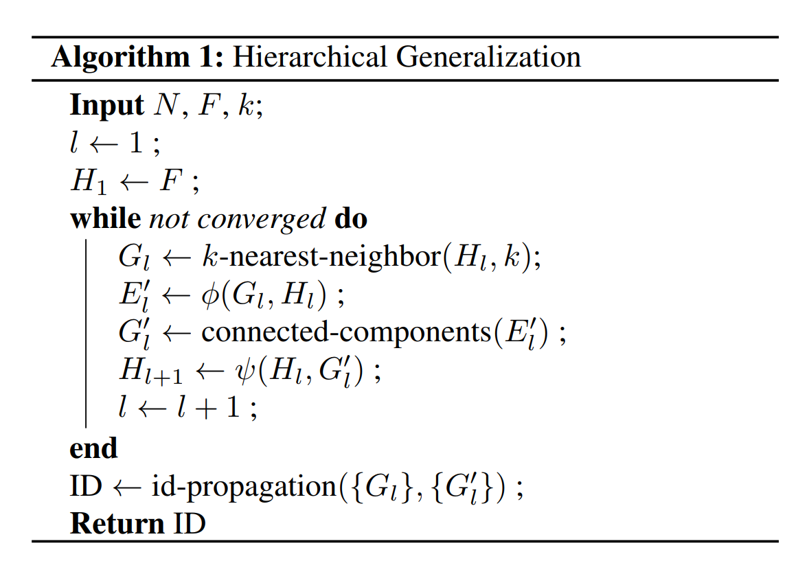

# Learning Hierarchical Graph Neural Networks for Image Clustering

每一层聚合后都得到一个新的图

生成新图->聚类$\phi$->特征聚合$\psi$->生成新图->聚类->...

### Realizing the Cluster Function$\phi$
密度和连接信息都是有效的监督信号，我们同时使用。
**Graph Encoding** 对每个节点，用一组图注意力网络(GAT)来编码其特征，得到新的特征。

**Joint prediction for density and linkage** 对于图中的一条边，将其连接的两个顶点的特征拼装到一起传到一个MLP（Softmax）中得到连接概率，即当前边连接的两节点为同一类的概率。还用这个值来预测一个节点的伪密度估计，衡量了同一个类别节点在其近邻中的相似度加权比例（这个值只是一个近似，而非严格的非负密度，其和也不为1）

出于这个目的，先计算两个节点$v_i,v_j$间的相似度（特征内积）$a_{ij}$。然后计算对应的边的系数：
$$
\hat{e}_{ij}=P(y_i=y_j)-P(y_i\ne y_j)
$$
j是i的k近邻（的索引）
可以将$\hat{d}_i$定义为：
$$
\hat{d}_{i}=\frac{1}{k}\sum_{j=1}^{k}\hat{e}_{ij}\cdot a_{ij}
$$

**Graph Decoding** 获取连接概率和节点密度估计之后，按下述解码流程将它们转换成最终的聚类结果。首先，在一开始$E'=\empty$. 给定$\hat{e}_{ij},\hat{d}_i, p_{ij}$和边的连接阈值$p_\tau$，定义节点$v_i$的侯选边集合$\mathcal{E}(i)$为：
$$
\mathcal{E}(i)=\{ j|(v_i,v_j) \in E \quad \text{and} \quad \hat{d}_i \le \hat{d}_j \quad \text{and} \quad p_{ij} \gt p_{\tau} \}
$$
对任意$i$, 如果$\mathcal{E}(i)$不为空，则选择：
$$
j=\argmax_{j\in \mathcal{E}(i)} \hat{e}_{ij}
$$
并将$(v_i,v_j)$添加到$E'$中。需要强调的是，对边连接阈值$p_{\tau}$的选择调整过程只在验证集上进行。在meta-training之后是固定的。这与无监督聚类算法的参数选择过程不同。
另外，$\mathcal{E}(i)$的定义保证了每个$\mathcal{E}(i)$不为空的节点$v_i$都会向$E'$中添加一条边。另一方面，每个$\mathcal{E}(i)$为空的节点都会成为没有边连接的peak节点。与此同时，条件$d_i \le d_j$在建立连接时引入了一个归纳偏置。由于密度低的节点一般是那种与其他类有相同邻居的数据，或者在多个类别边界上的节点，因此一般希望排除掉与这种节点的连接。在一次所有节点的完整的传递之后，$E'$形成了一组相连接的部分$G'$，作为聚类结果。

### Realizing the Aggregation Function $\psi$
对下一层（下一个图）的新节点定义两个特征向量，分别是identity feature $\tilde{h}_i^{(l+1)}$和average feature $\bar{h}_i^{l+1}$
$$
\tilde{h}_i^{(l+1)}=\tilde{h}_{m_i}^{(l)} \\
\bar{h}_i^{(l+1)}=\frac{1}{|c_i^{(l)}|}\sum_{j\in c_i^{(l)}}\tilde{h}_j^{(l)}
$$
其中$m_i=\argmax_{j\in c_i^{(l)}}\hat{d}_j^{(l)}$，代表连接部分$c_i^{(l)}$的peak node index（密度最大）. 在第一层，$\tilde{h}_{i}^{(0)}=\bar{h}_i^{(0)}=f_i$

>identity feature是聚类结果中密度最大的节点的特征
average feature是这个聚类的平均特征
下一层中这个聚类对应节点的特征是这两个特征拼接得到的新特征

### Hi-LANDER Learning
因为超节点的融合后特征与节点的原始特征总是位于同一个嵌入空间，因此可以在多层结构中共享同一个GNN模型参数
**Hierarchical Training Strategy** 给定k和gt标签，就可以确定当层次聚合收敛的时候的等级L. 因此按照Algorithm 1中的方法构建图的序列$\{G_l\}$，唯一不一样的地方是我们在每一层都使用gt的边连接信息$\{E_l'^{gt}\}$，因此也使用了gt的中间级聚类结果$\{G_l'^{gt}\}$来进行图的构建。初始化LANDER并在全部的中间图$\{G_l\}$上进行训练。在一个epoch中，对每个$G_l$进行循环，在$\{G_l\}$上前向传播，然后计算loss

**Training Loss** loss由两部分组成：
$$
\mathcal{L}=\mathcal{L}_{conn}+\mathcal{L}_{den}
$$
第一项提供对连接预测的监督，使用每条边平均连接损失：
$$
\mathcal{L}_{conn}=-\frac{1}{|E|} \sum_{(v_i,v_j)\in E} l_{ij}
$$
其中$l_{ij}$是每条边的loss：
$$
l_{ij}=
\begin{cases} 
q_{ij}\log p_{ij}+(1-q_{ij})\log(1-p_{ij}),&\text{if $d_i \le d_j$}\\
0,&\text{otherwise}
\end{cases}
$$
q是gt标签，当这条边所连接的两个节点属于同一类的时候为1.
第二项代表邻居密度平均loss：
$$
\mathcal{L}_{den}=\frac{1}{|V|}\sum_{i=1}^{|V|}\lVert d_i-\hat{d_j}\rVert _2^2
$$
训练的时候这两项在所有层的数据上进行平均。