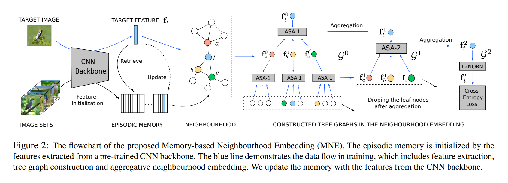
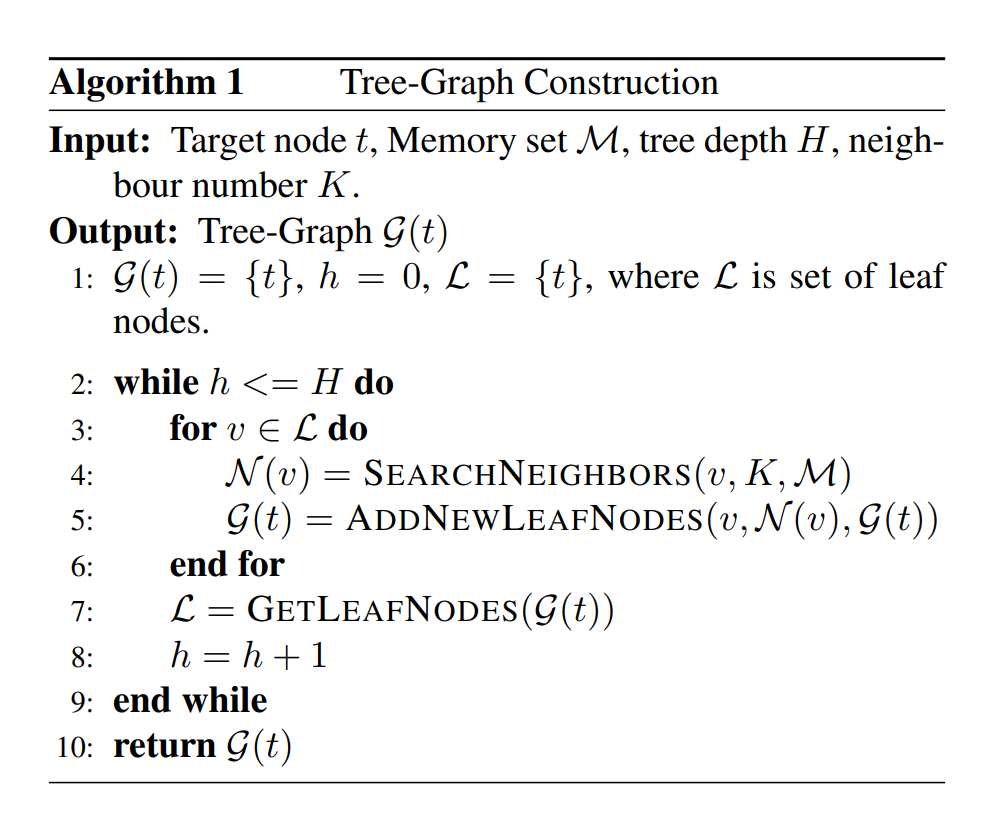
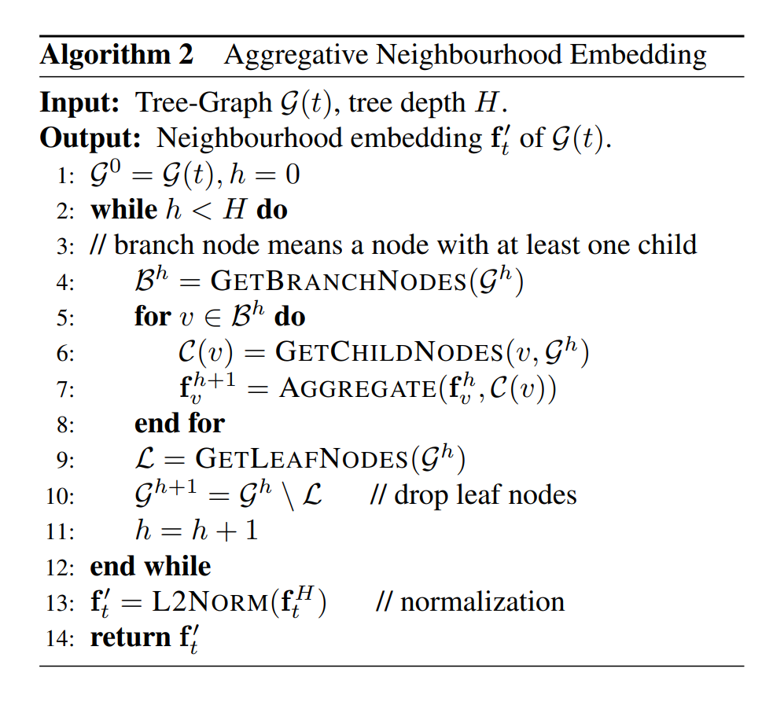
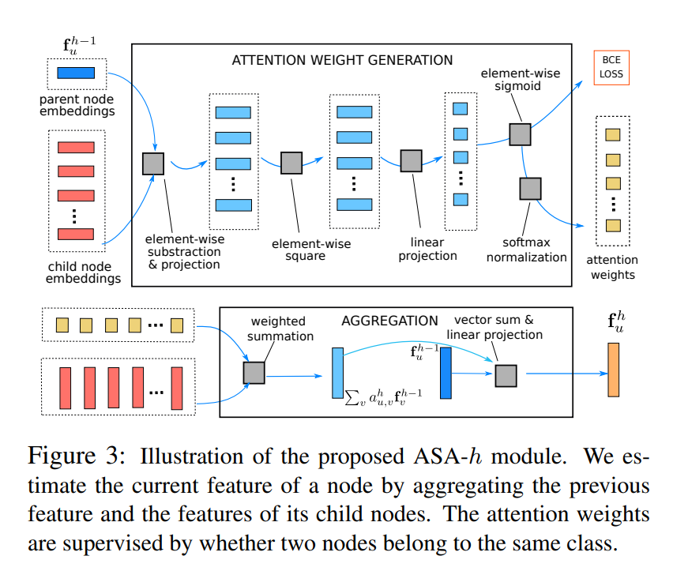

# Memory-Based Neighbourhood Embedding for Visual Recognition

## Abstract
为了获得更优的特征嵌入，一些方法通过设计不同的网络或损失函数来实现，本文提出通过基于内存的邻接嵌入(MNE, Memory-based Neighbourhood Embedding)通过考虑其相邻特征来增强一个普通的CNN特征。

## 1. Introduction
通过网络获取的特征是基于单张图像的，并忽略了丰富的上下文信息。当同一类别物体的差异变化剧烈或者不同类别物体外观差异很小的时候，就难以根据单张图片来分辨类别。如Figure 1所示，两个类别的特征距离很近。但是如果将个别特征和其相邻特征考虑在内，就可以将两个不同的特征分成两个聚类，而它们的邻接关系也可以用于修改原始特征得到分辨能力更强的新特征。
对于常见的神经网络，基于batch的训练策略决定了一个训练样本只能观测到同一batch图片的特征。为了能够获取更多相关的上下文信息，我们在网络中加入了一个不定时内存(episodic memory)，其中保存了很多图片的特征和标签，特征在训练过程中实时更新。对于batch中的每张图片，从内存中取出它的近邻并将这些图片组织成树图的形式，其中目标位于根节点。基于树的结构提出一种迭代的聚合策略，逐渐将邻居的信息传递到根节点。用这种方式，与目标相邻的近邻对目标的影响更大。如果两个节点属于同一个类别，就要用一个更大的聚合权重，这样可以帮助生成更紧凑的类内的邻居embeddings. 引入一个新的注意力模块来预测聚合权重，用节点的类别关系来做监督，从根节点获得目标对象的邻居embedding.
贡献主要有三点：
1. 通过引入episodic内存来探索特征embedding 的邻居信息。这个内存可以提供更多相关的邻居并支持端到端训练。
2. 提出一个迭代式的特征聚合策略用于汇总邻居特征。这个策略将邻居组织成树图的结构并逐次将信息传播至根节点。
3. 引入一个新的注意力模块用于进行特征聚合操作，为了能够将不同类别embeddings更好的区分开，通过节点间的语义关系进行监督。

## 2. Related Work
。。。

## 3. Methodology
目标是通过检查周围邻居节点与当前节点的关系来增强单张图片的embedding. 增加episodic内存，给定一个提取得到的特征，在内存中搜索近邻并组织成树图的形式。最终的特征通过一个基于注意力的迭代式聚合策略在树状结构上得到。实际上我们对树叶节点进行动态剪枝并且通过节点对间关系来对注意力权重进行监督。整体结构如Figure 2所示。

### 3.1. Episodic Memory
在大多数情况下，一张图片的特征embedding足以编码其用于视觉识别的语义信息。另外，由于特征相似的图片通常属于同一个或者相关的类别，所以同样可以通过检测一张图片近邻的特征来估计它的标签。为了在保证标准模型的性能和泛化能力的同时实现快速获取相关邻居，引入了一个episodic内存模块。
训练的时候，一个episodic内存$\mathcal{M}$由训练数据的数据和标签构成：
$$
\mathcal{M}_{train}=\{(\textbf{f}_i,y_i)|i\in \mathcal{D}_{train}\}
$$
其中$\textbf{f}_i$是实例$i$的特征embedding，$y_i$是对应的类别标签。其中保存的实例数量是不固定的。一般来说数量越多越好，因为这样可以提供更多相关的邻居。在训练的时候特征实时更新。
在模型推理的时候不需要标签信息

### 3.2. Embedding with Neighbourhood Tree Graph
这个方法的主要目的是为了获取一个用于视觉识别的更鲁棒的特征embedding. 与直接从单张图片提取特征不同，我们根据其邻居进行了“重新估计”，邻居是通过树图来建模的。实际上，将目标实例作为根节点，然后以迭代的方式构建树。每次对每个节点以增加K近邻作为新的叶节点的方式进行扩展。树图深度达到预定值时停止扩展。具体的流程如Algorithm 1所示。值得注意的是算法中允许同一个节点在一棵树中多次出现。经常出现的节点一般是邻居中的“中心节点”，会对最终的特征embedding形成较大影响。

一个实例的embedding随后可以利用邻居树图来探索更丰富的信息。由于图中的节点没有顺序信息，因此如CNN和RNN的标准神经网络无法直接应用。为了解决图的输入，我们在连接的节点上迭代地使用特征聚合操作，逐渐将图中的信息传递至目标实例。具体来说，节点$u$的第$h$次特征聚合可以表示为：
$$
\textbf{f}_u^h=\text{AGGREGATE}(\textbf{f}_u^{h-1}, \mathcal{C}(u))
$$
其中$\mathcal{C}(u)$是节点$u$的子节点，$\textbf{f}_u^0$是原始特征。直观上与目标实例近的节点应该对最终的embedding的影响更大。所以在一个动态图上进行特征聚合操作，如Algorithm 2所示。每次更新树中的全部分支节点的特征，然后丢掉叶节点从而形成一颗新的树。最终只剩下一个节点，它的特征就是邻居embedding. 在邻居embedding上使用交叉熵损失：
$$
\mathcal{L}_C(t)=-\sum_{i=1}^I y_{i,t}\log \Bigg(\frac{\exp(\textbf{w}_i^T\textbf{f}_t')}{\sum_{j=1}^I\exp(\textbf{w}_j^T\textbf{f}_t')}\Bigg)
$$
其中$y_{i,t}$代表图片是否属于第$i$个类别，一共有$I$个类别

### 3.3. Aggregation with Supervised Attention
一般的聚合策略，例如均值池化或者最大池化无法确定哪些邻居更重要。为了能够适应性地聚合同一类别的特征，提出一个网络模块称作ASA来使用有监督注意力来聚合特征(Aggregate features with Supervised Attention).
图中所有父节点的第h次聚合都是通过同一个模块完成的，如Figure 2所示，表示为ASA-h. 在这个模块中引入关于子节点的注意力权重，聚合操作表示为：
$$
\textbf{f}_u^h=\textbf{W}_A^h(\textbf{f}_u^{h-1}+\sum_{v\in\mathcal{C}(u)}a_{u,v}^h\textbf{f}_v^{h-1})+\textbf{b}_A^h
$$
其中$\textbf{W}_A^h,\textbf{b}_A^h$是特征变换的参数，$a_{u,*}^h$是注意力权重。如果子节点和父节点是同一类的话，子节点的特征$\textbf{f}_v^{h-1}$需要更紧密地映射到父节点的特征$\textbf{f}_u^{h-1}$上，因此注意力权重$a_{u,v}^h$就得更大。与大多数隐式学习注意力权重的方法不同，我们利用内存中的标签信息来对注意力模块进行监督。实际上，注意力权重设计成两个节点属于同一类的概率：
$$
a_{u,v}^h=p_{u,v}^h/\sum_{k\in \mathcal{C}(u)}p_{u,k\cdot}^h
$$
概率$p_{u,v}^h$是根据已有的特征embeddings$\textbf{f}_u^{h-1}$和$\textbf{f}_v^{h-1}$估计得到的，步骤如下：
$$
\textbf{d}_{u,v}^h=\textbf{W}_D^h(\textbf{f}_u^{h-1}-\textbf{f}_v^{h-1})+\textbf{b}_D^h, \\
p_{u,v}^h=\sigma(\textbf{W}_S^h(\textbf{d}_{u,v}^h\circ \textbf{d}_{u,v}^h)+\textbf{b}_S^h)
$$
其中$\textbf{W}_D^h,\textbf{b}_D^h$和$\textbf{W}_S^h,\textbf{b}_S^h$是线性变换的参数，用于获取不同的特征和成对概率。$\sigma$代表Sigmoid函数。使用交叉熵损失对父节点和其所有子节点做监督：
$$
\mathcal{L}_{P}^h(u)=-sum_{v\in\mathcal{C}(u)}[y_{u,v}\log(p_{u,v}^h)+(1-y_{u,v})\log(1-p_{u,v}^h)]
$$
Figure 3展示了ASA-h模块的架构。
总的来说，MNE通过两种损失函数进行学习，一种是多类别的交叉熵，另一种是二元交叉熵
