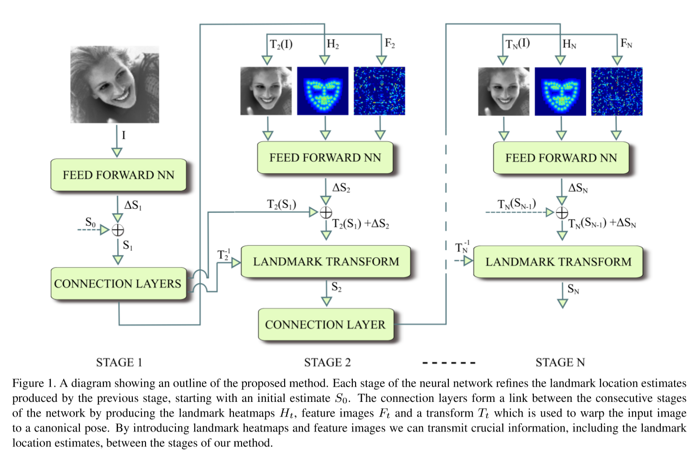
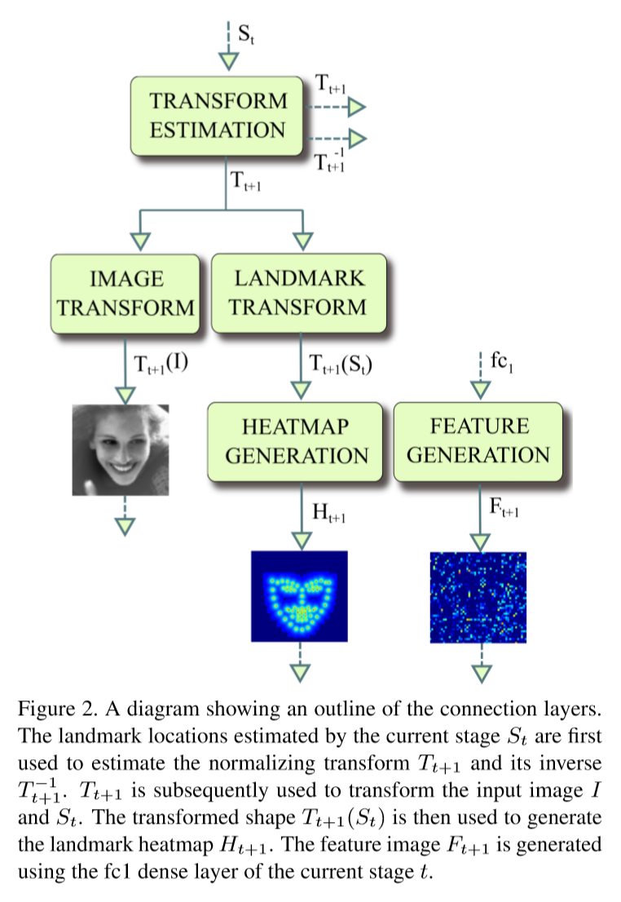
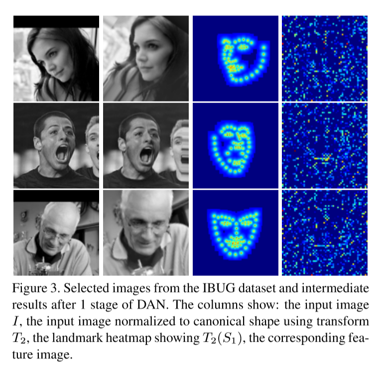

# Deep Alignment Network:  A convolutional neural network for robust face alignment

DAN是一个多阶段的神经网络，每个阶段都对上一阶段的关键点预测值进行修正，迭代地调整关键点预测的位置。

每个阶段的输入（除了第一个阶段）都是一张归一化后的正姿态人脸图像和一张经过前一阶段全连接层学习的图像。

为了能在人脸对齐过程中使用整张人脸图片，我们在每个阶段的输入中还加入了一个关键点热力图，这是本系统的一个关键元素。

关键点热力图是一张离关键点位置越近亮度越高的图像。CNN可以使用热力图来推测并调整当前预测的关键点位置。

Figure 1中概要地描述了本方法，可以看到其中有关键点热力图。

本文的贡献可以总结为：

1. 引入关键点热力图，在多个阶段间传递当前关键点位置的估计信息。这项改进使本方法可以使用整张人脸图片而非局部小图，避免陷入局部极小值。

 	2. 与SOTA相比，本文提出的健壮的人脸对齐方法在300W非公开测试集上降低60%错误率，在300W公开测试集上降低72%错误率。
 	3. 代码与模型皆公开

## Related work

人脸对齐的发展历史很长，从最初的AAM(Active Appearance Models)到CLM(Constrained Local Models)，最近又换为基于CSR(Cascaded Shape Regression)和深度学习的方法。

对于基于CSR的方法，人脸对齐的操作开始于一组初始化的关键点位置，接下来会迭代地更新这些位置。初始化形状$S_0$是人脸检测结果的平均脸形状。每个CSR的迭代过程可以描述为：
$$
S_{t+1}=S_t+r_t(\phi(I,S_t))
\quad\quad\quad(1)
$$
其中$S_t$是第$t$个迭代过程中预测的关键点位置，$r_t$是一个回归函数，给定从图像$I$提取的特征和关键点位置$S_t$，函数返回$S_t$的修正值。

在基于CSR的众多变体之间，比较主要的不同之处是特征提取方法$\phi$和回归方法$r_t$的选择。

MDM(Mnemonic Descent Method)将CSR中的特征提取和回归融合到一个end-to-end训练的RNN中。MDM还在过程中引入记忆机制，为在CSR迭代间传递信息提供可能。

## Deep Alignment Network

DAN受CSR架构启发，与CSR相似，本方法在开始阶段需要初始化人脸形状$S_0$，这个形状会在迭代期间进行调整。但是DAN将CSR中的迭代替换为一个同时完成特征提取和回归的深度神经网络stage。DAN和其他基于CSR的方法的主要不同之处在于DAN从整张人脸图像提取特征而非只提取关键点周围的局部特征。这是通过在每一阶段的输入中加入一项来实现的，称为关键点热力图，它表示在整张图片下的当前预测的关键点位置，并且在不同阶段间传递这一信息，如Figure 1所示。

因此，DAN的每个阶段接收三个输入：

* 根据正脸形状$S_0$旋转对齐后的输入图像$I$
* 一个关键点热力图$H_t$
* 由一个全连接层生成的特征图$F_t$，这个全连接层与前一阶段$t-1$的倒数第二层连接

第一个阶段只接收输入图像，关键点的初始值设定为在图像中间位置的平均脸型$S_0$

DAN的一个阶段由一个前馈神经网络和一组连接层（connection layers）组成，前者生成关键点位置估计，后者生成下一阶段的输入。

连接层由变换估计层(Transform Estimation Layer)，图像变换层(Image Transform Layer)，关键点变换层(Landmark Transform layer)，热力图生成层(Heatmap Generation layer)和特征生成层(Feature Generation layer)组成。

连接层的结构如Figure 2所示。

估计变换层生成变换$T_{t+1}$，其中$t$是阶段的下标。这个变换用来对输入图像$I$和当前的关键点估计$S_t$进行旋转，使$S_t$接近于正脸$S_0$.经过变换后的关键点位置$T_{t+1}(S_t)$传入热力图生成层。逆变换$T_{t+1}^{-1}$用于将经过连续阶段的关键点输出映射回原坐标系。

### Feed-forward neural network

每一阶段的前馈部分的结构如Table 1所示：

除了max pooling层和输出层之外的每一层都经过BN和用ReLU作为激活函数。第一个全连接层前加入了一个dropout层。最后一层的输出为当前关键点位置估计的更新值$\Delta S_t$

### Normalization to canonical shape

DAN中每个阶段的输入图片$I$都会经过一个变换，这样当前的关键点估计才会与标准脸（正脸）$S_0$对齐。这一归一化操作令后续阶段在给定一族变换时具有不变性。这种特性简化了对齐任务并提高了准确率。

变换估计层，负责对$t$阶段的输出估计变换矩阵$T_{t+1}$的参数，将当前阶段$S_t$的输出作为其输入。

当得到$T_{t+1}$之后，图像变换层和关键点变换层会根据变换矩阵将图像$I$和（前一阶段的）关键点预测$S_t$变换成标准姿态（正姿态）。图像的变换使用双线性插值。注意到DAN的第一个阶段的归一化操作不是必须要有的，因为其输入是标准脸模板$S_0$，它本身就是标准脸，不需要对齐。

由于输入图片经过了变换，为了能够与原图匹配，每一阶段的输出就必须经过逆变换，DAN的阶段输出为:
$$
S_t=T_t^{-1}(T_t(S_{t-1}+\Delta S_t))
\quad\quad\quad(2)
$$
其中$\Delta S_t$是$t$阶段的输出，$T_t^{-1}$是变换$T_t$的逆变换

### Landmark heatmap

关键点热力图是一张离关键点位置越近亮度越高的图像。得益于关键点热力图，CNN可以根据前一阶段的输出对关键点进行预测。因此DAN可以基于整张人脸图像进行人脸对齐。

DAN阶段的输入中的关键点热力图由前一阶段产生并变换到正姿态：$T_t(S_{t-1})$.

热力图生成公式：
$$
H(x,y)=\frac{1}{1+min_{{s_i}\in T_t(S_t-1)\lVert(x,y)-s_i\rVert}},
\quad\quad\quad(3)
$$
其中$H$是热力图，$s_i$是$T_t(S_{t-1})$的第$i$个关键点。在实现中，为了提升效果，只计算以每个关键点为中心，半径为16范围内热力图的值。与标准化步骤类似，这一操作对于第一个stage来说不是必须的，因为第一个stage的输入姿态是正脸$S_0$，无论输入图片是什么，对应的热力图都是一样的。Figure 3展示了人脸图片和对应的关键点热力图。

### Feature image layer

特征图层$F_t$是由与前一阶段$t-1$的fc1层相连的一个全连接层生成的。这种连接使前一层学习到的任何信息都可以转移至连续阶段(consecutive stage ???)。它自然地作为从前一阶段学到关键点位置信息的热力图的补充。

特征图层是一个有3136个units的全连接层，使用ReLU激活函数。输出reshape到$56\times56$的2D层，再放大到$112\times112$，这也是DAN中stages的输入尺寸。实验中使用$56\times56$的小图因为结果差不多而且参数数量少，Figure 3展示了特征图的例子。

### Training procedure

DAN的stages是按顺序训练的。第一个stage由其自身训练，直到损失（validation error）不再上升。然后将其后续的连接层和第二阶段加入训练，重复这一步骤直到损失（validation error）不再下降为止。

尽管很多人脸对齐算法通过最小化关键点位置的平方和损失值来训练模型，DAN最小化的损失是根据两瞳孔间距离归一化后的关键点：
$$
\min\limits_{\Delta S_t}\frac{\lVert T_t^{-1}(T_t(S_{t-1})+\Delta S_t)-S^*\rVert}{d_{ipd}},
\quad\quad\quad(4)
$$
其中$S^*$是gt关键点位置的向量，$T_t$是stage t中将输入图像和外形归一化的变换，$d_{ipd}$是$S^*$中瞳孔的距离。

选择这一损失的原因是它是比平方和损失更常见的基准。

由于DAN网络内的所有层都是可微的，因此DAN可以作为end-to-end模型来训练。

对第一个stage进行几个epoch的预训练后训练整个网络，得到的效果较好但是训练时间很长。

从0开始训练整个网络得到的效果较第一种训练方案很差。

尽管再end-to-end的训练中效果没有得到提升，我们相信如果使用一个更好的训练策略的话是有可能获得更好效果的。

## Experiments

### Datasets

300W，Menpo challenge

### Error measures

最近提出的几个用于人脸对齐的损失衡量方式：

* 除以了眼间距（外眼角间距）的关键点平均距离
* 除以了瞳孔距（眼中心间距）的关键点平均距离
* 除以了边界框对角线长度的关键点平均距离

本作中采用了上述的三种方式。验证时采用了三种度量方式：平均误差（mean error），误差累积曲线下面积（$AUC_\alpha$）和失败率（failure rate）

*****

多阶段人脸关键点检测方法，上一个阶段的输出作为下一个阶段的输入，通过多个阶段迭代优化热力图，每个阶段都会得到一个变换矩阵，所以整个变换的流程是可逆的