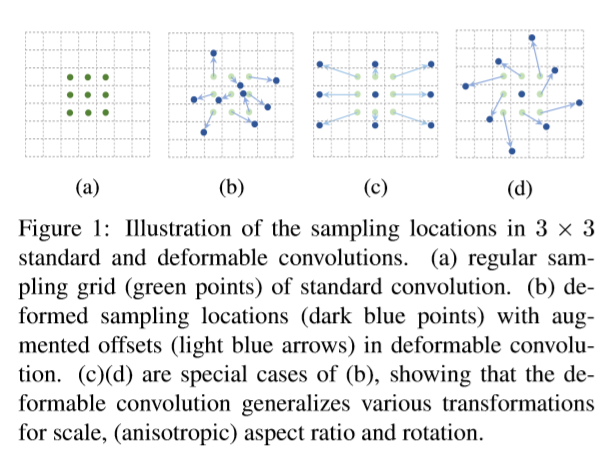
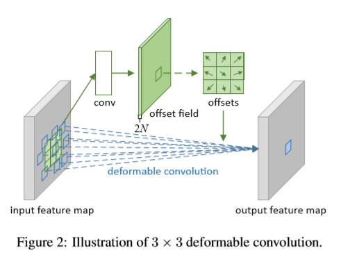
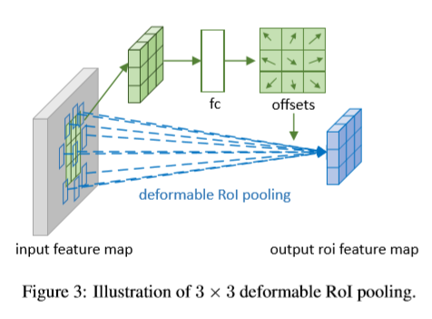
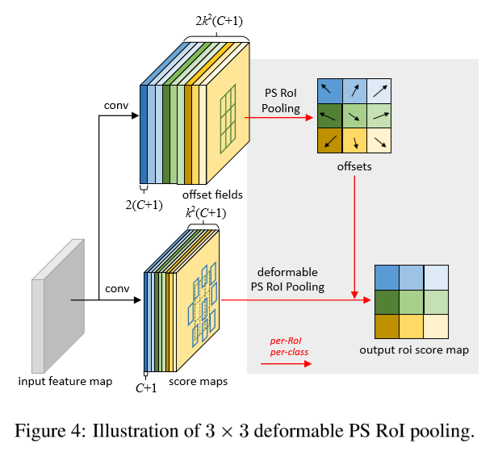

# Deformable Convolutional Networks

由于CNN内建模型固定的几何结构，它们在对几何变换的建模上有天生的不足。本文提出两个新模型用于加强CNN对形变的建模能力，分别是可变形卷积（deformable convolution）和可变形RoI pooling（deformable RoI pooling）。二者都是基于在模型中增加空间采样位置，并加入附加的偏移量（additional offsets）然后从目标任务中学习偏移量。新模型可以轻易替换原CNN的对应部分，而且端到端训练也使用标准的BP方法。

## Introduction

视觉识别任务中的一个关键挑战是如何包含几何差异或者对几何变换建模，包括物体尺寸、姿态、视角和部分形变等。总的来说，有两种方式。第一种是构建包含足量目标差异样本的训练数据集，通常通过对现有数据样本进行增广来实现，如：仿射变换。这时，可以从数据中学习到鲁棒的表示，但是通常训练成本和模型参数复杂度都要更高。第二种方式是使用变换不变（ transformation-invariant ）特征和算法。对应这种方式的技术有很多，比如SIFT（scale invariant feature transform）和基于滑窗的物体检测模型（paradigm）。

上面提到的两种方式有两个缺陷。一是假设固定且已知的几何变换，使用这种先验知识来对数据进行增广和设计特征和算法。这个假设降低了模型在有关未知几何变换的新任务上的泛化能力，因为建模的方式不合适。二是人工设计的不变特征和算法很难或几乎不可能应对过于复杂的变换，即使变换已知。

最近CNN在视觉识别任务上取得了巨大的成功，例如图片分类，语义分割和物体检测等。但是这些CNN模型仍然有上述的两个缺陷。它们对几何变换的建模能力基本上来自大量的数据增广和巨大的模型还有一些简单的人工模型（例：max-pooling用在小变换不变）

简而言之，CNN天生很难对未知的大规模变换进行建模。其原因在于CNN模型内的固定几何结构：一个卷积单元来对输入的特征图进行采样；一个池化层按固定比率来降低空间分辨率；一个RoI（region-of-interest）pooling层将一个RoI分离给在空间上固定的格子，等等。其中缺少一个能处理几何变换的内部机制。这就造成了一些显而易见的问题。举个例子，对于同一个CNN层的所有激活单元来说，它们的感受野尺寸是相同的。对于在空间位置上编码语义信息的高层CNN层来说，这个特点是不好的。因为不同的位置可能与不同尺度或形变的物体相关，精确定位的视觉识别任务需要能够适应性决定（adaptive determination）尺度或感受野尺寸的适应，例：语义分割使用全卷积网络。再举个例子，尽管最近物体检测方向得到了长足的发展，但是所有实现方法都依赖于原始的基于bounding box的特征提取方法。这个方法显然是次优解，尤其在面对非刚性物体的时候。

本文提出两个新模型，它们可以显著提升CNN对于几何变换的建模能力。

第一个是可变形卷积，在传统卷积层的栅格取样位置加入了2D偏移量，使取样格栅自由形变成为可能。如Figure 1所示。偏移量是使用额外的卷积层在之前的特征图上学到的。因此，从输入的特征上通过一个局部、稠密且有适应性的方法来检测形变（信息）。

第二个是可变形RoI pooling。在原有RoI pooling基础上，对每个划分的小格子都加一个偏移量。与可变形卷积类似，偏移量在之前的特征图和RoI上学到，赋予其对于不同形状物体的适应性局部定位能力。

这两个模块都很轻量。偏移量学习所增加的参数量和计算量都很小。替换和端到端训练都很简单。

## Deformable Convolutional Networks

特征图和CNN中的卷积操作都是3D的。可变形卷积和RoI pooling在2D空间域上进行操作，在不同通道维度上的操作是一致的。没有通用的loss，为了表示简单，这两个模块用2D来描述，扩展到3D也很简单直观。

### Deformable Convolution

2D卷积有两个步骤：

1. 在输入的特征图$\mathrm{x}$上用一个常规的网格$\mathcal{R}$来进行采样；
2. 对使用权重$\mathrm{w}$加权后的采样值求和；

网格$\mathcal{R}$定义了感受野的尺寸和扩张（dilation）。例如：$\mathcal{R}=\{(-1,-1),(-1,0),...,(0,1),(1,1)\}$定义了一个$3\times3$，扩张（dilation）为1的卷积核。

对输出特征图$\mathrm{y}$的每个位置$\mathrm{p_0}$，有：
$$
\mathrm{y(p_0)}=\sum\limits_{\mathrm{p}_n\in\mathcal{R}}\mathrm{w}(\mathrm{p}_n)\cdot\mathrm{x}(\mathrm{p_0}+\mathrm{p}_n),
\quad\quad\quad(1)
$$
其中$\mathrm{p}_n$对$\mathcal{R}$中的位置进行枚举。

在可变形卷积中，为传统的网格$\mathcal{R}$增加了偏移量$\{\Delta{\mathrm{p}_n}|n=1,...,N\}$，其中$N=|\mathcal{R}|$.

公式(1)变为：
$$
\mathrm{y(p_0)}=\sum\limits_{\mathrm{p}_n\in\mathcal{R}}\mathrm{w}(\mathrm{p}_n)\cdot\mathrm{x}(\mathrm{p_0}+\mathrm{p}_n+\Delta\mathrm{p}_n),
\quad\quad\quad(2)
$$
这样，采样的就是在不规则的偏移位置$\mathrm{p}_n+\Delta\mathrm{p}_n$上进行了。由于偏移$\Delta\mathrm{p}_n$一般是小数，公式(2)通过双线性插值实现：
$$
\mathrm{x(p)}=\sum\limits_{\mathrm{q}}G(\mathrm{q,p})\cdot\mathrm{x(q)},
\quad\quad\quad(3)
$$
其中$\mathrm{p}$代表一个随机位置（$\mathrm{p}=\mathrm{p_0}+\mathrm{p}_n+\Delta\mathrm{p}_n$），$\mathrm{q}$遍历输入特征图$\mathrm{x}$的整数空间位置，$G(\cdot,\cdot)$是双线性插值核。注意$G$是二维的。分离成两个一维核：
$$
G(\mathrm{q,p})=g(q_x,p_x)\cdot g(q_y,p_y),
\quad\quad\quad(4)
$$
其中$g(a,b)=max(0,1-|a-b|)$.公式(3)计算速度很快，因为$G(\mathrm{q,p})$除了几个$\mathrm{q}$外都是非零的。

如Figure 2所示，同一个输入特征图经过一个卷积层得到偏移量。其空间分辨率和扩张和当前卷积层相同（图中仍为$3\times3$扩张为1的卷积核）。输出的偏移特征图和输入的空间分辨率一致。通道数$2N$对应$N$个2D偏移量。训练过程两部分卷积同时训练。为了能够学到偏移量，梯度反向传播时要经过公式(3)和(4)的双线性操作。

### Deformable RoI Pooling

所有基于proposal的物体检测方法都使用了RoI pooling.它将一个任意大小的矩形框转换成固定尺寸的特征。

**RoI Pooling：**给定输入特征图$\mathrm{x}$和一个左上角点为$\mathrm{p_0}$，尺寸为$w\times h$的RoI，RoI Pooling将RoI划分成$k\times k$（$k$是一个自由参数）个小区域并输出一个$k\times k$的特征图$\mathrm{y}$.对第$(i,j)$个区域（$0\le i,j \lt k$）有： 
$$
\mathrm{y}(i,j)=\sum\limits_{\mathrm{p}\in bin(i,j)}\mathrm{x(p_o+p)}/n_{ij},
\quad\quad\quad(5)
$$
其中$n_{ij}$是每个小区域（bins）的像素数量。第$(i,j)$个小区域包括（spans）$\lfloor i \frac{w}{k} \rfloor \le p_x \lt \lceil (i+1)\frac{w}{k}\rceil$和$\lfloor j\frac{h}{k}\rfloor \le p_y \lt \lceil (j+1)\frac{h}{k} \rceil$.

与公式(2)类似，在可变形RoI Pooling中加入了偏移量$\{\Delta p_{ij}|0\le i,j\lt k\}$.公式(5)变为：
$$
\mathrm{y}(i,j)=\sum\limits_{\mathrm{p}\in bin(i,j)}\mathrm{x(p_o+p+\Delta p_{\mathit{ij}})}/n_{ij},
\quad\quad\quad(6)
$$
一般来说，$\Delta \mathrm{p}_{ij}$是小数。公式(6)通过公式(3)和(4)的双线性插值来实现。

Figure 3展示了如何获取偏移量。首先RoI Pooling（公式(5)）生成池化后的特征图。在特征图上使用一个全连接层生成归一化的偏移量$\Delta \widehat {\mathrm{p}}_{ij}$，然后将它变换成公式(6)中的偏移量$\Delta \mathrm{p}_{ij}$，方法是与RoI的宽高进行逐元素相乘$\Delta \mathrm{p}_{ij}=\gamma \cdot \Delta \widehat{\mathrm{p}}_{ij} \circ (w,h)$，其中$\gamma$是一个预定义好的标量数，用来调节偏移量的量级，按经验来讲设置成$\gamma=0.1$.为了使偏移量学习结果与RoI尺寸无关，对其进行归一化操作很有必要。

**Position-Sensitive(PS) RoI Pooling：**是全卷积网络且与RoI Pooling不同。经过一个卷积层，全部特征图首先变为$k^2$个得分图（score maps）对应每一个分类（对$C$个物体类别有$C+1$个分类），如Figure 4中下方分支所示。不需要区分类别，这个得分图表示为$\{\mathrm{x}_{i,j}\}$其中$(i,j)$枚举全部区域（bins）。在这些得分图上进行池化操作。第$(i,j)$个区域的输出值是这个区域对应的一个得分图$\mathrm{x}_{i,j}$的和。简而言之，公式(5)中的RoI Pooling的不同之处在于一般的特征图$\mathrm{x}$被替换为一个特殊的positive-sensitive的得分图$\mathrm{x}_{i,j}$.

