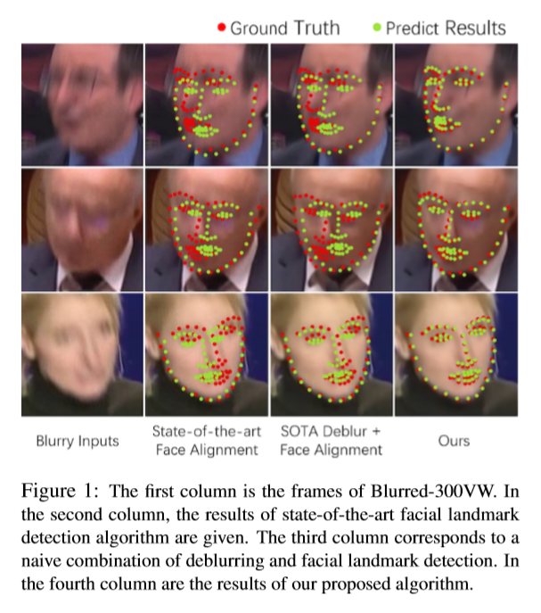
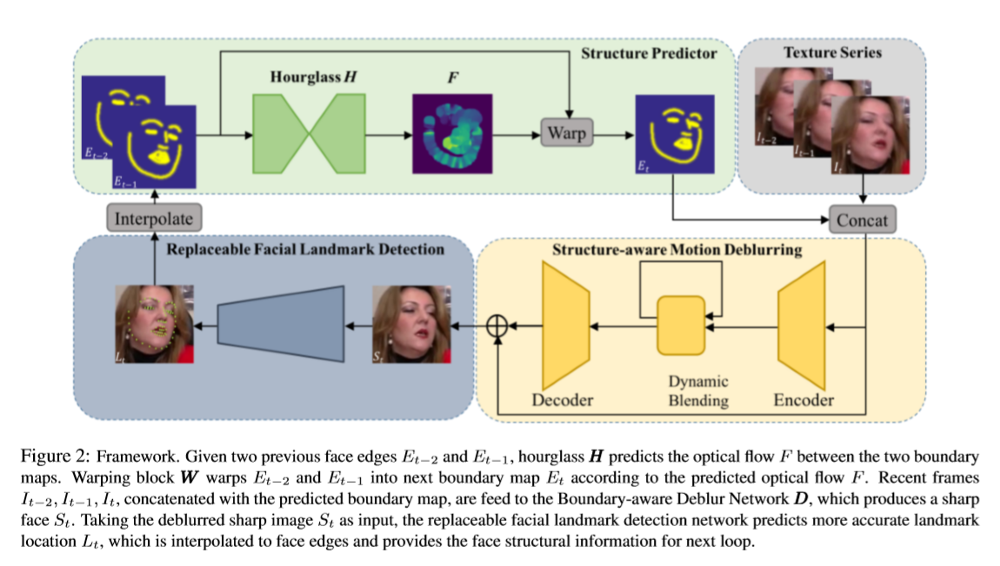

# FAB: A Robust Facial Landmark Detection Framework for Motion-Blurred Videos

提出一个在模糊视频中利用时间维度上结构一致性的面部关键点检测的框架，称为FAB.

提出一个结构预测器来预测时间上丢失的面部结构信息（作为几何先验信息）。这使本框架的运转称为了一个良性循环。一方面，几何先验信息帮助我们的结构感知去模糊网络生成高质量的去模糊图片，这可以提升关键点检测的效果。另一方面高质量的关键点检测结果会帮助结构预测器生成更准的几何先验信息给下一帧用。

## Introduction

人脸关键点检测，或称为人脸对齐，是很多人脸应用的关键部分。以前的研究很多在关注静态图片的关键点检测。人脸关键点检测可以自然地扩展到视频领域，即在序列帧上定位人脸关键点。与静态图片不同，由于动作速度和快门速度不匹配，运动模糊通常会出现在视频中，如Figure 1所示，其中丢失的结构信息（例如边缘）令SOTA的关键点检测算法都难以捕捉到面部结构。

一个直观的办法是在关键点检测前使用去模糊算法。道理很简单，去模糊的图片可以提升面部关键点检测的效果。SOTA人脸去模糊算法倾向于基于以输入图片的人脸面部结构（如关键点和边缘）作为强先验信息来恢复人脸的形状和细节。但是如果不能精确检测关键点就不能得到这样的面部结构。总的来说，运动模糊视频的人脸关键点检测需要去模糊后的图像，但是人脸去模糊操作需要基于如关键点的结构信息。它们之间是相互依赖的，这就使这种方式成为运动模糊视频的先有鸡还是先有蛋的问题。

在一段视频中，面部结构在时间上保持连续性和一致性，且模糊帧通常在时间维度上的分布是离散的。这就促使我们根据前序的结构信息来预测可靠的面部结构。根据这一思想，提出一个结构预测器来预测当前人脸的面部结构。而且，给定前序脸的边缘，预测器得出光流（optical flow）并扩展动作，通过假定光流是线性的来预测下一个人脸的边缘。

基于此，我们设计了一个框架，包含三个模块：结构预测器，结构感知动作去模糊网络和可替换的人脸关键点检测网络，如Figure 2所示。这三个模块作为一个有机整体一起工作。结构预测器根据前序线索来预测当前的面部结构。去模糊网络在结构先验的帮助下去除运动模糊。关键点检测器在去模糊后的图片上检测准确的关键点，这些关键点用于预测下一帧人脸的结构。

## Related Work

### Facial Landmark Detection

**Facial landmark detection in static images.** 经典的基于模型（model-based）的方法ASMs,AAMs,CLMs,ESR,SDM,CFSS,和深度卷积神经网络方法TCDCN,FAN,DSRN,RFLD,SAN,LAB在静态图片上的效果（不同姿态，光照，表情等条件下）越来越好。但是人脸对齐却中少有关注运动模糊的文献。这些方法无法在极端运动模糊的情况下获取较好的表现。

**Facial landmark detection in videos.** 为了克服如大姿态和遮挡等问题，人脸关键点检测自然想要利用视频中的时域信息来进行补偿。

### Motion Deblurring

运动模糊，通常由于运动速度和快门速度不匹配而发生，可由物体运动，相机抖动等引起。运动本身无限制的特点是去模糊称为一个很复杂的问题。与图片去模糊相比，视频去模糊可以利用时域信息来处理大运动模糊，而网络参数更少。但是这些方法都不是针对人脸的特殊方法，因此也就不能对人脸的结构信息进行补偿。

结构信息可以有效地辅助去模糊操作。先验知识，尤其是面部结构，已经被证实在人脸相关任务中是一个有效的先验，例如超分辨率和去模糊。但是