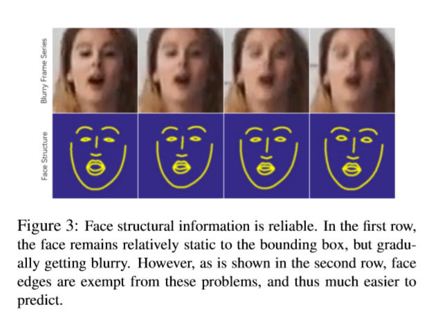

# FAB: A Robust Facial Landmark Detection Framework for Motion-Blurred Videos

提出一个在模糊视频中利用时间维度上结构一致性的面部关键点检测的框架，称为FAB.

提出一个结构预测器来预测时间上丢失的面部结构信息（作为几何先验信息）。这使本框架的运转称为了一个良性循环。一方面，几何先验信息帮助我们的结构感知去模糊网络生成高质量的去模糊图片，这可以提升关键点检测的效果。另一方面高质量的关键点检测结果会帮助结构预测器生成更准的几何先验信息给下一帧用。

## Introduction

人脸关键点检测，或称为人脸对齐，是很多人脸应用的关键部分。以前的研究很多在关注静态图片的关键点检测。人脸关键点检测可以自然地扩展到视频领域，即在序列帧上定位人脸关键点。与静态图片不同，由于动作速度和快门速度不匹配，运动模糊通常会出现在视频中，如Figure 1所示，其中丢失的结构信息（例如边缘）令SOTA的关键点检测算法都难以捕捉到面部结构。

一个直观的办法是在关键点检测前使用去模糊算法。道理很简单，去模糊的图片可以提升面部关键点检测的效果。SOTA人脸去模糊算法倾向于基于以输入图片的人脸面部结构（如关键点和边缘）作为强先验信息来恢复人脸的形状和细节。但是如果不能精确检测关键点就不能得到这样的面部结构。总的来说，运动模糊视频的人脸关键点检测需要去模糊后的图像，但是人脸去模糊操作需要基于如关键点的结构信息。它们之间是相互依赖的，这就使这种方式成为运动模糊视频的先有鸡还是先有蛋的问题。

在一段视频中，人脸面部结构在时间上保持连续性和一致性，且模糊帧通常在时间维度上的分布是离散的。这就促使我们根据前序的结构信息来预测可靠的面部结构。根据这一思想，提出一个结构预测器来预测当前人脸的面部结构。而且，给定前序脸的边缘，预测器得出光流（optical flow）并扩展动作，通过假定光流是线性的来预测下一个人脸的边缘。

基于此，我们设计了一个框架，包含三个模块：结构预测器，结构感知动作去模糊网络和可替换的人脸关键点检测网络，如Figure 2所示。这三个模块作为一个有机整体一起工作。结构预测器根据前序线索来预测当前的面部结构。去模糊网络在结构先验的帮助下去除运动模糊。关键点检测器在去模糊后的图片上检测准确的关键点，这些关键点用于预测下一帧人脸的结构。

## Related Work

### Facial Landmark Detection

**Facial landmark detection in static images.** 经典的基于模型（model-based）的方法ASMs,AAMs,CLMs,ESR,SDM,CFSS,和深度卷积神经网络方法TCDCN,FAN,DSRN,RFLD,SAN,LAB在静态图片上的效果（不同姿态，光照，表情等条件下）越来越好。但是人脸对齐却中少有关注运动模糊的文献。这些方法无法在极端运动模糊的情况下获取较好的表现。

**Facial landmark detection in videos.** 为了克服如大姿态和遮挡等问题，人脸关键点检测自然想要利用视频中的时域信息来进行补偿。

### Motion Deblurring

运动模糊，通常由于运动速度和快门速度不匹配而发生，可由物体运动，相机抖动等引起。运动本身无限制的特点是去模糊称为一个很复杂的问题。与图片去模糊相比，视频去模糊可以利用时域信息来处理大运动模糊，而网络参数更少。但是这些方法都不是针对人脸的特殊方法，因此也就不能对人脸的结构信息进行补偿。

结构信息可以有效地辅助去模糊操作。先验知识，尤其是面部结构，已经被证实在人脸相关任务中是一个有效的先验，例如超分辨率和去模糊。但是当输入人脸图像对齐不好的时候这些方法就失败了，例如侧脸或特别大的运动导致的人脸解析分割或关键点检测失效的情况。考虑到上述这些缺点，我们设计了这个框架，它通过时域信息来获取可靠的结构信息，从而深层次地去除掉模糊。

## Method

如Figure 2所示，FAB可以分成三个联合的部分：结构预测器，结构感知动作去模糊网络和可替换的人脸关键点检测网络。结构预测器根据前序帧预测当前帧的人脸结构先验。借助预测出的面部结构先验，结构感知动作去模糊网络生成一张清晰图像。给定清晰的输入图像，人脸关键点检测网络检测出当前帧的准确关键点，这个结果也被反馈到结构预测器用于下一帧的预测。这种方式使三个网络作为一个有机整体来同时完成运动模糊视频中人脸关键点定位和去模糊的工作，并相互激励。

### Structure Predictor

结构预测器在打破去模糊和关键点检测之间“先有鸡还是先有蛋”这一困境中起到了重要的作用。它接收$t-2$和$t-1$时间的面部结构来预测当前帧$t$的面部结构。由相机震动或物体运动导致的运动可以在数学上建模，且这种运动在短时间内是持续的。此外，面部结构是一个与面部纹理无关的表示，这种表示方式具有语义信息，清晰而且是明确定义的。相比于从两张面部图片提取动作，从两个面部结构提取动作要简单很多。这些特性使短时间面部结构预测成为可能。

面部结构的表示方法有关键点、边缘、部分分割、3D模型等。关键点在语义上不稳定，因为它们在不同表情和姿态下会沿边缘漂移。关键点的漂移给面部运动添加了噪声，这有损于结构预测。另一方面，如部分分割或3D模型的复杂标注包含更丰富的信息，但是获取大规模训练集却很难。因此我们使用面部边缘作为人脸结构信息。脸上每一部分的边缘线条都通过关键点插值得到。

给定两个之前的脸部边缘$E_{t-2}$和$E_{t-1}$使用一个沙漏网络$\textbf{H}$预测两个边界图之间的光流$F$.直接预测出脸部边缘$E_t$也可以但是没法保证边缘图的清晰度，而这一特性（清晰度）对于接下来的去模糊网络来说很重要。接下来卷曲块（wraping block）$\textbf{W}$会根据预测的光流$F$将$E_{t-2}$和$E_{t-1}$卷曲到下一个边界图$E_t$:
$$
\mathbf{H}(E_{t-2},E_{t-1}) = \mathbf{F} \quad\quad\quad(1) \\
\mathbf{W}(E_{t-2}, E_{t-1}) = E_t \quad\quad\quad(2)
$$
其中$t$代表当前时间。

人脸结构预测器使用面部关键点检测视频数据集训练，如300VW，随后于其他网络一起微调。使用预测值和gt人脸边界图之间的MSE loss.loss函数为：
$$
\mathcal{L}_{prd}=\frac{1}{N_{pixel}} \cdot \|E_t-E_{GT}\|_2 \quad\quad\quad(3)
$$
其中$N_{pixel}$代表生成的图的全部像素个数，$E_{GT}$是当前脸边缘gt.

### Structure-Aware Motion Deblurring

人脸去模糊本身就比较难。由于使用人脸检测/追踪，导致面部运动与运动模糊程度不一致。如Figure 3所示，人脸相对于边界框的位置没有改变，但是逐渐变模糊。但是面部边缘不受这些问题影响（见Figure 3第二行），因此也更容易预测。在可靠的结构先验预测的帮助下，去模糊网络将纹理信息和结构信息耦合到一起来重建一张去模糊后的人脸。

将一个人脸解耦成两部分，如结构和纹理。给定精准的结构先验-边界图，去模糊网络$\textbf{D}$重建一张清晰的图像，重建后的图像满足边界限制且同时保持了纹理的一致性。面部结构信息引导了当前帧的去模糊操作。这一流程可以被视为向预测的结构中填充前序帧的纹理信息。基于SOTA去模糊网络的设计，使用一个由最近的三个帧$I_{t-2},I_{t-1},I_t$组成的batch作为输入。然后将预测的边界图连接起来作为结构先验，和帧batch一起作为去模糊网络的输入。一个编码网络会从输入提取所需的信息。然后使用一个动态时域混合网络将不同帧的信息组合到一起。最后，使用一个解码器来预测模糊帧和gt间的残差。
$$
\textbf{D}(E_t,I_{t-2},I_{t-1},I_t) = S_t \quad\quad\quad (4)
$$
与面部结构预测器类似，同样使用300VW数据集对结构感知去模糊网络进行预训练。首先生成模糊后的视频（方法为 "Online video deblurring via dynamic temporal blending network"）。然后将gt边缘作为结构先验进行预训练。在去模糊图片和gt清晰图片上使用MSE损失：
$$
\mathcal{L}_{rec}=\frac{1}{N_{pixel}}\cdot \|S_t-S_{GT}\|_2 \quad\quad\quad(5)
$$

### Replaceable Facial Landmark Detection Network

将去模糊后的清晰图片$S_t$作为输入，可替换的人脸关键点检测网络预测出关键点位置$L_t$.面部关键点预测网络可以使用任何高级网络架构，本文使用预激活的残差网络和L1 loss。网络现在关键点检测数据集上进行预训练，之后和另两个网络一起微调：
$$
\mathcal{L}_{align}=\frac{1}{N_{point}}\cdot\|L_t-L_{GT}\|_1 \quad\quad\quad(6)
$$
其中$L_{GT}$是gt关键点，$N_{point}$是关键点个数。

无论使用哪种关键点检测网络，去模糊后的帧都能提高关键点检测的效果。几乎所有检测网络都会受到去模糊的增益影响。而且，更准确的面部结构会为下一个循环的结构预测器提供质量更高的信息，构成了一个良性循环。