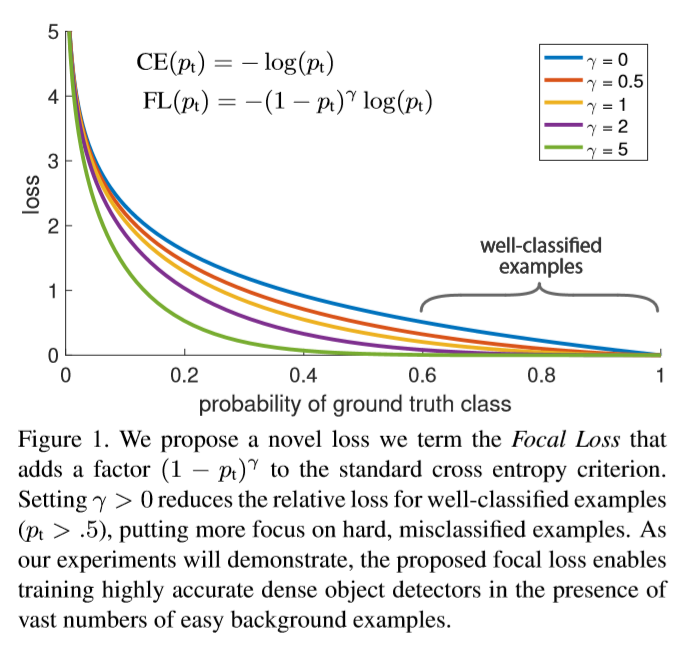

# Focal Loss for Dense Object Detection

## Introduction

最近的SOTA检测器都基于二阶段，proposal-driven机制。R-CNN框架推广的方法，第一阶段生成一个候选框位置的稀疏集合，第二阶段用一个卷积神经网络对每个候选框位置是前景还是背景进行分类。R-CNN的一系列发展让这个二阶段框架在COCO上不断达到更高的准确率。

本文提出一个能达到SOTA COCO AP效果的一阶段的物体检测器（和复杂的二阶段检测器一样，例如FPN，Mask R-CNN等）。为了能达到这个结果，我们认定训练过程中的样本不平衡问题是阻止一阶段方法达到SOTA的最主要障碍，因此提出一个新的loss函数来消除这个障碍。

在类R-CNN检测器是通过二阶段级联和启发式采样来解决类间不平衡问题的。proposal阶段（RPN）大幅度降低候选框数量（如：到1-2k），过滤掉大多数背景样本。在第二个分类阶段采用启发式采样，比如使用固定的前背景比例或者在线困难样本挖掘（OHEM）来保证前背景间的平衡。

与之对比，单阶段检测器必须处理整张图片均匀采样得到的（规模）更大的候选框集合。实际上通常等于遍历高达100k个位置，这些位置排列紧密，包含不同的位置、尺度和长宽比。尽管同样可以用启发式采样，但是效率低，因为训练过程仍由易于分类的背景样本主导。效率低的问题在物体检测领域是一个经典问题，通常通过一些例如bootstrapping（自举法，用有限样本多次重复采样）或者hard example mining的技术手段来解决。

本文提出一个新的损失函数作为类间不平衡问题的另一个解决方案。这个loss函数是一个动态比例的交叉熵loss，如Figure 1所示，比例因子随着正确分类置信度的提高而向0衰减。

比例因子可以自动将简单样本贡献的权重降低并使模型更关注困难样本。实验结果表明提出的*Focal Loss*可以训练出更高准确率的一阶段检测器，其效果要明显好于以前的SOTA技术如启发式采样或困难样本挖掘方法训练的一阶段模型。最终我们发现focal loss的精确形式并不重要。

为了展示提出的focal loss效果，设计了一个简单的一阶段物体检测器称作*RetinaNet*，名字来源于它在输入图像上对物体位置的密集采样。这个设计的特点是有一个高效的网络内部特征金字塔并使用anchor边界框。

## Focal Loss

设计*Focal Loss*是为了解决一阶段物体检测方案前背景类别极度不平衡（如：1：1000）的问题。

先从二分类的交叉熵loss开始：
$$
CE(p,y)=
\begin{cases}
-\log(p)\quad\quad\quad \mathbb{if}\quad y=1\\
-\log(1-p)\quad \mathbb{otherwise.}
\end{cases}
\quad\quad\quad(1)
$$
上式中$y\in\{\pm1\}$代表gt class，$p\in[0,1]$代表模型对于label$y=1$的样本的估计值。

为了表示方便，定义$p_t$:
$$
p_t=
\begin{cases}
p \quad\quad\quad \mathbb{if}\quad y=1 \\
1-p \quad \mathbb{otherwise}
\end{cases}
\quad\quad\quad (2)
$$
则$CE(p,y)=CE({p_t})=-\log(p_t)$

CE loss是Figure 1中靠上的蓝色的曲线。从图中可以看到CE loss的一个重要性质，即易分类样本（$p_t\gg .5$）也会增大loss（incur a loss with non-trivial magnitude）。当把大量的容易分类的样本加到一起时，这些小loss值会压制rare class.

### Balanced Cross Entropy

解决类间不平衡问题的一个常见办法是为1类引入权重因子$\alpha\in[0,1]$，-1类的权重因子就是$1-\alpha$.应用中可以将$\alpha$设置为类频率的倒数或当作超参数，通过交叉验证来设置。为了表示方便，定义$\alpha_t$，与定义$p_t$类似。将$\alpha$-balanced CE loss写作：
$$
CE(p_t)=-\alpha_t\log(p_t). \quad\quad\quad(3)
$$
这是对CE loss的简单扩展，我们将它当作focal loss实验的基准。

### Focal Loss Definition

在实验中，loss主要由易于分类的负样本组成，主宰了梯度。尽管$\alpha$平衡了正样本和负样本的重要性，但它并不能将简单和困难样本区分开。

提出修改loss函数形式来对简单样本降权从而使训练关注困难负样本。

形式上，在交叉熵loss中加入调节因子$-(1-p_t)^{\gamma}$，它有一个可调节的关注参数（focusing parameter）$\gamma \ge0$.

定义focal loss 为：
$$
FL(p_t)=-(1-p_t)^{\gamma}\log(p_t).\quad\quad\quad(4)
$$
Figure 1展示了不同$\gamma\in[0,5]$的focal loss曲线。

我们指出focal loss的两个性质：

1. 当一个样本被错分类且$p_t$很小，则调节因子接近1，loss不受影响。当$p_t\to1$，因子接近0，则易分类样本的loss被降权。
2. 关注参数$\gamma$平滑地调整简单样本降权率。当$\gamma=0$，FL就是CE，随着$\gamma$增加，调整因子的影响也跟着增加（在论文实验中发现$\gamma=2$时效果最好）

直观理解，调节因子降低了简单样本对loss的影响并增大了一个样本接收低loss值的范围。例如，当$\gamma=2$时，一个$p_t=0.9$的样本的loss比CE loss低$100\times$，当$p_t\approx0.968$时要低$1000\times$.这个特点增加了对误分类样本修正的重要性（在$p_t\le.5,\gamma=2$时其loss被缩小至多$4\times$）。

实际使用的是focal loss的$\alpha$-balanced变种：
$$
FL(p_t)=-\alpha_t(1-p_t)^{\gamma}\log(p_t).\quad\quad\quad(5)
$$
在实验中使用这个loss的效果要比非$\alpha$-balanced形式准确率高。最终在计算loss层加入sigmoid操作提高数值稳定性。

## RetinaNet Detector

RetinaNet是一个单一、完整的网络，内部包含一个backbone网络和两个有不同任务的子网络。

backbone网络负责根据输入的图像计算卷积特征图，是一个off-the-self卷积网络。

第一个子网络使用backbone输出实现卷积物体检测。

第二个子网络实现边界框回归。

两个子网络的特点是结构简单，是为一阶段密集检测任务目的特别设计的，见Figure 3.

尽管结构中细节上的选择有很多，但是大多数参数都不对某个特定值很敏感。

* **Feature Pyramid Network Backbone：** 使用FPN作为RetinaNet的backbone。简单来说，FPN在标准卷积网络基础上增加了自顶向下（从小到大）的通道和侧连接，使网络可以根据单一分辨率的输入图片高效地构建多尺度的特征金字塔，如Figure 3(a)-(b)所示。用金字塔的不同层检测不同尺度的物体。FPN在FCN的基础上增强了多尺度检测的效果，比如RPN，DeepMask-style，Fast R-CNN或Mask R-CNN。我们在ResNet的结构之上构建FPN。用$P_3$到$P_7$来构建金字塔，$l$表示金字塔的层，$P_l$的分辨率比原图低$2^l$倍。和原版FPN一样，所有层的通道数都为256，细节上有一些不同之处（RetinaNet的特征图金字塔从$P_3$到$P_7$，其中$P_3$到$P_5$使从ResNet的对应残差块输出($C_3$到$C_5$)得到的，$P_6$是在$C_5$上使用一个$3\times3$步长为2的卷积操作得到的，$P_7$是在$P_6$上使用ReLU接一个$3\times3$步长为2的卷积操作得到的。与原版FPN有一些不同之处：(1)由于计算上的原因，不适用高分辨率金字塔层$P_2$(2)$P_6$通过卷积计算得到而非下采样(3)加入$P_7$来增强大物体检测效果。这些小改动在保持精度不下降的前提下提高了计算速度）。尽管结构设计上的可选方案很多，但是需要强调FPN的backbone的重要性。

* **Anchors：** 使用与RPN变种类似的平移不变的anchor boxes.anchors的区域大小从$P_3$到$P_7$为$32^2$到$512^2$，有三种长宽比$\{1:2,1:1,2:1\}$.为了能够覆盖得更密集，在原有anchors尺寸的基础上增加$\{2^0,2^{1/3},2^{2/3}\}$倍尺寸的anchors，提高了AP。anchors的数量为$A=9$

  每个anchor对应一个长度为$K$的one-hot类别向量，$K$是类别个数，和一个长度为4的box回归目标值。使用RPN的分配规则，但是修改为多分类检测并加上调整后的阈值。anchors分配给gt box的IoU阈值为0.5；分配给背景的阈值为$[0,0.4)$.未被分配的anchor(IoU为$[0.4,0.5)$)在训练中会忽略掉。

* **Classification Subnet：** 分类子网络为每个anchors和类别在每个位置预测分类概率。这个子网络是一个小型FCN，接在FPN的每层后面；其参数由整个金字塔共享。它的设计很简单，针对给定的金字塔层，输入$C$通道的特征图，使用4个有$C$个通道的$3\times3$卷积层，接ReLU层，再接一个有$K A$个filters的$3\times3$卷积层，最后使用sigmoid激活输出$KA$个01预测值，见Figure 3(c).使用$C=256,A=9$

  与RPN相比，本分类子网络更深，只使用$3\times3$卷积层，且不与box回归子网络共享参数。我们发现这些更顶层的设计要比具体的超参数值更重要。

* **Box Regression Subnet：** 在金字塔每层后接一个与分类子网络平行的小FCN来对每个anchor box根据其临近的gt object（如果存在）进行偏移量回归。除了最后输出$4A$通道外，其结构与分类子网络一样，见Figure 3(d)。对每个位置上的$A$个anchors，这4个输出预测anchor和gt box之间的相关偏移量

*****

提出FocalLoss解决类间不平衡问题，并提出了一个一阶段检测网络RetinaNet