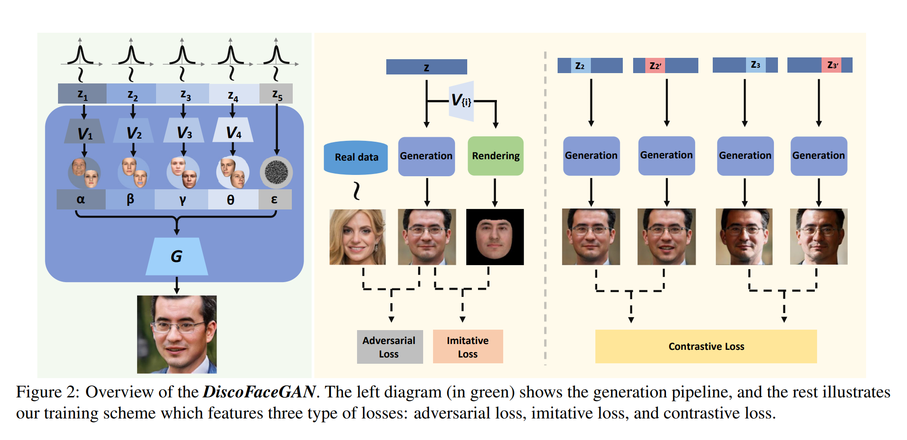
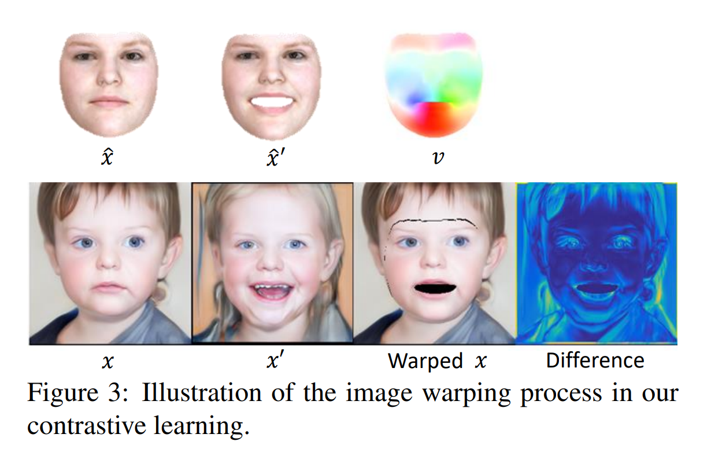

# Disentangled and Controllable Face Image Generation via 3D Imitative-Contrastive Learning

## Abstract
将3D先验嵌入到对抗学习中，训练网络模拟一个分析3D人脸变形和渲染过程的图像的组成。为了解决真实人脸和渲染人脸间的domain gap引入的自由度，进一步引入对比学习通过对比生成图片对来促进解耦

## 1. Introduction
我们调研了使用独立隐变量（包括id信息、表情、姿态、光照和其他噪声）来合成虚拟人物人脸图片的方法。为了得到对上述四种变量的可预测的控制能力，我们通过训练一组VAE将它们转换成参数模型的系数。我们将3DMM和解析渲染过程的先验融入到对抗学习中。引入一组imitative losses强制生成器模仿可解释的图像渲染过程，因此生成由隐变量描述的人脸属性。但是，真实和渲染人脸间的domain gap会导致生成自由度的出现，而这个自由度是无法控制的且会导致负面的变量纠缠。
为了解决生成自由度的问题同时为了增强解纠缠的能力，进一步提出一组对比loss. 对比一对生成图片，然后仅对这一对生成图片共享的完全一样的隐变量引起的外观差异进行惩罚。这样，生成器就会强制每一个隐变量的独立影响表示在最终结果上。对比损失对于隐变量的完全解耦是有关键作用的。
本文使用的模型基于StyleGAN，但是方法可以扩招到其他的GAN上。修改了StyleGAN的隐编码层，将其引入到我们的损失函数。结果表明隐变量可以高度分离，从而可以对生成结果进行精确地控制。我们进一步分析了学习得到的StyleGAN隐空间并发现一些支持因子分解的有意义的属性。我们的方法可以用于将真实图片嵌入到解纠缠的隐空间

## 2. Related Work

## 3. Approach
给定一组真实人脸图片$\mathcal{Y}$,目标是训练一个网络G从随机噪声z生成现实的人脸图片x，随机噪声z由多个独立变量$z_i\in \mathbb{R}^{N_i}$组成，每一个都服从正态分布。
考虑五个独立的因素：id、表情、光照、姿态和随机噪声。在标准的GAN中，会使用一个判别器D来与G进行对抗。为了获得解纠缠和可解释的隐空间，我们将3D先验引入到一个模仿-对比学习范式，见Figure 2

### 3.1. Imitative Learning
引入3DMM模型并训练生成器模仿渲染后的3D人脸。有参数$\lambda \doteq [\alpha,\beta,\gamma,\theta]$,分别为对应id、表情、光照和姿态。使用通过系数$\gamma$进行参数化的Spherical Harmonics(SH)方法来近似场景光照。
为了能够进行模仿，首先将$z$空间转换为$\lambda$空间。通过在从真实数据集$\mathcal{Y}$中提取的$\lambda$样本上训练VAE模型实现这个空间的转换。具体使用3D人脸重建网络获得所有训练图片的系数然后分别训练$\alpha,\beta,\gamma,\theta$四个VAE. 训练完成后丢掉编码器只保留解码器($V_i,i=1,2,3,4$)用于从$z$空间转换为$\lambda$空间。
在训练中，从标准正态分布采样$z=[z_1,...z_5]$，将它映射到$\lambda$，然后把$\lambda$传入生成器G和渲染器，分别获得生成的人脸$x$和渲染的人脸$\hat{x}$.注意到其实可以将$z$或者$\lambda$传入G，实际上没差别。使用$\lambda$的优势在于控制人脸属性，因为$\lambda$是可解释的。
对x的模仿学习定义下述损失函数。首先强制x模仿$\hat{x}$的身份信息：
$$
l_{I}^{id}(x)=\max(1-<f_{id}(x), f_{id}(\hat{x})>-\tau, 0)
$$
其中$f_{id}(\cdot)$是人脸识别模型的身份特征，$<\cdot, \cdot>$代表余弦相似度，$\tau$是定常边距，设定为0.3. 由于在3DMM人脸和真实人脸间存在较大domain gap，所以允许特征间存在较小的差距。对于表情和姿态，针对人脸关键点差距进行惩罚：
$$
l_I^{lm}(x)=\lVert p(x)-\hat{p} \rVert^2
$$
其中$p(\cdot)$代表3D人脸重建网络得到的关键点位置，$\hat{p}$代表渲染后人脸的关键点。对于光照，只是最小化SH差异：
$$
l_i^{sh}(x)=|\gamma(x)-\hat{\gamma}|_1
$$
其中$\gamma(\cdot)$代表3D人脸重建网络得到的系数，$\hat{\gamma}$是$\hat{x}$的系数。最后加上一个强制输出人脸模仿渲染人脸肤色的loss：
$$
l_I^{cl}(x)=|c(x)-c(\hat{x})|^1
$$
其中$c(\cdot)$代表3DMM的mask定义的人脸区域的平均颜色。

**The domain gap issue.** 显然在3DMM模型渲染的人脸和生成人脸间存在domain gap.重要的是要理解这个domain gap的意义并恰当地处理它。一方面，有必要保留一个合理的domain gap，这样可以避免与对抗损失产生矛盾并保证生成图片的真实性。它同时防止生成模型困在3DMM的身份集合中。另一方面，它可能导致解耦多样性降低。
为了理解为什么这种现象会发生，首先用$\Delta x$表示生成人脸$x$和它对应的渲染人脸$\hat{x}$间的差异，即$x=\hat{x}+\Delta x$.在模仿学习过程中，x可以在身份以及图片上除人脸外的其他区域这两个方面自由地偏离$\hat{x}$.结果就是，$\Delta x$有无法控制的确定的自由度。

### 3.2. Contrastive Learning
为了增强解耦效果，用对比的方法强制图片生成的latent表示的一致性：修改一个latent变量并保持其他不变，然后强制生成的人脸图片和对应的latent变量发生关联。细节上，选一对latent code$z,z'$，它们的差别仅在$z_k$，其他都一样。比较两张生成的图片$x,x'$，然后针对除$z_k$外的其他部分造成的差异进行惩罚。
为了进行这种比较，需要找到一个函数$\phi_k(G(z))$，在尽可能广的范围内，对$z_k$的变化不敏感而对其他部分变化敏感。本作中在人脸图片上使用了两个简单的函数。第一个用于表情一致的比较。想法是保存$x$和$x'$的中性表情进行比较。但是高清的表情去除本身就是一个难度较高的方向。为了规避这一问题，通过渲染后的3DMM人脸$\hat{x}$获取用来替代图片变形的光流场(flow field). 这种光流场可以通过修改表情系数轻易得到，然后再用中性表情渲染另一张3DMM人脸。实际上没有必要对$x$和$x'$都实施变形。只根据$\hat{x}$到$\hat{x}'$生成光流场$v$，然后根据$v$将$x$变形到$x'$,如Figure 3所示。然后最小化图片颜色差异：
$$
l_C^{ex}(x,x')=|x(v)-x'|_1
$$
