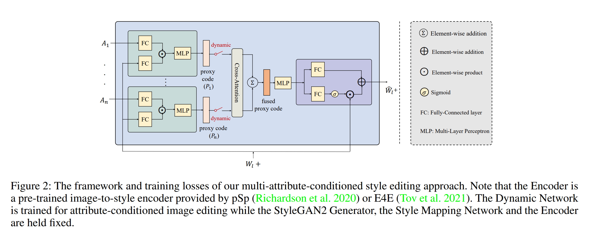
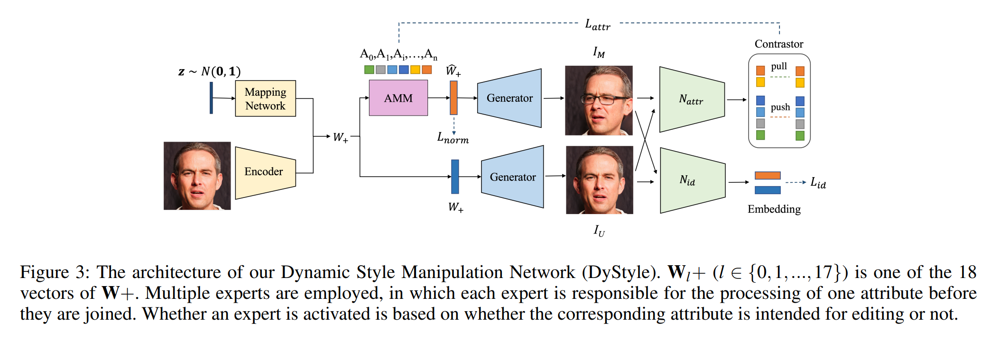

# DyStyle: Dynamic Neural Network for Multi-Attribute-Conditioned Style Editing
[toc]

## Abstract
生成网络目前在多属性操控控制的精准度上仍存在问题。提出一个动态风格操控网络(Dynamic Style Manipulation Network, DyStyle)，其结构和参数会根据输入的不同进行动态的更改，对latent codes进行非线性、适应性的操控，从而实现柔性且精确的属性控制。训练方面引入一个新的从简单到困难的训练过程。

## Introduction
我们认为style editing network应该能够适应不同属性配置对应的大的变量范围，并且当对style editing network进行多属性操控的训练时，任何属性配置分布的偏置都会轻易造成系统性控制误差。以真实人像图片编辑为例，一种情况只改变头发颜色，另一种情况改变头发颜色和年龄。我们希望这两种属性设置的采样是等概率的，并且都能够被style editing network较好地实现。在解决这一问题上做了两点：
1. 在训练的时候对属性配置进行了均匀采样而非使用固定训练样本集合。实现方案是使用预训练的knowledge networks来提供在线的监督而非使用固定标签。
2. 采用了由多个experts组成的动态style editing network，每一个都负责操控一项属性。根据属性是否被编辑动态地激活对应的experts. 也就是说这个style editing network的结构和参数根据输入的不同而发生改变。
实验证明，尽管训练上有些困难，但是对每个样本采用数据独立结构和参数进行处理的动态风格操控网络(Dynamic Style Manipulation Network, DyStyle)能够有效地适应各种各样的属性配置。为了使DyStyle的训练简单一些，采用了一个新的简单到困难的训练流程，首先训练DyStyle每次编辑一个属性，然后再训练随机采样的多属性编辑。

## Method
### Framework
如Figure 2所示，本方法使用DyStyle网络对扩展后的latent code$\textbf{W}+$进行编辑。扩展后的latent code$\textbf{W}+$包含18个512维的向量，每一个都对应StyleGAN2生成器的一个输入层。与$\textbf{W}$相比，$\textbf{W}+$极大地扩展了latent space并且再指定生成真实图片表达的时候由更小的重建误差。$\textbf{W}+$既可以通过StyleGAN的Style Mapping Network根据一个随机高斯噪声得到，也可以通过pSp或E4E的image-to-style编码器生成真实图片的编码。DyStyle网络接收属性设置和$\textbf{W}+$作为输入并预测得到一个修改后的latent code$\hat{\textbf{W}}+$. 属性的设置$\textbf{Attr}$是由用户指定的一组属性值，定义了生成图片的样式。在本作中属性集合包含数值型属性（如，头部姿态的角度，年龄）和二元属性（如眼镜、微笑、黑头发、小胡子、闭眼、张嘴）。不需要调整框架就可以增加属性的数量。
修改后的latent code$\hat{\textbf{W}}+$传入StyleGAN2的生成器得到对应的图片$I_M$. 与此同时原始latent code$\textbf{W}$生成得到未经修改的图片$I_U$. $I_M$应该保持$I_U$的身份同时对应目标属性的变化。这个限制通过预训练的属性预测器$N_{attr}$和一个预训练的身份识别模型$N_{id}$进行控制。

### Dynamic network architecture
DyStyle的结构如Figure 3所示。DyStyle网络对每个$\textbf{W}_l+$都会进行单独处理，将属性设置和$\textbf{W}_l+$作为输入并输出代理编码P用于对$\textbf{W}_l+$进行线性变换。因为使用属性设置和$\textbf{W}_l+$共同影响代理编码，相比于只使用属性设置，网络能够对每个输入$\textbf{W}+$都适应性地预测一个代理编码，而非生成一个统一的调节参数。DyStyle网络采用多个experts来分别处理不同的属性，然后它们会通过交叉注意力和元素加法进行融合，这样每一个expert都能够在属性交互前专注于处理一个属性。使用交叉注意力的原因有两点：
1. 这种方式可以使不同experts间的信息进行交流，也推动属性更好地进行解耦。例如对偏航角和俯仰角的编辑会使相同的区域发生改变（例如鼻子或嘴），从而会引起二者之间的相关或耦合。当同时操控偏航角和俯仰角的时候，对偏航角的编辑应同时考虑到对俯仰角的编辑。交叉注意力使不同的experts间进行交流，促使一个expert适应其他属性修改对它造成的影响。
2. 交叉注意力模块可以适配可变属性数量
根据对应属性是否编辑，DyStyle仅激活属性分支的一部分，通过属性分支的开关进行控制。比如，当编辑真实头像的时候，比如只该表头发的颜色，那么就只需要激活头发颜色的分支；如果要同时编辑发色和年龄，则需要激活发色和年龄的分支。如果不激活任何分支，则不对输入的style code进行编辑。风格编辑网络的动态特征在训练和推理阶段都有效。
在经过由交叉注意力和加法构成的属性处理过程之后，将特征融合到一起。这样的设计有利于解耦属性编辑并且会提升控制精度。交叉注意力的计算如下式：
$$
p_i=\sum_j V_j\odot \frac{\exp(Q_i\cdot K_j)}{\sum_j \exp(Q_i\cdot K_j)}
$$
其中$Q_i,K_i,V_i,i\in \{1,2,...,n\}$是代理编码$P_i$经过一个FC层计算得到的query,key,value向量。当n=1的时候，交叉注意力的输出$P_i=V_i$

### Training method
**Training losses** DyStyle的目标函数由三种loss组成：
$$
L=\alpha_{attr}L_{attr}+\alpha_{id}L_{id}+\alpha_{norm}L_{norm}
$$
其中$L_{attr}$是各种属性的属性loss，用于限制生成图片的属性和目标属性间的一致性。$L_{id}$是身份loss，$L_{norm}$是归一化loss，防止图片质量下降。