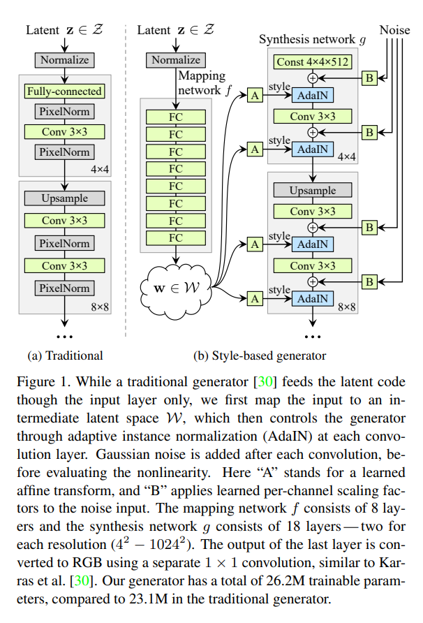
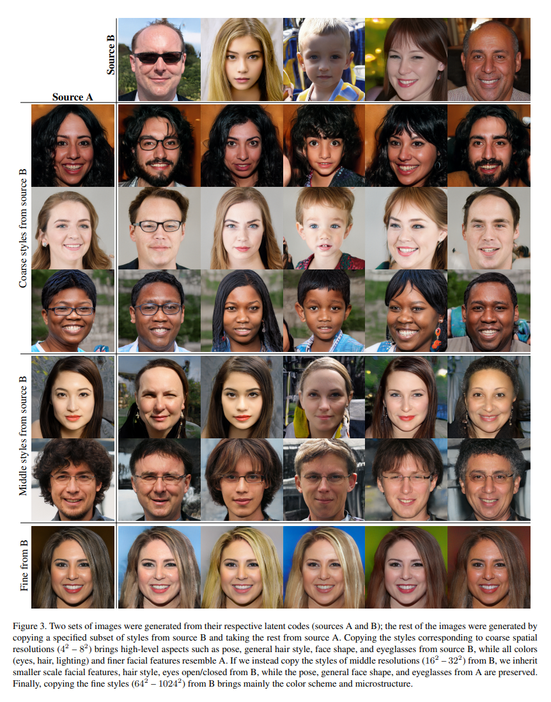
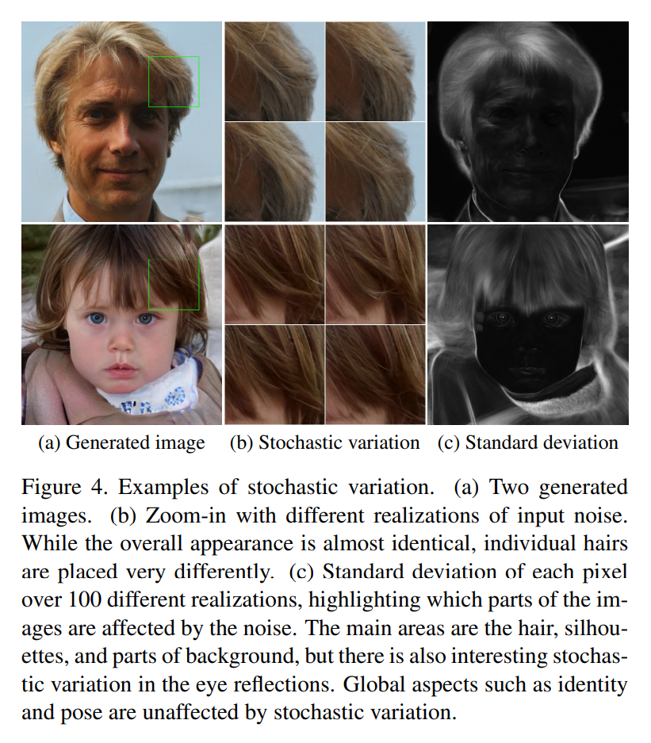
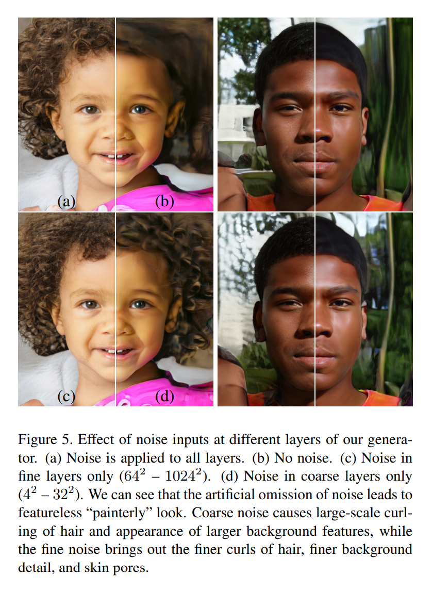
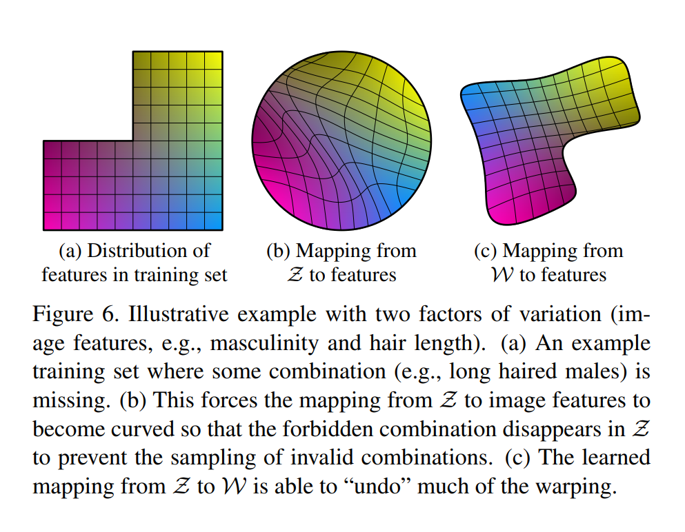
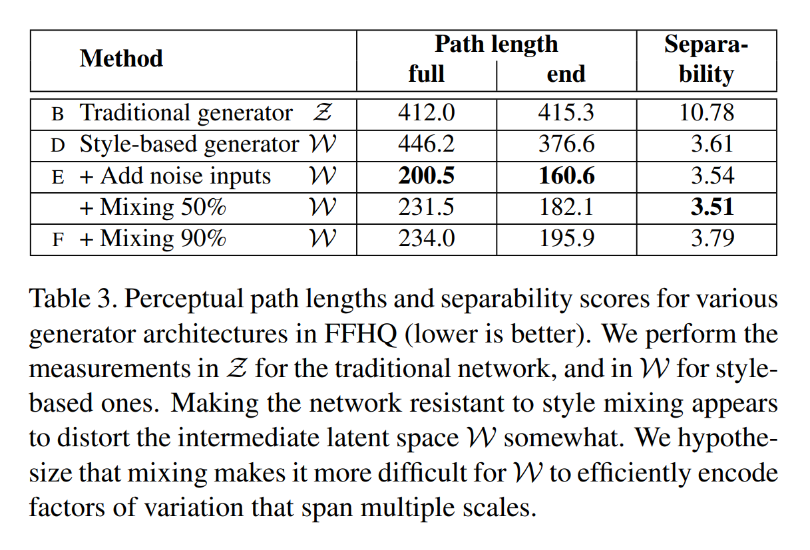
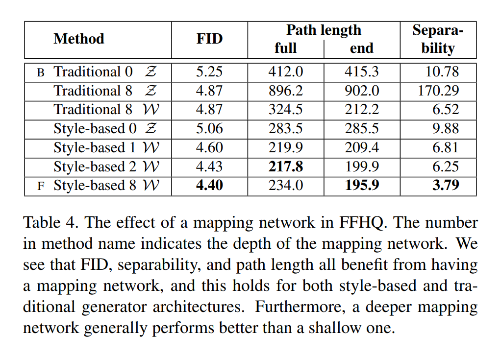

# A Style-Based Generator Architecture for Generative Adversarial Networks
[toc]

**Abstract** 提出一个用于生成对抗网络的可替代的生成器架构，借鉴于风格迁移作品。新架构能够得到自动学习，无监督的分离的高级特征（例如用于人脸生成中的姿态、id等）和生成的图片中的随机变量（如雀斑、头发），并对合成具有直观且尺度特定的控制能力。新的生成器在传统分布质量度量上达到sota，明确地更好的内部属性，同时更好地对变量潜在的影响因素进行解耦。

# 1. Introduction

GAN生成的图像的分辨率和质量持续提升。但是生成器仍然如黑盒一样，仍然缺少对图片合成过程中的不同方面的理解，如初始随机特征等。人们对隐空间（latent space）的理解同样很少，常见的展示隐空间的方法（? interpolations）也没有提供比较不同生成器的量化方法。

受风格迁移启发，重新设计了生成器的架构，暴露新方式用于控制图像合成过程。我们的生成器从一个学习后的常量输入开始，没一个卷积层基于隐编码调整图像的“风格”，从而直接控制不同尺度上图像特征的强度。与直接注入网络的噪音结合，这个结构上的改变获得了随机变量的高级属性的自动的、无监督的分离。并没有改变判别器和loss函数。

将输入的隐编码嵌入到一个中间隐空间中，这样做对网络如何表达变量有很大效果。输入隐空间必须遵循训练数据的概率密度，但是我们主张这一结论在某种程度上会导致无法避免的耦合。我们的中间隐空间就不受这个限制，因此可以解耦。由于以前估计隐空间解耦程度的方法不能直接应用于我们的案例，所以提出两个新的自动度量：**感知路径长度**和**线性分离度**，用于量化生成器的这些方面。

# 2. Style-based generator

一般来讲都是通过一个输入层将隐编码传入生成器的，例如前向网络的第一层，如Fig 1a所示。我们不采用这种方法，而是将输入层全部省略，从一个可学习的常量开始，如Fig 1b所示。给定一个属于输入隐空间$\mathcal{Z}$的隐编码$\textbf{z}$,首先经过一个非线性映射网络$f:\mathcal{Z} \to \mathcal{W}$生成$\textbf{w}\in \mathcal{W}$. 简单起见，将两个空间的维度都设定为512，映射$f$使用的是一个8层的MLP. 学习一个仿射变换，然后获取属于*风格*$\textbf{y}=(\textbf{y}_s, \textbf{y}_b)$的特定的$\textbf{w}$用于控制g网络每个卷积层之后的AdaIN(adaptive instance normalization)操作。AdaIN操作定义为：
$$
\mathrm{AdaIN}(\textbf{x}_i, \textbf{y})=\textbf{y}_{s,i} \frac{\textbf{x}_i-\mu(\textbf{x}_i)}{\sigma(\textbf{x}_i)} + \textbf{y}_{b,i}, \qquad(1)
$$
其中每个特征图$\textbf{x}_i$是分开进行归一化的，然后使用对应风格$\textbf{y}$的缩放组件进行缩放和添加偏置。因此，$\textbf{y}$的维度是那一层特征图维度的两倍。

与风格迁移相比，我们根据向量$\textbf{w}$而非风格图片计算了空间不变的风格参数$\textbf{y}$. 

blahblahblah

## 3. Properties of the style-based generator

我们的生成器通过对风格的特定尺度修改实现对图像合成的控制。可以将映射网络和放射变化视为一种从一个学习的分布中对每种风格获取样本的方法，将合成网络视为生成一张基于一个风格集合生成一张新图片的方法。每种风格的作用都被定位在网络中，例如修改风格的一个特定子集合只会影响生成图像的几个特定方面。

要得到如此定位的原因，考虑AdaIN操作，其首先将每个通道归一化到0均值和单位方差，然后才根据风格加上尺度和偏置。新的到的每个通道的统计信息受风格支配，会修改用于随后卷积操作的相关特征的重要程度，但是不依赖于原始统计信息，因为经过了归一化。因此每个风格在被下一个AdaIN操作覆盖之前只控制一个卷积层。

### 3.1. Style mixing

使用混合正则化进一步增强风格定位，在训练过程中，给定百分比的图像使用两个随机隐编码而非一个生成。当生成一张图片的时候，在合成网络的某个随机的位置，将隐编码从一个换成另一个，这个操作称为风格混合。具体说，将两个隐编码$\textbf{z}_1,\textbf{z}_2$传入映射网络，得到对应的$\textbf{w}_1,\textbf{w}_2$用于控制风格，在交叉点(crossover point)之前使用$\textbf{w}_1$，之后使用$\textbf{w}_2$. 这个正则化技术可以防止网络假定相邻的风格具有相关性。Fig 3展示了通过混合几个尺度的两个隐编码合成的图片样本。可以看到每个风格的子集都控制图像有意义的高级属性。

### 3.2. Stochastic variation

人像的很多方面都有随机性，例如头发的具体位置、胡茬、雀斑或者毛孔。对于这些方面来说，只要它们遵循正确的分布，就可以在不影响我们对图像的感知的条件下随机生成。

考虑一下一个传统的生成器如何实现随机变化。通过输入层给定网络的唯一输入，网络需要找到一种方式，当需要的时候，从先前的活动生成空间变化的伪随机数。这样做会消耗网络能力，而且隐藏生成的信号周期很困难——且不保证成功，证据可从生成图像中常见的重复模式找到。我们的架构通过在每次卷积后对每个像素增加噪音的方式避免这些问题。

Fig 4展示了同一张基础图片使用我们的生成器加不同的噪音生成的随机变化。可以看到噪音只影响随机的方面，而不影响整体整体构成和高级方面例如id信息。Fig 5进一步展示了对不同层的子集合使用随机变化的效果。

有趣的是，我们发现噪声的影响在网络中的定位非常紧密。假设在生成器的任意位置，尽可能早地引入新的内容都有压力阻碍，网络创建随机变化的最简单的方式就是依赖于提供的噪声。每一层都可以获得一组新的噪声，因此也就不需要根据之前的活动生成随机效果。

### 3.3. Separation of global effects from stochasticity

已知风格的改变会产生全局效果（改变姿态，id等），而噪音仅影响无关紧要的随机变化（不同发型、胡子等）。这一观察和风格迁移作品中是一致的，其具有空间不变的统计特征（Gram matrix，channel-wise mean，variance等）会编码图片的风格，与此同时空间变化特征编码一个特定的实例。

在我们的基于风格的生成器中，风格会影响整个图片，因为整个特征图都是根据相同的值进行缩放和偏置的。因此全局性的影响如姿态和光照或者背景的风格都可以进行控制。同时，将噪声独立地添加到每个像素上，也就很好的实现了对随机变量的控制。如果网络试图使用噪声控制例如姿态这样的全局性变量，就会导致空间不一致，因此会被判别器惩罚。从而使网络学习到适当地使用全局和局部通道，而无需显式指导。

## 4. Disentanglement studies

退纠缠(disentanglement)有多种定义，但是常见的目标是一个由线性子空间组成的隐空间，每一个子空间都控制一个变量因子。但是每种$\mathcal{Z}$中因子组合的采样概率都需要和训练数据中对应的密度相匹配。如Fig 6中所示，这阻止了因子与典型数据集和输入隐分布完全退纠缠。

我们的生成器架构的一个主要优势在于中间隐空间$\mathcal{W}$无需支持根据任何固定分布的采样；其采样密度是通过学习后的分段连续的映射（函数）$f(\textbf{z})$得到的。这个映射可以适用于“展开”$\mathcal{W}$，这样，变量的因子就变得更线性。假定生成器这么做是存在阻碍的，因为基于一个退纠缠的表示来生成真实图片应该要比基于一个纠缠的表示生成更简单一些。同样，我们希望训练过程能够在无监督情况下得到一个纠缠程度更低的$\mathcal{W}$，也就是说变量的因子事先未知。

不幸的是，最近提出的用于量化退纠缠的度量方法都需要一个编码器网络将输入图片映射到隐编码。这些度量方法并不适用于我们的方案，因为我们的基准GAN缺少这样的编码器。尽管可以为此增加一个额外的网络，但我们不想将精力投入到一个不属于真正方案的部分中。为此，提出两种新的用于量化退纠缠的度量方法，它们都不需要额外的编码器，也不需要事先知道变量的因子，因此也就可以用于任何图片数据集和生成器上进行计算。

### 4.1. Perceptual path length
对隐空间的向量的插值也许会在图片中引起惊人的非线性变化。例如，在线性插值路径的两个端点处缺失的特征也许会出现在中间位置。这是隐空间纠缠的一个标志，变量的因子没有分开。可以通过衡量当对隐空间进行插值时图片跟随变化的剧烈程度来量化这一现象。直观理解，一个曲率小的隐空间应该得到比曲率大的隐空间直观上更光滑的转换。

基础的衡量方法使用一个基于感知的图片对距离，通过计算两个VGG16 embeddings的加权差异实现，使用合适的权重可以使判断近似于人类感知。如果将一个隐空间插值路径细分成线性段，就可以将这个线性路径段的完整感知长度定义为每段的感知差异的和，也称为图片距离度量。感知路径长度的一个自然定义应该是这一和的极限（无限细分），但是实际上使用了很小的线段长度$\epsilon=10^{-4}$来近似。因此隐空间$\mathcal{Z}$所有端点的平均感知路径长度为：
$$
l_{\mathcal{Z}}=\mathbb{E}\Big[\frac{1}{\epsilon^2}d(G(\mathrm{slerp}(\textbf{z}_1,\textbf{z}_2;t)),G(\mathrm{slerp}(\textbf{z}_1,\textbf{z}_2;t+\epsilon)))\Big], \qquad(2)
$$
其中$\textbf{z}_1,\textbf{z}_2\sim P(\textbf{z}),t\sim U(0,1)$, $G$是生成器，$d(\cdot,\cdot)$评价生成图片的感知距离。$\mathrm{slerp}$代表球面插值，是对归一化的输入隐空间的最合适的插值方法。为了能够更多地关注于面部特征而非背景，将生成的图片裁切成只包含人脸的图片来衡量图片对度量。由于距离$d$是二次项，所以除以$\epsilon^2$. 用100000样本计算期望。

用类似的方式计算$\mathcal{W}$的平均感知路径长度：
$$
l_{\mathcal{W}}=\mathbb{E}\Big[\frac{1}{\epsilon^2}d(g(\mathrm{lerp}(f(\textbf{z}_1),f(\textbf{z}_2);t)),g(\mathrm{lerp}(f(\textbf{z}_1),f(\textbf{z}_2);t+\epsilon)))\Big], \qquad(3)
$$
唯一差别在于插值在$\mathcal{W}$空间。因为$\mathcal{W}$中的向量没有用任何方法进行归一化，所以使用线性插值($\mathrm{lerp}$).

Table 3展示了对于带噪音输入的基于风格的生成器的完整路径的长度基本上比较短，表明$\mathcal{W}$在感知上比$\mathcal{Z}$更线性。但是这一度量实际上稍微偏向于输入隐空间$\mathcal{Z}$. 如果$\mathcal{W}$的确是$\mathcal{Z}$的解耦且“扁平化”的映射，那么它可能包含不在输入流形上的区域——并因此被生成器错误重建——甚至在从输入流形映射得到的点之间，尽管输入latent space$\mathcal{Z}$定义上并不存在这种区域。因此如果将对路径终点的度量加以限制，即$t\in\{0,1\}$，就可以在不影响$l_Z$的前提下得到较小的$l_W$. 这实际上在Table 3中可以看到。
Table 4中展示了路径长度受映射网络影响的现象。可以看到传统和基于风格的生成器都受益于映射网络，并且映射网络的深度增加通常会提升感知路径长度。有趣的是，对于传统生成器来说，当$l_W$提升的时候，$l_Z$变得很差，阐述了我们的观点：GAN中，输入latent space可能任意纠缠。

### 4.2. Linear separability
如果一个latent space充分解耦，就应该能够找到于独立变量相关的方向向量。我们提出另一个度量来量化这一效应：通过衡量latent space中的点被线性超平面划分到两个集合的程度；这样，每一个集合都代表了图片的一个二元属性。
为了能够对生成的图片进行标注，训练了一个针对多个二元属性的辅助分类网络。在我们的测试中，分类器和判别器有同样的结构。
对每个属性使用一个SVM来预测标签，对传统生成器用$z$，对基于风格的生成器用$w$，并且用这个平面进行分类。然后计算条件熵$H(Y|X)$其中$X$是预测值，$Y$是标签。这样可以知道在已知样本位于超平面某侧的前提下，确定一个样本类别需要多少额外的信息。条件熵的值小说明latent space方向与独立的变量方向一致。
最终的分离度分数计算为$\exp(\sum_iH(Y_i|X_i)))$其中i对应40个属性。
Table 3和Table 4说明了$\mathcal{W}$始终比$\mathcal{Z}$有更好的分离度，有纠缠程度更低的表示。
而且增加mapping network的深度会同时提升图片质量和$\mathcal{W}$的可分离性，这也与合成网络天生倾向于接收解耦后的表示输入的假设相一致。有趣的现象是，在一个传统的生成器之前加上一个映射网络会在$\mathcal{Z}$中造成严重的分离度下降，但是在中间latent space$\mathcal{W}$中则会提升。这说明了即使是传统的生成器架构也会在引入中间latent space之后获得性能的提升，而这个latent space并不需要与训练数据同分布。