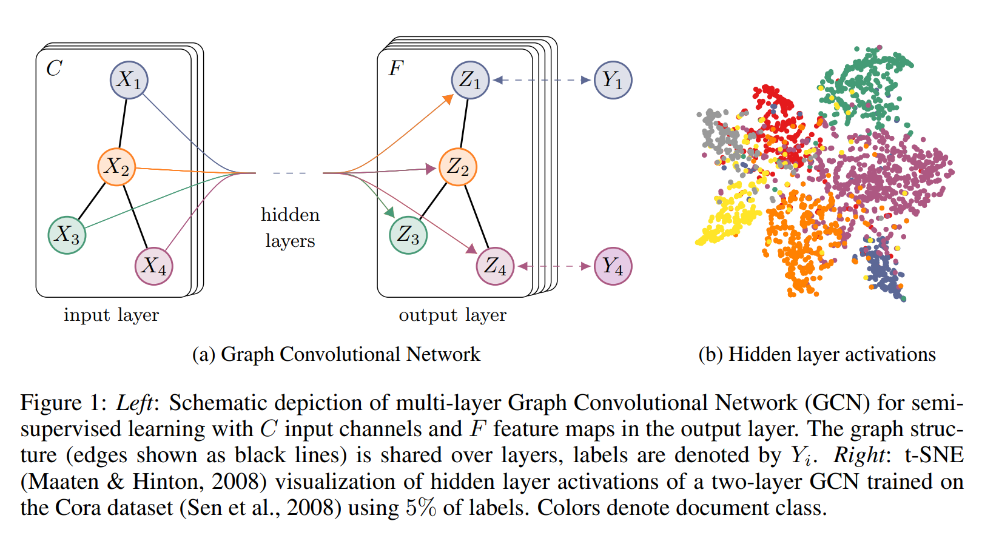

# Semi-Supervised Classification with Graph Convolutional Networks

## 1 Introduction

考虑在一个图中对节点进行分类的问题，其中只有一小部分节点有标签。这个问题可以看成基于图的半监督学习，其中标签信息通过某种形式的基于图的显式正则化过程进行传播，如通过在loss函数中使用图拉普拉斯正则化项：
$$
\mathcal{L}=\mathcal{L}_0+\lambda \mathcal{L}_{\text{reg}} , \quad \text{with} \quad \mathcal{L}_{\text{reg}}=\sum\limits_{i,j}A_{ij} \Vert f(X_i)-f(X_j)\Vert ^2=f(X)^T \Delta f(X). \qquad(1)
$$
其中$\mathcal{L}_0$代表关于图中有标签部分的有监督loss，$f(\cdot)$可以是一个类似神经网络一样的可微函数，$\lambda$是一个权重因子，$X$是一个节点特征向量$X_i$的矩阵。$\Delta=D-A$代表一个无向图$\mathcal{G=(V,E)}$的未归一化的图Laplacian矩阵，这个图有$N$个顶点$v_i \in \mathcal{V}$，边$(v_i,v_j)\in \mathcal{E}$和一个邻接矩阵$A\in \mathbb{R}^{N\times N}$（01或加权）还有一个度矩阵$D_{ii}=\sum_jA_{ij}$. 公式1中的方程依赖于图中相连的节点可能拥有同一个标签的假设。尽管这个假设可能会限制模型的能力，因为图的边并不需要编码节点的相似度，但是却能包含更多额外的信息。

本文我们使用一个神经网络模型$f(X,A)$直接编码图的结构并在一个有监督的目标$\mathcal{L}_0$上训练所有带标签的节点，从而避免在loss函数中使用图的显式正则化项。在图的邻接矩阵上调整$f(\cdot)$可以使模型对来自于有监督loss$\mathcal{L}_0$的梯度信息进行分发，并可以使模型学习节点（有标签和无标签）的表达。

两部分内容：

1. 介绍一个简单又好用的神经网络模型的层级传播法则，可以直接应用于图上。并展示它可以通过谱图卷积（Spectral graph theory, 简单的概括就是：*借助于图的拉普拉斯矩阵的特征值和特征向量来研究图的性质*）的一阶近似驱动。
2. 展示了这种形式的基于图的神经网络模型能够用到对图中节点的快速且可扩展的半监督分类中。

## 2 Fast Approximate Convolutions on Grpahs

本节提供将在本文中使用的一个特定的基于图的神经网络模型$f(X,A)$的理论动机。考虑一个多层图卷积网络(GCN)，使用下述层级传播法则：
$$
H^{(l+1)}=\sigma \Big(\tilde{D}^{-\frac{1}{2}}\tilde{A}\tilde{D}^{-\frac{1}{2}}H^{(l)}W^{(l)}\Big). \qquad(2)
$$
这里，$\tilde{A}=A+I_N$是无向图$\mathcal{G}$加上自链接的邻接矩阵。$I_N$是单位矩阵，$\tilde{D}_{ii}=\sum_j\tilde{A}_{ij}$，$W^{(l)}$是按层的可训练权重矩阵。$\sigma(\cdot)$代表一个激活函数，比如$\text{ReLU}(\cdot)=\max{(0, \cdot)}$. $H^{(l)}\in \mathbb{R}^{N\times N}$是第$l$层的activations; $H^{(0)}=X$. 

### 2.1 Spectral Graph Convolutions

考虑定义为信号$x\in\mathbb{R}^{N}$和滤波器$g_{\theta}=\text{diag}(\theta)$乘积的图上的谱卷积（$g_{\theta}=\text{diag}(\theta)$是在傅里叶域上通过$\theta \in \mathbb{R}^N$参数化的滤波器）：
$$
g_{\theta}\star x=Ug_{\theta}U^Tx, \qquad(3)
$$
其中$U$是归一化后的图Laplacian矩阵$L=I_N-D^{- \frac{1}{2}}AD^{- \frac{1}{2}}=U\Lambda U^T$的特征向量矩阵，其对角的特征值矩阵为$\Lambda$，$U^Tx$是$x$的图傅里叶变换。我们可以将$g_{\theta}$理解为$L$的特征值的函数，也就是$g_{\theta}(\Lambda)$. 公式（3）计算起来很麻烦，因为特征向量矩阵$U$的乘法的复杂度是$\mathcal{O}(N^2)$. 而且首先计算$L$的特征分解对于大规模图来说就可能异常麻烦。为了避免这一问题，有研究指出（Hammond 2011）$g_{\theta}(\Lambda)$能够通过切比雪夫多项式$T_k(x)$到第$K$阶的部分展开（截断展开）来近似：
$$
g_{\theta'}(\Lambda) \approx \sum\limits_{k=0}^K \theta_k'T_k(\tilde{\Lambda}), \qquad (4)
$$
用到了调整过的$\tilde{\Lambda}=\frac{2}{\lambda_{\max}} \Lambda-I_N$. $\lambda_{\max}$代表$L$的最大的特征值。$\theta'\in \mathbb{R}^K$是切比雪夫系数的向量。切比雪夫多项式的递归定义为$T_k(x)=2xT_{k-1}(x)-T_{k-2}(x)$，其中$T_0(x)=1, T_1(x)=x$. 

回到我们对一个信号$x$在滤波器$g_{\theta'}$下卷积的定义，现在有：
$$
g_{\theta'} \star x \approx \sum\limits_{k=0}^K\theta_k'T_k(\tilde{L})x, \qquad (5) \\
\tilde{L}=\frac{2}{\lambda_{\max}} L-I_N
$$
$(U\Lambda U^T)^k=U\Lambda^k U^T$

注意到由于这个表达式是一个Laplacian的k阶多项式，所以现在它是K-localized，也就是说它仅依赖于与中心节点K步以内的节点（K序邻居）。公式（5）的复杂度为$\mathcal{O(|E|)}$，即边数线性。

### 2.2 Layer-wise Linear Model

因此可以根据公式（5）的形式通过堆叠多个卷积层（并后接一个逐点的非线性操作）来构建基于图卷积的神经网络模型。现在想象一下我们把逐层卷积操作限制为$K=1$，亦即一个关于$L$的线性函数，因此也就是图Laplacian谱的一个线性函数。

这样，我们仍然可以通过堆叠多个这种层来覆盖类别丰富的卷积滤波函数，但是并没有被具体的参数化操作限制住，例如切比雪夫多项式。直觉上我们期望这样的模型能够减轻有很宽广度分布的图的局部近邻结构上的过拟合问题，例如社交网络，文献引用网络，知识图谱和很多其他现实世界的图数据集。另外，对于固定的计算能力，这样的逐层线性公式化方法允许我们构建更深的模型，而更深的模型是一种已知的能够提高模型在几个域上容量的方法。

在这个GCN的线性化操作中，进一步近似到$\lambda_{\max} \approx 2$，可以期望神经网络的参数会在训练时按比例适应这一改变。在这样的近似下，公式（5）可以简化为：
$$
g_{\theta'} \star x \approx \theta_0'x+\theta_1'D^{- \frac{1}{2}}AD^{- \frac{1}{2}}x, \qquad(6)
$$
$\theta_0',\theta_1'$是两个自由参数。滤波器的参数可以被整个图共享。逐次应用这个形式的滤波器就可以有效地对一个节点的k阶邻居进行卷积，其中k代表神经网络模型中逐次操作的次数或卷积层的个数。

实际上，限制参数的数量是有利的，可以进一步解决过拟合问题并使每层的操作（例如矩阵乘法）数量最少。可以得到：
$$
g_{\theta'} \star x \approx \theta \Big( I_N+D^{- \frac{1}{2}}AD^{- \frac{1}{2}} \Big)x, \qquad(7)
$$
只有一个参数$\theta=\theta_0'=-\theta_1'$. 注意$I_N+D^{- \frac{1}{2}}AD^{- \frac{1}{2}}$现在的特征值的范围为$[0,2]$. 在深度神经网络模型中，重复使用这一操作会导致数值不稳定和梯度爆炸或梯度消失。为了缓解这一问题，引入重归一化技巧(renormalization trick): $I_N+D^{- \frac{1}{2}}AD^{- \frac{1}{2}} \rarr \tilde{D}^{-\frac{1}{2}}\tilde{A}\tilde{D}^{-\frac{1}{2}}$, 其中$\tilde{A}=A+I_N$,$\tilde{D}_{ii}=\sum_j\tilde{A}_{ij}$.

可以将这一定义推广到有$C$个输入通道（也就是对于每个节点有一个$C$维的特征向量）和$F$个滤波器或特征图的信号$X\in \mathbb{R}^{N\times C}$上：
$$
Z=\tilde{D}^{-\frac{1}{2}}\tilde{A}\tilde{D}^{-\frac{1}{2}}X\Theta, \qquad(8)
$$
其中$\Theta\in \mathbb{R}^{C\times F}$是滤波器参数的矩阵，$Z\in \mathbb{R}^{N\times F}$是卷积后的信号矩阵。这个滤波操作的复杂度为$\mathcal{O(|E|}FC)$，因为$\tilde{A}X$可以通过稀疏矩阵和稠密矩阵相乘来实现。

## 3 Semi-Spuervised Node Classification

介绍完一个简单却灵活的模型$f(X,A)$用来多图上的信息进行高效传播之后，可以回到半监督节点分类的问题上来。可以通过同时在数据$X$和图结构的邻接矩阵$A$上调整模型$f(X,A)$来得到特定的假设，这些假设往往是在基于图的半监督学习中得到的。我们期望这种设置在邻接矩阵包含数据$X$中无法提供的信息时可以非常强大，例如引用网络中的文档间的引用链接，或者知识图谱中的关系。总的模型，一个用于半监督学习的多层GCN，见Figure 1所示。

> Figure 1: *Left:* 多层GCN的示意图，用于半监督学习，其有$C$个输入通道，输出层有$F$个特征图。图结构（黑线为边）在层间共享，标签表示为$Y_i$. *Right:* t-SNE可视化在Cora数据集上使用5%标签训练的两层GCN隐藏层activations

### 3.1 Example

下文考虑一个两层的GCN，用来进行图上的半监督节点分类，这个图有一个对称的邻接矩阵$A$. 首先在预处理阶段计算$\hat{A}=\tilde{D}^{-\frac{1}{2}}\tilde{A}\tilde{D}^{-\frac{1}{2}}$. 我们的前向模型使用了简单的形式：
$$
Z=f(X,A)=\text{softmax}\Big(\hat{A}\quad \text{ReLU}(\hat{A}XW^{(0)})W^{(1)}\Big). \qquad(9)
$$
这里，$W^{(0)} \in \mathbb{R}^{C\times H}$是一个有$H$个特征图的隐藏层的权重矩阵（输入到隐藏层）。$W^{(1)}\in \mathbb{R}^{H \times F}$是一个隐藏层到输出的权重矩阵。softmax激活函数的定义为$\text{softmax}(x_i)=\frac{1}{\mathcal{Z}}\exp{(x_i)}, \mathcal{Z}=\sum_i\exp{x_i}$，应用在行上。用于半监督多类别分类的交叉熵为：
$$
\mathcal{L}=-\sum\limits_{l\in\mathcal{Y}_L}\sum\limits_{f=1}^F Y_{lf}\ln Z_{lf}, \qquad (10)
$$
其中$\mathcal{Y}_L$是有标签的节点的（索引）集合。

神经网络的权重$W^{(0)}$和$W^{(1)}$通过梯度下降训练。本作中每次训练循环都使用了整个数据集上的批梯度下降，这个选择需要内存放得下。使用$A$的一个稀疏表示，其内存需求为$\mathcal{O(|E|)}$，即按边数线性。通过dropout向训练过程引入随机性。

### 3.2 Implementation

Tensorflow

## 4 Related Work

灵感来源于基于图的半监督学习和最近的图上的神经网络。

### 4.1 Graph-Based Semi-Supervised Learning

大多数用图表示的半监督学习可以分成两大类：使用某种形式的显式图Laplacian正则化和基于图embedding的方法。

### 4.2 Neural Networks On Graphs

