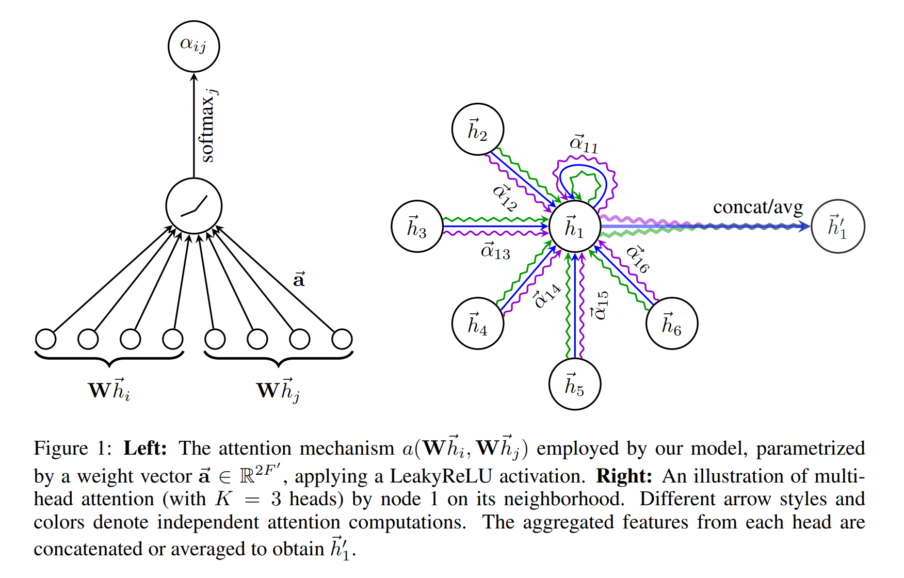

# GRAPH ATTENTION NETWORKS

## ABSTRACT
提出一个全新的神经网络架构——图注意力网络(GATs)，它在图结构数据上进行操作，利用掩码自注意力层来解决以前方法（图卷积或近似方法）的缺陷。

## 1 INTRODUCTION
卷积神经网络作用的数据必须是网格状结构。这样的架构通过将带可学习参数的局部滤波器作用于所有位置而达到高效地重复使用。

但是很多任务的数据无法以网格状结构来表示，而是存在于一个不规则的域中。例如3D meshes,社交网络、电信网络、生物网络等。这种数据通常可以用图的形式表示。

blahblahblah

在将卷积泛化到图域的兴趣日益高涨。在这一方面的推进一般分称两类：谱方法和非谱方法。

一方面，谱方法使用图的谱表示并已成功应用于节点分类任务。
在所有已经提出的谱方法中，学习的滤波器依赖于Laplacian特征基，而它则来自于图结构。因此在一个特定结构上训练的模型无法直接应用于另一个不同结构的图。

另一方面，非谱方法直接在图上定义了卷积，在一组稀疏的近邻上进行操作。这一方向的一大挑战是定义一个算子，使其可以在不同尺寸的邻接上进行操作并维护CNNs的共享权重。其中GraphSAGE，介绍了一个计算节点特征的归纳式方法。这个方法对每个结点采样固定尺寸的邻居并在其上使用一个特定的聚合器（如对节点邻居的特征向量求平均，或者将它们传入一个RNN网络得到结果）。这一方法达到了较好的表现。

注意力机制在很多基于序列的任务中几乎已经变成de facto（实际上的）标准。注意力机制的一个优点是可以处理不同尺寸的输入，关注于输入中最相关的部分来得出结论。当使用注意力机制计算一个单独序列的表达，通常称为*自注意力*或者*内部注意力*。

## 2 GAT ARCHITECTURE

### 2.1 GRAPH ATTENTIONAL LAYER
单独的图注意力层的描述

层的输入是一组节点特征$\textbf{h}=\{h_1,h_2,...,h_N\},h_i \in \mathbb{R}^F$，其中$N$是结点的数量，$F$是每个节点的特征维度。这一层生成一组新的节点特征（不同基数$F'$）$\textbf{h}'=\{h_1',h_2',...,h_N'\},h_i' \in \mathbb{R}^{F'}$作为输出。

为了得到足够的表达能力将输入特征变换成更高级特征，至少需要1个可学习的线性变换。因此在初始化阶段，一个参数为权重矩阵$\textbf{W}\in \mathbb{R}^{F'\times F}$的共享线性变换会应用在每个节点上。然后在节点上使用自注意力——一个共享的注意力机制$a:\mathbb{R}^{F'}\times \mathbb{R}^{F'} \rightarrow \mathbb{R}$来计算注意力相关系数：
$$
e_{ij}=a(\textbf{W}h_i,\textbf{W}h_j) \qquad (1)
$$
代表j节点对于i节点的重要性。对于最一般的公式，模型允许每个节点注意到其余所有节点，得到全部结构信息。通过使用掩码注意力将图结构注入到这个机制中——只计算节点$j\in \mathcal{N}_i$的$e_{ij}$，其中$\mathcal{N}_i$是节点i的一部分邻居。实验中只采用一阶邻居。为了使节点间的相关系数方便比较，在全部j上使用softmax函数进行归一化：
$$
a_{ij}=\text{softmax}(e_{ij})=\frac{\exp(e_{ij})}{\sum_{k\in \mathcal{N}_i}\exp(e_{ik})}. \qquad (2)
$$
在我们的实验中，注意力机制a是一个单层的前馈神经网络，参数为一个权重向量$\vec{\textbf{a}}\in \mathbb{R}^{2F'}$，并使用LeakyReLU($\alpha=0.2$)非线性函数。注意力机制计算的相关系数（如Figure 1左图所示）完全展开的形式可以表示为：
$$
a_{ij}=\frac{\exp\Big(\text{LeakyReLU}\Big(\vec{\textbf{a}}^T[\textbf{W}h_i\lVert \textbf{W}h_j]\Big)\Big)}{\sum_{k\in \mathcal{N}_i}\exp\Big(\text{LeakyReLU}\Big(\vec{\textbf{a}}^T[\textbf{W}h_i\lVert \textbf{W}h_k]\Big)\Big)} \qquad (3)
$$
其中$\cdot^T$代表转置，$\lVert$是拼接操作。
> 上式注：
> $h$是$1\times F$
> $\textbf{W}$是$F\times F'$
> $\textbf{W}h$是$1\times F'$
> $\textbf{W}h_i\lVert \textbf{W}h_j$是$1\times 2F'$
> $\vec{\textbf{a}}^T$是$2F'\times 1$
> 所以最后$\vec{\textbf{a}}^T[\textbf{W}h_i\lVert \textbf{W}h_j]$就得到注意力系数（一个数）

获取归一化的注意力系数之后，用于计算特征的线性组合，作为每个节点的最终特征（还要经过一个激活函数$\sigma$）：
$$
h_{i}'=\sigma \Bigg(\sum_{j\in \mathcal{N}_i}\alpha_{ij}\textbf{W}h_j\Bigg). \qquad (4)
$$
为了稳定自注意力的学习过程，发现将我们的机制扩展到多头注意力会有收益。在公式(4)上采用K个独立地注意力机制，然后将它们的特征拼接到一起，得到输出特征表示：
$$
h_i'=\mathop{\lVert}\limits_{k=1}^K \sigma \Bigg(\sum_{j\in \mathcal{N}_i}\Bigg) \qquad (5)
$$
其中$\lVert$是拼接操作，$\alpha_{ij}^k$是第k个注意力机制($\alpha^k$)计算得到的归一化后的注意力相关系数，$\textbf{W}^k$是对应的输入线性变换权重矩阵。注意到这种情况下最终返回的输出$\textbf{h}'$的每个节点都包含尺寸为$KF'$的特征，而非$F'$.

特别地，如果在网络的最终层使用多头注意力的话就不应该再进行拼接了，我们使用*平均*替换了拼接操作，并在平均之后才加上非线性激活：
$$
h_i'=\sigma \Bigg(\frac{1}{K}\sum_{k=1}^K\sum_{j\in \mathcal{N}_i}\alpha_{ij}^k \textbf{W}^kh_j\Bigg) \qquad (6)
$$
多头注意力层的聚合过程如Figure 1右图所示。

### 2.2 COMPARISONS TO RELATED WORK
2.1节中描述的图注意力层直接解决了以前用神经网络建模图结构数据方法遇到的一些问题：
* 在计算上效率很高：自注意力层的操作可以在全部边上同时/并行计算，而输出特征的计算也可以在全部节点上同时/并行计算。不需要特征分解或者类似的开销大的矩阵操作。一个单独的GAT注意力头计算$F'$特征的时间复杂度可以表示为$O(|V|FF'+|E|F')$，其中F是输入的特征维度，$|V|$和$|E|$分别是图中节点和边的数量。这一时间复杂度和GCNs基本持平。使用多头注意力会使存储和参数量扩大K倍，但是独立头的计算完全可以分开进行。
* 与GCNs不同，我们的模型允许（隐式地）对同一个邻居分配不同的重要性，在模型容量上达到了一个提升。而且进一步分析学习到的注意力权重可能会在可解释性方面获得收益，如机器翻译领域的情况。
* 注意力机制以一种共享的方式作用于图上的全部边，因此它不依赖于预先获取节点的全局图结构（这是以前方法的一大限制）。这一特点的意义在于：
  * 图不必是无向图
  * 使本技术可直接应用于归纳式学习
* GraphSAGE的方法为了保持computional footprint一致，对每个节点采样了固定数量的邻居；这就不允许在推理的时候接触到节点的整个邻居集合。而且他们用到的LSTM聚合器需要考虑邻居节点顺序带来的影响。我们的方法则不受这些问题的影响——在整个邻居范围内进行操作，并且不会假设任何顺序。