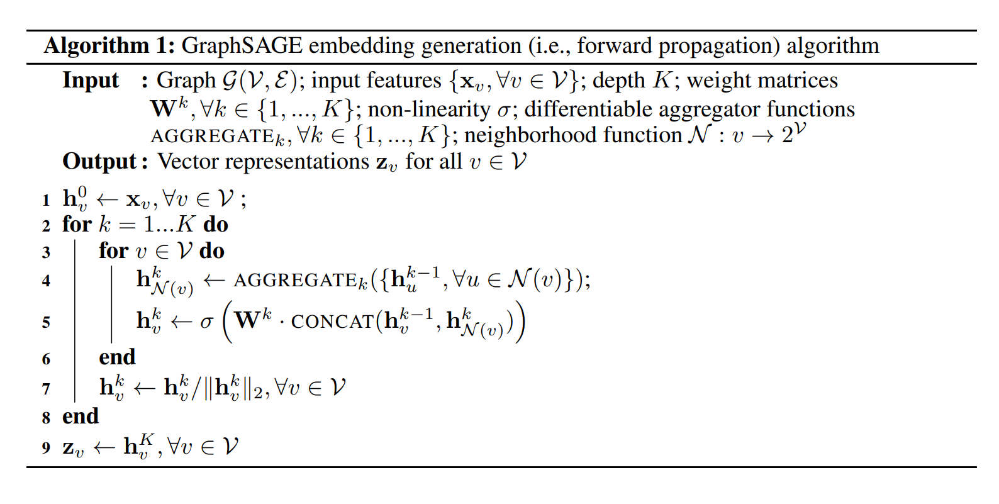

# Inductive Representation Learning on Large Graphs(GraphSAGE)

## Abstract
大规模图的节点低维嵌入法应用广泛，效果也好。但是目前大多数实现方法都需要图中所有节点参与训练；这些方法本质上是直推式(transductive)的而且无法直接泛化到没见过的节点。本文提出GraphSAGE，一个一般的归纳式框架，利用节点特征信息生成预先未见过的节点嵌入。与为每个节点训练其独立的嵌入不同，我们学习一个函数通过采样和聚合一个节点的局部邻居节点的特征来生成嵌入。

## 1 Introduction
大规模图节点的低维嵌入向量在很多任务中都可以作为很有用的输入特征来使用。节点嵌入法背后的思想是利用降维技术对图中节点的邻居的高维信息进行蒸馏得到一个稠密的向量。然后可以将这些节点向量送入后续的机器学习系统来完成不同的任务，比如节点分类、聚类和连接预测。

但是之前的工作都关注于一个单一固定图的节点嵌入，而很多现实任务都需要快速生成没见过节点或者整个新（子）图的嵌入。对于高吞吐的生产环境机器学习系统而言，这一归纳能力是必须的，因为它需要在不断进化的图上进行操作，而且会一直遇到没有见过的节点。一个归纳的生成节点嵌入的方法也可以促进拥有同样形式特征的不同图间的泛化能力：例如可以在一个模型有机体上训练一个蛋白质-蛋白质相互作用图嵌入生成器，然后迁移到一个新的有机体上利用现有模型生成数据。

与直推式的设定相比，归纳式节点嵌入问题格外困难，因为泛化到没见过的节点需要将新观察的子图与算法已经优化郭的进行“对齐”。一个归纳式框架必须学习识别一个节点的邻居的结构属性，这样的结构属性可以揭示节点在图中的局部角色和它的全局位置。

大多数现有方法都采用直推式生成节点嵌入。其中大多数方法通过使用基于矩阵分解的目标来直接优化每个节点的嵌入，因为它们在单一的固定图上进行预测，所以不能直接泛化到没见过的数据。这种方法可以通过修改变成归纳式方法，但是修改会增加计算复杂度，生成新预测前需要额外的梯度下降轮数。GCNs同样是直推式的方法，它也做用于固定图。本作干了两件事，一是将GCNs扩展到归纳式无监督学习，另一个是提出一个框架，将GCNs泛化来使用可训练的聚合函数（超越简单卷积）。

**当前工作** 
提出一个用于归纳式节点嵌入的通用框架，称为GraphSAGE(SAmple and aggreGatE).与基于矩阵分解的嵌入方法不同，我们利用节点特征（如文本属性、节点描述信息、节点度）来学习一个能够泛化到没见过节点的嵌入函数。通过在学习算法中结合节点特征，我们同时学习每个节点邻居的拓扑结构，以及节点特征在邻居中的分布。虽然我们关注特征丰富的图（例如带文本信息的引用数据，带公式/分子式标记的生物数据），但是我们的方法同样能够利用整个图的结构特征（如节点的度）。因此我们的算法同样可以应用于没有节点特征的图（？？？）。

我们不是针对每个节点训练一个明确的嵌入向量，而是训练一组聚合器函数，让它们学习去从一个结点的邻居中聚合特征信息(Figure 1).每个聚合器函数都从给定节点的不同跳数，或称为搜索深度处聚合信息。测试或推理的时候，使用训练好的系统，在全部没见过节点上应用学习后的聚合函数来生成它们的嵌入。根据之前生成节点嵌入的工作，设计一个无监督损失函数，它可以允许GraphSAGE脱离特定任务监督而训练。同时GraphSAGE也可以通过全监督的方式来训练。

在三个节点分类的基准上进行了测试，blahblahblah

## 2 Related work
**Factorization-based embedding approaches.** 一些最近的节点嵌入方法通过使用随机游走策略和基于矩阵分解的学习目标来学习低维嵌入。这些这些方法也和其他的一些经典算法联系紧密，例如谱聚类，多维缩放，以及PageRank算法。由于这些嵌入算法是针对独立的节点直接训练节点嵌入，因此它们本质上是直推式的，而且至少需要通过大量的额外训练才能在新节点上进行预测。而且其中很多方法的目标函数对于嵌入的正交变化是固定不变的，也就意味着嵌入空间无法在不同图之间自然泛化，还会在重训练的时候发生漂移。

**Supervised learning over graphs.** 除了节点嵌入法之外，有丰富的关于图结构数据的有监督学习的资料。其中包含多种基于核的方法，其图的特征向量来源于多种图核。最近还有一些神经网络的有监督学习方法。上述这些方法尝试对整个图进行分类，而我们的方法则关注于对每个结点生成有用的表达。

**Graph convolutional networks.** 近年提出了作用于图上的一些卷积神经网络架构。其中大部分无法扩展到大规模图或只设计用于整个图的分类。我们的方法与GCN的关系很紧密。原始的GCN算法的设计是用于直推式半监督学习的，具体的算法在训练的时候需要整个图的Laplacian矩阵。我们算法的一个简单的变体可以视为GCN框架在归纳式学习的一个扩展，具体见3.3

## 3 Proposed method: GraphSAGE
核心思想是学习如何从一个结点的邻居聚合特征信息（如附近节点的度或文本属性）。首先描述GraphSAGE的嵌入生成（即前向传播）算法。然后描述GraphSAGE模型的参数是如何使用SGD和反向传播技术进行学习的。

### 3.1 Embedding generation(i.e.,forward propagation) algorithm
本节描述生成嵌入的过程，或称前向传播算法(Algorithm 1)，这一过程假设模型训练完毕且参数固定。实际上我们假设学习了$K$个聚合函数（表示为$\text{AGGREGATE}_k, \forall k \in \{1,...,K\}$）的参数，这些聚合函数从节点的邻居处聚合信息，还有一组权重矩阵$\textbf{W}^k,\forall k\in \{1,...,K\}$，用于在模型的不同层（或“搜索深度”）间传播信息。



```
|在每一层(K):
|    |对每一节点(V):
|    |    |1. 当前节点邻居在这一层的特征：由这些邻居在前一层的特征聚合得到
|    |    |2. 当前节点在这一层的特征：由当前节点在前一层的特征和它的邻居在这一层的特征拼接，点乘权重矩阵并激活得到
|    |对每一层的节点特征进行归一化
|
|得到节点的向量表示
```

Algorithm 1的直观理解是对于每一次循环或搜索深度，节点都会从它们各自的邻居处聚合信息，随着这一过程的继续，节点逐渐地获得越来越多来自图上更远处的信息。

Algorithm 1描述了在整个图$\mathcal{G=(V,E)}$以及每个结点的特征$\textbf{x}_v,\forall v \in \mathcal{V}$都作为输入的情况下的嵌入的生成过程。下面描述如何将这一过程推广到minibatch. Algorithm 1中的外层循环的过程如下，其中$k$代表外层循环的当前步（或称搜索深度），$\textbf{h}^k$代表一个节点在这一步中的表达：首先，每个节点将它*直接邻居*的表达$\{\textbf{h}_{u}^{k-1}, \forall u \in \mathcal{N}(v)\}$聚合成一个向量$\textbf{h}_{\mathcal{N}(v)}^{k-1}$.注意到这一聚合过程依赖于前一个循环中生成的表达（即$k-1$），而$k=0$（基础）的表达定义为输入结点特征。聚合完相邻的节点特征之后，GraphSAGE将节点的当前表达$\textbf{h}_v^{k-1}$和聚合得到的邻居向量$\textbf{h}_{\mathcal{N}(v)}^{k-1}$进行拼接，然后把这个拼接得到的向量传入一个带非线性激活函数$\sigma$的全连接层，转换成算法下一步会用到的表示（即$\{\textbf{h}_{v}^{k}, \forall v \in \mathcal{V}\}$）。为了方便表示，将第$K$层最终输出的表达表示成$\textbf{z}_v=\textbf{h}_v^K, \forall v \in \mathcal{V}$. 其中聚合的操作可以使用多种聚合器结构实现。

要将Algorithm 1扩展到minibatch上使用，在内部循环中只计算必要的节点而非全部节点(Appendix A)

**Relation to the Weisfeiler-Lehman Isomorphism Test.** GraphSAGE算法概念上受到了一些用于检测图同构性的经典算法的启发。在Algorithm 1中，如果：
(i) 设定$K=|\mathcal{V}|$,
(ii) 将权重矩阵设定为单位阵，
(iii) 使用一个合适的hash函数作为（无非线性）聚合器，
那么Algorithm 1就是一个Weisferler-Lehman(WL)同构测试的实例，aka “naive vertex refinement”.