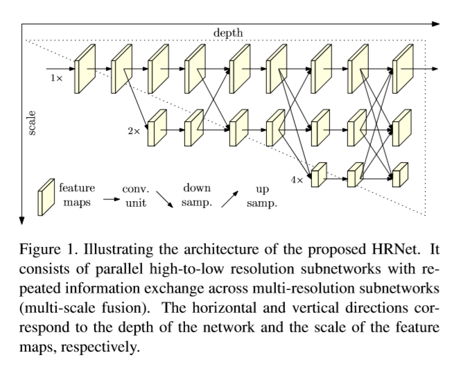
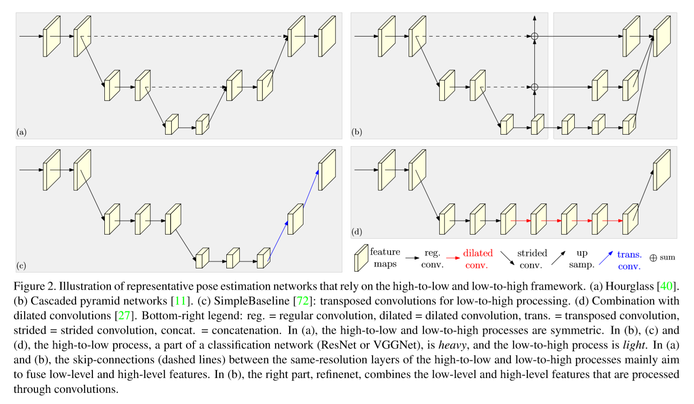
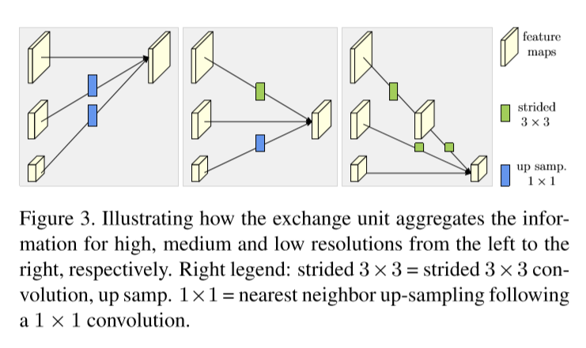

# DeepHigh-ResolutionRepresentationLearningforHumanPoseEstimation

本文关注于学习可靠的高分辨率表示来估计人体姿态。大多数方法都通过一个high-to-low网络（降分辨率网络）从低分辨率表示来恢复高分辨率表示。与它们不同，我们提出一个在整个流程中都保持高分辨率表示的网络。

从以一个高分辨率子网络作为第一阶段开始，逐渐地增加high-to-low子网络形成更多阶段，并将多分辨率子网络平行地连接到一起。重复使用多尺度融合，这样每一个high-to-low分辨率表示都会多次从其他平行表示接收信息，得到丰富的高分辨率表示。作为结果，预测的关键点热力图可能更准（potentially more accurate）且位置精确。

## Introduction

2D人体姿态估计在CV领域是一个基础却充满挑战的问题。目标是定位人体结构的关键点（如肘部，手腕等）或身体部位。其有很多应用，包括动作识别，人机交互，动画等。

大多数方法将输入传入一个网络，一般由high-to-low分辨率子网络连接组成，然后再进行升分辨率。例如，沙漏网络（Hourglass）通过一个对称的low-to-high网络来恢复高分辨率；SimpleBaseline使用几个转置卷积层来生成高分辨率表示。另外，在high-to-low分辨率网络中也使用空洞卷积来扩大后续层尺寸。

提出一个新架构，即高分辨率网络（High-Resolution Net, HRNet），其能在整个流程中保持高分辨率表示。以一个高分辨率子网络作为第一阶段，逐渐地增加high-to-low子网络形成更多阶段，并将多分辨率子网络平行地连接到一起。在整个流程中，多次重复使用多尺度融合在平行的多分辨率子网络间交换信息。在HRNet输出的高分辨率表示上估计关键点。网络如Figure 1所示。

在姿态估计方面，本网络与现有网络相比有两个优势：

1. 我们将high-to-low分辨率子网络平行链接而非其他方案一样顺序链接。因此我们的方案可以保持高分辨率而不是通过low-to-high过程来恢复分辨率，从而使预测的热力图本能地（potentially）在空间上更精确。
2. 大多数现有的融合方案（fusion schemes）将低层和高层的表示聚合到一起。我们使用多次多尺度融合，借助于同一深度和相似层的低分辨率表示，来激励（boost）高分辨率表示，反之亦然，得到的结果中高分辨率表示也包含丰富的姿态估计信息。因此，预测的热力图本能地（potentially）更准确。

## Related Work

大多数传统的单人姿态估计方法采用概率图模型(probabilistic graphical model)或者图结构模型(pictorial structure model)，其最近在使用深度学习方法更好地对一元数（unary）和成对能量（pair-wise energies）建模或模拟迭代推理过程的帮助下得到了提升。

目前有两个主流方案：对关键点位置进行回归和估计关键点热力图然后选取热力图上最高值的点作为关键点。

大多数关键点热力图估计的CNN组成为：一个主干（stem）子网络，同分类网络类似，这个子网络会降低分辨率；一个主体网络生成与输入相同分辨率的表示，再接一个回归器来估计关键点位置的热力图，然后将人力图变换到完整分辨率。

其主体主要使用high-to-low和low-to-high框架，可能会使用多尺度融合和深监督来进行扩充。

**High-to-low and low-to-high.** high-to-low过程为了生成低分辨率的高层表示，low-to-high过程为了生成高分辨率表示。为了增强效果，这两个过程都可以重复很多次。

表示网络的设计模式包括：

1. high-to-low和low-to-high过程对称。沙漏网络及其后续将low-to-high过程设计成high-to-low过程的镜像。
2. 重high-to-low，轻low-to-high，high-to-low过程基于ImageNet分类网络，例如：ResNet，low-to-high过程只是简单的几个双线性上采样或者转置卷积层。
3. 空洞卷积。

Figure 2 中展示了四种表示姿态估计网络。

**Multi-scale fusion. **直观的变法是将多分辨率的图像分别输入多个网络，并将结果聚合。沙漏网络和其拓展网络在low-to-high过程中使用跳跃链接（skip connections）逐渐将high-to-low过程中的低层特征与同分辨率的高层特征合并。在级联金字塔网络中，使用一个全局网络（globalnet）将high-to-low过程中的low-to-high的层的特征与low-to-high过程合并，然后使用一个refinenet将low-to-high层特征合并。

**Intermediate supervision. **中间监督或深监督，早期为图像分类任务而开发，同样在深度网络的训练和提升热力图估计质量上有帮助。

**Our approach. ** 我们的网络将high-to-low子网络平行地连接起来。在整个过程中保持高分辨率表示，用于空间精确热力图估计。high-to-low子网络的输出经过多次重复的特征融合生成可靠的高分辨率表示。

## Approach

人体姿态估计，又称关键点检测，目的是要从一个尺寸为$W\times H\times3$的图像$\textbf{I}$中检测$K$个关键点或部分（如肘部，手腕等）的位置。SOTA方法将这个问题转换成估计$K$个尺寸为$W'\times H'$的热力图，$\{\textbf{H}_1, \textbf{H}_2,...,\textbf{H}_K\}$，其中每个热力图$\textbf{H}_K$表示第$k$个关键点的位置置信度。

广泛使用的关键点热力图估计的CNN组成为：一个主干（stem）子网络，同分类网络类似，这个子网络会降低分辨率；一个主体（main body）网络生成与输入相同分辨率的表示，再接一个回归器来估计关键点位置的热力图，然后将人力图变换到完整分辨率。我们关注主体的设计并引入HRNet，如Figure 1所示。

**Sequential multi-resolution subnetworks. **现有的姿态估计网络是通过将high-to-low分辨率子网络顺序链接构建的，其中每个子网络构成一个阶段，由一组卷积构成，在相邻的子网络间使用一个下采样层将分辨率减半。

令$\mathcal{N}_{sr}$为第$s$阶段的子网络，$r$为分辨率下标（它的分辨率为第一个子网络的$\frac{1}{2^{r-1}}$）。有$S$个阶段（例：4）high-to-low网络可以表示为：
$$
\mathcal{N}_{11} \to \mathcal{N}_{22} \to \mathcal{N}_{33} \to \mathcal{N}_{44}. \quad\quad\quad(1)
$$
**Parallel multi-resolution subnetworks. **以一个高分辨率子网络作为第一阶段，逐渐增加high-to-low分辨率子网络形成新阶段，并将多分辨率子网络平行地连接起来。结果就是，后一阶段的子网络保持了前一阶段的分辨率，和一个额外的较低的分辨率。

举个例子，包含4个平行子网络，如下所示：
$$
{\mathcal{N}_{11} \to \mathcal{N}_{21} \to \mathcal{N}_{31} \to \mathcal{N}_{41} \\
\quad\quad \searrow \mathcal{N}_{22} \to \mathcal{N}_{32} \to \mathcal{N}_{42} \\
\quad\quad\quad\quad\quad \searrow \mathcal{N}_{33} \to \mathcal{N}_{43} \\
\quad\quad\quad\quad\quad\quad\quad\quad \searrow \mathcal{N}_{44}} 
\quad\quad\quad(2)
$$
**Repeated multi-scale fusion. **引入在平行子网络间的交换单元（exchange units），使子网络可以重复接收其他平行自网络的信息。举例说明交换信息的方案。将第三个阶段分成多个（例：3）交换块，每个块由3个平行的卷积单元组成，在三个平行的单元上有一个交换单元，如下所示：
$$
\mathcal{C}_{31}^1 \quad\searrow \quad\quad\quad \nearrow \mathcal{C}_{31}^2\quad \searrow \quad\quad \nearrow \mathcal{C}_{31}^3 \quad\searrow \\
\mathcal{C}_{32}^1 \quad\to \quad \varepsilon_3^1 \quad \to \mathcal{C}_{32}^2 \to \quad \varepsilon_3^2 \quad \to \mathcal{C}_{32}^3 \to \varepsilon_3^3 \\
\mathcal{C}_{33}^1 \quad\nearrow \quad\quad\searrow\quad \mathcal{C}_{33}^2 \quad\nearrow \quad\quad\searrow \mathcal{C}_{33}^3 \quad\nearrow \\
\quad\quad\quad\quad\quad\quad\quad\quad\quad\quad\quad\quad\quad\quad\quad\quad\quad\quad\quad\quad\quad\quad\quad\quad(3)
$$

其中$\mathcal{C}_{sr}^b$代表第$s$个阶段第$b$个block的第$r$分辨率的卷积单元，$\varepsilon_s^b$是对应的交换单元。

如Figure 3所示，为方便起见，忽略下标$s$和上标$b$.输入为$s$的对应图（response maps）$\{\textbf{X}_1,\textbf{X}_2,...,\textbf{X}_s\}$，输出为$s$的对应图$\{\textbf{Y}_1,\textbf{Y}_2,...,\textbf{Y}_s\}$，其分辨率和宽度与输入一致。每一个输出都是输入图的集合，$\textbf{Y}_k=\sum_{i=1}^sa(\textbf{X}_i,k)$.跨阶段的交换模块有额外的输出图：$\textbf{Y}_{s+1}=a(\textbf{Y}_s, s+1)$.

函数$a(\textbf{X}_i,k)$对$\textbf{X}_i$进行从分辨率$i$到$k$的上采样或下采样。使用$3\times3$卷积做下采样，例如：一个步长为2的$3\times3$卷积下采样倍数为$2\times$，连续用俩就是$4\times$.上采样使用简单的临近采样，再加一个$1\times1$卷积来对齐通道数。如果$i=k$，则$a(\cdot,\cdot)$就是一个不变连接（identify connection）：$a(\textbf{X}_i,k)=\textbf{X}_i$.

**Heatmap estimation. **仅从最后一个交换单元输出的高分辨率表示来回归热力图，从经验来看效果还不错。loss函数使用mse，比较预测的热力图和gt热力图之间的差别。gt热力图通过标准差为1的2D高斯分布在每个gt关键点上以一个像素为中心生成。

**Network instantiation. **根据ResNet的设计原则初始化关键点热力图估计网络，分配每个阶段的深度和每个分辨率的通道数。

主体（HRNet）包括四个阶段和四个平行子网络，它们的分辨率逐渐降至一半，深度（通道数）相应增加至两倍。第一阶段包括4个残差单元，每个单元与ResNet-50一样，由宽度为64的bottleneck构成，随后接一个$3\times3$卷积将特征图宽度（通道数）降低到$C$.第2，3，4阶段各包含1，4，3个交换块。一个交换块包含4个卷积单元，每个单元的每个分辨率包含两个$3\times3$卷积，并有一个交换单元与这些分辨率相交。总的来说，共有8个交换单元，例：执行了8次多尺度融合操作。

在实验中，我们研究了一个小网络和一个大网络：HRNet-W32和HRNet-W48，其中32和48分别代表后三个阶段的高分辨率子网络宽度$C$.另外三个平行子网络的宽度为：HRNet-W32是64，128，256；HRNet-W48是96，192，384.

****

高分辨率网络，能在整个流程中保持高分辨率表示，用于人体姿态估计，也可做新的backbone