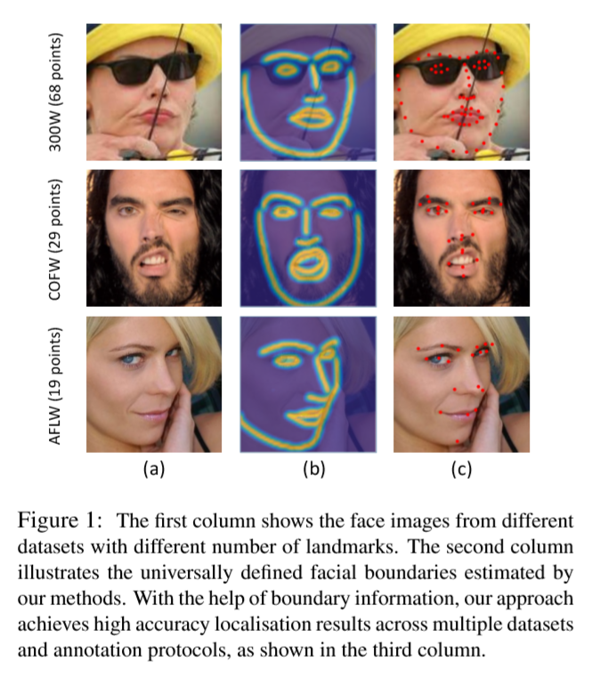
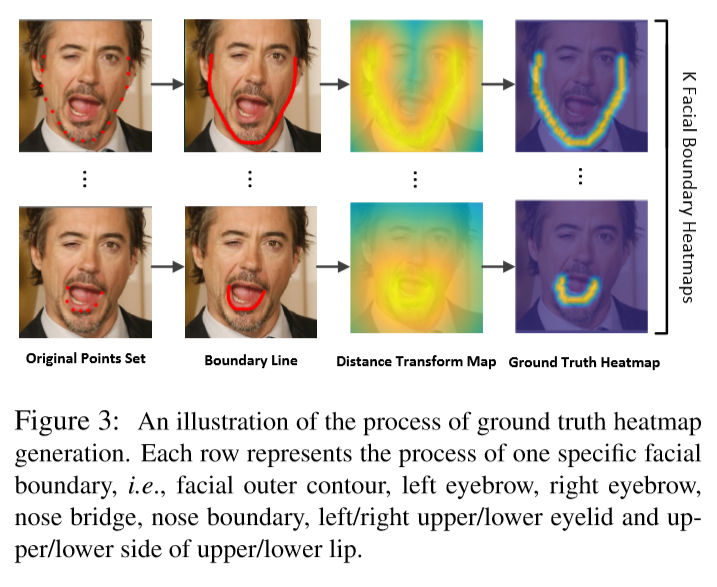

# Look at Boundary: A Boundary-Aware Face Alignment Algorithm

本文中提到的人脸对齐均指人脸关键点检测。

与人脸检测和识别不同，人脸对齐在人脸中找到几何结构，可以被理解为生成一个高度结构化的输出。

每一个人脸关键点都与一个明确定义的边界相关，如：眼皮和鼻梁。尽管与边界相比，关键点的定义并没有那么明确。

除了角点（corners）之外的关键点在较大的姿态变换或者较大的遮挡的情况下几乎无法保留语义位置信息。除此之外，现有数据集的不同标注方案使关键点的数量各不相同。

我们相信独一无二的面部结构是确定人脸关键点位置的核心的观点，因为人脸并不具有二义性。

我们使用定义好的人脸边界来代表人脸的几何结构。在较大姿态的遮挡的情况下，识别人脸边界要比识别人脸关键点更简单。本文中使用13条边界线来表示人脸几何结构。每条边界线都是用来自多个数据集的足够多的关键点进行插值得到的，这样可以保证结果不受数据集标签不一致的影响。

我们的边界感知人脸对齐算法包含两个阶段。首先估计人脸边界热力图，然后在边界热力图的帮助下回归关键点。如Figure 1所示，不同标注方案的关键点信息可以由同一个定义方案下的边界热力图生成。

为了考察人脸边界和关键点间的关系，引入对抗学习的思想，使用一个基于关键点的边界有效性判别器。实验证明，生成的边界质量越高，边界点越准。

边界热力图生成器（boundary heatmap estimator），关键点回归器（landmark regressor）和边界有效性判别器（boundary effectiveness discriminator）可以用end-to-end方法一起训练。

## Related Work

人脸对齐的深度学习方法一般分两大类：坐标回归和热力图回归。

* **坐标回归模型**

  直接学习从输入图片到关键点坐标向量的映射。尽管坐标回归模型有在无需任何后续处理的情况下明确推测出关键点坐标的优点，然而其效果不如热力图回归好。

* **热力图回归模型**

  为每个关键点分别生成似然（likelihood）热力图，最近在人脸对齐方向达到SOTA水平。

由于边界检测问题是CV领域中一个最基础的问题之一，业界出现了非常多的相关资料。它在物体检测和分割领域是非常有效的。在人脸对齐领域，由于关键点几乎全部位于面部边界线上，这使边界信息表现出其特殊的重要性。

最近在人体姿态估计领域的进展一定程度上激发了本方法（边界热力图估计）的灵感。堆叠沙漏网络（Stacked hourglass network）用自底向上（编码）和自顶向下（解码）的设计赋予网络获取多尺度信息的能力，达到了很好的效果。信息传递在人体结构建模方向表现出很强的能力。最近，对抗学习用于提升大遮挡的人体姿态估计效果。

## Boundary-Aware Face Alignment

关键点在表达面部图像的准确的全局几何结构上有困难。我们提出面部分界线作为几何结构的表达方式，并且用这种方式来帮助关键点的回归。

分界线是详细且定义明确的结构描述方法，对于不同的头部姿态和数据集来说是一致的。由于大多数关键点都在边界线上，所以边界线与关键点的联系很紧密。

本文提出的Boundary-Aware Face Alignment的架构如Figure 2所示。

它由3个紧密相关的模块组合而成：

* 边界感受关键点回归器(Boundary-Aware Landmark Regressor)：通过多阶段方法吸收边界信息来预测关键点坐标
* 边界热力图生成器(Boundary Heatmap Estimator)：生成作为面部几何结构的边界热力图
* 基于关键点的边界有效性判别器(Landmark-Based Boundary Effectiveness Discriminator)：由于边界信息很重要，边界热力图的质量对最终的关键点回归的影响是决定性的。我们引入对抗学习的思想，提出基于关键点的边界有效性判别器，它和边界热力图生成器是成对使用的。这个判别器能够进一步提高边界热力图的质量，从而达到更好的关键点坐标预测结构。

### Boundary-aware landmark regressor

为了能够将边界线融合到特征学习中，我们把关键点转换成边界热力图。热力图中每个像素的值由其到对应边界线的距离决定。

如Figure 3所示，边界热力图的定义为：

给定一张人脸图片$I$，将其gt标注信息的$L$个关键点表示为$S=\{s_l\}_{l=1}^L$.

$K$个子集$S_i\subset S$，代表对应$K$条边界线上的关键点（如：左上眼皮，鼻梁）。

对于每个边界，$S_i$经过插值得到连续的(dense)边界线。

然后生成与$I$同样尺寸的边界二值图$B_i$，生成的方式是将在边界线上的点设为1，其余为0.

最终，根据每个$B_i$得到距离图$D_i$.

使用标准差为$\sigma$的高斯表达式将距离图变换为gt边界热力图$M_i$.

$D_i$以$3\sigma$为阈值，使边界热力图更关注边界区域。

实现中，为了提高计算效率，将热力图尺寸设置为原图的四分之一。
$$
M_i(x,y)=
\begin{cases}
\mathrm{exp}(-\frac{D_i(x,y)^2}{2\sigma^2}), \quad \mathrm{if}D_i(x,y)<3\sigma \\
0, \quad\quad\quad\quad\quad\quad \mathrm{otherwise}
\end{cases}
\quad\quad(1)
$$
为了能够充分利用边界热力图中包含的信息，提出一种多阶段边界热力图融合的方案。如Figure 2所示，使用一个四阶段的res-18网络作为基准网络。边界热力图的融合操作在输入和网络的每个阶段进行。结果表明在基础网络进行越多的融合操作，得到的效果越好。

**输入图片融合**

将边界热力图$M$和输入图片$I$进行融合，融合后的输入$H$定义为：
$$
H=I\oplus(M_1\otimes I)\oplus ... \oplus(M_T\otimes I) \quad\quad (2)
$$
其中$\otimes$代表逐元素点积操作，$\oplus$代表逐通道连接。上述操作使融合后的输入只关注边界周围的纹理信息，因此大多数背景和无纹理信息的面部区域都被忽略掉了，这样做可以增强输入的效果。为了保持原有的一些其他有价值的信息，原始输入也被连接在输入中。

**特征图融合**

与上面类似，将边界热力图$M$与特征图$F$相融合，融合后的特征图$H$定义为：
$$
H=F\oplus(F\otimes T(M\oplus F)) \quad\quad\quad (3)
$$
因为$M$的通道数与预定义的边界数相等，是一个常数。就需要一个转换函数$T$使$M$与$F$有相同的通道数。

我们选用沙漏结构的子网络作为$T$来保持特征图尺寸。下采样和上采样对称。使用跳跃链接来组合多尺度信息。然后使用一个sigmoid层将输出归一化到$[0,1]$

另一个选择是使用连续的$1\times1$卷积层。

实验证明沙漏结构的子网络效果较好。Figure 4中展示了特征图融合子网络的细节。

由于关键点坐标回归严重依赖与边界热力图，热力图的质量对预测结果的准确度影响就很大。

### Boundary heatmap estimator

使用堆叠的沙漏结构网络作为边界热力图生成器的基础网络。

使用生成的热力图和gt热力图之间的均方差（MSE）来优化网络。

但是如Figure 5中所示，当图中人脸遮挡严重时，生成的热力图总是会受到噪声和多模态响应（multi-mode response）的影响。

为了能缓解遮挡造成的问题，引入信息传递层，在不同的边界间传递信息。这一过程如Figure 6所示。

当遇到遮挡的时候，可见的边界可以根据面部结构为不可变边界提供帮助。

在每个堆（stack）之后使用**内部信息传递**在不同边界热力图间传递信息。因此便可以在可见和不可见的边界间传递信息。

由于沙漏结构网络的不同stack关注面部信息的不同方面。**外部信息传递**用于从低级stack向高级stack传递信息来保证当增加沙漏子网络时边界热力图的质量。

实现中，每个stack末端的特征图被分到$K$个分支，其中$K$是边界的个数，代表不同的边界特征图。与关键点热力图相比，使用边界热力图的优点是$K$值更小，信息传递层的参数更少。

### Boundary effectiveness discriminator

边界热力图生成器使用MSE作为loss函数，但最小化MSE有时候会使预测值模糊或不真实。这种回归到平均（regression-to-the-mean）的问题是超分辨率领域的著名问题。如果生成的边界热力图效果不好，就会损害到回归网络的学习。

但是在我们的架构中，难以定义的热力图“质量”一项有着很清晰的度量方式。如果对生成准确的关键点坐标有帮助，则边界热力图的质量就好。根据这一点，提出一个基于关键点的边界质量判别器，来判定生成的边界热力图的有效性。

对于一个生成的边界热力图$\hat M$（为简单起见，忽略了下标$i$表示的$\hat M_i$），将其对应生成的关键点坐标集合表示为$\hat S$，gt距离图表示为$Dist$，判别器$D$的gt$d_{\mathrm{fake}}$（表示生成的边界热力图是否为假）表示为：
$$
d_{\mathrm{fake}}(\hat M,\hat S)=
\begin{cases}
0,\quad \mathrm{Pr}_{s\in \hat S}(Dist(s)<\theta)<\delta \\
1,\quad \mathrm{otherwise}
\end{cases}
\quad\quad\quad (4)
$$
其中$\theta$是gt边界距离阈值，$\delta$是概率阈值。这个判别器判断生成的关键点是否与gt边界相近。

引入对抗学习的思想，将边界有效性判别器$D$和边界热力图生成器$G$配对。

$D$的loss可以表示为：
$$
\mathcal{L}_D=-(\mathbb{E}[\log D(M)]+\mathbb{E}[\log(1-|D(G(I))-d_\mathrm{fake}|)]) \quad\quad(5)
$$
其中$M$是gt边界热力图。判别器学习将gt边界热力图预测为1

与有效性判别器一起，对抗损失可以表示为：
$$
\mathcal{L}_A=\mathbb{E}[\log(1-D(G(I)))] \quad\quad(6)
$$
生成器的目标是通过生成可信度更高的热力图来欺骗判别器$D$，从而对回归网络的学习做出贡献。

下面的伪代码描述了训练的流程：

*****

人脸关键点是高度结构化的数据，每个关键点都和一个明确定义的边界相关，所以可以利用面部结构的边界信息（线条）来辅助关键点回归，生成的边界质量越高，关键点回归就越准。引入对抗学习的思想，使用一个基于关键点的边界质量判别器，来判定生成的边界热力图的有效性。

