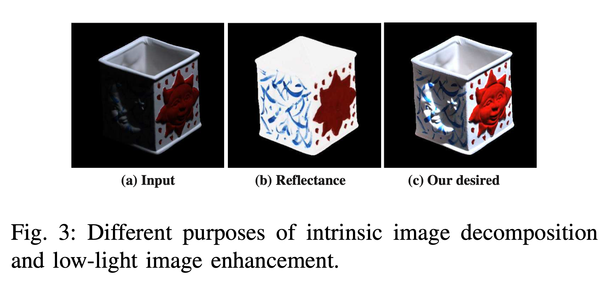

# LIME

## Abstract
提出低光照图像增强算法LIME，先根据三通道最大值估计每个像素的光照值，然后在这个初始光照图基础上通过加入一个结构的先验进行优化得到最终光照图。有了构建好的光照图，就可以进行相应的增强操作。

## 1. Introduction
直接放大图片亮度的方法算是最直接最简单的提升暗处可见度的方法。但是这种操作会引起额外的问题，比如较亮区域会失真。直方图均衡化(histogram equalization, HE)策略通过将输出限制在0到1之间来避免上述问题。其他的一些变体引入不同的正则项来提升HE算法性能。但是这些方法本质上关注于对比增强而非探索真实光照的成因，也就有过度增强和欠增强的风险。另一种方法是Gamma修正，它是一种作用于图像上的非线性操作。主要的缺陷是这种非线性操作是独立作用于每一个像素上的，没有考虑到周边相关性，因此增强效果不好。

Retinex理论主要假设图片可以分解为两部分：反射和光照。早期基于Retinex理论的方法将反射图作为最后的增强结果，但是它通常看起来不自然而且经常是过增强的。有的方法在保留自然光照的同时对对比度进行增强，这种方法可以防止过增强现象。

## 2. Methodology
本方法机遇Retinex理论，对于低光照图片，可以表示为：
$$
L=R\circ T \qquad (1)
$$
其中L和R是原图像和目标修复图像，T代表光照图，$\circ$是元素对应相乘。本文首先假设对于彩色图片，三通道共享相同的光照图。上式有很明确的物理意义，观测图像可以分解为目标光照增强结果和光照图乘积的形式。

这个模型和本征图像分解类似，后者的目标是将输入分解为两部分。但是本征图像分解的目标是从原图复原得到反射部分和明暗部分，从Figure 3(b)中可以看到，反射部分丢失了盒子形状信息，因此不适合于低光照图像增强任务。我们期望的效果是获取暗光区域的视觉语义信息，同时保持图像在视觉上的真实性，如Figure 3(c)中样例。有人注意到使用反射图作为增强结果引起不真实的效果是因为尝试将修正后的光照图映射回修正后的反射图，而且因为分解问题本身是不适定的，所以就需要很多先验条件来约束解空间。但是假如只是增强低光照图像，这也是本文关注的任务，则不需要将图像分解成两部分，因为根据公式(1)有$R=L/T$，这里的除法也是元素对应相除。显然T的估计是修正R的关键，这样就将问题简化了，只需要估计T就可以。