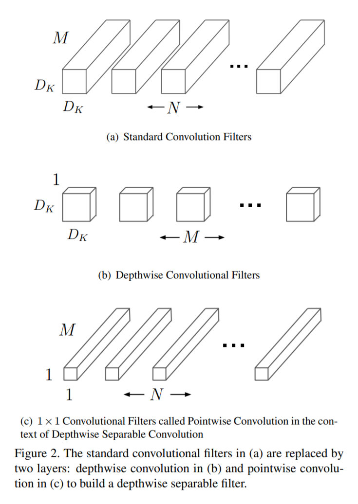

# MobileNets: Efficient Convolutional Neural Networks for Mobile Vision Applications

贡献一类用于移动和嵌入式设备上视觉任务的高效的模型，称为*MobileNets*.

*MobileNets*基于流线型架构，使用深度可分离卷积构建轻量级深度神经网络。

引入两个简单的全局超参数，可以高效地在延迟和精准度上进行取舍。

## 1. Introduction

自从AlexNet赢得ImageNet挑战之后，计算机视觉领域中卷积神经网络就无处不在了。为了获得更高的准确率，一般的趋势是采用更深更复杂的网络。但是这些为了提升准确率而采用的提升并不会使网络在关于尺寸的速度方面更高效。在很多现实世界应用中，例如机器人技术，自动驾驶和增强现实，识别任务需要在一个计算量受限的平台上实时地实现。

本文描述一个高效的网络架构和一组两个超参数来构建很小且低延迟的模型，可以轻易匹配移动端和嵌入式设备视觉应用的设计需求。

## 2. Prior Work

高效小网络的构建方法大致可以分为两类：压缩预训练网络和直接训练一个小网络。本文提出一类网络架构，其允许设计者具体地选择一个与其应用的资源限制（延迟，尺寸）相匹配的小网络。MobileNets首要关注延迟的优化，同时也是小网络。很多小网络文章只关注尺寸而没有考虑速度。

MobileNets首先使用可分离深度卷积创建网络来减少前几层的计算量。

## 3. MobileNet Architecture

### 3.1. Depthwise Separable Convolution

MobileNet模型基于深度可分离卷积（depthwise separable convolutions），深度可分离卷积是分解卷积（factorized convolutions）的形式之一，其将一个标准卷积分解为按深度（逐层）卷积和一个称为逐点卷积的$1\times1$卷积。MobileNet中深度卷积对每个输入的通道都是用一个滤波器。逐点卷积随后使用一个$1\times1$卷积将逐层卷积的输出合并。一个标准的卷积在一步中同时进行滤波和合并生成一组新的输出。深度可分离卷积将这个步骤分成两层，一个分离卷积层用来滤波，一个分离卷积层用来合并。这种分解方式可以大幅度地减少计算量和模型尺寸。Figure 2中展示了一个标准卷积2(a)如何分解成一个深度卷积2(b)和一个$1\times1$逐点卷积2(c)

一个标准卷积层接收一个$D_F \times D_F \times M$的特征图$\textbf{F}$作为输入，并输出一个$D_F \times D_F \times N$的特征图$\textbf{G}$，其中$D_F$是输入的方形特征图的空间尺寸，$M$是输入通道数（输入深度），$D_G$是输出的方形特征图的空间尺寸，$N$是输出通道数（输出深度）。

标准的卷积层使用卷积核$\textbf{K}$参数化为$D_K\times D_K \times M \times N$

假设步长为1，并且padding，标准卷积层的输出特征图计算为：
$$
\textbf{G}_{k,l,n}=\sum_{i,j,m}\textbf{K}_{i,j,m,n}\cdot\textbf{F}_{k+i-1,l+j-1,m} \quad\quad\quad(1)
$$
标准卷积操作的计算量为：
$$
D_K\cdot D_K\cdot M \cdot N\cdot D_F \cdot D_F \quad\quad\quad(2)
$$
其中计算量依赖于输入通道数$M$，输出通道数$N$，卷积核尺寸$D_k\times D_k$和特征图尺寸$D_F\times D_F$的乘积。MobileNet一一解决上述每一项和它们的交互。首先使用深度可分离卷积打破输出通道数和卷积核尺寸之间的联系。

传统卷积操作的效果是用卷积核对特征进行滤波并将特征合并以生成一个新的表示。滤波和合并步骤可以通过分解后的卷积（称为深度可分离卷积）分成两步来大幅度地减少计算量。

深度可分离卷积由两个层组成，深度（逐层）卷积和逐点卷积。使用深度卷积在每个输入通道（深度）上使用一个滤波器。逐点卷积，一个简单的$1\times1$卷积，随后用于创建深度层输出的一个线性组合。MobileNets在这两层上都是用了batchnorm和ReLU非线性操作。

每个输入通道（输入深度）一个滤波器的深度卷积可以表示为：
$$
\hat{\textbf{G}}_{k,l,m}=\sum_{i,j}\hat{\textbf{K}}_{i,j,m}\cdot \textbf{F}_{k+i-1,l+j-1,m} \quad\quad\quad(3)
$$
其中$\hat{\textbf{K}}$是深度卷积核，尺寸为$D_K\times D_K \times M$，其中第$m$个滤波器用于$\textbf{F}$的第$m$个通道，生成输出特征图$\hat{\textbf{G}}$的第$m$个通道。

深度卷积的计算量为：
$$
D_K\cdot D_K\cdot M\cdot D_F\cdot D_F \quad\quad\quad(4)
$$
与标准卷积相比，深度卷积非常高效。但是它只是对输入通道进行滤波，并没有进行合并生成新特征。所以需要一个新的层通过使用$1\times1$卷积计算输出的深度卷积的线性组合来生成新特征。

深度卷积核$1\times1$（逐点）卷积的组合称为深度可分离卷积，计算量为：
$$
D_K\cdot D_K\cdot M\cdot D_F\cdot D_F+M\cdot N\cdot D_F\cdot D_F \quad\quad\quad(5)
$$
是深度卷积核逐点卷积的计算量的和。

通过将卷积压缩成滤波和合并的两部，我们可以得到计算量的缩减：
$$
\frac{D_K\cdot D_K\cdot M\cdot D_F\cdot D_F+M\cdot N\cdot D_F\cdot D_F}{D_K\cdot D_K\cdot M\cdot N\cdot D_F\cdot D_F} =\frac{1}{N}+\frac{1}{D_K^2}
$$
MobileNet使用$3\times3$深度可分离卷积的计算量比标准卷积少8到9倍，而精度只有很小的下降。

空间维度上额外的分解并不能节省额外的计算量，因为深度卷积的计算量本身很小。

### 3.2. Network Structure and Training

MobileNet架构除了第一层使用全卷积外，是由深度可分离卷积构成的。通过使用这样的简单项定义网络，我们可以轻易地探索网络的拓扑结构来找到一个好网络。MobileNet架构的定义如Table 1所示。

所有层都后接一个batchnorm和ReLU非线性层，除了最后的全连接层没有非线性层，输入到一个softmax层用于分类。Figure 3展示了由普通卷积，batchnorm和ReLU非线性层组成的层和由深度卷积，$1\times1$逐点卷积和同样的batchnorm和ReLU组成的分离后的层之间的对比。

大步长的深度卷积和第一层实现下采样。最后使用一个平均池化层将空间分辨率在全连接层前降低至1.如果把深度卷积和逐点卷积分开算的话，MobileNet有28层。

只依靠少量的相乘相加操作并不足以定义一个网络。还要确定这些操作可以被高效地实现。例如，非结构化稀疏矩阵操作除非矩阵的稀疏程度较高，不然这些操作并不比稠密矩阵操作要快。我们的模型架构几乎将所有计算都放在稠密$1\times1$卷积中完成。这可以通过高度优化通用矩阵乘法（GEMM，general matrix multiply）函数实现。