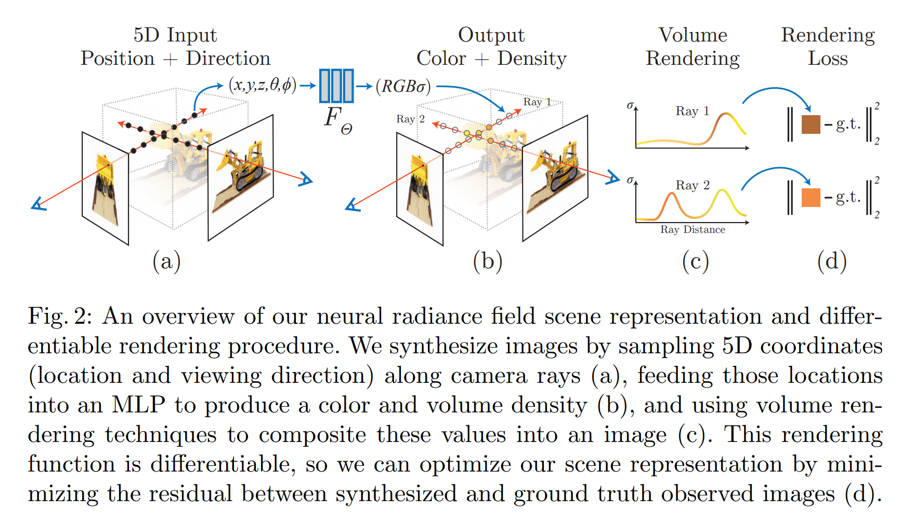
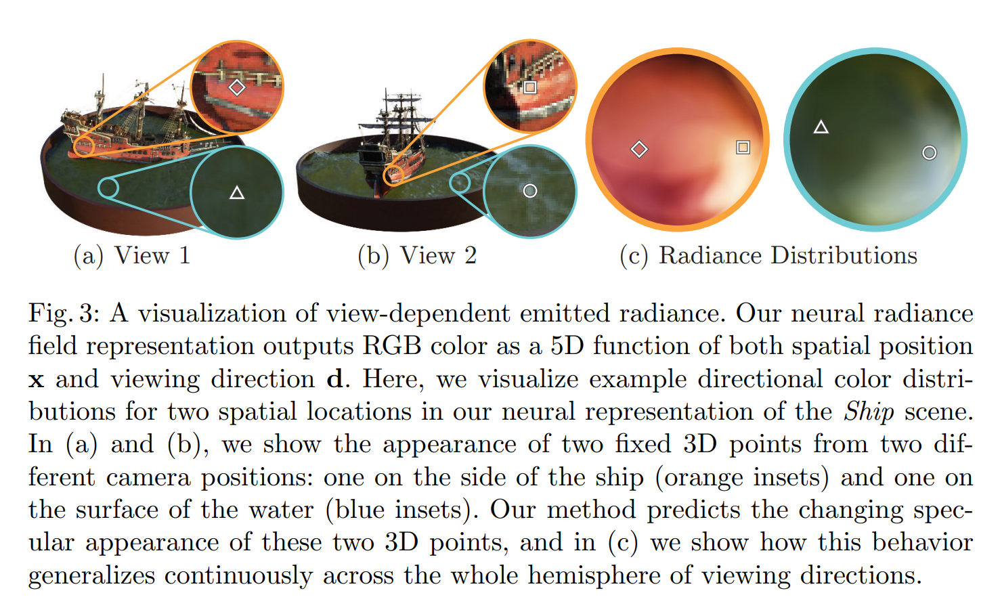
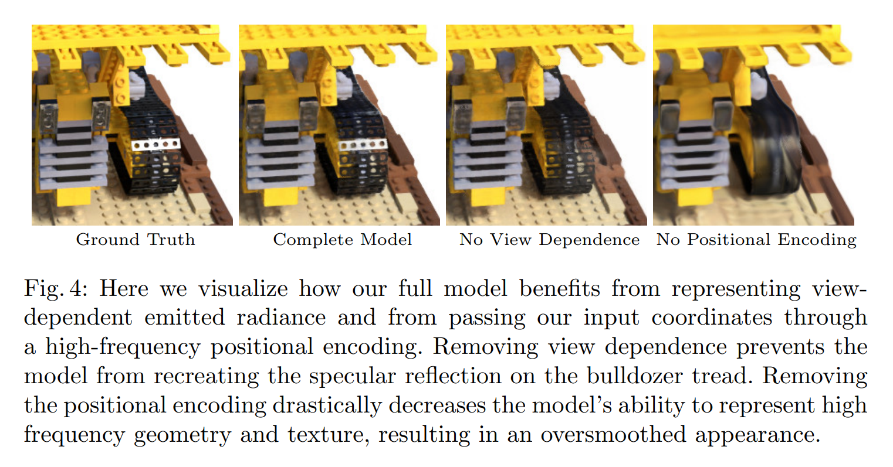

# NeRF:Representing Scenes as Neural Radiance Fields for View Synthesis

**Abstract.** 提出一个用于合成复杂场景新视角的sota方法，使用一组稀疏的视角输入来优化一个隐式连续体积场景函数实现。

## 1 Introduction
本文通过一个通过直接优化一个连续5D场景表达的方式来最小化渲染一组已捕捉到的数据的误差的新方法来解决视角合成的问题。
将一个静止场景表示成一个连续的5D函数，输出每一个点$(x,y,z)$在每一个方向$(\theta, \phi)$上发出的辐射，和每个点的密度（可以视为一个差分透明度，用于控制通过$(x,y,z)$的光线累积了多少辐射）。我们的方法优化一个全连接神经网络，没有卷积层来表示这个函数，从5维输入得到单一的体积密度和视角独立的RGB颜色。要从一个确定的视角来渲染这个*神经辐射场(NeRF,neural radiance field)*，我们：
1. 推进相机光线穿过场景来生成一组采样后的3D点
2. 使用这些点和它们对应的2D视角方向作为神经网络的输入并输出一组颜色和密度
3. 使用经典的体积渲染技术将这些颜色和密度合成到一张2D图片上

因为这一过程天生可微，所以可以使用梯度下降法，通过最小化每个观察到的图片和模型输出的渲染后视角间差异来优化这个模型。最小化不同视角间的这个误差会推动网络通过将高体积密度和准确的颜色指定给包含真实信息的点来预测与场景一致的模型。如Figure 2所示。
我们发现针对复杂场景优化神经辐射场表达的基础实现无法收敛到一个足够高分辨率的表达，并且对于每个相机光线所需的样本数也是无效的。我们通过使用一个位置编码对输入的5D坐标进行变换，使MLP能够表示高频函数，并且提出一个层次采样程序来减少对这个高频场景表达进行采样所需的queries数量。

## 2 Related Work
...

## 3 Neural Radiance Field Scene Representation
我们将一个连续场景表示成一个5D向量函数，其输入是一个3D的位置$(\textbf{x}=(x,y,z))$和一个2D的视角方向$(\theta, \phi)$，其输出是一个颜色$\textbf{c}=(r,g,b)$和一个体积密度$\sigma$。实际上我们将方向表示成一个3D的笛卡尔坐标系的单位向量$\textbf{d}$. 使用一个MLP网络来近似这个连续的5D场景表达，$F_{\Theta}:(\textbf{x,d})\rightarrow(\textbf{c},\sigma)$并通过将每个输入的5D坐标映射到其对应的体积密度和方向颜色来优化其权重$\Theta$.
为了推动表示的多视角一致性，通过限制网络将体积密度$\sigma$预测为仅关于位置$\textbf{x}$的函数并同时允许RGB颜色$\textbf{c}$作为位置和视角方向的函数进行预测。实现方法使首先用MLP $F_{\Theta}$的8个全连接层（每层256通道，并使用ReLU）处理输入的3D坐标$\textbf{x}$，输出体积密度$\sigma$和一个256维特征向量。这个特征向量随后会与相机光线视角方向进行拼接，然后传入一个额外的全连接层（128通道以及ReLU）并输出关于视角独立的RGB颜色。
Figure 3中的例子展示了使用输入的视角方向来代表non-Lambertian效应。如Figure 4所示，没有独立视角训练（输入只有$\textbf{x}$）的模型在表示高光这方面的能力上有困难。

## 4 Volume Rendering with Radiance Fields
我们的5D神经辐射场将一个场景表示成空间中每个点的体积密度和带方向辐射。我们使用经典的体积渲染的准则来渲染每一条穿过场景的光线的颜色。体积密度$\sigma(\textbf{x})$可以解释称一条光线终止于$\textbf{x}$位置的一个无穷小粒子上的微分概率(differential probability). 相机光线$\textbf{r}(t)=\textbf{o}+t\textbf{d}$在远近边界$t_n, t_f$下的期望的颜色$C(\textbf{r})$为：
$$
C(\textbf{r})=\int^{t_f}_{t_n}T(t)\sigma(\textbf{r}(t))\textbf{c}(\textbf{r}(t),\textbf{d})dt \\
\text{where} \quad T(t)=\exp \Big(-\int^{t}_{t_n}\sigma(\textbf{r}(s))ds\Big)
$$
$T(t)$函数代表光线从$t_n$到$t$的累积透过率，也就是光线从$t_n$到$t$的路径上不会评到任何其他粒子的概率。从我们的连续神经辐射场渲染一个视角需要对一个相机光线追溯虚拟相机的每一个像素来估计这个积分$C(\textbf{r})$.
求这个积分使用一种分层采样的方法，将$[t_n,t_f]$分割成$N$个均匀空间格栅，然后在每个格栅里进行均匀采样：
$$
t_i \sim \mathcal{U}\Big[t_n+\frac{i-1}{N}(t_f-t_n),t_n+\frac{i}{N}(t_f-t_n)\Big].
$$
尽管用来估计积分值的样本是一组离散的样本，但是分层采样使我们可以表示一个连续的场景，因为MLP的结果是以连续位置评估和优化的。我们使用这些样本来估计$C(\textbf{r})$:
$$
\hat{C}(\textbf{r})=\sum_{i=1}^N T_i(1-\exp(-\sigma_i\delta_i))\textbf{c}_i, \\
\text{where} \quad T_i=\exp\Bigg(-\sum_{j=1}^{i-1}\sigma_j\delta_j \Bigg)
$$
其中$\delta_i=t_{i+1}-t_i$是相邻样本间的距离。这个用$(\textbf{c}_i,\sigma_i)$值的集合来计算$\hat{C}(\textbf{r})$的函数可微并可以退化到传统的alpha复合，alpha值为$\alpha_i=1-\exp(-\sigma_i\delta_i)$.

## 5 Optimizing a Neural Radiance Field
