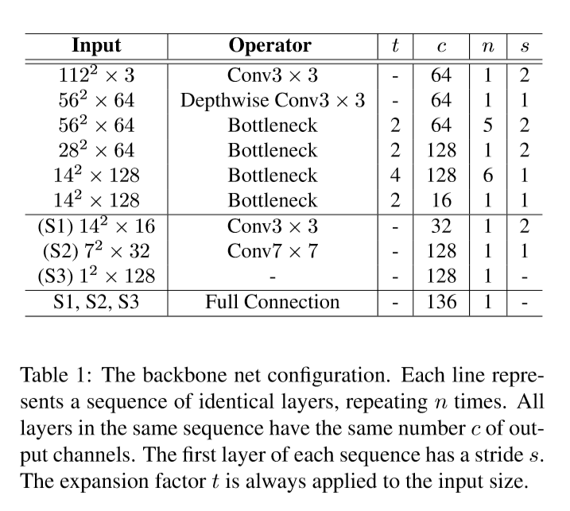
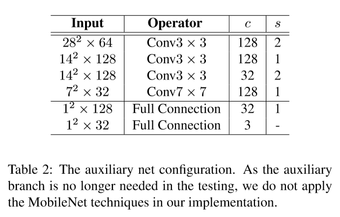

# PFLD: A Practical Facial Landmark Detector

## Introduction

近些年人脸对齐（人脸关键点检测）方向有很大发展，但是开发一个使用的人脸关键点检测器还是很难，因为要同时考虑检测精度、速度和模型尺寸。

现实世界中很难获取到完美的面部图像，人脸所处的环境通常是非限制性的。在不同光照下表现出巨大的姿态差异、表情和形态差异，有时还有遮挡。

关键点检测的三个难点/挑战：

1. 局部差异（Local Variation）：表情，局部异常光照（高光和阴影等），还有遮挡，导致人脸图像的部分难点。某些区域的关键点位置可能会偏移甚至消失。
2. 全局差异（Global Variation）：姿态和图像质量是影响图像中人脸全局表现的两个主要因素，当错误估计（mis-estimated）面部全局结构的时候可能导致一（大）部分关键点定位准确性下降。
3. 数据不平衡（Data Imbalance）：数据不平衡很有可能使算法/模型不能正确地表达数据的特性，因此不同特征间的准确性效果就不好。

这些难点相当程度上地提升了准确检测的难度，也需要检测器更具健壮性。

由于越来越多的人使用移动设备进行办公或娱乐，因此除了提高模型的准确度之外，下面的一个难点也应该考虑到

4. 模型效率（Model Efficiency）：另外两个适用性限制是：模型的尺寸和计算需求。

这一点特别需要检测器拥有小尺寸模型和高处理速度。

本作展示了好的设计可以在达到SOTA表现的同时节省大量的资源

本作提出的实用的人脸关键点检测器，称为PFLD，可以在包括非限制姿态、表情、光照和遮挡在内的复杂情况下获得高准确率。

与局部差异相比，全局差异由于对关键点影响更大因此更值得关注。

为了增强鲁棒性，引入一个分支来估计每个人脸样本的几何信息，然后正则化关键点位置。

另外，在深度学习中，数据的不平衡问题通常限制了检测的准确率。例如，一个训练集中可能包含大量的正脸但是缺少大姿态样本。这样，当遇到大姿态人脸的时候准确率就会下降。为了解决这个问题，我们对较罕见样本的损失惩罚更大。考虑到上述两点，即几何限制和数据不平衡，我们设计了一个新loss。

为了增大感受野尺寸和更好的提取面部全局结构特征，引入多尺度全连接层（MS-FC layer）来在图像中精确定位关键点。

对于处理速度和模型密度，使用MobileNet blocks来构建backbone

## Methodology

### Loss Function

训练的质量很大程度上依赖于损失函数，尤其在训练数据量不够大的情况下。

为了惩罚gt关键点$\mathrm{X}:=[\mathrm{x_1,...,X_N}]\in \mathbb{R}^{2\times N}$和预测值$\mathrm{Y:=[y_1,...,y_N]}\in \mathbb{R}^{2\times N}$间的误差，可以认为$\ell_1$和$\ell_2$是最简单的loss了。但是，不考虑几何/结构信息而均等地衡量关键点对间的差异并不明智。例如，给定一对$\mathrm{x}_i$和$\mathrm{y}_i$，它们在图像空间里的差异为$\mathrm{d}_i:=\mathrm{x}_i-\mathrm{y}_i$，如果是两个从3D真实人脸到2D图像的投影（姿态关于摄像机的投影），真实人脸的内部差异可能很大。因此在惩罚项引入几何信息有利于缓解这一问题。

对于人脸图像，全局几何状态-3D姿态-足以用来决定投影方式。令$\mathrm{X}$代表要求的2D关键点位置，它是3D关键点的投影。

例如，$\mathrm{U}\in \mathbb{R}^{4\times N}$，每一列代表一个3D位置$[u_i,v_i,z_i,1]^T$.假定一个弱透视模型（weak perspective model），一个$2\times4$的矩阵$\mathrm{P}$可以将$\mathrm{X}$和$\mathrm{U}$连接起来：$\mathrm{X=PU}$.这个投影矩阵有六个自由度，包括yaw,roll,pitch,scale和2D变换。本作中可以认为人脸检测、对齐和归一化效果都很好。而且如表情等的局部差异几乎对投影无影响。也就是说，scale和2D变换这三个自由度可以去掉，只剩下三个欧拉角需要估计。

此外，在深度学习中，数据不平衡是另外一个限制检测准确率的问题。例如，一个训练集中有大量的正脸但缺乏大姿态样本。如果不用一些额外的技巧，几乎可以确定这样训练出来的模型无法正确处理大姿态人脸。在这种情况下对每个样本采用相同的惩罚会引起不平衡。

loss的公式：
$$
\mathcal{L}=\frac{1}{M}\sum\limits_{m=1}^M \sum\limits_{n=1}^N\gamma_n \lVert\mathrm{d}_n^m \rVert,
\quad\quad\quad(1)
$$
其中$\lVert\cdot\rVert$表示衡量第$m$个输入的第$n$个关键点的距离/误差的度量方法。$N$是预定义的关键点个数。$M$代表训练数据的数量。给定距离衡量方法（如本文中的$\ell_2$），权重$\gamma_n$起到关键作用。

考虑到几何约束和数据不平衡问题，设计一个新loss：
$$
\mathcal{L}:=\frac{1}{M}\sum\limits_{m=1}^M\sum\limits_{n=1}^N\Big(\sum\limits_{c=1}^Cw_n^c\sum\limits_{k=1}^K(1-cos\theta_n^k)\Big)\lVert\mathrm{d_n^m}\rVert_2^2.
\quad\quad\quad(2)
$$
可以将公式2中的$\sum\limits_{c=1}^Cw_n^c\sum\limits_{k=1}^K(1-cos\theta_n^k)$当作公式1中的$\gamma_n$

其中，$\theta^1,\theta^2,\theta^3(K=3)$代表gt和估计的欧拉角间的偏差。显然随着角度偏差的增大，惩罚项也会变大。另外，我们将每个样本分为一个或多个属性分类，包括正脸，侧脸，抬头，低头，表情和遮挡。权重参数$w_n^c$根据$c$类样本的分数进行调整（求倒数）。

如果去掉几何和数据不平衡功能，loss函数就会退化成简单的$\ell_2$loss。

在3D姿态或数据不平衡问题的影响下，我们的loss函数都可以用它的距离衡量方法来解决局部差异问题。

与其他方法相比，本方法在考虑利用3D姿态信息提升效果上的优势有：

1. 3D姿态估计和2D距离度量成对使用
2. 容易理解，方便计算
3. 单阶段而非级联

loss中的$\mathrm{d_n^m}$来自backbone，$\theta_n^k$来自辅助网络

网络结构如Figure 2所示

### Backbone Network

和其他CNN based网络一样，backbone使用卷积层来提取特征并预测关键点。

考虑到人脸具有很强的去全局几何特性，例如对称性，眼、嘴、鼻等之间的特殊关系等，类似的全局几何特性可以帮助提升关键点定位的准确度。因此使用多尺度图而非单尺度图。通过卷积操作进行扩展，卷积操作的步长增大了感受野尺寸。然后多尺度特征图通过全连接层完成最终预测。

backbone的结构如Table 1所示

从架构的角度来看，backbone的结构很简单。我们首要的目的是想验证，在使用新loss和辅助子网络的情况下，即使一个很简单的建构也可以达到SOAT的效果。

为了提升速度并减小尺寸，使用MobileNet blocks

### Auxiliary Network

辅助子网络的作用是估计3D旋转信息（欧拉角），通过欧拉角获得头部姿态信息。

也许有人会有疑问，既然有了关键点，为什么不从关键点计算欧拉角？

这个想法在技术上是可行的，但是实际上关键点的预测值可能很不准，尤其是在训练起始阶段。这就会造成欧拉角的估计不准。为了将关键点定位和角度估计解耦，引入了辅助子网络。

我们的辅助子网络可以在不需要（成对的）正脸图像的情况下输出角度预测。因为我们的任务只针对人脸，其根据正脸有很强的规律性和结构性。而且如表情和光照等因素几乎不影响姿态。因此可以用一个平均正脸图像作为统一的模板。换句话说，计算欧拉角的时候不需要其他多余的标注信息。计算方式如下：

1. 预定义一个标准脸（根据一组正脸计算平均）并将11个关键点定位到其上作为所有训练数据的参照模板
2. 用11个关键点和标准脸作比较估计旋转矩阵
3. 从旋转矩阵计算欧拉角

计算出来的欧拉角并不一定准，因为每个样本都使用同一个标准脸。但尽管如此，精度也足够了。

Table 2展示了辅助子网络的结构，注意到辅助网络的输入是backbone的第4个block的输出

### Implementation Details

训练中，所有脸部图像都根据给定的box剪裁并缩放到$112\times112$大小。使用Adam优化器，weight decay为$10^{-6}$，momentum为0.9，学习率固定为$10^{-4}$

*****

关键点检测，辅助网络估计旋转信息用于辅助关键点回归

