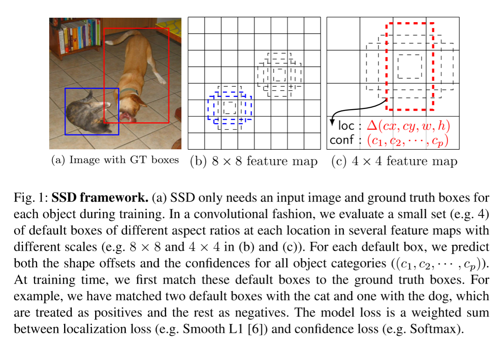
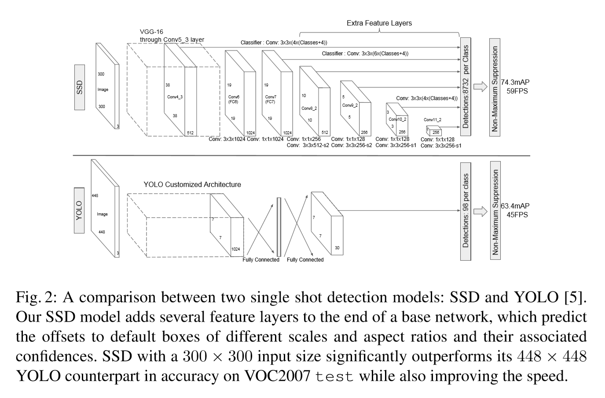

# SSD: Single Shot MultiBox Detector

提出使用单一深度神经网络来检测图片中物体的方法，称为SSD，其将边界框的输出空间离散化成特征图上每一点的一组不同长宽比和尺寸的默认边界框。预测的时候，网络对每个默认box生成每个分类的得分，并生成box的修正值来更好地匹配物体边界。而且SSD将不同分辨率特征图的预测结果合并到一起来解决物体尺寸不同的问题。相比于需要object proposals的方法，SSD相对简单，因为它彻底消除了生成box和后续的工作，把所有计算都放在了一个单一的网络里进行。

## Introduction

目前的SOTA物体检测系统都是下述方法的变种：预设边界框，对每个边界框进行重新采样然后在其上使用高质量分类器。尽管准确率很高，但是对于嵌入式系统，甚至对于高端硬件来说，这些实现的计算量都太大了，实时应用的速度太慢。通常检测速度以每帧耗时（SPF, seconds per frame）来衡量，就算最快的高质量检测器，Faster R-CNN也只能跑7FPS。

## The Single Shot Detector(SSD)

### Model

SSD基于一个前馈卷积网络实现，其生成一系列固定尺寸边界框并对这些边界框根据现有类别进行评分，然后使用NMS来得出最终检测结果。网络的前几层基于一个用于高质量图片分类的标准框架（在分类层之前截断），称为基础网络（原版使用VGG-16）。在此基础上加入辅助结构来生成检测结果，这些结构的主要特点是：

* **Multi-scale feature maps for detection** 在基础网络后加入卷积特征层，这些层的尺寸逐渐减小，使检测在多个尺度上进行。预测检测结果的卷积模型对于每个特征层都不一样。
* **Convolutional predictors for detection** 添加的每个特征层（或者也可以是基础网络现有的特征层）通过使用一组卷积滤波器来生成固定的一组预测结果，如Figure 2所示。对于一个尺寸为$m\times n$通道数为$p$的特征层来说，预测一个潜在检测结果参数的基础元素是一个$3\times3\times p$小卷积核，生成分类得分或者box相对于默认box的坐标偏移量。对于$m\times n$的每个位置都使用卷积核来得到一个输出值。边界框偏移量输出值使用特征图上对应的默认框来衡量。
* **Default boxes and aspect ratios** 将网络顶部多个特征图的每一个特征图位置都与一组默认边界框联系起来。默认box通过卷积的方式经过特征图，这样每个特征图位置和对应的box就确定了下来。对于每个特征图位置，预测与根据当前位置的默认box相关的偏移量和类别评分。例如，如果每个位置有$k$个box，计算$c$个类别评分和4个偏移量（相对于给定的默认box），则需要$(c+4)k$个卷积核，对于一个$m\times n$的特征图得到$(c+4)kmn$个输出，见Figure 1.SSD中的默认boxes与Faster R-CNN中的anchor boxes类似，但是SSD在多个不同分辨率的特征图上都使用默认box，这让SSD能够有效地离散化输出box形状的空间。

### Training

训练SSD和训练一个使用region proposal的经典分类器之间的关键差异是，gt信息需要与检测器的一组输出中的特定输出绑定。绑定之后就可以得到端到端的loss函数和反向传播。训练过程还包括选择检测的默认box和尺度以及困难样本挖掘和数据增广策略。

* **Matching strategy** 训练过程中，需要确定哪些默认box与gt相对应，然后相应地训练网络。