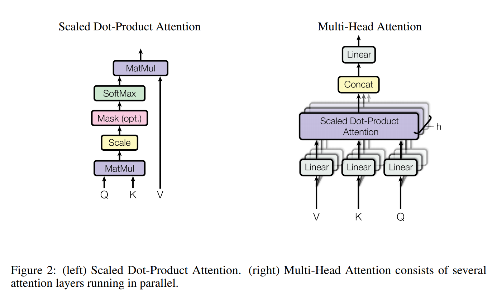

# Attention Is All You Need

## Abstract

主要的序列转导模型(sequence transduction models)都是基于复杂的循环或者包含一个编码器和一个解码器的卷积神经网络。性能最佳的模型同样通过一种注意力机制将编码器和解码器连接到一起。我们提出一个新的简单的网络架构，Transformer，只基于注意力机制而完全不需要循环或者卷积。

## 1 Introduction

循环神经网络、长短期记忆、以及特别是门控循环神经网络是序列建模和转导问题如语言建模和机器翻译等方向的sota的网络架构。

循环模型会典型地沿着输入和输出序列的符号位置进行因子化计算。在计算的时候将位置和步骤(steps)对齐，生成一个隐藏状态的序列$h_t$，作为前序隐藏状态$h_{t-1}$和输入位置$t$的函数。这一内在的序列特性阻碍了训练样本的并行化，因此对于较长序列效果不好，因为内存限制。尽管近期成果在计算效率上通过参数化技巧和条件计算获得了较大提升，但是序列计算的这一基础限制仍然存在。

## 2 Background

自注意力，有时也称内注意力，是一种将单一序列不同位置联系起来用于计算一种表达的注意力机制。子注意力已经在多种任务中取得优势。

端到端网络基于一个循环注意力机制而非序列对齐循环，并且在单一语言问答和语言建模任务上表现良好。

# 3 Model Architecture

大多数有竞争力的神经序列转导模型都有一个编码-解码结构。编码器将符号表达的输入序列$(x_1,...,x_n)$映射成一个连续表达的序列$\textbf{z}=(z_1,...,z_n)$。给定$\textbf{z}$，解码器每次会生成一个元素的符号的输出序列$(y_1,...,y_m)$.在每一步中，模型都是自动回归(auto-regressive)的，将先前生成的符号作为额外的输入用于生成下一个符号。

Transformer沿用了这一整体架构，编码器和解码器都使用堆叠的自注意力和逐点的全连接层，见Figure 1，分别位于左右两侧。

### 3.1 Encoder and Decoder Stacks

**Encoder:** 编码器由$N=6$个identical层堆叠而成。每一层有两个子层。首先是一个多头的自注意力机制，然后是一个简单的、按位置的全连接前馈网络。每两个子层间使用一个残差连接，后接层归一化LN. 也就是每个子层的输出都是$\text{LayerNorm}(x+\text{Sublayer}(x))$,其中$\text{Sublayer}(x)$是子层自身的函数。为了能够实现残差连接，模型中的所有子层和embedding层的输出维度都是$d_{\text{model}}=512$.

**Decoder:** 解码器同样由$N=6$个identical层堆叠而成。但每个解码器层在原有的两个子层外另加入第三个子层，用于在解码器输出上实现多头注意力。与编码器类似，每个子层上都使用残差连接，后接层归一化LN. 同样修改了解码器中的自注意力子层来防止位置前后发生关联。这种掩码连同输出embeddings受一个位置影响这一事实一起，保证了位置$i$的预测只依赖于位置$i$以前的已知输出。

### 3.2 Attention

一个注意力函数可以描述成将一个查询(query)和一组键值对映射到一个输出的操作，其中Q,K,V和输出都是向量。输出通过值的加权和计算得到，而每个值的权重是通过Q中对应键的兼容性函数(compatibility function)计算得到的。

#### 3.2.1 Scaled Dot-Product Attention

称我们的注意力为“缩放点积注意力”，如Figure 2所示。输入由维度为$d_k$的Q和K以及维度为$d_v$的V组成。计算Q和所有K的点积，分别除以$\sqrt{d_k}$，然后使用softmax函数获得值的权重。

实际上，我们将一组Q组合成一个矩阵$Q$，在这组Q上同时计算注意力函数。键和值同样组合成矩阵$K,V$. 矩阵的计算为：
$$
\text{Attention}(Q,K,V)=\text{softmax}(\frac{QK^T}{\sqrt{d_k}})V  \qquad (1)
$$
两种最常用的注意力函数是加法注意力(additive attention)和点积（乘法）注意力。我们的注意力算法与点积注意力是相同的，除了缩放因子$\frac{1}{\sqrt{d_k}}$. 加法注意力用一个只有一个隐藏层的前馈网络来计算兼容性函数。尽管二者的复杂度在理论上相当，但是点积注意力要快的多，而且空间效率也更高，因为可以通过高度优化的矩阵乘法代码实现。

尽管对于较小的$d_k$值，这两种机制的表现相似，但在不缩放的较大$d_k$值上，加法注意力的性能要比点积注意力号。我们怀疑对于更大的$d_k$值，点积的数量级增长更快，使softmax函数进入一个梯度非常小的位置。为了抵消这一效应，使用$\frac{1}{\sqrt{d_k}}$来对点积进行缩放。

#### 3.2.2 Multi-Head Attention

与在$d_{model}$维的K,V和Q上只使用一个单一的注意力函数相比，我们发现使用学习得到的不同的线性投影将Q,K和V分别投影到$d_k,d_k,d_v$维度上$h$次效果更好。然后在这些投影后的Q,K和V上并行地使用注意力函数，获取$d_v$维的输出值。再将它们拼接到一起再进行一次投影，得到最终结果，如Figure 2所示。

多头注意力机制允许模型在不同的位置上联合处理来自于不同表示子空间的信息。
$$
\text{MultiHead}(Q,K,V)=\text{Concat}(head_1,...,head_h)W^O \\
\textbf{where} \quad \text{head}_i=\text{Attention}(QW_i^Q,KW_i^K,VW_i^V)
$$
其中投影为参数矩阵$W_i^Q \in \mathbb{R}^{d_{model}\times d_k},W_i^K \in \mathbb{R}^{d_{model}\times d_k},W_i^V \in \mathbb{R}^{d_{model}\times d_v},W^O\in \mathbb{R}^{hd_v \times d_{model}}$.

本作中使用$h=8$并行注意力层，或头。对每个层/头，使用$d_k=d_v=d_{model}/h=64$. 由于每个头的维度都减少了，所以总的计算量和单头注意力下的完整维度差不多。

#### 3.2.3 Applications of Attention in our Model

Transformer通过三种方式使用多头注意力机制：

* 在“编码器-解码器注意力”层中，Q来自于前序的解码器层，内存中的键和值来自于编码器的输出。这就允许解码器的每个位置都可以关联到输入序列的全部位置。在序列到序列模型模仿了典型的编码器-解码器注意力机制。
* 编码器包含子注意力层。在一个自注意力层中，所有K,V和Q的来源都是相同的，在这里就是编码器前一层的输出。编码器中每个位置都可以与前一层中所有位置进行关联。
* 与之类似，解码器中的子注意力曾也允许解码器中的每个位置与此位置之前的所有位置发生关联。我们需要阻止左向信息流入解码器以保护自回归器的性质。在缩放点积注意力中通过掩码将所有输入中与非法连接相关的值滤除掉来实现（掩码设置为$-\infty$）。

### 3.3 Position-wise Feed-Forward Networks

除了注意力子层外，我们的编码器和解码器中还包含一个全连接前馈网络，同等且独立地应用于每个位置。由两个线性变换和一个ReLU激活组成。
$$
\text{FFN}(x)=\max(0,xW_1+b_1)W_2+b_2  \qquad (2)
$$
尽管不同位置的线性变换是一样的，但是每层用的参数不同。另一种描述的方式是使用两个卷积核尺寸为1的卷积操作。输入和输出的维度都是512，中间层的维度是2048.

### 3.4 Embeddings and Softmax
与其他序列转导模型相似