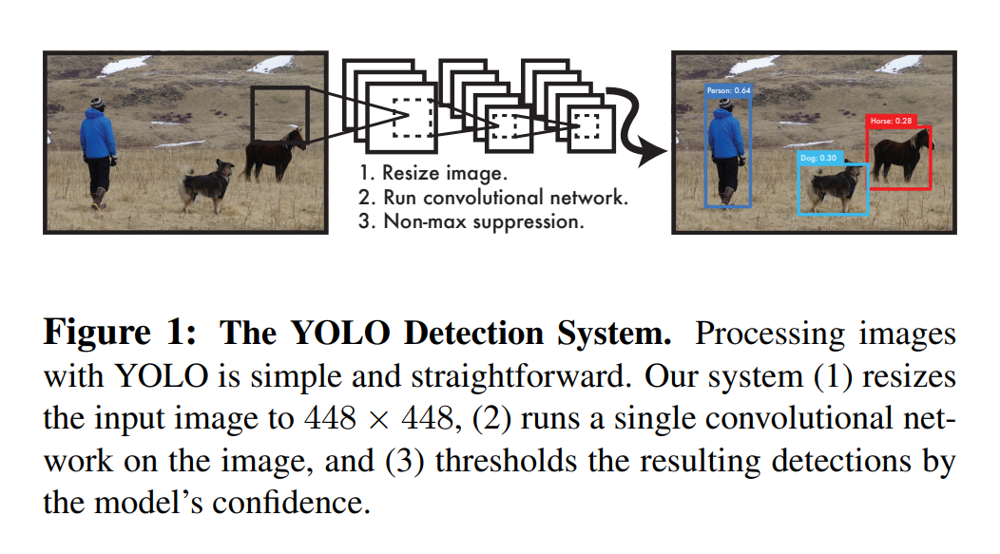
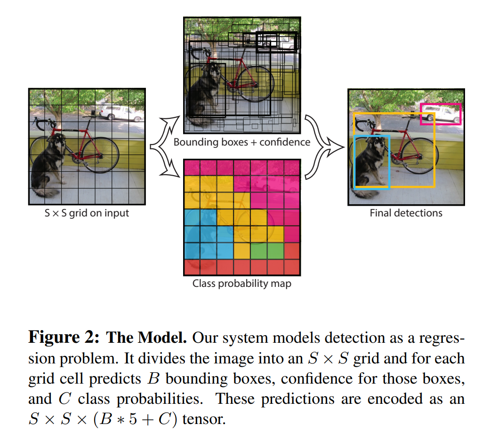

# You Only Look Once: Unified, Real-Time Object Detection

## 1. Introduction
最近的检测系统重新应用了分类器来实现检测功能。这些系统在一个物体上使用一个分类器并在多个位置和尺度上进行评估。如DPM（deformable parts models）使用滑动窗口的方法，其分类器运行在整张图片的所有位置上。

更新一些的方法，如R-CNN使用region proposal方法，先在图片中生成潜在的边界框，然后在这些box上运行分类器。分类后对bbox使用后处理来微调bbox，消除重复检测结果并根据场景内物体对box重新打分。这些复杂的流程不仅很慢，而且难以优化，原因在于每一个独立的部件都需要单独训练。

YOLO则很简单：见Fig 1. 使用单独一个卷积网络同时预测多个bbox和这些box对应的类别概率。YOLO在整个图片上进行训练，并能直接优化检测性能。这个统一的模型相对于传统物体检测方法有多个优点。

首先，YOLO很快。因为我们将检测问题转化为回归问题，而不需要复杂的流程pipeline. 在测试时只需要在新图片上运行神经网络就行了。

第二，当进行预测时，YOLO在整个图片上进行推理。与滑动窗口和region proposal-based技术不同，YOLO在训练和测试时可以看到整张图片，因此可以隐式地对类别和其外观的语义信息进行编码。Fast R-CNN是顶级的检测方法，因为它的视野较小，所以会错误地将背景patch作为物体。与Fast R-CNN相比，YOLO在背景的错误上减少了一半。

第三，YOLO能学习物体的泛化表达。当在自然图片上训练，并在艺术作品上测试的时候，YOLO的表现大幅度超越了顶级的检测方法，如DPM和R-CNN.由于YOLO拥有高度泛化性，当遇见新domain或意料外的输入时，其崩溃的可能性更小。

YOLO在准确性上仍落后于sota检测系统。尽管它可以快速识别图像中的物体，但是在某些物体的精确定位上仍然有困难，尤其是小物体。

## 2. Unified Detection
我们将物体检测的分离的部件整合到一个神经网络中。我们的网络使用整张图片的特征来预测每一个bbox.同时预测每个类别的所有bbox.这意味着我们的网络对整张图片和图片中的所有物体进行推理。YOLO的设计使其可以进行端到端的训练并且在获取较高平均精度的同时达到实时速度。

将输入图片分成$S\times S$个方格(grid)。如果一个物体的中心落在一个方格中了，那么这个方格就负责检测这个物体。

每个方格预测$B$个bbox以及这些box的置信度分数。置信度分数反映了模型认为这个box包含一个物体的置信度以及预测的box的精度。形式上，将置信度定义为$\text{Pr(Object) * IOU}^{\text{truth}}_{\text{pred}}$. 如果这个方格中没有物体，则置信度分数应该为0. 否则我们希望置信度分数等于预测box与gt的IOU.

每一个bbox包含五个预测数据：$x,y,w,h$和置信度。$(x,y)$坐标代表box的中心相对于当前方格边界的坐标。宽和高则关于整张图片进行预测。最后置信度则代表预测框和gt的IOU.

每一个方格也预测$C$个条件类别概率，$\text{Pr}(\text{Class}_i|\text{Object})$. 这些概率是在当前方格包含一个物体的条件下的概率。每个方格无论有多少个box，都只预测一组类别概率。

测试的时候，将条件类别概率和独立的box置信度预测相乘：
$$
\text{Pr}(\text{Class}_i|\text{Object})*\text{Pr(Object) * IOU}^{\text{truth}}_{\text{pred}}=\text{Pr(Class)}_i*\text{IOU}^{\text{truth}}_{\text{pred}}
$$
就得到了每个box的类别置信度分数。这些分数编码了那个类别出现在box中的概率以及预测的box与物体匹配的程度。

> 将检测视为一个回归问题。把图片分成$S\times S$个grid，然后对每个grid预测$B$个bbox、这些box的置信度以及$C$个类别概率。预测的结果编码成$S\times S\times(B*5+C)$的张量

### 2.1. Network Design
网络前面的卷积层从图像中提取特征，最后的全连接层预测输出的概率和坐标等。

受用于图像分类的GoogLeNet启发。我们的网络有24个卷积层，后接2个全连接层。但是没用GoogLeNet中的inception模块，用的是$1\times 1$接$3\times 3$卷积层。整个网络结构如Figure 3所示。
我们同样训练了一个fast版本的 YOLO.只有9层卷积层

### 2.2. Training
