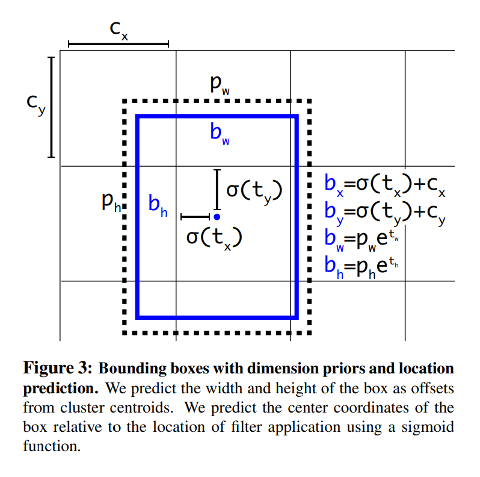
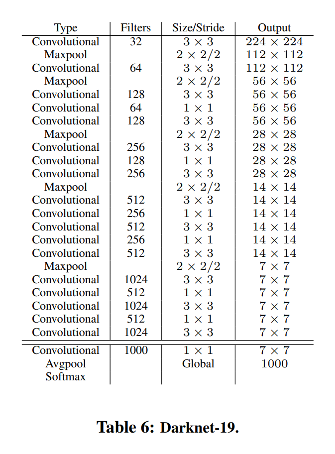

# YOLOv2

## 1. Introduction
提出一个利用已有的大量分类数据来提升当前检测系统能力的新方法，新方法使用了一种目标检测的层级视角，因此可以将不同的数据集合并起来。
还提出了一个联合训练算法使我们可以在检测数据和分类数据上训练目标检测器。该方法利用标注的检测图像来学习准确定位物体，并使用分类图像来增加词汇量并增强鲁棒性。
使用这种方法训练了YOLO9000，一个可以检测超过9000类别物体的实时目标检测器。首先在基础的YOLO上升级得到YOLOv2.然后使用数据集合并方法和联合训练算法训练YOLO9000

## 2. Better
YOLO有一堆缺点
YOLOv2的改进：
**Batch Normalization.** 在YOLO的每个卷积层后加上BN使mAP获得了超过2%的提升。BN同时对模型正则化有帮助。使用BN可以在没有过拟合出现的情况下去掉dropout
**High Resolution Classifier.** YOLOv2的分类网络先在448*448的ImageNet图片上训练了10个epoch. 使网络对高清输入更熟悉。然后调整用于检测的结果网络。这个高分辨率分类网络在mAP上实现了近4%的提升
**Convolutional With Anchor Boxes.** YOLO使用卷积提取器后的全连接层直接预测bbox的坐标。除了直接预测坐标的方法，Faster RCNN使用挑选后的先验框来预测bbox。Faster R-CNN中的RPN只用卷积层来预测anchor boxes的偏置和置信度。因为预测层使卷积层，所以RPN在特征图的每一位置都进行预测。预测偏置而非坐标使问题更简单，也更容易学习。
移除了YOLO中的全连接层并使用anchor boxes来预测bbox. 首先去掉了一个池化层使网络卷积层的输出有更高分辨率。缩小了网络尺寸，使它接收416的图片而非$448\times 448$图片。这样做的原因是希望特征图中的位置的个数为奇数，也就是有一个单独的中心cell. 目标，特别是大目标，会倾向于占据图像的中心位置，所以用一个位于中心的单独的位置来预测这些目标要好于使用周围的四个位置。YOLO的卷积层下采样的因子是32，所以通过将输入调整到416就可以得到一个$13\times 13$的特征图。
转向anchor boxes方法的同时，也将类别预测机制从空间位置中分离出来，并且对每个anchor box预测类别和是否有物体。与YOLO相同，是否有物体的预测仍然是与gt的IOU值，box和类别预测的是有物体的条件下的类别条件概率。
使用anchor boxes导致了很小的精度下降。YOLO对每张图片只预测98个box，而anchor boxes会预测超过1000个。但是召回率上升了。
**Dimension Clusters.** 在YOLO上使用anchor boxes的时候遇到了两个问题。首先，box的维度是手选的。网络会学习如何调整box，但是如果我们为网络选择较好的先验的话，网络学习起来就更容易。
作为手选的替代，我们在训练集上使用k-means聚类自动选择好的先验。如果使用基于欧氏距离的标准k-means，则较大的box的误差比较小box要大。但是实际上的理想先验是那些IOU分高者，这与box的大小无关。因此我们的距离度量使用的是：
$$
d(\text{box, centroid})=1-\text{IOU(box, centroid)}
$$
**Direct location prediction.** 遇到的第二个问题：模型不稳定，尤其在训练的早期。大多数不稳定线性来自于预测box的位置$(x,y)$. 在RPN中网络预测$t_x,t_y$的值，则中心坐标$(x,y)$的计算方法为：
$$
x=(t_x*w_a)-x_a \\
y=(t_y*h_a)-y_a
$$
例如一个$t_x=1$的预测会将box向右移动一个anchor box的宽度距离
这种方式是没有限制的，就导致任意anchor box都可能移动到图片中的任意一点，与预测的box位置没有关系。随机初始化模型要经过很长时间才能够稳定预测有意义的偏移量。
和预测偏移量不同，我们采用YOLO的方法预测相对于grid的坐标。这就限制gt的范围在0到1之间。使用logistic激活将网络的预测值限制在这一范围内。
在输出的特征图中，网络对每个grid cell预测5个bbox. 每个bbox预测5个坐标值$t_x,t_y,t_w,t_h,t_o$. 假设cell距图片左上角的偏移量为$(c_x,c_y)$，bbox先验的宽高为$p_w,p_h$，那么预测就相当于：
$$
b_x=\sigma(t_x)+c_x \\
b_y=\sigma(t_y)+c_y \\
b_w=p_w e^{t_w} \\
b_h=p_h e^{t_h} \\
Pr(\text{object})*IOU(b,\text{object})=\sigma(t_o)
$$
因为限制了位置的预测值，所以参数的学习更容易，也就使网络更稳定。

**Fine-Grained Features.** 这一修改后的YOLO在一个$13\times 13$的特征图上进行预测。尽管这对于大目标是足够的，但是更细粒度的特征图对较小目标更有利。Faster R-CNN和SSD都将RPN作用于多个特征图上获得多种分辨率。我们采用了一个不同的方法，简单地添加一个passthrough层将靠前层的$26\times 26$的分辨率加到最后。
passthrough层将更高分辨率的特征与低分辨率特征拼接到一起，与ResNet中的identity映射类似，将邻接的特征堆叠到不同的通道而非空间位置。将$26\times 26\times 512$的特征图变成$13\times\ 13\times 2048$的特征图，就可以与原始特征进行拼接。在这个扩张后的特征图上运行检测器就可以获取细粒度的特征信息。
**Multi-Scale Training.** 

## 3. Faster
**Darknet-19.** 提出一个新的分类模型作为YOLOv2的基础模型。与VGG模型相似，基本使用$3\times 3$滤波器并在池化操作后将通道数翻倍。在$3\times 3$卷积之间使用$1\times 1$卷积压缩特征表达。
最终模型称为Darknet-19，有19个卷积层和5个最大池化层。结构如下：

**Training for classification.** 

**Training for detection.** 对这个网络做了一些修改用于检测，移除了最后一个卷积层并添加3个有1024个滤波器的$3\times 3$卷积层每一层后面都接了一个$1\times 1$卷积。