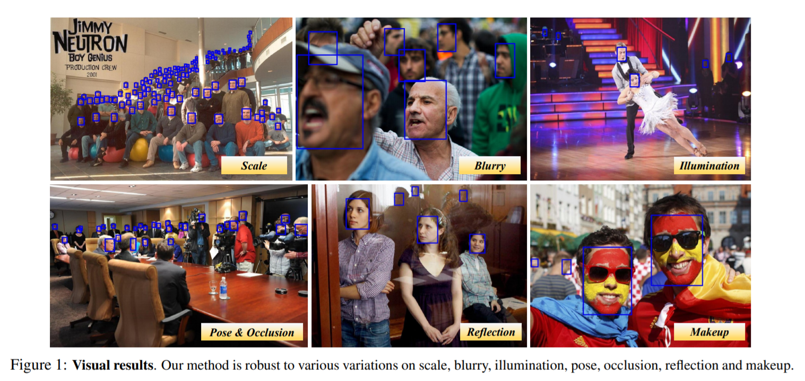
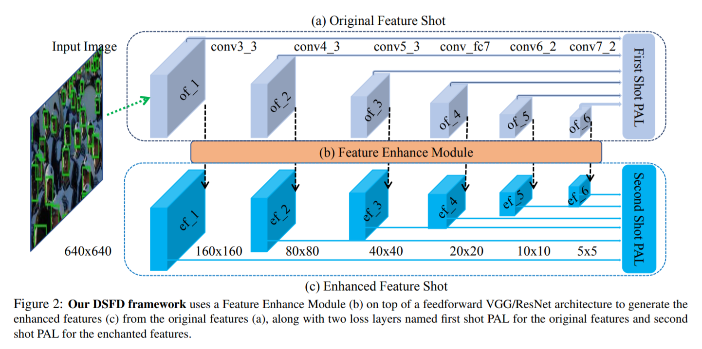
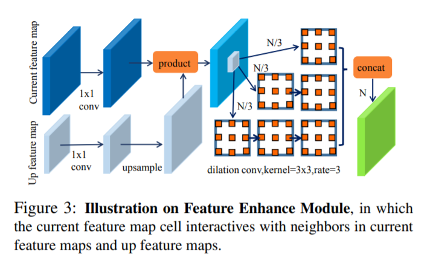

# DSFD: Dual Shot Face Detector

CVPR2019（tencent youtu）

提出一个新的人脸检测网络，在三方面做出贡献：更高效的特征学习，先进的loss设计和基于anchor分配的数据增广。首先提出一个特征增强模块（Feature Enhance Module, FEM）来增强原始特征图，将single shot检测器扩充成dual shot 检测器。其次使用不同anchor集合计算出的先进anchor loss（Progressive Anchor Loss，PAL）来有效地促进特征。最后，使用一个改良的anchor匹配（Improved Anchor Matching， IAM），通过将新的anchor分配策略整合到数据增广中来给回归器提供更好的初始化参数。由于这些技术都与two-stream设计相关，于是将本文提出的网络称为Dual Shot Face Detector（DSFD）

## Introduction

人脸检测是众多人脸应用的基础步骤，如人脸对齐、解析、识别、认证等。尽管基于CNN的人脸检测器已经被广泛地研究过，但在如尺度、姿态、遮挡、表情、外观和光照等方面有高度差异的现实场景中的人脸检测仍然是一个挑战。

之前的SOTA人脸检测器可以简单分为两类。第一类主要基于FasterRCNN使用的RPN，使用二阶段检测方案。端到端训练RPN生成高质量region proposals，后续经过FastR-CNN检测器精细化处理。另一类是基于Single Shot Detector（SSD）的一阶段方法，其不使用RPN，直接预测边界框和置信度。最近，一阶段人脸检测框架由于其更高的推理效率和直观的系统部署而受到了更多关注。

抛开上述方法取得的进步，仍有一些问题存在于3个方面：

**Feature Learning** 特征提取部分是人脸检测器所必需的。最近，FPN被广泛使用于SOTA的富特征（rich features）人脸检测器中。但是FPN只在高低层间将特征图按层融合到一起，并不考虑当前层信息，而且忽略了anchors间的语义关系。

**Loss design** 物体检测中使用的卷积loss函数包括一个人脸区域的回归loss和一个用来分辨一张人脸是否被检测到的分类loss。为了进一步解决类别不平衡问题，提出Focal Loss来关注于在一个困难样本的稀疏集合上训练。为了使用所有原始和增强过的特征，提出Hierarchical Loss.但是上述的loss函数并没有考虑到特征图在不同层和不同shot上的进步学习能力（progressive learning ability）

**Anchor matching** 基本上每个特征图预设的anchors是通过在图片上均匀地平铺一组不同尺度和长宽比的box来生成。有的工作分析了一系列合理的anchor尺度和anchor步长策略来提升正anchor的数量。但是这个策略忽略了数据增强的随机取样，仍会造成正负anchor数量不均衡。

本文提出三个新技术分别解决上述三个问题。首先引入特征增强模块（FEM）来增强特征的分辨能力和健壮性，FEM结合了PyramidBox中的FPN和RFBNet中的RFB（Receptive Field Block）的优点。其次，受hierarchical loss和PyramidBox中pyramid anchor的启发，设计了PAL（Progressive Anchor Loss），其不仅在不同层级使用progressive anchor尺寸，在不同shots也同样使用。具体来说，我们在第一个shot分配较小的anchor尺寸，在第二个shot中使用较大尺寸。第三点，提出IAM（Improved Anchor Matching），其加入anchor划分策略和基于anchor的数据增广来提升anchor和gt faces的匹配效果，并因此为回归器提供更好的初始化（？）。这三个方面是互补的，因此这些技术可以一同使用来进一步提升效果。另外由于这些技术都和two-stream设计相关，则将提出的网络命名为Dual Shot Face Detector（DSFD）.Figure 1展示了DSFD在不同变量下的效果，特别是极小脸或严重遮挡脸的情况。

总的来说，本文的主要贡献如下：

* 一个新特征增强模块，利用不同层的信息从而获得更强的区分能力和更健壮的特征
* 通过一组较小anchors在靠前层（early layers）引入辅助监督来有效地促使（facilitate）特征（？）
* 一个改良的anchor匹配策略，尽可能地匹配anchor和gt faces，给回归器提供更好的初始化
* 在FDDB和WIDER FACE上进行综合实验

## Related work

从三个方面回顾了以前的方法

**Feature Learning** 早期人脸检测的方法主要依赖于hand-crafted特征，比如Harr-like特征、控制点集合、边缘方向直方图。但是hand-crafted特征设计缺少引导。由于深度学习的发展，hand-crafted特征被CNN取代。例如Overfeat、级联CNN、MTCNN将CNN作为滑动窗口检测器作用域图像金字塔来生成特征金字塔。但是使用图像金字塔很慢而且占内存高。结果就是大多数二阶段检测器在单一尺度提取特征。R-CNN通过选择性搜索获取region proposals，然后将每个归一化后的图像区域经过CNN来分类。Faster R-CNN，R-FCN使用区域建议网络（RPN）来生成初始区域。另外对每个区域使用ROI-pooling和位置敏感RoI pooling来提取特征。

最近有些研究表明多尺度特征对小物体效果更好。具体来说，SSD、MS-CNN、SSH、S3FD在多个特征层上预测boxes。FCN、Hypercolumns、Parsenet在分割上融合多层特征。FPN，一个top-down架构，在所有尺度上都加入高层语义信息。基于FPN的方法，比如FAN、PyramidBox在检测上取得了很大的进步。但是这些方法没有考虑到当前层信息。与上述方法忽略anchor间上下文关系不同，提出一个特征增强模块结合多层扩张卷积层来增强特征的语义信息。

**Loss Design** 一般来说，检测的目标loss是一个分类loss（如softmax loss）和box回归loss（如L2 loss）的加权和。Girshick提出L1 loss防止梯度爆炸。Lin发现类间不平衡是一阶段检测器的一个阻碍，因此提出focal loss，一个动态缩放的交叉熵loss.另外，Wang为行人检测设计了RepLoss，提升遮挡场景下的效果。FANet创造了一个分层的特征金字塔并为其架构提出分层loss. 但是在FANet中使用的anchors对不同阶段使用同一尺寸。本作中，我们在不同层适应性地选取不同anchor尺寸来促进特征。

**Anchor Matching** 为了使模型更健壮，大多数检测方法都使用数据增广，例如颜色失真、水平翻转、随机剪裁和多尺度训练。Zhang提出一个anchor补偿策略使小脸在训练时能匹配到足够多的anchors. Wang提出随机剪裁生成大量遮挡人脸。但是这些方法忽略了数据增广里的随机采样，我们的方法结合了anchor分配来提供anchor匹配用的更好的数据初始化。

## Dual Shot Face Detector

### 3.1. Pipline of DSFD

DSFD的框架如figure 2所示。我们的架构使用与PyramidBox和S3FD相同的扩展的VGG16作为backbone，在分类层前截断并增加一些辅助结构。我们选择conv3_3, conv4_3, conv5_3, conv_fc7, conv6_2和conv7_2作为第一个shot的检测层来生成六个原始特征图，分别称为$of_1,of_2,of_3,of_4,of_5,of_6$. 然后我们提出的FEM将这些原始特征图转换为六个增强后的特征图，称为$ef_1,ef_2,ef_3,ef_4,ef_5,ef_6$,与原始特征图尺寸相同，经过SSD类head构成第二个shot的检测层。注意到训练图像的输入尺寸使640，意味着最低层特征图到最高层特征图的尺寸为160到5.与S3FD和PyramidBox不同，我们在FEM中使用感受野增大并采用新的anchor设计策略之后，对于步长、anchor和感受野的尺寸，它们不需要满足equal-proportion interval principle.因此我们的DSFD更灵活也更健壮。另外，原始和增强后的shots有两个不同loss，分别成为FSL(First Shot progressive anchor Loss)和SSL(Second Shot progressive anchor Loss).

### 3.2. Feature Enhance Module

特征增强模块能够增强原始特征使它们变得可分辨性更强且更健壮，简称FEM。为了增强原始神经元$oc_{(i,j,l)}$，FEM利用了不同维度信息，包括较高层的原始神经元$oc_{(i,j,l)}$和当前层的非局部神经元$nc_{(i-\epsilon, j-\epsilon, l)},nc_{(i-\epsilon, j, l)},...,nc_{(i, j+\epsilon, l)},nc_{(i+\epsilon, j+\epsilon, l)}$.特别地，增强的神经元$ec_{(i,j,l)}$的数学定义为：
$$
ec_{(i,j,l)}=f_{concate}(f_{dilation}(nc_{(i,j,l)})) \quad\quad\quad\\
nc_{i,j,l}=f_{prod}(oc_{(i,j,l)},f_{up}(oc_{(i,j,l+1)}))  \quad\quad\quad(1)
$$
其中$c_{i,j,l}$是一个位于第$l$层特征图的$(i,j)$坐标位置的cell,$f$代表一组基本的扩张卷积，元素对应相乘，上采样或拼接操作。Figure 3展示了FEM的思想，是受FPN和RFB启发。

此处，首先使用$1\times1$卷积核对特征图进行归一化。然后对上层特征图进行上采样和当前特征图进行元素对应相乘。最后将特征图分成三部分，后接包含不同数量的扩张卷积层的三个子网络。

### 3.3. Progressive Anchor Loss

与传统检测loss不同，我们不仅为不同层设计progressive anchor尺寸，还为不同shot设计。受低级特征更适用于小人脸启发，我们将较小的anchor尺寸放到第一个shot中，在第二个shot中使用较大的尺寸。首先，第二个shot基于anchor的多任务loss函数定义为：
$$
\mathcal{L}_{SSL}(p_i,p_i^*,t_i,g_i,a_i)=\frac{1}{N_{conf}}(\Sigma_iL_{conf}(p_i,p_i^*)+\frac{\beta}{N_{loc}}\Sigma_ip_i^*L_{loc}(t_i,g_i,a_i)), \quad\quad\quad(2)
$$
其中$N_{conf}$和$N_{loc}$分别代表正负anchor的数量和正anchor的数量，$L_{conf}$是两个类别（人脸和背景）的softmax loss，$L_{loc}$是使用anchor $a_i$的预测box $t_i$和gt box $g_i$参数化的smooth L1 loss.当$p_i^*=1(p_i^*=\{0,1\})$，anchor $a_i$为正，对应的位置损失被激活。$\beta$是一个用于平衡两项影响的权重。与同一层的增强后的特征图相比，原始特征图有更少用于分类的语义信息，却有更多用于检测的高分辨率位置信息。因此，我们相信原始特征图可以检测和分类较小尺寸人脸。提出有一组较小anchors的第一个Shot的多任务Loss：
$$
\mathcal{L}_{FSL}(p_i,p_i^*,t_i,g_i,sa_i)=\frac{1}{N_{conf}}\Sigma_iL_{conf}(p_i,p_i^*)+\frac{\beta}{N_{loc}}\Sigma_ip_i^*L_{loc}(t_i,g_i,sa_i), \quad\quad\quad(3)
$$
其中$sa$代表第一个shot层中较小的anchors，两个shots的losses可以通过加权求和的方式表示成一个完整的Progressive Anchor Loss：
$$
\mathcal{L}_{PAL}=\mathcal{L}_{FSL}(sa)+\lambda\mathcal{L}_{SSL}(a). \quad\quad\quad(4)
$$

### 3.4. Improved Anchor Matching

当前的anchor匹配方法在anchor和gt face间是双向的。因此，anchor的设计和增广的face采样都与尽可能匹配anchors和人脸从而更好的初始化回归器相关。我们的IAM目标是解决离散的anchor尺度和连续的人脸尺度之间的矛盾，其中人脸通过$S_{input}*S_{face}/S_{anchor}$进行概率为40%的增广，目的是为了增加正anchors的数量，稳定训练过程并由此提高结果。Table 1展示了我们的anchor设计，每个特征图上的点（cell）是如何与固定形状anchor相关联的。基于face尺寸统计信息，将anchor比率设置为1.5:1.原始特征图上的anchor尺寸是增强后特征图上尺寸的一半。另外，有2/5的概率，我们使用基于anchor的采样方法（类似于PyramidBox中的data-anchor-sampling），从图像中随机选择一个人脸，对包含人脸的子图进行剪裁，设置子图和选中的人脸间的尺寸比为640/rand（16，32，64，128，256，512）.剩下的3/5概率，使用与SSD类似的数据增广方法。为了提升人脸的召回率并同时保证anchor的分类能力，将anchor与gt face之间的IoU阈值设置为0.4。

## Experiments

### 4.1. Implementation Details

backbone网络使用在ImageNet预训练的VGG/ResNet.所有新加入的卷积层参数都用`xavier`方法初始化。用动量为0.9，weight decay为0.0005的SGD来微调DSFD模型。batch size设为16.学习率前40k步为$10^{-3}$，两个10k步分别降到$10^{-4}$和$10^{-5}$.

推理阶段，忽略掉第一个shot的输出，第二个shot预测前5k个高置信度检测结果。使用交并比为0.3的非极大值抑制每张图片产生前750个高置信度bounding box.bounding box 的四个坐标，左上点向下取整，右下点向上取整来扩大检测框。