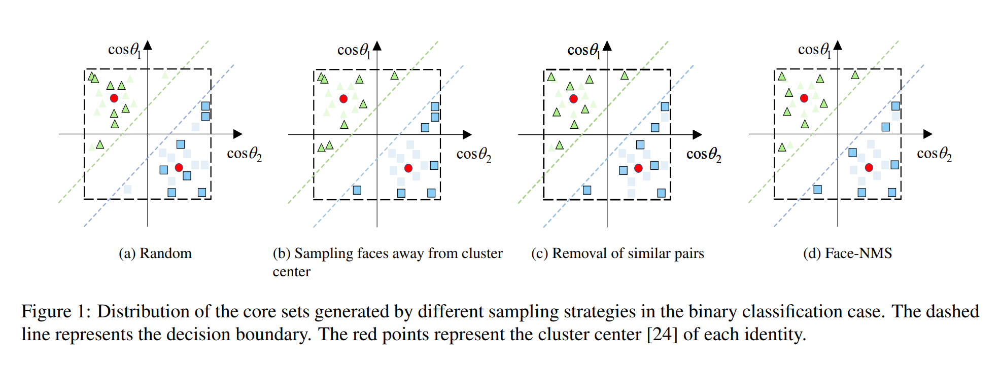
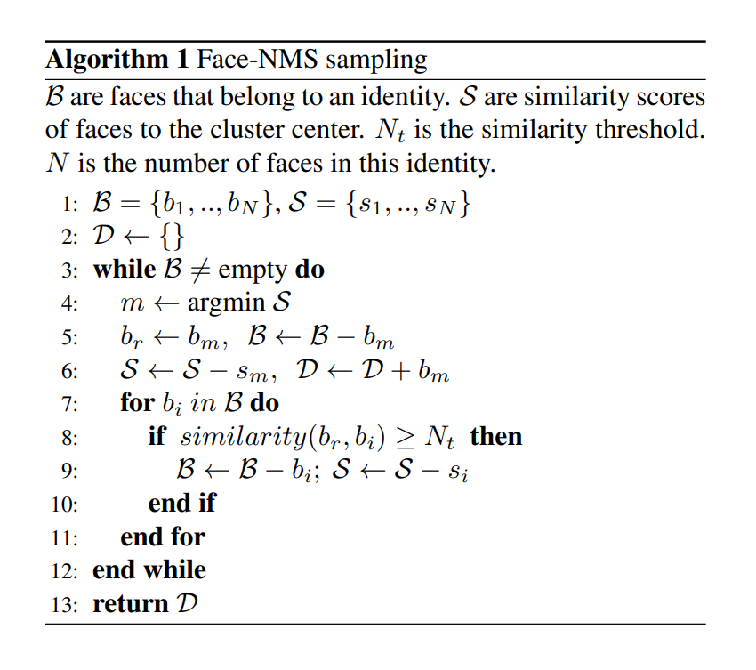

# Face-NMS

## Abstract
人脸识别模型的训练数据的规模越来越大，所需的时间和算力也越来越多，本文提出通过解决由贪婪采样操作（即核心组选择视角？core-set selection perspective）引起的数据集的冗余问题。提出一个全新的过滤策略称为Face-NMS.Face-NMS运行于特征空间，在生成core sets的时候同时兼顾局部和全局的稀疏性。实际上，Face-NMS与物体检测中的NMS很相近。它根据人脸对全局稀疏性的潜在贡献进行排名，并过滤出在局部稀疏性上有高相似度的多余的人脸。

## 1. Introduction
Face-NMS生成的core sets在相对高稀疏的情况下更合理，如Figure 1所示。

为了解决人脸识别训练时数据量太大、效率低的问题

主要贡献如下：
1. 针对减轻训练时所用的大规模人脸数据所造成负担的新视角。
2. 设计了一个新的、有理论指导的过滤策略称为Face-NMS
3. 做了一堆实验

## 2. Related Works
### 2.1. Efficient Face Recognition
主流的人脸识别模型训练方法一般分两种：一个是经过softmax loss的分类方法，另一个是度量学习损失函数来优化一个batch内样本的相似度。由于度量学习的缺陷，所以softmax以及其变体被广泛应用于人脸识别的训练中。但是随着id数量的增长，基于softmax的方法中的线性变换矩阵的规模也呈线性增长，计算量也随着一起增长。结果就是在面对大规模数据集的时候，这种方法受限于GPU内存和算力。

### 2.2. Core-set Selection
Core-set selection可以定义为一种从数据中寻找一个有相似质量等级（例如对训练模型的泛化误差或者最小包含球）的数据子集作为完整数据集的技术。

### 3. Methodology
### 3.1. The Target of Core-set Selection
与搜索最重要的样本的方式不同，我们通过从稀疏性角度出发，抛弃冗余样本的方式来解决core-set selection问题。给定一个id的一组人脸集合$F=\{f_1,f_2,...,f_N\}$，其中$f_i,i=1,...N$是第i个人脸的归一化特征向量。局部的冗余存在于有高相似度且对整体分离度贡献较小的数据对中。因此对于局部稀疏性，根据阈值随机抛弃无效人脸对中的样本就比较合理。但是随机抛弃的操作并没有考虑到两张人脸对全局稀疏性贡献的差异，因此这种方式是次优的。
全局稀疏性可以表示为同一个id下人脸对的余弦相似度。
$$
S(F)=-\frac{1}{N^2}\sum^N_i \sum^N_j f_i \cdot f_j
$$
其中$f_i \cdot f_j$是两个人脸向量的余弦相似度。
考虑两个额外的样本$f,f'$，有
$$
S(F\cup \{f\})-S(F\cup \{f'\})\\
=-\frac{2}{(N+1)^2}(\sum^N_i f_i \cdot f - \sum^N_i f_i \cdot f') \\
=-\frac{2}{N+1}[f\cdot \frac{\sum_i^N f_i+f}{N+1}-f'\cdot \frac{\sum_i^N f_i+f'}{N+1}]
$$
其中$\frac{1}{N+1}(\sum_i^N f_i+f)$是一个id中人脸的平均特征，即聚类中心。根据上式，距离类中心远的样本会对全局稀疏性有更大的贡献。为了最大化全局稀疏性，与随机选择相比，去掉离类中心近的样本而保留离类中心远的样本更合理。
但是这样会忽略局部稀疏性，同样导致次优解。
总的来说，人脸识别中core-set selection的原则是过滤出互相有高相似度且与类中心相近的的人脸图片。

### 3.2. Face-NMS Sampling
根据之前的描述，会联想到检测中的NMS.提出的Face-NMS采样策略按人脸与类中心的相似度按顺序选择人脸并丢掉高相似度的人脸，如Algorithm 1中所示。

具体来说，首先通过一个预先训练好的代理模型提取特征。然后采样策略根据样本和类中心S的相似度对它们进行排序。选择分数最小者为m，然后将他从B中移除并加入最终集合D中。然后计算B中每个人脸与m的相似度，超过阈值$N_t$的样本会被删除。重复上述过程直到B为空。值得注意的是，由于代理模型工作于特征空间，就可以用一个较小的代理数据集进行训练。