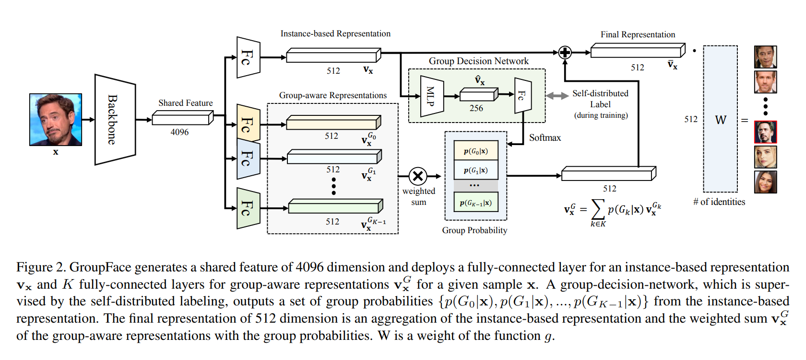

# GroupFace

## 1. Introduction
分组，是高效且灵活地生成非常大量人员表示并简要描述一个未知人员的核心思想。每个人脸上都有属于他的特点。同时，常见的特点会出现在一群人的描述中。实际上，包含常见特征的基于分组的描述虽然不能直接定位到个人，但仍然可以帮助缩小搜索范围。可问题是，明确的分组需要手动对巨量的数据进行标注，而且可能受人类感知的有限范围的描述所限。尽管如此，采用分组的概念，可以使识别网络缩小搜索空间并灵活地生成大量id的特征表示。

## 3. Proposed Method
通过使用一个自行分布的分组方法学习潜在分组，构建多个分组感知表示并将它们组合成基于实例的标准表示来增强人脸识别特征的表达能力。
### 3.1. GroupFace
**Instance-based Representation.** 将传统人脸识别方法中的特征向量称为*基于实例的表达*。一般来说，基于实例的表达是通过softmax类loss方法进行训练得到的，并且获得身份的预测：
$$
p(y_i|x)=\text{softmax}_k(g(v_x))
$$
其中$y_i$是身份标签，$v_x$是给定样本$x$的基于实例的表达，$g$是一个将512维特征向量映射到M维空间的函数，M是id数量。
**Group-aware Representation.** GroupFace使用一个新的分组感知表达和基于实例的表达一起增强特征。每个分组感知表达向量都通过对应分组的全连接层提取得到。GroupFace的embedding 特征($\bar{\textbf{v}}_X$，Figure 2中的最终表达)是通过对基于实例的表达$\textbf{v}_X$和分组感知表达$\textbf{v}_X^G$的加权和进行聚合操作得到的。GroupFace使用最终的增强后的表达来预测id信息：
$$
\begin{align*}
p(y_i|x)&=\text{softmax}_k(g(\bar{\textbf{v}}_X)) \\
&=\text{softmax}_k(g(\textbf{v}_X+\textbf{v}_X^G))
\end{align*}
$$
**Structure.** 基于实例的表达通过传统人脸识别方法获取，K个分组感知表达通过一个全连接层以类似的方法获取。然后用一个分组决策网络(GDN, Group Decision Network)根据实例表达计算分组的概率，GDN由3个全连接层和一个softmax层构成。根据分组概率，可以对分组表达进行soft方法合并(S-GroupFace)或hard方法合并(H-GroupFace)。
1. S-GroupFace就是概率加权
2. H-GroupFace就是取最大

S-GroupFace能带来人脸识别精度的巨大提升，但是需要一些额外的资源；而H-GroupFace则更适合实际的应用。只需要少量的卷积操作。最终的特征是实例特征和分组特征的聚合结果。

**Group-aware Similarity.** 引入一个新的相似度——分组感知相似度，在推理阶段同时考虑标准特征和GDN的中间特征。分组感知相似度通过两个实例的中间特征的距离进行惩罚，因为中间特征并没有在余弦空间上进行训练，并且只描述一个给定样本的分组信息而非具体的身份信息。第i张图片和第j张图片间的分组感知相似度$S^*$为：
$$
S^*(x_i,x_j)=S(\bar{\textbf{v}}_{x_i},\bar{\textbf{v}}_{x_j})-\beta D(\hat{\textbf{v}}_{x_i},\hat{\textbf{v}}_{x_j})^{\gamma}
$$
其中S是cosine相似度，D是一个距离度量，$\hat{\textbf{v}}_{x}$代表GDN的中间特征，$\beta, \gamma$是常参数，按经验设定为$\beta=0.1,\gamma=1/3$.

### 3.2. Self-distributed Grouping
本文中将一个分组定义为一个拥有共同的视觉或非视觉特征的样本的集合。这样的分组是通过一个GDN来确定的。这个GDN是用一种自分组方法逐步训练得到的，通过考虑潜在分组的分布提供分组标签而不需明确的gt信息。
**Naïve Labeling.** 一种确定分组标签的朴素方法是取softmax输出最大的索引作为标签。用一个全连接+softmax的GDN $f$来确定一个样本x的对应分组$G^*$:
$$
p(G_k|x)=\text{softmax}_k(f(x)) \\
G^*(x)=\argmax_kp(G_k|x),
$$
其中$G_k$是第k个分组。