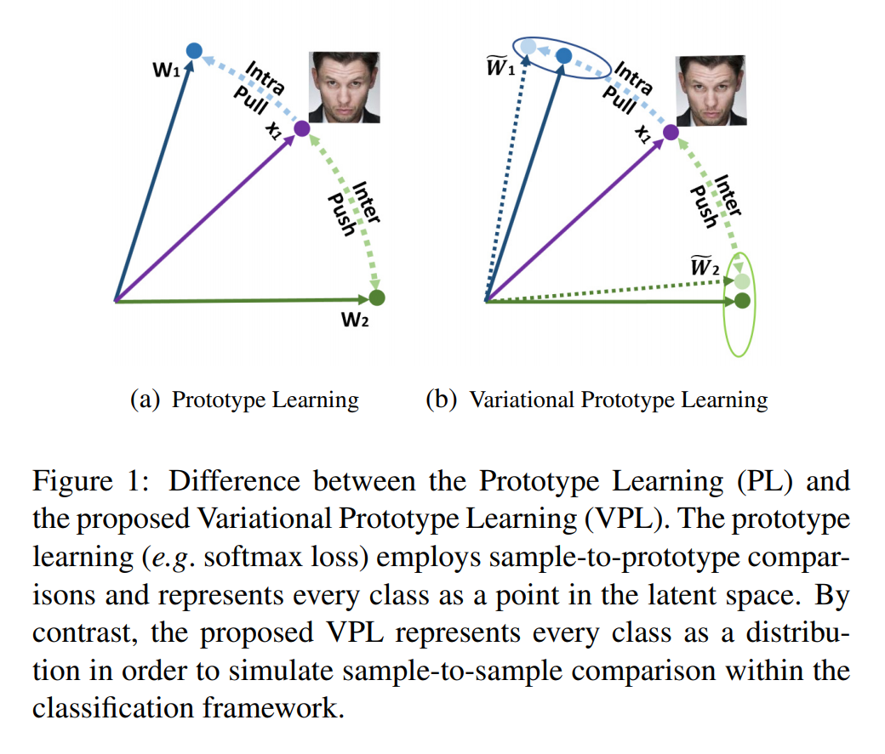
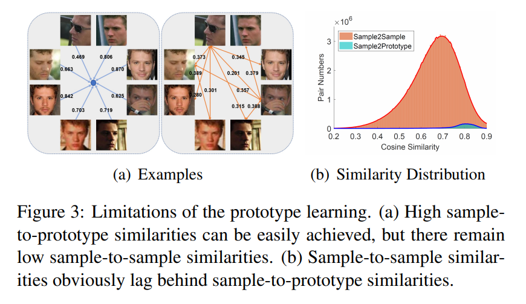

# Variational Prototype Learning for Deep Face Recognition

## Abstract
在margin-based softmax loss中，prototype存储与最后一个线性层中，代表了每个类的中心表示。对于这样的方法，训练的样本会根据一个明确的边界强制靠近正类prototype并远离负类prototype. 但是这种prototype的学习方式在训练的过程中只实现了样本与prototype之间的比较而没有将样本与样本间比较考虑在内，其对应的低loss值营造了一种得到完美embedding的假象，阻碍了SGD的进一步动作。为了解决这一问题，提出了变分原型学习(Variational Prototype Learning, VPL)，将每个类别表示成一个分布而非隐空间中的一个点。通过识别缓慢的特征漂移现象，直接将存储的特征注入原型来近似变分原型采样。提出的VPL可以在分类框架下模拟样本到样本对比，推动SGD进一步进行探索。

## 1.Introduction
目前大多数sota的人脸识别方法都是用边界惩罚来增强embedding的判别能力。尽管margin-based的softmax很强，但是每个类只表示成隐空间中一个点，这样做失去了变化信息，如Figure 1(a)所示.从现实角度，人脸数据的分布天生是不平衡的，有些id有很多样本，其他的只有很少样本。在4.2节导数分析中发现prototype通过不断吸收正样本特征并消除负样本特征进行学习。当数据变浅(shallow, id内图片少)，类内变化受限，prototype向量能够轻易记住类内的全部样本。例如，假设id内只有两张图片，其对应的特征分别是$x_1,x_2$，如果prototype可以学习记住中心$(x_1+x_2)/2$，而不考虑$x_1,x_2$之间的相似度，那么样本与prototype间的相似度可能会很高。因此，prototype的单一点表示有的时候会阻碍SGD进一步探索，导致模型收敛到suboptimal local-minima
因此提出变分原型学习(Variational Prototype Learning, VPL)，将每个类别表示成一个分布而非隐空间中的一个点，如Figure 1(b)所示。

contributions：
* 提出VPL方法
* 基于对缓慢特征漂移的观察，设计一个变分原型采样方法，直接将存储的特征注入原型。在VPL中同时采用了样本原型比较和样本样本比较
* 提出的VPL是即插即用模块

## 2.Related Work
aaa

## 3. Limitations of Prototype Learning
分类loss的prototype只表示了每个class的中心点，并不携带类内差异信息。而样本之间的比较则包含embedding网络得到的实时的特征差异。

## 4. Variational Prototype Learning
VPL优化训练样本和一组变分prototype间的相似度：
$$
\mathcal{L}_{VPL}=-\log \frac{e^{\widetilde{W}^T_{y_i}x_i}}{e^{\widetilde{W}^T_{y_i}x_i}+\sum_{j=1,j\ne y_i}^N e^{\widetilde{W}^T_{j}x_i}}
$$
其中变分prototype$\widetilde{W}_j$是在类别分布上采样得到的。

### 4.1. Variational Prototype
**Feature consistency across mini-batches:** 特征漂移现象
**Feature injection into the prototype:** 训练开始一段时间之后的特征漂移变得很缓慢，因此可以近似视作当前网络的输出。因为这些历史特征不需要额外的计算并且携带了每个类别的变化信息，所以用一个存储器来保存它们。在初始阶段，特征漂移还很大的时候先不采用，等到特征稳定下来，再创建一个存储器M和一个指示器T.当mini-batch中的人脸特征$\{x_i,y_i\}$属于$M_{y_i}$时，对应的指示器$T_{y_i}$刷新为$\Delta t$. 每一步之后将$T_{y_i}-1$
则变分prototype可以表示为：
$$
\widetilde{W}_j \approx (1-\textit{1}\{T_j>0\}\lambda)W_j+\textit{1}\{T_j>0\}\lambda M_j \\
\approx \lambda_1 W_j+ \lambda_2 M_j
$$
$\lambda$是超参数。VPL中每个训练样本都和全部prototype和存储器中的有效特征的线性组合进行比较，在训练的时候同时进行样本与prototype以样本间比较。