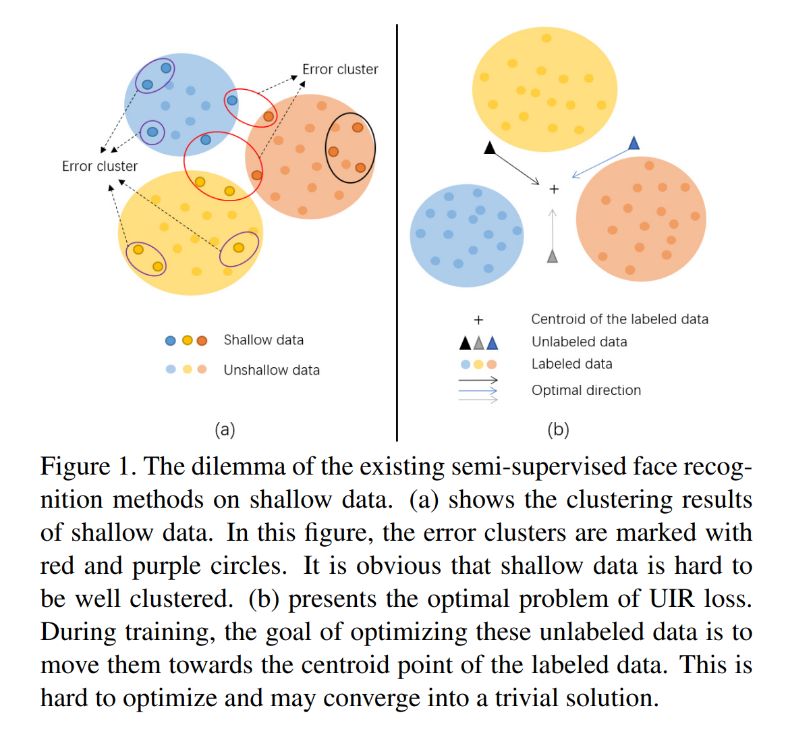
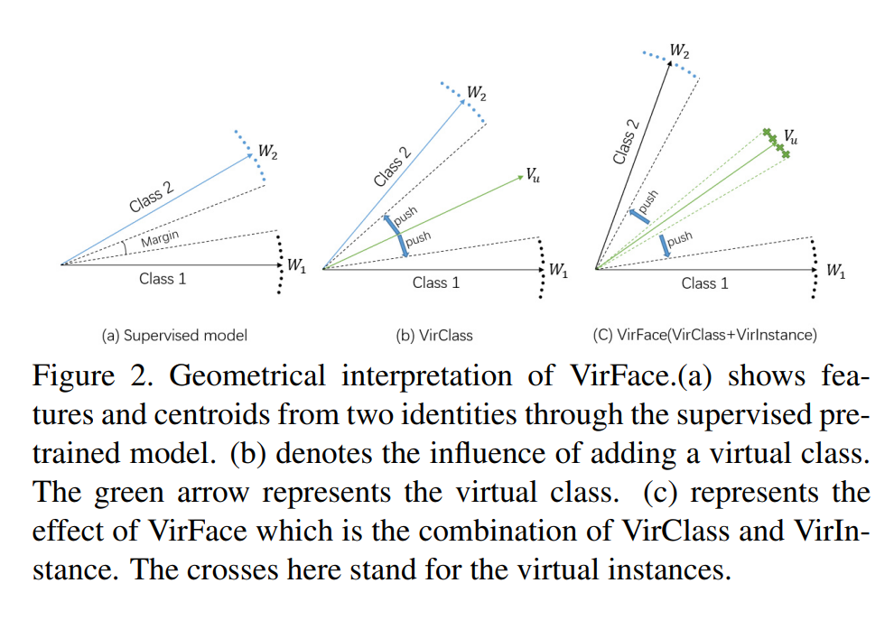

# VirFace: Enhancing Face Recognition via Unlabeled Shallow Data
VirFace模型，利用无标签的shallow数据进行人脸识别的训练。
VirFace由VirClass和VirInstance组成，VirClass通过引入无标签数据作为新id从而增大了类间距离，VirInstance生成每个id学习到的分布的虚拟距离来进一步增大类间距离。

## 1. Introduction
shallow data定义为少于5张图片的id
聚类方法会为无标签数据分配伪标签，然后将他们与有标签数据一起训练一个新模型。但是shallow data难以聚类（？？？），如Figure 1(a)所示。其中红色圈圈代表不同id的图片聚到同一个类别，紫色圈圈代表同一id的图片聚到不同的类别中。如Figure 1(b)所示，可以轻松地使模型收敛到一个平凡解，即将所有无标签数据优化到有标签数据的中心。

## 3. Proposed Method
VirClass通过引入无标签数据作为新id从而增大了类间距离，VirInstance生成每个id学习到的分布的虚拟距离来进一步增大类间距离。
基于角度的识别损失：
$$
L=-\frac{1}{N}\sum_{i=1}^N \log \frac{f(w_{y_i},x_i,m)}{f(w_{y_i},x_i,m)+\sum_{j\ne y_i}^n f(w_j,x_i)}
$$
其中$f(\cdot)$代表指数余弦项，$m$代表角度边距，$w$代表最后FC层的权重，$x$是backbone输出的特征，$N,n$分别是batch size和类别数

### 3.1. VirClass
由于无标签数据没有标签代表具体id，受Virtual-Softmax启发，提出虚拟类的概念，再mini-batch中给无标签数据一个虚拟的id. 我们将这些虚拟类视作负类，并尝试找到虚拟类的中心（最后一层FC层权重一样效果）。由于无标签数据是shallow的，难以在一个mini-batch中找到同一个id的样本，因此每一个无标签的特征都可以作为它所属的虚拟类中心的替代品。然后将这些中心加入到有标签的空间中并最大化有标签样本与虚拟类中心的角度来增大类间距离。为了减少存储空间和降低计算复杂度，在每个mini-batch动态地更新虚拟类。
在识别函数中加入虚拟类项：
$$
P_{vc_i}=\frac{f(w_{y_i},x_i,m)}{f(w_{y_i},x_i,m)+\sum_{j\ne y_i}^n f(w_j,x_i)+\sum_{u=1}^Uf(v_u,x_i)} \\
L_{vc}=-\frac{1}{N}\sum_{i=1}^N\log P_{vc_i}
$$
其中$U$和$N$是mini batch中无标签数据和有标签数据的数量。$v_u=x_u$是虚拟类$u$的中心。
如Figure 2(b)所示，可以通过优化$L_{vc}$（额外的虚拟类）来增大类间距离。

### 3.2. VirInstance
为了探索无标签数据的更大的潜力，提出一个进一步增强的部件VirInstance来更好地利用无标签数据。VirInstance会生成每个虚拟类的特征分布，然后最大化有标签中心和虚拟类特征分布间的距离来增大类间距，如Figure 2(c)所示。
根据中心极限定理，不考虑原始分布，当采样数量足够大的时候，采样的分布总会接近于正态分布。如果将所有人脸特征视作一个完整的特征集合，那么每个id的特征就可以作为从完整集合中采样得到的子集合。因此，可以通过有标签特征学习这一分布然后预测无标签id的特征分布。
从每个虚拟类中随机采样几个虚拟实例来代表对应虚拟类的特征分布。这样的话，最大化标签中心和虚拟类特征分布间的距离就等同于最大化标签中心和虚拟类中的虚拟实例之间的距离。
loss函数：
$$
P_{vi_{i,s}}=\frac{f(v_i,x_{s_i},m)}{f(v_i,x_{s_i},m)+\sum_{u\ne i}^U f(v_u,x_{s_i})+\sum_{j=1}^n f(w_j,x_{s_i})} \\
L_{vi}=-\frac{1}{U}\sum_{i=1}^U\sum_{s=1}^S\log P_{vi_{i,s}}
$$
其中$v_i$是虚拟类i的中心，$x_{s_i}$代表虚拟类i的第s个生成的虚拟实例。$w_l$是标签l的中心。$U,S$分别代表虚拟类和一个虚拟类下虚拟实例的数量。
使用VAE来预测特征分布并生成从特征分布中采样得到的实例。