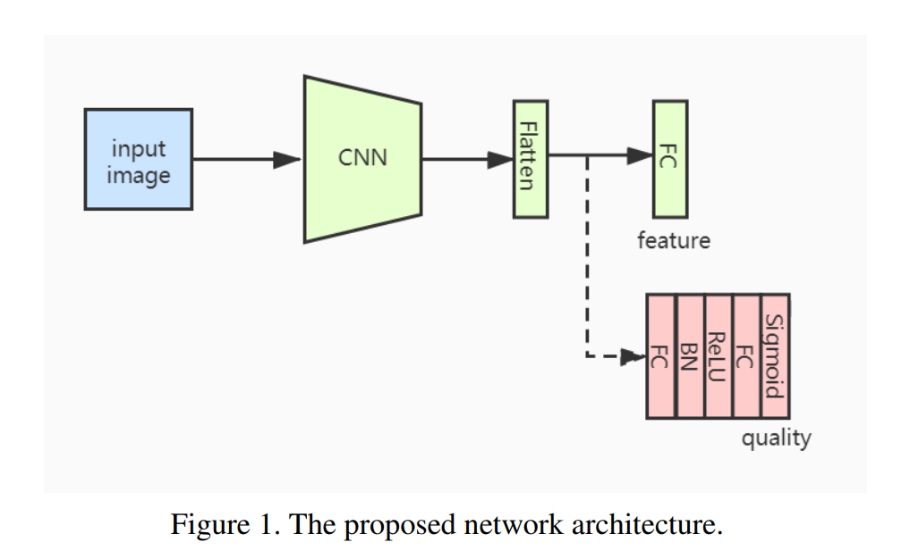
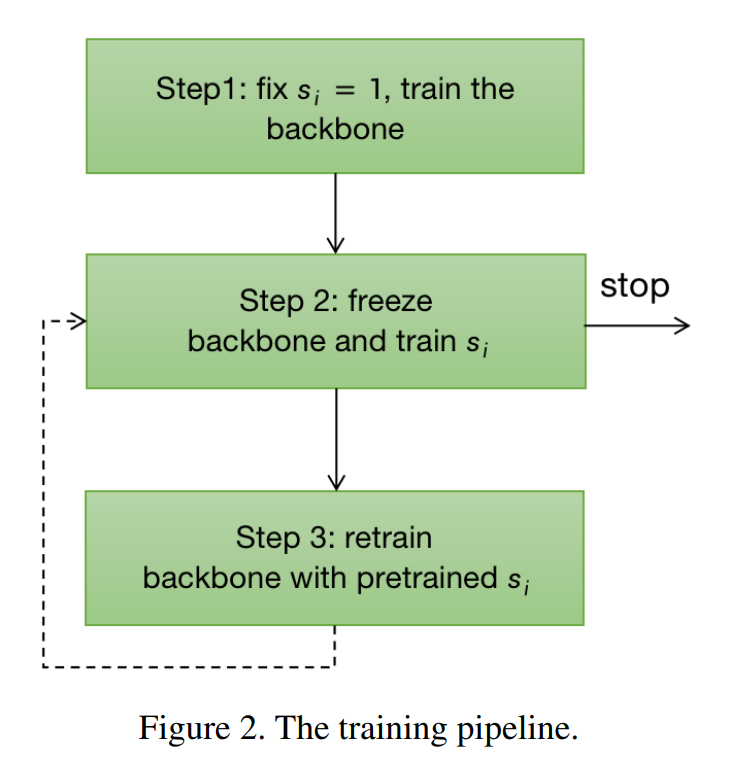
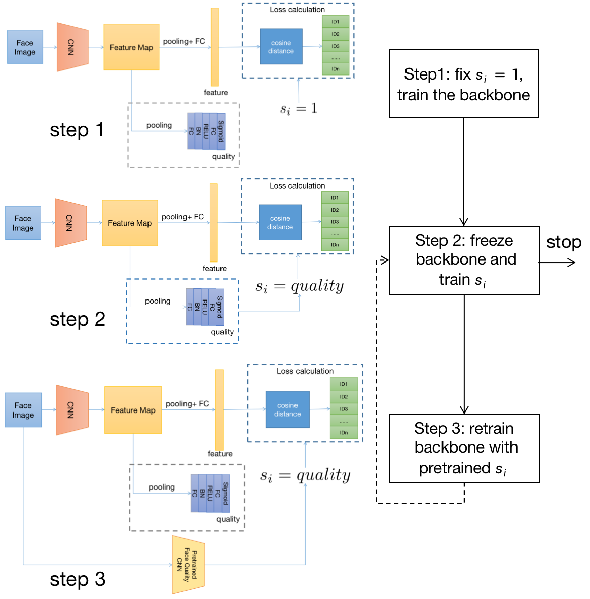
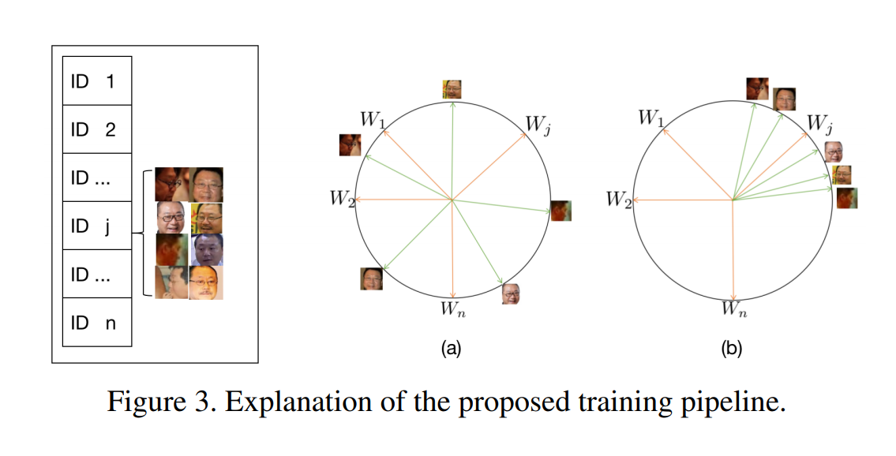

# EQFace: A Simple Explicit Quality Network for Face Recognition

网络简单，在识别模型后加一个分支即可，而且不需要带标注的训练数据
另一个贡献是提出一个基于EQFace得到的质量评分的先进的特征聚合方式，作用于在线视频人脸识别。

## 3. Proposed Explicit Quality Network
### 3.1. Review of ArcFace Loss Functions
从广泛使用的softmax loss开始，提出了ArcFace：用于人脸识别的可加的角度边缘loss
令$f_i \in R^d$代表属于类别$y_i$的样本$x_i$的特征向量，维数一般512. 令$W_j \in R^d$代表权重$W\in R^{d\times n}$的第j列，$b_j\in R^n$代表偏置项。假设类别数为n，则softmax loss可表示为：
$$
l_1=-\log\frac{e^{W^T_{y_i}f_i+b_{y_i}}}{\sum_{j=1}^n e^{W^T_{j}f_i+b_{j}}}  \qquad (1)
$$
注意所有loss都不包含batch的求和。
通常偏置项可以置零。那么对数就可以变成$W_j^Tf_i=\lVert W_j \rVert \lVert x_i \rVert cos(\theta_j)$，其中$\theta_j$是权重$W_j$和特征$x_i$间的夹角。通常可以使用L2正则化令$\lVert W_j \rVert=1$. 同样可以令特征向量$\lVert f_i \rVert=1$，然后缩放到$s$. 加上边界项之后，ArcLoss表示为：
$$
l_2=-\log\frac{e^{s(cos(\theta_{y_i}+m))}}{e^{s(cos(\theta_{y_i}+m))}+\sum_{j \neq y_i}e^{s(cos(\theta_j))}} \qquad (2)
$$
将所有的边界惩罚合并在一起，同时使用SphereFace，ArcFace和CosFace的loss，包含三个超参数$m1,m2,m3$的loss为：
$$
l_3=-\log \frac{e^{s(m_1cos(\theta_{y_i}+m_2)-m_3)}}{e^{s(m_1cos(\theta_{y_i}+m_2)-m_3)}+\sum_{j\neq y_i}e^{s(cos(\theta_j))}} \qquad (3)
$$
本文的loss基于(3)式

### 3.2. Review of Confidence Aware Loss Function
在"Probabilistic face embeddings"中提出了将人脸图片建模成高斯分布的方法，并使用人脸图片的变化来定义置信度。这个置信度作为了人脸质量的一个衡量指标。这一方法减轻了低质量人脸图片的影响，减少了训练中的噪声。

除此之外，"Towards universal representation learning for deep face recognition"中作者突出一个新的loss函数和几个提升置信度感知嵌入的策略。

本方法每个样本$x_i$都建模成了特征空间中的一个高斯分布$N(f_i,\sigma_i^2I)$，$\sigma_i$是特征的标准差。令$s_i=1/\sigma_i^2$，则softmax loss就变成了：
$$
l_4=-\log\frac{e^{s_iW^T_{y_i}f_i+b_{y_i}}}{\sum_{j=1}^n e^{s_iW^T_{j}f_i+b_{j}}}  \qquad (4)
$$
与公式1相比，公式4在logit项前面多了一个$s_i$. 加上边界项后：
$$
l_5=-\log\frac{e^{s_iW^T_{y_i}f_i-m}}{\sum_{j=1}^n e^{s_iW^T_{j}f_i-m}+\sum_{j\neq y_i}e^{s_iw_j^Tf_i}}  \qquad (5)
$$
将公式5和3进行比较可以发现两个不同点；首先公式5只是用了一个边界项而公式3使用了3个。而且公式5中在logit项前有一个额外的项$s_i$，它是$\sigma_i^2$的倒数，就作为样本$x_i$的质量评分。
但是需要注意公式5的loss函数中的$s_i$的范围是无穷的。因为$m$是一个独立的变量，对于低质量图片，$s_i$的值不能接近于零。就导致$s_i$缺乏足够的判别能力。

### 3.3. Proposed Loss Function
受公式3和公式5启发，提出一个新的loss函数：
$$
l_6=-\log \frac{e^{s_iS(m_1cos(\theta_{y_i}+m_2)-m_3)}}{e^{s_iS(m_1cos(\theta_{y_i}+m_2)-m_3)}+\sum_{j\neq y_i}e^{s_iS(cos(\theta_j))}} \qquad (6)
$$
其中$s_i \in [0,1]$而S的值是固定的，它等于高斯分布中最小的variation value的倒数。在训练的时候希望低质量图片有更小的$s_i$，而高质量图片有更大的$s_i$.这个$s_i$让每个样本在训练的时候使用它自己的质量作为权重。最后，将模型生成的$s_i$作为对人脸图片质量的估计。
这个loss函数集合了公式3和5的优点。公式3中$s$是固定的，因此无法判别人脸图片的质量。公式5对每个样本$x_i$引入一项$s_i$. 但是因为它的值是无界的，所以不能进行归一化使用。而我们提出的loss中解决了它们的弱点同时保留了它们的长处。

### 3.4. Proposed Quality Network
为了让模型输出$s_i$，添加了一个小的质量网络作为基础网络的分支，如Figure 1所示。这个分支网络的关键层是两个FC层，用来提取质量值。第一个FC之后有一个BN和一个ReLU，并在第二个FC后使用一个Sigmoid层使输出处于$[0,1]$区间。

训练流程分三步：
1. loss中的$s_i$固定为1. 只训练人脸特征提取部分，不训练人脸质量网络。
2. 第一步结束后，固定基础网络，将$s_i$替换成质量网络的输出，用公式6的loss对质量网络的参数计算梯度。
3. 固定质量网络，此时每张图片都可以生成一个质量分数，用这个质量分数作为$s_i$并再次训练基础网络。基础网络可以从头或者继续训练。

可以循环重复2，3步来提升网络的性能。

涉及这个三步训练流程的理由：同一个人的多张人脸图片的质量是不同的。令$w_j$表示它们的真实因子，如Figure 3所示。在训练过程的初始阶段，它们与$w_j$的角度距离比较大，如Figure 3(a)所示。如果在loss函数中直接用的话，为了最小化loss函数，所有人脸图片的$s_i$都会被训练成一个很接近0的值。这样的话这个质量分就没有判别能力了。因此需要在第一步中将$s_i$设定为1并只训练基础网络。训练一段时间之后，这些人脸图片与$w_j$间的角度距离就变得比较小。其中，低质量人脸图像的角度距离要大于高质量图像。继续训练会令这些低质量图片的$s_i$变得更小，结果$s_i$对不同质量的图片就有了判别能力。这一方法有一个条件，就是每个人脸id中的高质量图片数量要多于低质量图片数量。为了保证它们与$w_j$间的角度距离较小，在第三步使用了预训练模型（第二步得到的）生成的人脸质量分数。因为高质量图片的权重更大，所以它们与$w_j$间的角度距离会训练得更小。

