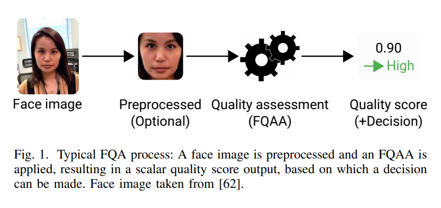

# Face Image Quality Assessment: A Literature Survey

## I. INTRODUCTION

人脸质量评估(Face Quality Assessment, FQA)指以人脸数据作为输入并输出某种形式的“质量”估计的过程，如Figure 1所示。

## II. QUALITY ASSESSMENT IN FACE RECOGNITION

blahblahblah

### A. Application areas of FQA

blahblahblah

### B. Evaluating FQAA performance

blahblahblah

## III. FACE QUALITY ASSESSMENT ALGORITHMS

为了提供更清晰的全局视角，将调查的FQA资料细分成四个类别：

* **Non-DL(III-A): **未使用深度学习方法实现FQAA的资料。占资料的主要部分。
* **Standard-focused(III-B): **将按标准定义的质量因素作为FQA的资料。与其他类别相比，这一类别的大部分都使用大量人类可理解的元素。这一类别没有用到深度学习的方法。
* **Video frame(III-C): **用于筛选视频帧目的的FQA. 本类别中有两种方法使用了深度学习方法。
* **DL(III-D): **使用深度学习方法实现FQAA的资料。可代表最近的资料。

standard-focused和视频帧类别下的几乎所有资料都是非深度学习的资料，其中视频帧有两个算是深度学习，但是为了清晰起见，图表和后续章节并不包含交集情况。注意到非深度学习的资料包含基于其他机器学习方法（包括浅层人工神经网络）的FQA，作为纯手动方法的补充。深度学习FQA资料是最近才出现的，基于深度学习的FQA的研究趋势见Figure 6.

一部分论文和其他提到的论文有至少一位公共作者，而通过作者间的这种关系形成的小组包含至多四篇作品。大多数论文都有独特的一组作者，这表明FQA的研究是以一大批研究组所推动的。与作者关系独立的是各种FQA的作品显然基于已有的作品。

Table V列出了用来开发和评估FQA方法所使用的数据集。

## A. Non-DL FQA literature

所调查的FQA文章中，大多数的方法都是非深度学习的FQAA，例如使用手工算法或其他机器学习方法（Table I）。Standard-focused (Table II) 和video frame FQA (Table III)  的文章项目同样大多以非深度学习方法构成。本节中按年代序列出了调查的非深度学习FQAA文章，见Table I中从底向上。

Luo考虑与人脸图像的亮度、模糊和上下文的噪声相关的通用IQA.从一张灰度图中提取10个特征并传入一个RBF(Fadial Basis Function)ANN(Artificial Neural Network)生成最终的质量评分。作为ANN的变种，同样使用了GMM(Gaussian Mixture Model)，但据报道其结果更差。IQA在一个人的质量估计的未指定的数据集上进行训练，并与之比较。10个特征分别是：1个用于衡量平均像素亮度，7个从二阶小波分解的频带推出的值，和2个不同的噪声度量（一个基于方形窗的灰度像素值标准差的最小值，另一个将方形窗的标准差和二值化的高频带相融合得到）。

 Kryszczuk 和Drygajlo使用了两个基于图像（“信号级”）和一个基于分类得分（“得分级”）的FQAA方法，使用两个各有12个高斯分量的GMM（“正确”和“错误”分类器决策）的平均值，将其合并成一个二元结果。但是引入基于分类评分的FQAA意味着合并后的FQAA只能用于人脸识别比较之后，因此需要排除掉这一部分以允许独立的单张图片FQA使用这两种方法。其中，一个衡量锐度，即水平/垂直像素强度差的均值（与高频特征相关），另一个计算人脸图像和平均人脸图像间的皮尔森相关系数（与低频特征相关）。这个平均脸图片是训练集的前8个PCA特征脸的平均值。

Abdel-Mottaleb 和 Mahoor提出的FQAA用于评估模糊，光照，姿态和面部表情。模糊是通过频域的峰度来衡量的。光照的QS通过16个定义了权重的区域（作用是更多关注图像中心区域）的平均强度值的加权和来衡量。姿态的估计指标使用的是yaw偏航角，其结果是通过比较双眼和嘴的中心点构成的三角形的左右两部分的皮肤色调（tone）像素的数量得到的。使用Fisher判别分析（FDA）来区别区域内和区域外的像素。为了评估表情在质量方面的影响是好还是坏，使用一个人脸识别算法在标注的面部表情数据集上得出的正确/不正确决策来训练一个GMM.

Beveridge使用GLMMs（Generalized Linear Mixed Models）验证了因子数量对人脸验证性能的影响。将现有的FQA输入label（如年龄或者性别）排除在外，只考虑3个衡量标准用来做图片的自动FQA，其中一个是图片的分辨率/眼间距。剩下的两个复杂的衡量标准，一个通过平均后的Sobel滤波器像素数量级得到的边缘密度度量，和将人脸分区并计算不同区域数量的区域密度度量。这些度量都是在灰度图像上使用，其中人脸区域被一个椭圆形掩码暴露，为了降低图片背景中的环境因素对度量敏感性的影响。其作者后来将他们使用的边缘密度度量和两个新的FQAA方法进行了比较。其中一个是强边和动作补偿关注度量(SEMC, Strong Edge and Motion Compensated focus measure)，这种方法计算面部区域的最强边缘（而非全部边缘），其目的在于和对焦/模糊的相关性更清晰。第二个新FQAA估计一张人脸的光源来自于正面（输出正值）还是侧面（输出负值）。

Zhang和Wang基于SIFT（尺度不变特征变换，Scale Invariant Feature Transform）提出三个对称的衡量变量。第一个变量是图像左右部分SIFT关键点的数量中最小值与最大值的比值，作为QS. 由于使用的是左右两部分图像，也就限制了这个度量只适用于正脸图像。第二个QS变量是根据关键点的位置，在另一半区域有对应点的数量。第三个变量进一步增加了SIFT特征向量的欧氏距离对比来定义对应点，使用水平翻转后的图像使用可直接比较的SIFT特征来建立目标点。

 Sellahewa 和 Jassim提出一个用于正脸人像光照的IQA方法，使用"universal image quality index"中的亮度失真组件来对一张输入人脸图片和一张从一个训练集生成的固定的平均参考图进行对比。方法是使用一个滑动窗口， 在输入图片和参考图上同步滑动，并计算$2L_{input}L_{reference}/(L_{input}^2+L_{reference}^2)$，其中$L$是平均光照，使用全部窗口的结果的平均值作为最终的$[0,1]$QS.

Rizo-Rodriguez等人提出了一个对人脸更具有针对性的正脸光照的估计方法。首先将一个三角形网格与输入图中的人脸相匹配。

## B. Standard-focused FQA literature

blahblahblah

## C. Video frame FQA literature

blahblahblah

## D. DL FQA literature

blahblahblah

## IV. OPEN ISSUES AND CHALLENGES

blahblahblah

### A. Comparisons and Reproducibility

blahblahblah

### B. Robustness and Capabilities

blahblahblah

## V. SUMMARY

blahblahblah