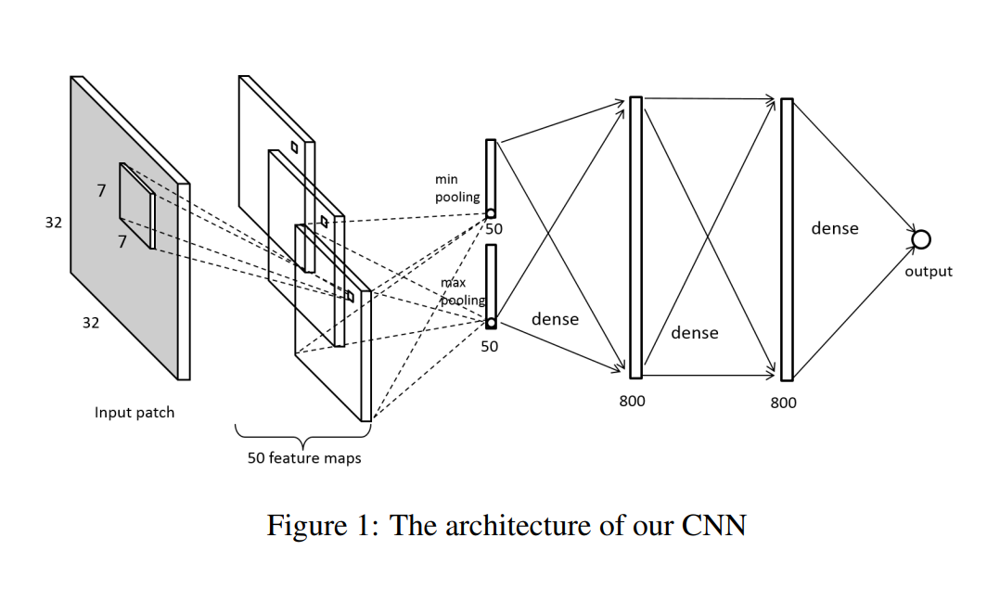
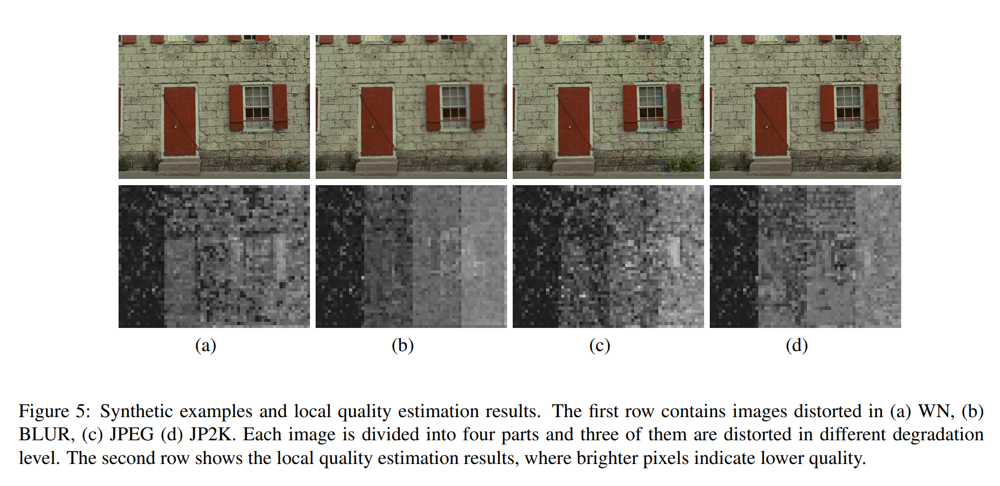

# Convolutional Neural Networks for No-Reference Image Quality Assessment
无参照图片质量评估(NR-IQA)

网络结构：

32 × 32 − 26 × 26 × 50 − 2 × 50 − 800 − 800 − 1 
池化同时采用了最大和最小池化（对应2×50的2）

训练：
从大图上裁下32×32的无交叠patches用来训练。训练的时候，给每个patch分配一个质量分数作为它的原图的gt分数。可以这样做的原因是训练中用到的图片有均匀的失真。测试的时候将预测的patch分数求平均获得图片级别的质量分数。
令$x_n$和$y_n$代表输入patch和它的gt分数，$f(x_n;w)$是$x_n$的预测分数，网络权重是$w$. 使用L1loss做loss函数。

Local Quality Estimation
我们的CNN可以衡量小图片patches的质量，所以可以用在检测高、低质量的局部区域，也可以给出整个图片的质量分数
首先从数据集中选出未失真的图片，垂直地分成四条，将2-4条换成失真后的同一张图片对应部分（三种不同的劣化水平）。然后用模型对这些生成的图片进行质量估计。用8为步长扫描16 × 16的patches并将预测的分数归一化到0-255之间用作可视化。Figure 5展示了图片的质量估计图。可以看到模型正确地区分了清晰部分和失真部分。
