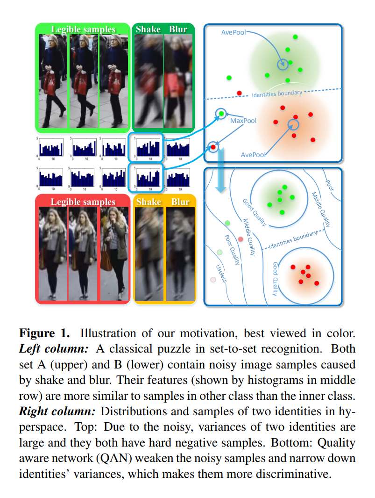
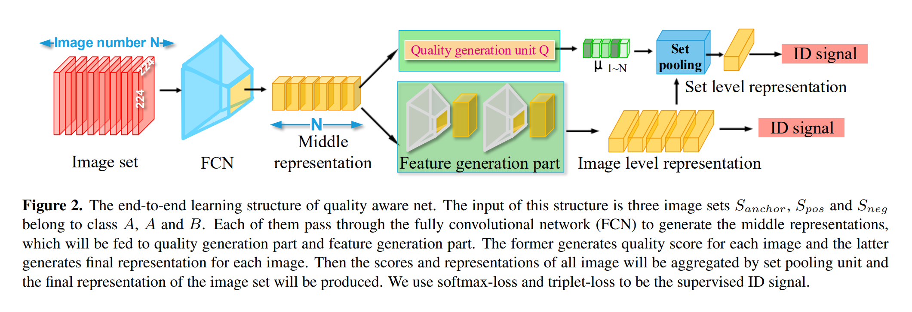
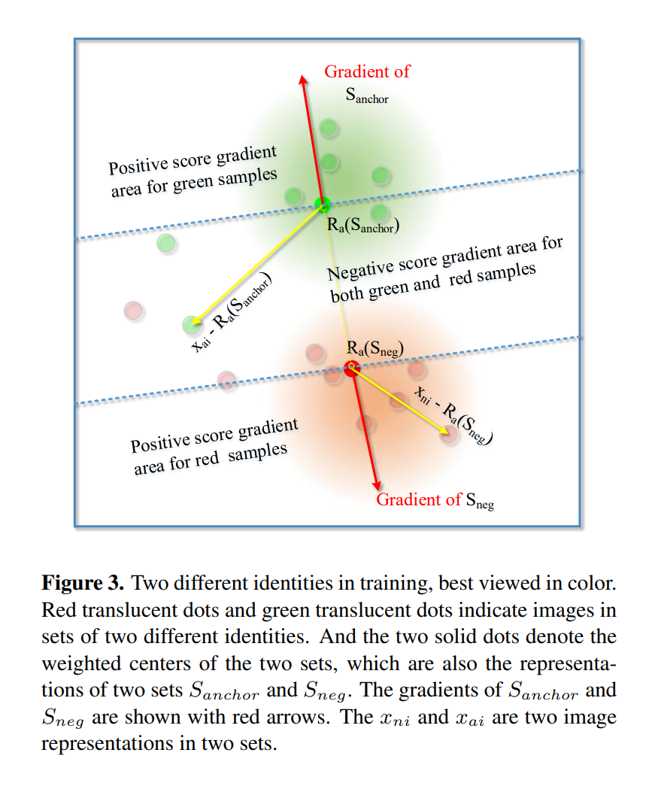

# Quality Aware Network for Set to Set Recognition

一个图片集合要比单张图片能够提供的信息更多。
为了能够对低质量图片具有更强的鲁棒性并且同时能够利用同一集合中其他图片提供的丰富信息，我们的基本思想是每一张图片都会聚合得到一个质量分数。因此提出一个质量感知网络(QAN)，它有两个分支，随后会合并到一起。第一个分支称为*特征生成部分*，用于提取特征，另一个称为*质量生成部分*用于预测质量分数。整个集合图片的特征随后会根据每张图片的质量分数通过最终的*集合池化单元*聚合到一起。
这种方法对于质量来说是无监督的。网络会自动给低质量图片低的质量分从而保证用于集合间识别的最终特征的质量。

## 3. Quality aware network(QAN)
本方法关注提升集合的embedding模型，将一个图片集合$S=\{I_1,I_2,...,I_N\}$映射成一个固定维度的表示，这样包含不同图片数量的图片集合之间就可以进行比较了。令$R_a(S), R_{I_i}$分别代表$S$和$I_i$的表达。$R_a(S)$由其包含的所有元素决定，则可以表示为：
$$
R_a(S)=\mathcal{F}(R_{I_1},R_{I_2},...,R_{I_N}) \qquad (1)
$$
$R_{I_i}$是通过特征提取得到的。$\mathcal{F}(\cdot)$是一个聚合函数，将一个可变长度的输入集合映射成与个固定维度的表达。难点在于如何找到最优的$\mathcal{F}(\cdot)$来从整个图片集合获取最有判别能力的表达。根据判别性与质量成正比的经验，将$\mathcal{F}(\cdot)$定义为：
$$
\mathcal{F}(R_{I_1},R_{I_2},...,R_{I_N})=\frac{\sum_{i=1}^N \mu_iR_{I_i}}{\sum_{i=1}^N\mu_i} \qquad (2) \\
\mu_i=Q(I_i) \qquad(3)
$$
其中$Q(I_i)$代表质量分数。也就是说每个集合的表达是其内部所有图像特征根据质量分数的加权和。

### 3.1. QAN for image set embedding
本文提出的方法，特征提取和聚合模块是通过一个端到端的卷积神经网络实现的，称为QAN，其网络结构如Figure 2所示。

中间位置两个分支分开。在第一个分支中，质量生成部分后接了一个集合池化单元，构成了聚合模块。在第二个分支中，特征生成部分生成图片的表达。在这个流程的一开始，所有图片都送入一个全卷积网络来生成中间的表达。然后QAN分成两个分支。上面那个是质量生成部分，是一个小cnn，用于生成质量分$\mu$. 下面的分支用来生成图片表示。最终通过集合池化单元进行聚合，再通过一个全连接层得到最终的表示$R_a(S)$. 

### 3.2. Training QAN without quality supervision
使用端到端的方式训练QAN. 
单张图片训练的时候，在特征生成部分后接一个全连接层，使用Softmax损失。
集合训练的时候，一个集合的表示$R_a(S)$通过以下loss进行监督：
$$
L_{veri}=\lVert R_a(S_a)-R_a(S_p) \rVert ^2- \lVert R_a(S_a)-R_a(S_n) \rVert ^2+\delta
$$
是一个Triplet loss.其中定义$S_a,S_p,S_n$分别为anchor集合、正样本集合和负样本集合。这个函数最小化类内样本间的差异，而softmax则不能保证因为它直接优化每个类别的概率，而非表示的辨别能力。
考虑集合池化操作，集合池化单元的梯度反向传播如下：
$$
\frac{\partial \mathcal{F}}{\partial R_{I_i}}=\frac{\partial R_a(S)}{\partial R_{I_i}}=\mu_i \qquad (5) \\
\frac{\partial \mathcal{F}}{\partial \mu_i}=\frac{\partial R_a(S)}{\partial \mu_i}=R_{I_i}-R_a(S) \qquad (6) \\
$$
那么最终loss的传播过程：
$$
\frac{\partial L_{veri}}{\partial R_{I_i}}=\frac{\partial R_a(S)}{\partial R_{I_i}} \cdot \frac{\partial L_{veri}}{\partial R_a(S)}=\frac{\partial L_{veri}}{\partial R_a(S)} \cdot \mu_i \qquad (7) \\
$$
$$
\frac{\partial L_{veri}}{\mu_i}=\frac{\partial R_a(S)}{\partial \mu_i} \cdot (\frac{\partial L_{veri}}{\partial R_a(S)})^T \qquad(8) \\ 
= \sum_{j=1}^D(\frac{\partial L_{veri}}{\partial R_a(S)_j}\cdot (x_{ij}-R_a(S)_j)) 
$$
其中D是表达的维度。

### 3.3. Mechanism for learning quality score

**Automatic gradient of $\mu$.** 集合池化单元经过反向传播后，$\mu_i$关于$L_{veri}$的梯度可以通过公式（8）计算得到，也就是$R_a(S)$和$R_{I_i}$梯度的点积。所以如果$\nabla R_a(S)$和$R_{I_i}$的角度在$(-90\degree, 90\degree)$的范围内，$\mu_i$的梯度就会是正的。例如Figure 3所示，$\nabla R_a(S_{neg})$和$x_{ni}-R_a(S_{neg})$的角度小于90，所以$x_{ni}$的质量分在这次反向传播之后就会变得更大。作为对比，$x_{ai}$的相对距离在$R_a(S_{anchor})$梯度的相反方向，这使它成为了一个困难样本，所以它的质量分会倾向于变得更小。显然，在集合梯度的“正确”方向上的样本总是得到更高的质量分数，而那些在“错误”方向的权重会变得更小。如Figure 3中，上部的绿色样本和下部的红色样本会持续地提升它们的质量，而在中间地带，样本的质量分会减小。这样$\mu_i$代表了第i张图片是一个好样本还是一个困难样本。

**$\mu$ regulates the attention of $R_{I_i}$.** 在公式(7)中，$R_{I_i}$的梯度与一个因子$\mu_i$一起通过Softmax损失进行梯度传播。由于大多数$\mu_i$较低的困难样本都是质量较差图片甚至全是背景噪声，其梯度中的$\mu_i$削弱了它们对整个模型的负面影响。这个机制帮助特征生成部分更加关注优质样本而忽略较差样本，有利于集合间识别。