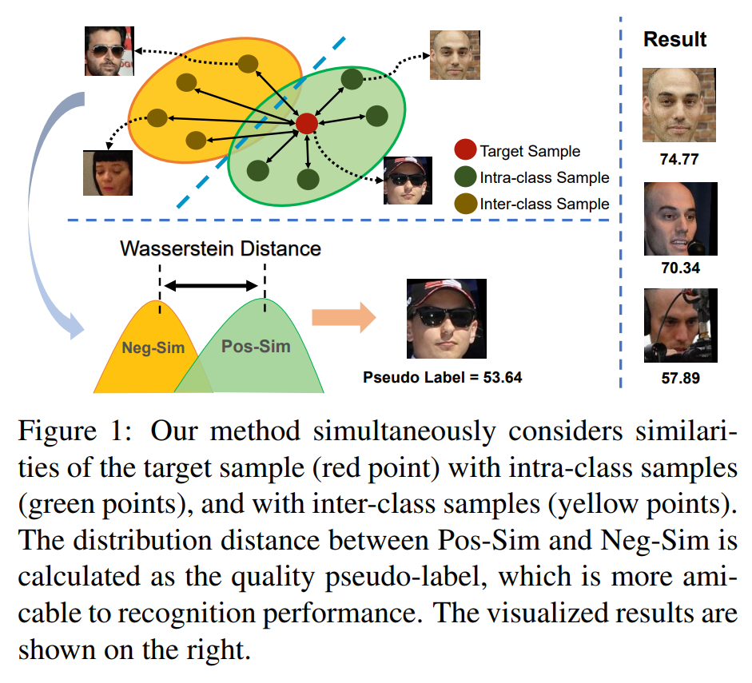
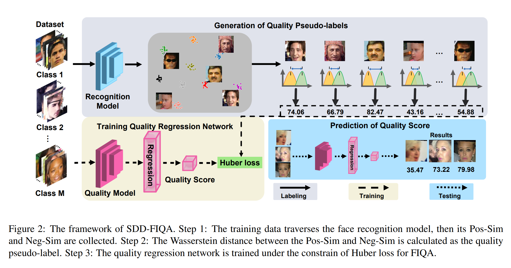

# SDD-FIQA: Unsupervised Face Image Quality Assessment with Similarity Distribution Distance

## Abstract

为了保证非限制场景下人脸识别系统的稳定性和识别可靠性，人脸图像质量评估(FIQA, Face Image Quality Assessment)方法应该同时考虑人脸图像的内在性质和可识别性。大多数已有方法将样本embedding不确定性或样本对的相似度作为质量分数，这样做只考虑了部分的类内信息，却忽略了用于估计人脸图像可识别性的宝贵的类间信息。本文提出，一张高质量的人脸图片应该与其同类样本相似而与类外样本不相似。因此提出一个新的无监督FIQA方法，用于人脸图片质量评估的相似度分布距离(SDD-FIQA, Similarity Distribution Distance for Face Image Quality Assessment). 本方法生成质量的伪标签用来计算类内相似度分布与类间相似度分布间的Wasserstein距离。然后使用这些质量分数伪标签来训练一个回归网络用作质量预测。

Figure 1

## 3. The Proposed SDD-FIQA

SDD-FIQA的架构如Figure 2所示

假设$\mathcal{X,Y,F}$分别代表人脸图片集、id标签集和识别embedding集。构建一个三元组数据集$D=\{(x_1,y_1,f(x_1)),(x_2,y_2,f(x_2)),...,(x_n,y_n,f(x_n))\} \subset \mathcal{X \times Y \times F}.$用同一id的样本$x_i,y_i$构建一个正样本对，两个不同id的样本构建一个负样本对。对每个训练样本$x_i$，用$\mathcal{S}_{x_i}^P=\{s_{x_i}^P=\langle f(x_i), f(x_j) \rangle | y_i=y_j\}$和$\mathcal{S}_{x_i}^N=\{s_{x_i}^N=\langle f(x_i), f(x_j) \rangle | y_i \ne y_j\}$分别表示正样本对和负样本对的相似度集合，其中$\langle f(x_i), f(x_j) \rangle$代表余弦相似度。

### 3.1. Generation of Quality Pseudo-labels

本节介绍人脸图像质量和人脸识别性能间的联系。证明这种关系可以通过EVRC(Error Versus Reject Curve)推断得到。假设$\mathcal{S_X}^P=\{\mathcal{S}_{x_i}^P\}_{i=1}^n$和$\mathcal{S_X}^N=\{\mathcal{S}_{x_i}^N\}_{i=1}^n$分别是正样本和负样本的相似度集合。$\mathcal{S_{X|<\xi}}^P$代表$\mathcal{S_X}^P$中相似度小于阈值$\xi$的子集。$\mathcal{S_{X|>\xi}}^P$代表$\mathcal{S_X}^P$中相似度大于阈值$\xi$的子集，$\xi \in [-1,1]$. 那么误匹配率(FMR, False Match Rate)和误未匹配率(FNMR, False No-Match Rate)可以分别定义为
$$
fmr=R_{fm}(\mathcal{X}, \xi)=\frac{|\mathcal{S_{X|>\xi}^\mathit{N}}|}{|\mathcal{S_X^\mathit{N}}|} \qquad (1) \\
fnmr=R_{nfm}(\mathcal{X}, \xi)=\frac{|\mathcal{S_{X|<\xi}^\mathit{P}}|}{|\mathcal{S_X^\mathit{P}}|} \qquad (2)
$$
其中$|\cdot|$代表集合基数。假设$\mathcal{X}_{| \sigma}^{Sub}$是$\mathcal{X}$中按$\sigma$百分比的最高质量人类样本的子集。EVRC的目的是衡量在一个固定的FMR下，$\sigma$和$\mathcal{X}_{| \sigma}^{Sub}$的FNMR之间的关系。注意到由于FMR需要固定，阈值$\xi$需要根据$\mathcal{X}_{| \sigma}^{Sub}$不停变化。根据EVRC度量，我们发现图像质量可以通过FNMR下降的梯度来描述。换句话说，如果一个样本$x_i$被从人脸数据集中排除，那么FNMR下降的程度越剧烈，就代表$x_i$的质量越低。受此启发，提出计算FNMR的差值作为$x_i$的伪标签，表示为$Q_{x_i}$
$$
Q_{x_i}=R_{fnm}(\mathcal{X, \xi_X})-R_{fnm}(\mathcal{X}_{|-x_i}^{Sub}, \xi_{\mathcal{X}_{|-x_i}^{Sub}}), \qquad (3)
$$
其中$\mathcal{X}_{|-x_i}^{Sub}$是$\mathcal{X}$排除了$x_i$的子集，$\xi_{\mathcal{X}}$和$\xi_{\mathcal{X}_{|-x_i}^{Sub}}$分别代表$\mathcal{X}$和$\mathcal{X}_{|-x_i}^{Sub}$的阈值。可以看到对于给定的$\mathcal{X}$，$Q_{x_i}$只由$x_i$和阈值$\xi$决定。由于FMR是固定的，阈值的公式为$\xi=R_{fm}^{-1}(\mathcal{X}, fmr)$，其中$R_{fm}^{-1}(\cdot)$代表$R_{fm}(\cdot)$的反函数。客观来说，$x_i$的实际质量是与FMR相独立的。但是通过公式（3），我们只能获得一个在固定FMR下的经验质量分数。从统计学的角度来看，应该用FMR上$Q_{x_i}$的期望来近似实际质量分数。与此同时，可以将FMR视为一个随机变量在$[0,1]$上的均匀分布。因此，$Q_{x_i}$可重新表示为：
$$
Q_{x_i}=\int_0^1[R_{fnm}(\mathcal{X},R_{fm}^{-1}(\mathcal{X},fmr)) \\
-R_{fnm}(\mathcal{X}_{|-x_i}^{Sub}, R_{fm}^{-1}(\mathcal{X}_{|-x_i}^{Sub}, fmr))]d(fmr).  \qquad (4)
$$
。。。

总之可以得到
$$
Q_{x_i}=\textbf{F}(\mathcal{S}_{x_i}^P, \mathcal{S}_{x_i}^N)  \qquad (6)
$$
其中$\textbf{F}(\cdot)$是映射函数。

FIQ可以通过SDD描述，例如一张高质量的人脸图片是容易识别的。意味着它与类内样本距离近，与类外样本距离远。换句话说，正类相似度和负类相似度间的距离很大。反过来，低质量人脸图片会得到一个小的SDD，如Figure 3所示。基于以上分析，提出利用Wasserstein度量来衡量SDD和$Q_{x_i}$，表示为
$$
Q_{x_i}=\mathbb{WD}(\mathcal{S}_{x_i}^P \Vert \mathcal{S}_{x_i}^N) \\
= \inf_{\gamma\in \Pi(S_{x_i}^P,S_{x_i}^N)} \mathbb{E}_{(S_{x_i}^P,S_{x_i}^N)\sim\gamma}[\Vert s_{x_i}^P - s_{x_i}^N \Vert], \qquad (7)
$$
其中$\mathbb{WD}(\cdot)$代表Wasserstein距离，$\Pi(S_{x_i}^P,S_{x_i}^N)$代表所有边缘分布为$S_{x_i}^P$和$S_{x_i}^N$的联合分布$\gamma(s_{x_i}, s_{y_i})$的集合。

。。。