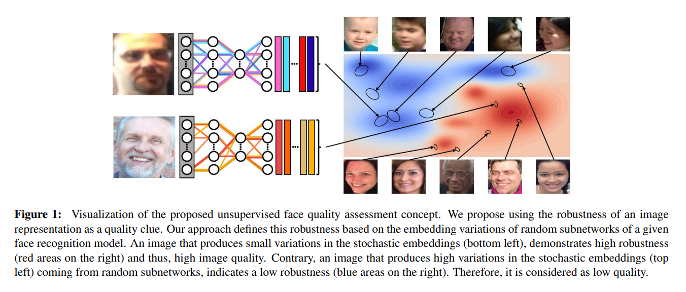
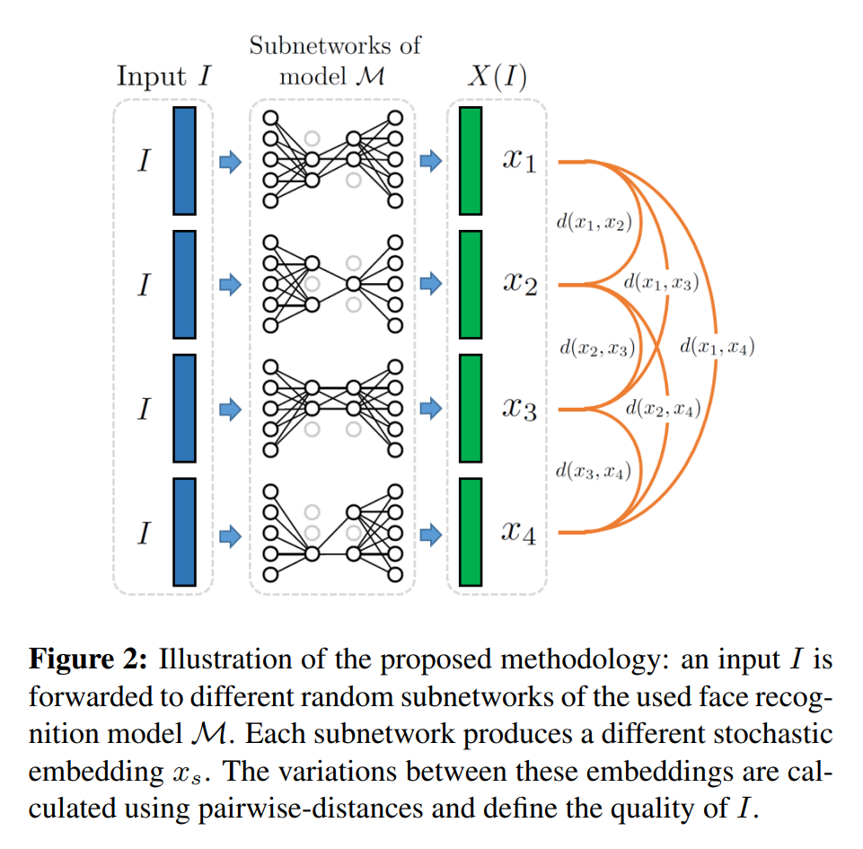
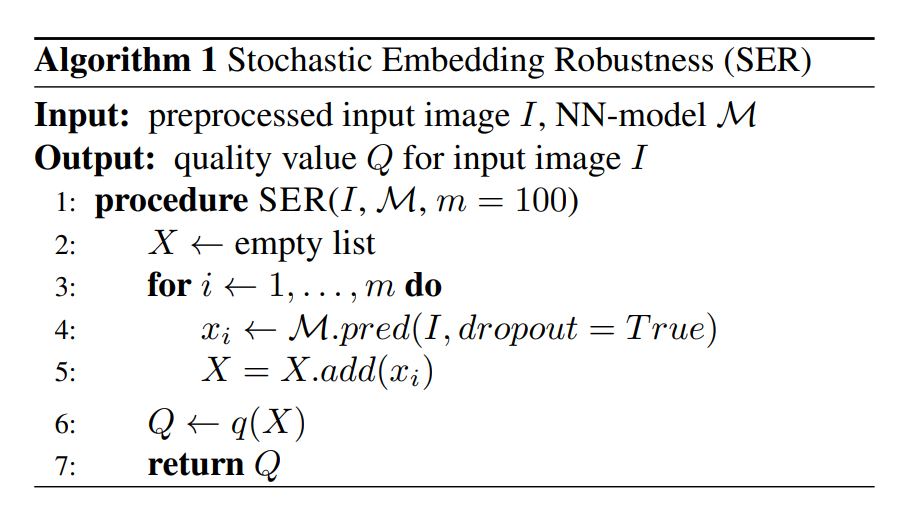
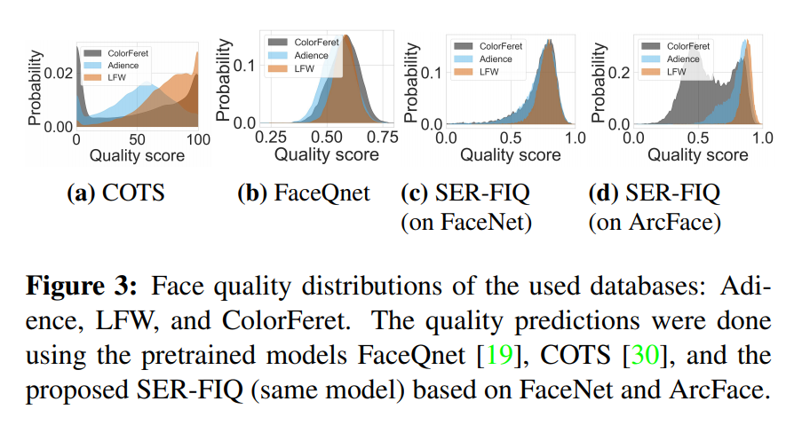
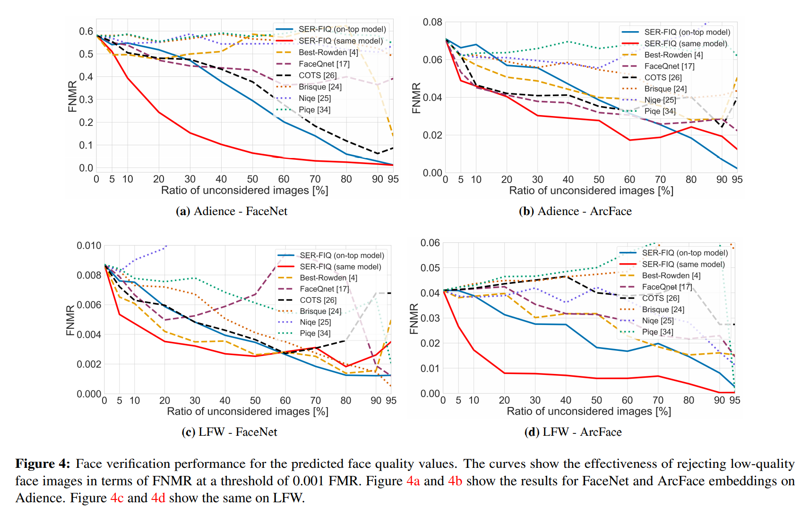
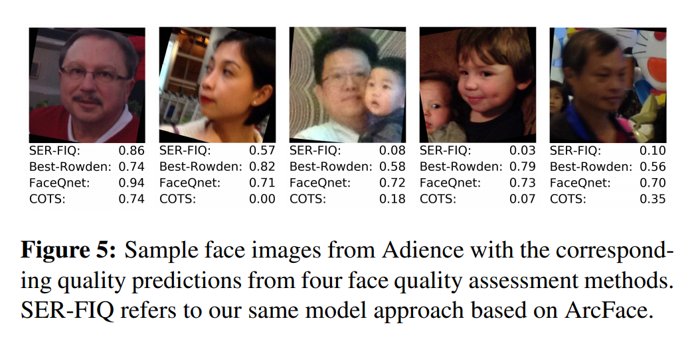

# SER-FIQ: Unsupervised Estimation of Face Image Quality Based on Stochastic Embedding Robustness

基于随机嵌入（特征）鲁棒性的无监督人脸质量估计

提议使用一张图片表达的鲁棒性作为质量线索。

***Abstract***

人脸图像质量是实现高质量人脸识别系统的一个重要的因素。人脸质量评估的目的在于估计一张人脸图片适合用于识别的程度。之前的方法使用有监督方案，需要人工标注质量值。但是这样的标注机制容易出错，因为并没有对质量水平的一个明确定义，也无法知道使用的人脸识别系统的最好特性。为了避免使用不准确的质量标签，我们提出一个新的基于任意人脸识别模型的概念来衡量人脸质量。通过判定一个人脸模型的随机子网络生成的embedding差异，一个样本表达的鲁棒性，因此可以估计其质量。

## 1. INTRODUCTION

由于大众接受程度较高且不需要用户主动配合，人脸图像是使用最多的生物识别模式之一。对于受控场景，当前的人脸识别系统能达到高准确率的表现。但是一些最有价值的人脸识别系统是在非限制环境下工作，因此需要解决较大差异引起的识别准确率的下降。这些差异包括照片拍摄的状态（如光照情况、背景、模糊和低分辨率），人脸因素（如姿态、遮挡和表情）和部署的人脸识别系统本身的偏差。因为这些差异会导致识别效果大幅度下降，则需要提出解决办法。

生物识别的效果由其样本质量决定。生物样本的质量定义为为了识别目的的样本使用。在进行匹配前自动预测人脸质量对于很多应用来说都是有益的。这样人脸识别系统的注册会更健壮。在否定性鉴别系统中，可以防止攻击者通过提供一张低质量图片来入侵系统。而且可以在提供多张图片或多个生物模式的前提下实现基于质量的融合。

当前人脸质量评估的解决方案需要带质量标签的训练数据，标签来源于人脸视角或来源于对照评分。这种质量评估衡量标准的定义是不明确的。人类也许并不知道所使用的人脸识别系统最好的特性是什么。另一方面，基于分数对比的自动标签代表两个样本的相关性，因此一个低质量的样本也许会对另一个样本的质量标签产生负面影响。

本文通过调查随机embeddings的鲁棒性提出一个新的无监督人脸质量评估概念。我们的方法在其embedding空间上基于其鲁棒性衡量一张图片的质量。

Figure 1展示了其工作原理

*提出的无监督人脸质量评估概念的可视化。我们提出使用一张图像表达的鲁棒性作为其质量的线索。我们的方法在给定的人脸识别模型的随机子网络的embedding特征的差异的基础上定义了这个鲁棒性。一张随机embedding特征差异较小的图片（左下）展示了高鲁棒性（右边的红色区域）也因此具有高的图片质量。反之，一张随机子网络输出的随机embedding特征差异较大的图片（左上）代表低的鲁棒性（右边蓝色区域）。因此认为它是一张低质量图片。*

## 2. Related work

为了保证人脸图像质量提出了一些标准。这些标准中，质量分为基于图像的质量（如姿态，表情，光照，遮挡）和基于对物体的质量（如配件）。这些标准影响了很多近些年提出的人脸质量评估方法。

基于图像质量因素分析的方法定义了人脸不对称性的质量度量，提出竖直边缘密度作为一项质量的衡量指标来获取姿态的变化信息，或在亮度失真与一张已知图片做对比进行衡量。但是这些方法需要人为地考虑每一个可能的因素，由于人类也许无法得知人脸识别系统最好的特性，最近更多的研究关注基于学习的方法。

## 3. Our approach

人脸质量评估的目的是估计一张人脸图像对于人脸识别的适用程度。一张人脸图像的质量应该与其应有的识别效果相对应。本作中，我们的人脸图片质量的定义以对应图片的深度学习embedding为基础。计算一个人脸识别模型的随机的子网络输出的embeddings的差异，我们的方法将这些差异的量级定义为一个鲁棒的度量，亦即图像质量。Figure 2展示了这一方法。

### 3.1. Sample-quality estimation

我们的方法使用一个人脸识别模型$\mathcal{M}$来预测给定人脸图像$I$的人脸质量$Q(I)$. 人脸识别模型需要使用dropout训练且其目的为提取能够良好区分id的embedding特征。为了获得$I$的基于鲁棒性的质量估计，在$\mathcal{M}$上通过使用不同dropout模式的随机前向传播生成$m=100$个随机embedding特征。$m$的选择取决于时间复杂度和质量衡量稳定性间的trade-off. 每一次随机前向传播都应用一个不同的dropout模式（预测期间）生成$\mathcal{M}$的一个子网络。每一个子网络生成人脸的一个随机embedding向量$x_s$.这些随机embedding向量放到一个集合中$X(I)=\{x_s\}_{s\in\{1,2,...,m\}}$. 我们将图像$I$对应的人脸质量定义为全部embedding向量对间的负的平均欧几里得距离$d(x_i,x_j)$的sigmoid值，$(x_i,x_j)\in X \times X$. 
$$
q(X(I))=2\sigma\bigg(-\frac{2}{m^2}\sum\limits_{i<j}d(x_i,x_j)\bigg), \quad\quad\quad(1)
$$

sigmoid函数$\sigma(\cdot)$保证$q\in[0,1]$.

由于已经证明在一个网络上重复使用dropout可以近似高斯过程的不确定性，则欧几里得距离是计算$d(x_i,x_j)$的一个合适的选择。随机embedding向量集合$X$的差异较大意味着表达的鲁棒性较差，也就代表低样本质量$q$. $X$中较低的差异意味着在embedding空间中有较高的鲁棒性，可以认为是高样本质量$q$. Algorithm 1展示了质量预测策略

### 3.2. Properties

SER-FIQ的目标是从识别任务的视角来估计人脸图片的质量，也许和估计图片质量的视角不一样。一张图片如果不受多种差异影响（这里由dropout引起）能够生成相对稳定的与id对应的embedding特征向量，那么它就是一张在识别任务中有较高可用性的图片，前提是识别网络训练目标是在类内鲁棒。

人脸识别算法训练的目标是学习到鲁棒的表示来增加类间距，降低类内距。假设一个人脸识别网络使用dropout训练且一个样本的质量与其embedding特征的鲁棒性相关，不同子网络可以从基础模型通过处理不同dropout模式生成。子网络间的一致性可以用于估计embedding特征的鲁棒性，因此也可用于估计质量。如果$m$个子网络生成相似的输出（高一致性），则这些子网络之间的差异（随机embedding特征集合$X$）就小。因此，这个embedding特征的鲁棒性，亦即这个样本的质量就高。相反，如果$m$个子网络生成不相似的表达（低一致性），随机子网络的差异就大。因此embedding空间的鲁棒性就低，样本质量也可以认为是低的。

我们的方法只有一个参数$m$，随机前向传播的数量。这个参数可以解释为一个蒙特卡洛模拟的步数，并控制质量预测的稳定性。较大的$m$可以得到更稳定的质量估计。由于本方法的计算时间$t=O(m^2)$根据$m$是平方增长的，因此取值不应过大。但是我们的方法可以抵消这一问题，并能实时运行，因为它是高度并行的，而且可以通过仅在最后几层重复随机前向传播过程大幅度降低计算量。

与之前的方法相比，我们的方法训练时不需要质量标签。而且如果使用的人脸识别系统训练时用到dropout，则可使用同一个网络判定embedding特征的鲁棒性，也就是样本质量。这样做的好处是可以完全避免训练而且质量预测捕获正在使用的人脸识别模型的决策模式和偏置。因此强烈推荐使用部署的人脸识别模型做质量评估任务。

## 4. Experimental setup

**Databases**

三个公开数据集：ColorFeret（1199个id的14126张高分辨率人脸图像，限制场景），Adience（2284个id的26580张图像，非限制场景）和LFW（5749个id的13233张图像）。后两个包含包括光照、位置、对焦、模糊、姿态和遮挡等在内的大量差异。

**Evaluation metrics**

使用error versus reject曲线来衡量人脸质量评估的表现。这些曲线展示了一个在少量unconsidered人脸图片上的验证错误率。unconsidered图像是那些预测的质量评分最低的图片，错误率用剩下的图片计算。error versus reject曲线能指出当提高unconsidered图像比例时验证错误持续减少时好的质量估计。与error versus quality-threshold曲线相反，这个过程允许公平地比较多个人脸质量评估算法，因为其与质量预测的范围无关。

error versus reject曲线中的人脸验证错误率使用FNMR（false non-match rate）和FMR（fixed false match rate）并作为EER（equal error rate）。EER等于阈值的FMR，FMR=1-FNMR，FMR是用于验证效果的单值指示器。

**Face recognition network**

要从一张人脸图像中获得人脸embedding特征，这张图像需要经过对齐、缩放和剪裁。经过预处理的图像传入一个人脸识别模型。本作中使用两个人脸识别模型，FaceNet和ArcFace.两个模型都用MS1M数据集进行训练。id验证通过比较两个embedding特征的余弦相似度来实现。

**On-top model preparation**

要应用我们的质量评估方法，需要一个使用dropout训练的识别模型。不然需要在现有模型上（前，top）添加一个带dropout的模型。使用我们的方法最直接的办法是用一个预训练的识别模型，在预测时只用最后几层重复进行随机前向传播。这样做甚至比训练一个定制的网络效果要好，因为验证决策，也就是质量评估决策，是在一个共享的embedding空间中完成的。

为了展示我们的方法可以应用于任意确定的人脸识别系统，在我们的实验中展示了两种实现方式：(a) 训练一个小的定制网络加在人脸识别系统上，称为***SER-FIQ(on-top model)***，(b) 使用部署的模型做质量评估，称为***SER-FIQ(same model)***.

***SER-FIQ(on-top model)***的结构经过优化，使其输出的embedding特征在ColorFeret上与FaceNet的embedding特征的EER相似。它由5层组成，分别有$n_{emb}/128/512/n_{emb}/n_{ids}$个维度。两个内部层有128和512个维度。最后一层的维度与训练时的id数$n_{ids}$相等，且旨在训练时使用。所有层都有dropout，推荐概率为$p_d=0.5$，且使用tanh作为激活。这个小网络使用AdaDelta优化器训练，batchsize为1024，训练100个epochs. 由于网络输入和输出层的尺寸根据使用的人脸embedding特征不同而不同，所以为FaceNet选用学习率$\alpha_{FN}=10^{-1}$,为embedding特征维度更高的Arcface选用学习率$\alpha_{AF}=10^{-4}$. loss函数选用BCE用作分类loss.

**Investigations**

为了调查人脸质量评估的泛化能力，我们在交叉数据集上做了实验。在ColorFeret上进行训练，让模型在受控场景下学习分布。在两个非限制场景的数据集上，Adience和LFW，进行测试。实验所用的embedding特征来自于FaceNet和ArcFace模型。

为了使实验结果更好理解，我们与六种baseline方法进行比较。其中三种是CV领域广为人知的无参考图像质量度量方法：Brisque，Niqe和Piqe. 另外三种是学术界和工业界的sota人脸质量评估方法。

我们提出的方法有两种设置，***SER-FIQ(on-top model)***和***SER-FIQ(same model)***. ***SER-FIQ(same model)***说明我们的无监督方法可用于任何人脸识别系统。***SER-FIQ(same model)***使用部署的人脸识别模型进行质量评估。后一种情况我们只在最后两层使用随机前向传播。

**Database face quality rating**

为了验证数据集的选择，Figure 3展示了使用四种预训练的人脸质量评估模型预测得到的人脸质量分布。

ColorFeret是在高度限制场景下拍摄的图片，其质量都很高。但是其中包含一些非正脸头部姿态，对于COTS和SER-FIQ(on FaceNet)来说是低质量图片。因为这些受限的变量，我们选择ColorFeret作为训练集。Adience和LFW是非限制场景数据集，对于人脸质量衡量而言，其中大多数人脸图像的质量都远称不上完美，所以将其作为测试集。

## 5. Results

在三个工况点对实验进行验证以考察人脸质量评估在更宽范围潜在应用上的表现。采用欧盟边境管理局欧洲边境和海岸警卫机构（European Border and Coast Guard Agency Frontex）的最好的实践准则，在Figure 4中展示人脸质量评估在FMR为0.001下的表现。Figure 6展示了FMR为0.01下的表现，Figure 7展示了广泛使用的EER下的人脸质量评估表现。而且Figure 5展示了样本照片和各自对应的质量预测值。

**No-reference image quality approaches**

为了了解不同衡量方式对于图片质量评估任务的重要性，我们衡量了三种无对照质量指标：Brisque，Niqe和Piqe.

*****

基于学习的无监督质量评估方法

基于高质量人脸图像embedding特征向量鲁棒性更高的假设。

用一个人脸识别模型多次随机前向传播（随机dropout）同一张人脸图片，计算多次特征向量的欧氏距离，越大说明人脸质量越差。