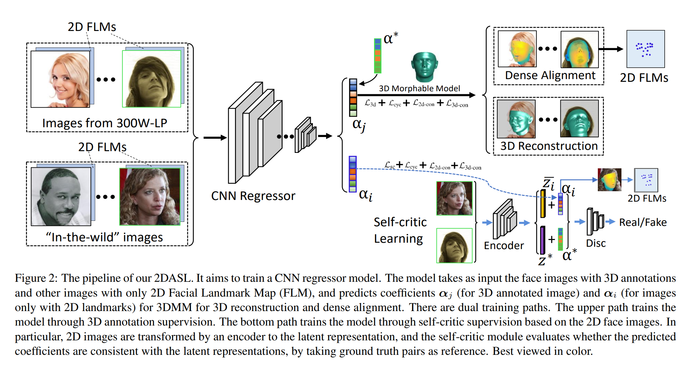

# 3D Face Reconstruction from A Single Image Assisted by 2D Face Images in the Wild
目录：
[toc]

## Abstract
通常的办法是利用基于CNN的3D人脸模型回归得到3DMM，但是由于缺少3D标注的训练数据，所以这种方法的性能没办法完全发挥出来。为了缓解这一问题，提出一个新的2D辅助自监督学习方法(2D-assisted self-supervised learning, 2DASL)，可以有效利用2D人脸图片，大幅度提升3D人脸模型的学习效率。具体来说，将离散的2D面部关键点作为额外的信息，2DASL引入四个新的自监督范式将2D和3D关键点的预测作为自映射过程，包括2D和3D关键点的自预测的一致性，2D关键点预测的循环一致性以及基于关键点预测的3DMM系数预测的self-critic

## 1. Introduction
CNN方法需要大量的训练数据，尽管可以获取到一些公开的数据集，如300W-LP，但这种数据集在人脸外观、表情、遮挡以及环境信息等方面仍缺少多样性，限制了3D人脸回归模型的泛化性能。
为了解决这一问题，提出一个方法利用2D图片提升3D人脸模型的性能。
由于2D图片没有3D标注信息，所以无法直接利用。设计了一个新的自监督学习方法，使利用2D图片的弱监督来训练3D人脸模型成为可能。具体来说，该方法将离散的2D关键点标注作为输入然后对2D-to-2D和3D-to-3D自映射过程的平衡作为监督。

## 2. Related work
blahblahblah

## 3. Proposed method
### 3.1. 3D morphable model
3DMM渲染3D面部形状$\textbf{S}\in \mathbb{R}^{3N}$，其中包含N个顶点在一组PCA基的线性组合的3D坐标。使用来自于BFM(Basel Face Model)的40个基生成面部形状组成部分，用来自Face Warehouse数据集的10个基生成面部表情部分。渲染的3D人脸形状为：
$$
\mathrm{\textbf{S}}=\bar{\mathrm{\textbf{S}}}+\mathrm{\textbf{A}}_{s}\alpha_{s}+\mathrm{\textbf{A}}_{exp}\alpha_{exp}, \quad\quad\quad(3)
$$
其中$\bar{\mathrm{\textbf{S}}} \in \mathbb{R}^{3N}$是平均形状，$\mathrm{\textbf{A}}_{s} \in \mathbb{R}^{3N\times 40}$是在3D人脸扫描上巡礼啊你的形状主要基，$\alpha_{s}\in \mathbb{R}^{40}$是形状表示系数；$\mathrm{\textbf{A}}_{exp} \in \mathbb{R}^{3N\times 10}$是表情主要基，$\alpha_{exp}\in \mathbb{R}^{10}$代表对应的表情系数。基于单张图片的3D人脸建模的任务就是预测用于从一张2D图片渲染得到3D人脸的系数$\alpha_{s}, \alpha_{exp}$.

得到3D人脸形状$\mathrm{\textbf{S}}$之后，就可以通过缩放正交投影将其投影到2D平面来生成一个特定视角的2D人脸：
$$
\textbf{V}=f*\textbf{Pr} * \Pi * \textbf{S}+\textbf{t}
$$
其中$\textbf{V}$存储3D顶点投影到2D平面的2D坐标，生成模型顶点的2D位置，$f$是缩放因子，$\mathrm{\textbf{Pr}}$是正交投影矩阵
$$
\begin{pmatrix} 
1 & 0 & 0 \\ 
0 & 1 & 0
\end{pmatrix}
$$
$\Pi$是有9个参数的投影矩阵，$\textbf{t}$是平移向量。总共就有62个参数$\alpha=[f,\textbf{t},\Pi,\alpha_{s},\alpha_{exp}]$

### 3.2. Model overview
如Figure 2中所示，2DASL模型由3部分组成：
* 一个基于CNN的回归器用于从输入的2D图片预测3DMM系数
* 一个编码器将输入图片变换成潜在的表示
* 一个self-critic评估输入对（潜在表示和3DMM系数）是否一致

