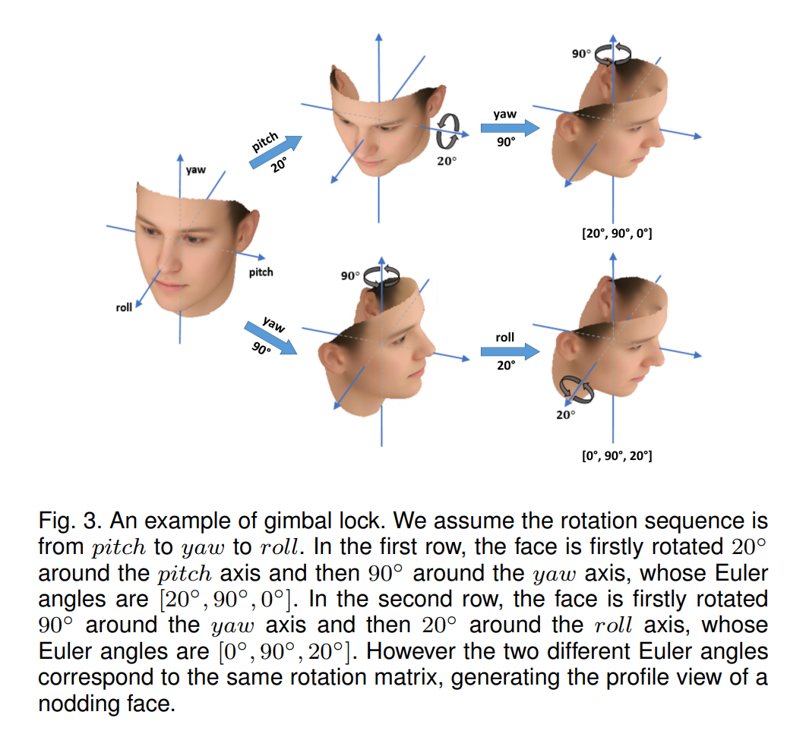

# Face Alignment in Full Pose Range: A 3D Total Solution
目录：
[toc]

人脸对齐，是将一张（人脸）图片与一个人脸模型对齐并提取人脸像素的语义信息，已经成为CV领域的一个重要方向。但是大多数算法是针对中小姿态（偏航角小于45°）人脸设计的，无法对齐到90°的大姿态角人脸。有三个挑战，第一，常用的关键点人脸模型假设所有关键点都可见，因此不适用于大姿态情况；第二，从正脸到侧脸，大姿态变化下人脸的外观变化很剧烈；第三，因为不可见关键点需要猜测其位置，所以大姿态关键点定位很困难。本文提出一个新对齐框架来解决这三个挑战，称为3D Dense Face Alignment(3DDFA)，其中通过级联卷积神经网络将一个稠密3D可变形模型(3D Morphable Model, 3DMM)拟合到图片中。还通过使用3D信息来生成侧脸图片以保证训练样本数量充足。

## 1 Introduction

人脸对齐是一个通过移动和变形将一个人脸模型放到图片中的过程，以便于提取人脸像素的语义信息。一般来说，人脸对齐是通过关键点检测来实现的，定位一组离散的面部基准点。但是大多数现有方法都是针对中等姿态，假设偏航角小于45°且所有关键点可见。当偏航角范围扩大到90°时就变出现巨大的挑战，这些挑战主要可以分成三类：

* **Modelling：** 关键点形状模型假设每个关键点都可以通过其独特的视觉模式健壮地检测到。但是非正脸的情况下，有一些关键点由于自遮挡的原因而变得不可见。中等姿态下这个问题可以通过将轮廓上的关键点移动到阴影中来解决，称为landmark marching.但是大姿态情况下，半张脸都被遮挡住了，有些关键点完全不可见且无法检测。反过来，关键点可能丢失语义信息，导致模型失效。
* **Fitting：** 另一个全姿态人脸对齐的挑战是由从正脸到侧脸夸张的外观差异而导致的。级联线性回归和传统非线性模型无法以统一的方式适应这些复杂的差异。
* **Training Data：** 带标注的数据时所有监督学习算法的基础。但是手工标注大姿态人脸很麻烦，因为被遮挡的关键点位置得靠猜，对于大多数人来说几乎做不到。以至于几乎所有人脸对齐的公共数据集（如AFW，LFPW，HELEN，IBUG等）都只包含中等姿态。少数大姿态数据集（如AFLW）只包含可见关键点，不可见点不明确，难以训练一个统一的人脸对齐模型

本文要解决全姿态范围的人脸对齐问题，偏航角可在±90°范围内变化。我们相信人脸对齐并不仅仅是一个2D问题，因为自遮挡和大外观差异是由3D空间内人脸旋转导致的，结合3D信息就可以解决这个问题。具体来说，我们将人脸模型从2D离散关键点升级到稠密3D可变形模型(3DMM)并将人脸对齐任务视为一个3DMM匹配任务。优化概念就从关键点位置变成姿态（尺度，旋转和平移）和形变（形状和表情）参数。我们称这个新的人脸对齐框架为3D Dense Face Alignment(3DDFA).为了实现3DDFA，提出将级联回归和CNN结合。这需要引入一个新的输入特征，同时满足级联方式和卷积方式，以及一个可以对3DMM模型的先验参数进行建模的新的代价函数。
三个挑战：
1. 自遮挡问题，使用3DMM解决
2. 大姿态下的外观差异问题，提出一种级联CNN作为回归器，提出一个新的代价函数
3. 3DDFA的训练问题，数据集

## 2 Related Works

人脸对齐可以总结成将一个人脸模型与图像相匹配。因此也就有两个基本问题：如何将脸部形状建模和如何估计模型的参数。

### 2.1 Face Model

传统的人脸形状表示时使用一组离散的2D基准点集合。形状变化可由子空间分析（如PCA）进行建模。但是这个2D子空间模型只能应对小范围姿态变化，因为非线性平面外旋转无法在线性空间内很好的表示。为了解决姿态变化问题，提出了一些改进（如Kernel PCA和Bayesian Mixture Model）来在子空间模型中引入非线性元素。Blanz et al.提出3D形变模型（3DMM），在一组3D扫描人脸上使用PCA。通过结合3D信息，3DMM将非线性平面外变换与PCA子空间解耦。剩下的形状和表情变化表现出高度线性特性，可以通过PCA建模。与2D模型相比，3DMM将刚性（姿态）和非刚性（形状和表情）变换分离开，使其可以覆盖各种形状差异并同时保持形状先验。另外3DMM可以轻松估计点的可见性，提供解决侧脸自遮挡的重要线索。

### 2.2 Model Fitting

大多数匹配（fitting）方法可以分成两大类：基于匹配模板和基于回归。匹配模板方法使用一个面部模型来匹配图像。例如Active Appearance Model(AAM)和Analysis-by-Synthesis 3DMM Fitting通过最小化模型外观和输入图像间差异来模拟面部图像的生成过程并完成对齐。Active Shape Model(ASM)和Constrained Local Model(CLM)为每个关键点建立一个模板并使用PCA形状模型来限制匹配结果。TSPM和CDM使用part based model和DPM-like方法对齐人脸。一般来说，模板匹配法的效果取决于图像的模式是否在面部外观模型的多种表示之中。因此，在非限制环境下由于外观变化范围太大且复杂程度太高，导致这种方法的鲁棒性有限。

基于回归的方法通过回归图像特征来估计模型参数。最近提出的级联回归在领域内很受欢迎，可以总结为：
$$
\mathrm{\textbf{p}}^{k+1}=\mathrm{\textbf{p}}^k+Reg^k(Fea(\mathrm{\textbf{I}},\mathrm{\textbf{p}}^k)). \quad\quad\quad(1)
$$
其中形状参数$\mathrm{\textbf{p}}^k$和第$k$次循环由在外形索引特征(shape indexed feature)$Fea$上执行的回归$Reg^k$来更新，$Fea$由图像$\textbf{I}$和当前参数$\mathrm{\textbf{p}}^k$来决定。回归$Reg^k$展现了一个重要的“反馈”特性，其输入特征$Fea(\textbf{I},\mathrm{\textbf{p}})$可由其输出来更新，因为每个循环结束后都会更新$\mathrm{\textbf{p}}$.有了这一特性，一系列弱回归器可以通过级联的方式逐步减小对齐误差。

### 2.3 Large Pose Face Alignment

尽管人脸对齐领域已经有了很多伟大成就，但是绝大多数SOTA方法在大姿态场景下适应能力不够强，因为要在关键点位移和对应图像特征间建立连接，而图像又有可能是自遮挡的。在2D方法中，一个通用解决方案是多视角框架，对不同视角使用不同关键点设置。在AAM，DAM，和DPM都用到这种方案，将人脸与不同模型进行匹配，哪个可能性最大就选作最终结果。但是由于要对每个视角进行测试，计算量很高。另一个方法是明确估计出关键点的可见性，将被遮挡的特征的贡献减小。尽管如此，遮挡估计本身仍是一个充满挑战的任务，处理多维度特征也仍然是一个不适定问题。

与2D方法不同，3D人脸对齐的目标是将一个3DMM与2D图像相匹配。通过与3D信息相结合，3DMM可以内在地提供每一个模型店的可见性而无需任何额外估计，使处理自遮挡点成为可能。原始3DMM匹配方法通过最小化3D模型与图像间的像素级差异将二者相匹配，并对面部模型进行渲染。由于只匹配可见顶点，这是第一个可以覆盖任意姿态的方法，但是它的计算量很大。最近，基于回归的3DMM匹配可以用来提升效率，它通过在3D投影的关键点上对特征进行回归来估计参数。不过这些方法面临两个主要挑战。第一个，投影后的3D关键点可能被自遮挡，从而丢失它们的图像模式，使特征不再具有姿态不变性。第二个，3DMM的参数再匹配的时候有不同的优先级，尽管现有的基于回归的方法无差别地对待它们。结果就是，直接最小化参数损失也许是次优的，因为更小的参数误差并不一定与更小的对齐误差相等。

## 3 3D Dense Face Alignment(3DDFA)

用一个CNN作为公式(1)中的回归器，级联CNN可以表示为：
$$
\mathrm{\textbf{p}}^{k+1}=\mathrm{\textbf{p}}^k+Net^k(Fea(\mathrm{\textbf{I}},\mathrm{\textbf{p}}^k)). \quad\quad\quad(2)
$$
这个框架中一共有四部分，分别是：回归目标$\mathrm{\textbf{p}}$，图像特征$Fea$，CNN结构$Net$和训练用的代价函数。

### 3.1 3D Morphable Model

Blanz et al. 提出3D Morphable Model(3DMM)，使用PCA描述3D人脸空间：
$$
\mathrm{\textbf{S}}=\bar{\mathrm{\textbf{S}}}+\mathrm{\textbf{A}}_{id}\alpha_{id}+\mathrm{\textbf{A}}_{exp}\alpha_{exp}, \quad\quad\quad(3)
$$
其中$\mathrm{\textbf{S}}$是一个3D人脸，$\bar{\mathrm{\textbf{S}}}$是平均形状，$\mathrm{\textbf{A}}_{id}$是在3D扫描人脸上用中性表情训练的主轴，$\alpha_{id}$是形状参数，$\mathrm{\textbf{A}}_{exp}$是用表情扫描和中性扫描的偏差训练的主轴，$\alpha_{exp}$是表情参数。本作中$\mathrm{\textbf{A}}_{id}$和$\mathrm{\textbf{A}}_{exp}$分别来自BFM和FaceWarehouse.3D人脸构建完成后，就可以用缩放正交投影（scale orthographic projection）将其投影到图像平面上：
$$
V(\mathrm{\textbf{p}})=f*\mathrm{\textbf{Pr}}*\mathrm{\textbf{R}}*(\bar{\mathrm{\textbf{S}}}+\mathrm{\textbf{A}}_{id}\alpha_{id}+\mathrm{\textbf{A}}_{exp}\alpha_{exp})+\mathrm{\textbf{t}}_{2d}, \quad\quad\quad(4)
$$
其中$V(\mathrm{\textbf{p}})$是模型构建和投影函数，生成模型顶点的2D位置，$f$是缩放因子，$\mathrm{\textbf{Pr}}$是正交投影矩阵
$$
\begin{pmatrix} 
1 & 0 & 0 \\ 
0 & 1 & 0
\end{pmatrix}
$$
$\mathrm{\textbf{R}}$是旋转矩阵，$\mathrm{\textbf{t}}_{2d}$是平移向量。全部模型参数的集合为$\mathrm{\textbf{p}}=[f,\mathrm{\textbf{R}},\mathrm{\textbf{t}}_{2d}, \alpha_{id}, \alpha_{exp}]^{\mathrm{T}}$.

#### 3.1.1 Rotation Formulation
一般人脸旋转用欧拉角来表示。但是当人脸接近侧脸的时候，欧拉角会出现万向节锁，如Figure 3所示。

欧拉角可能出现的这种歧义情况会使回归器出问题，影响拟合性能。因此使用单位四元数$[q_0,q_1,q_2,q_3]$来表示旋转。
实现上不要求四元数是单位四元数，使用了缩放参数$\sqrt f$. 则拟合的目标为$\textbf{p}=[q_0,q_1,q_2,q_3,t_{2d},\alpha_{id}, \alpha_{exp}]^T$

### 3.2 Feature Design
作为级联回归和CNN的连接点，输入的特征应该同时满足这两个框架的要求，主要有：
1. 可卷积性质
2. 反馈性质
3. 收敛性质

人脸对齐的输入特征可以分成两类：
1. 图片视角特征，将原图直接传入回归器。这种方式不损失图片信息，但是需要回归器能够覆盖任意人脸外观。
2. 模型视角特征，将图片的像素根据模型状态重新排列。这种特征将人脸外观与外形拟合，在优化时大幅度简化了对齐任务。但是这种方式无法覆盖人脸模型以外的像素，就导致上下文信息的描述变差。

本文提出一个模型视角特征，称为姿态适应特征(Pose Adaptive Feature, PAF)和一个图片视角特征，称为投影归一化坐标编码(Projected Normalized Corrdinate Code, PNCC)

#### 3.2.1 Pose Adaptive Convolution
传统的卷积层在2D图上进行卷积操作，而我们希望在人脸上语义连续的位置进行卷积，称为姿态适应卷积(Pose Adaptive Convolution,PAC)。因为人脸可以近似成一个圆柱体，所以使用柱坐标表示每个顶点，并采样固定方位角和高度范围内的64*64的特征，如Figure 4所示。

