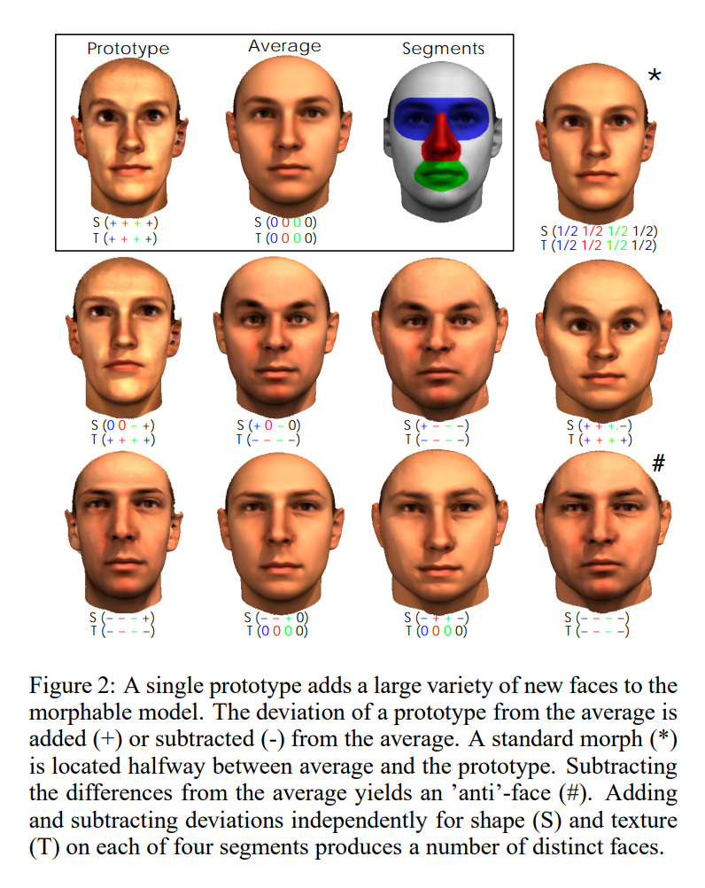
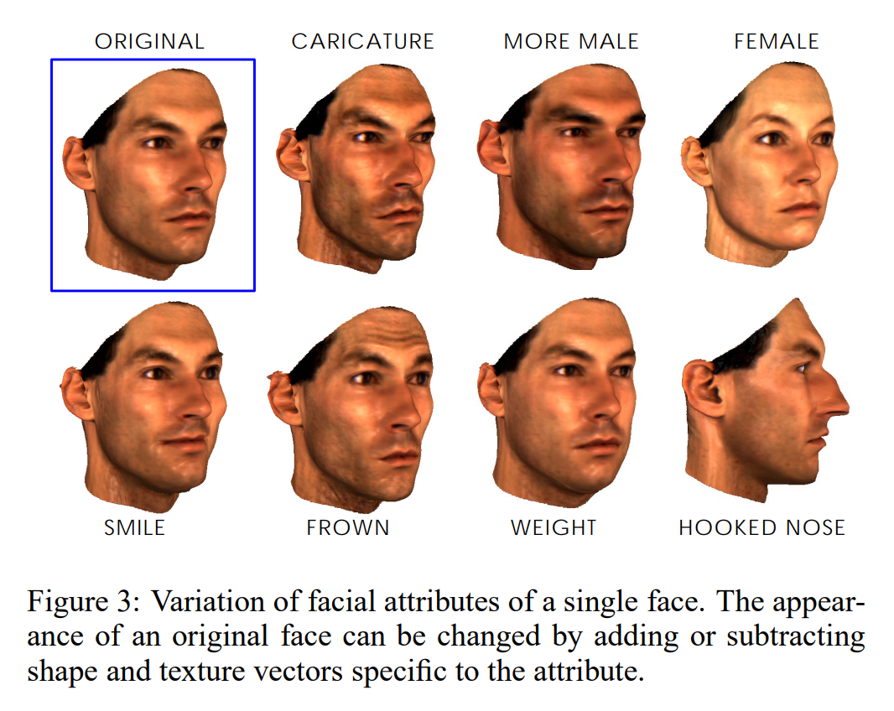

# A Morphable Model For The Synthesis Of 3D Faces

## 3 Morphable 3D Face Model
变形模型基于一个3D人脸数据集。在不同的人脸之间实现变形需要所有人连的完全对应。

一共有m个人脸，每个人脸的三维信息中有n个顶点
形状向量$S=(X_1,Y_1,Z_1,X_2,Y_2,Z_2,...,X_n,Y_n,Z_n)^T\in \mathbb{R}^{3n}$，n个顶点的三维坐标
纹理向量$T=(R_1,G_1,B_1,R_2,G_2,B_2,...,R_n,G_n,B_n)^T\in \mathbb{R}^{3n}$，n个顶点的RGB值

使用m个样本构建人脸模型，可以表示为m个样本的线性组合：
$$
\textbf{S}_{mod}=\sum_{i=1}^m a_i \textbf{S}_i,
\textbf{T}_{mod}=\sum_{i=1}^m b_i \textbf{T}_i,
\sum_{i=1}^m a_i=\sum_{i=1}^m b_i=1
$$

将变形模型定义为人脸$(S_{mod}(\vec{a}),T_{mod}(\vec{b}))$的集合，由系数$\vec{a}=(a_1,a_2,...,a_m)^T,\vec{b}=(b_1,b_2,...,b_m)^T$确定。那么新的人脸就可以通过改变$\vec{a},\vec{b}$来控制生成的形状和纹理。
对于一个可用的人脸合成系统，能够量化生成结果的真实性（合理性、可信性）是很重要的。因此估计了人脸样本集合的系数$a_i,b_i$的概率分布
。这一分布让我们能够控制系数$a_i,b_i$的的似然，因此能够控制生成人脸外观的似然。
我们用包含200个人脸的数据集去拟合了一个多元正态分布，基于平均形状$\bar{S}$和平均纹理$\bar{T}$以及通过差值$\Delta S_i=S_i-\bar{S},\Delta T_i=T_i-\bar{T}$计算得到的协方差矩阵$C_S,C_T$

PCA是数据压缩的一个常用的技术。它可以实现一个基本的正交坐标系的转换操作。

对人脸形状和纹理进行PCA：
1. 计算$\bar{S}, \bar{T}$
2. 中心化：$\Delta S=S - \bar{S},\Delta T=T - \bar{T}$
3. 计算协方差矩阵$C_S,C_T$
4. 求特征值和特征向量$(\alpha, s),(\beta, t)$

则：
$$
S_{model}=\bar{S}+\sum_{i=1}^{m-1}\alpha_i s_i,
T_{model}=\bar{T}+\sum_{i=1}^{m-1}\beta_i t_i, \qquad (1)
$$

**Segmented morphable model:** 公式(1)中描述的变形模型的形状和纹理都有$m-1$个自由度。可以通过将人脸区域分成几个在变形上相互独立的单独子区域来提升模型的表达能力，例如分成眼睛、鼻子、嘴巴以及一个外围区域，见Figure 2.由于假定所有的人脸都相互关联，因此可以在一个参考人脸上定义这些区域。这个分割的操作等同将人脸的特征空间分解成几个独立地子空间。一个完整的3D人脸是这些每个独立部分的线性组合。

### 3.1 Facial attributes
模型中所用的系数并不对应人类理解上的人脸属性。人脸属性中有一些比较容易量化，例如嘴巴的宽度等，还有一些无法量化，例如骨感程度或者女性化程度。本节给出一种将人脸属性映射到参数空间的的方法，这些属性是通过认为标注得到的。对于人脸空间的每个位置，都定义一个形状和纹理向量，当把这些向量加到人脸上或从人脸上减去的时候就会调整某个具体的特征而不改变其他特征。
表情可以通过同一个人的不同表情的图片间的差异得到
与表情不同，面部属性对于同一个人是不变的，因此也更难分离。下面的方法是我们可以对包含性别、丰满程度、眉毛颜色的深度、双下巴和鼻子形状等在内的人脸属性进行建模，如Figure 3.在一组有人工标注的描述属性显著性标签$\mu_i$的一个人脸集合$(S_i,T_i)$上计算加权和：
$$
\Delta S = \sum_{i=1}^m\mu_i(S_i-\bar{S}), \qquad
\Delta T = \sum_{i=1}^m\mu_i(T_i-\bar{T}). \qquad (3)
$$
可以在一张人脸上加上或减去$(\Delta S, \Delta T)$.
为了提升这个方法，令$\mu(S,T)$作为描述一个人脸$(S,T)$属性显著性的总体函数。由于$\mu(S,T)$本身并不是对于所有人脸$(S,T)$都适用的，因此就需要解决根据一组带标签人脸来估计$\mu(S,T)$的回归问题。因此为了获取特征的$\Delta \mu$，整个人脸空间只存在一个最优的方向$(\Delta S, \Delta T)$
另一种人脸属性是人脸的“特殊性”，通常在人脸漫画中较为突出。可以通过增大与平均人脸的距离来实现漫画效果。我们的方法中，通过给系数$\alpha_i,\beta_i$乘一个常数实现。

## 4 Matching a morphable model to images
框架中关键的一部分是一个自动将变形人脸模型和图片进行匹配的算法。如Figure 4所示，给定一个人脸的3D结构，算法会缩小对人脸的特定修改和典型应用的数据类型间的差距。
3D模型的系数和一组渲染参数一起进行优化，这样就可以生成一张与输入图片尽可能一致的图片。