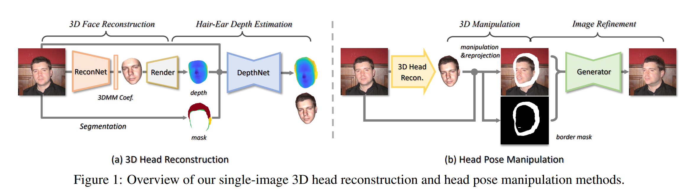

# Deep 3D Portrait from a Single Image

## Abstract
单张人像图片的头部3D重建方法。用一个参数化的3D人脸模型和一个包括头发和耳朵的头部其他区域的深度图来表示头部几何信息。提出一个二阶段范式来学习从人脸图重建3D头部的方法，首先学习使用自重建从单张图片获取人脸形状，然后使用立体匹配方法的成对图片学习头发和耳朵几何信息。第二步在第一步输出的基础上，不仅提升精度而且保证头部的全局几何一致性。

## 1. Introduction
学习单张图片的3D头部几何重建至少需要面对两个挑战。首先，人像图片的gt中携带的3D几何信息对于CNN的训练来说太少了，尤其是头发这种在3D扫描中会出现问题的部分。为了解决这个问题，提出一个头部几何估计的无监督学习流程。人脸部分则直接使用3DMM方法回归得到3DMM参数。而对于头发和耳朵，提出利用视角变化，在从视频提取的图片对上进行训练。第二个挑战是如何保证连续的头部结构，因为它是由两个单独的部分构成的。提出一个两步形状学习范式，其中使用复原的人脸几何信息作为深度网络的条件输入，并设计兼顾人脸和头发几何信息的层一致性的loss函数。

## 3. Overview and Preprocessing
框架入Figure 1所示。在图像经过预处理之后，运行两阶段3D重建，通过两个CNN来估计3D头部姿态和形状。针对头部姿态操作，首先调整重建的3D模型的姿态并将其重新映射到图片平面，然后使用一个优化CNN获取最终结果。

**Preprocessing.** 先对齐，然后进行人脸分割得到头部区域$\mathcal{S}$,包含面部、头发和耳朵区域

## 4. Single-Image 3D Head Reconstruction
使用的相机透视模型的焦距是根据经验选择的。头部姿态由旋转矩阵$\textbf{R}\in \text{SO}(3)$和平移矩阵$\textbf{t}\in \mathcal{R}^3$确定的，且参数化为$\textbf{p}\in \mathcal{R}^7$，通过四元数表示其旋转。

### 4.1. Face Reconstruction and Pose Estimation
3DMM方法

### 4.2. Hair&Ear Depth Estimation
下一步是为头部的其他区域估计深度图
由于缺少真实的深度数据，所以使用视频中图片对来训练一个网络。只在训练的时候使用成对数据
令$I_1,I_2$代表一个人在视频中头部姿态不同的一个图片对