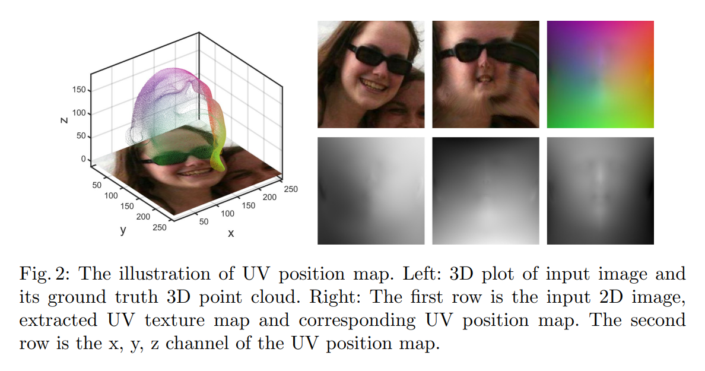

# Joint 3D Face Reconstruction and Dense Alignment with Position Map Regression Network

设计了一个2D表示称为UV位置图，在UV空间记录面部的3D形状，训练一个简单的CNN从2D图片回归得到UV位置图。还在loss函数中引入一个权重掩码来提升性能。

## 1 Introduction
提出一个端到端的方法用来联合预测密度对齐和3D人脸形状的重建，方法称为位置图回归网络(Position map Regression Network, PRN)。我们设计了一个UV位置图，是一张2D的图片，其中记录了一组完整的面部点云的3D坐标，同时在每个UV位置上保留了语义信息。然后用一个加权loss训练一个简单的编码解码网络，更关注通过一张2D图片回归得到UV位置图的判别区域。

## 2 Related Works

## 3 Proposed Method
### 3.1 3D Face Representation
目标是通过一张2D图片回归出3D面部几何结构以及对应的密度信息。因此需要一个可以直接通过深度网络预测的表示。一个简单的想法是将全部3D人脸点的坐标组成一个向量并用一个网络进行预测。但是这种变化增加了训练的难度，因为3D空间到1D向量的映射忽略了点与点之间的空间连接信息。
回归点坐标的方法计算量太大，难以训练。
体积回归网络(Volumetric Regression Network, VRN)输出一个3维的体积作为离散的点云。VRN可以用全卷积形式，但是离散的形式限制了点云的分辨率，而且网络输出大多数位置对应的都不是表面位置，也就没有太大用处。
为了解决这一问题，提出UV位置图作为人脸完整3D结构的表示。位置图是一张记录了UV空间中所有点位置的2D图片。

### 3.2 Network Architecture and Loss Function
因为网络将输入的RGB图像变换成位置图，所以采用一个编码解码结构来学习变换函数。由于位置图同时包含了完整的3D信息以及密度对齐的结果，所以无需额外的网络模块，结构如Figure 3所示。

MSE是常用的损失函数，但是MSE对每个点的处理方式是相同的，所以并不是很适合位置图的学习任务。由于面部中央区域有更多的可判别特征，因此在loss函数中引入权重掩码。
如Figure 4所示，权重掩码是一张灰度图，记录了位置图上每个点的权重。它与位置图上的像素是一一对应的。
假设预测的位置图为$P(x,y)$，gt位置图为$\tilde{P}(x,y)$，权重掩码为$W(x,y)$，则loss函数定义为：
$$
Loss=\sum \lVert P(x,y) - \tilde{P}(x,y) \rVert \cdot W(x,y)
$$
采用的权重比例为：
子区域1（68个关键点）：子区域2（眼睛，鼻子，嘴）：子区域3（面部其他区域）：子区域4（脖子）=16:4:3:0

### 3.3 Training Details
使用的数据集是300W-LP