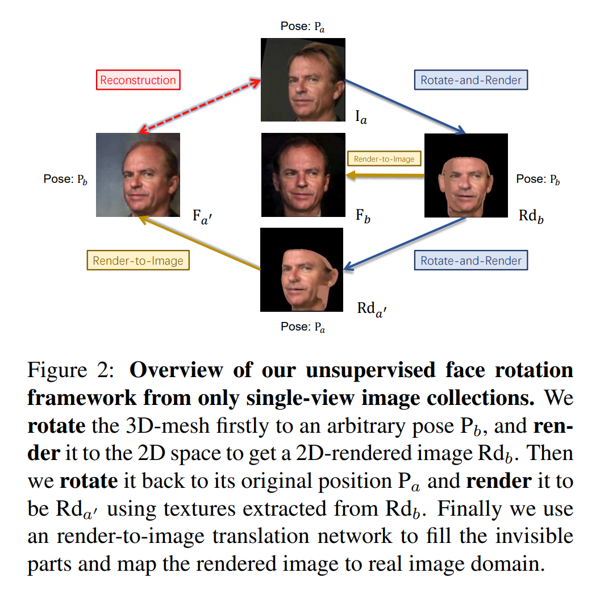
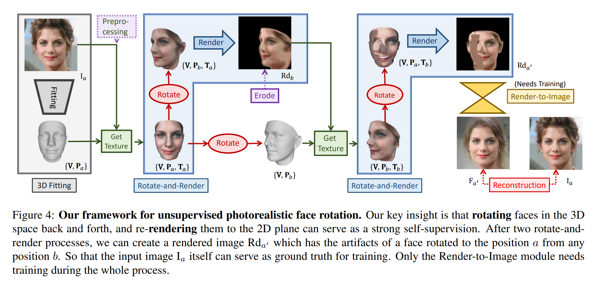
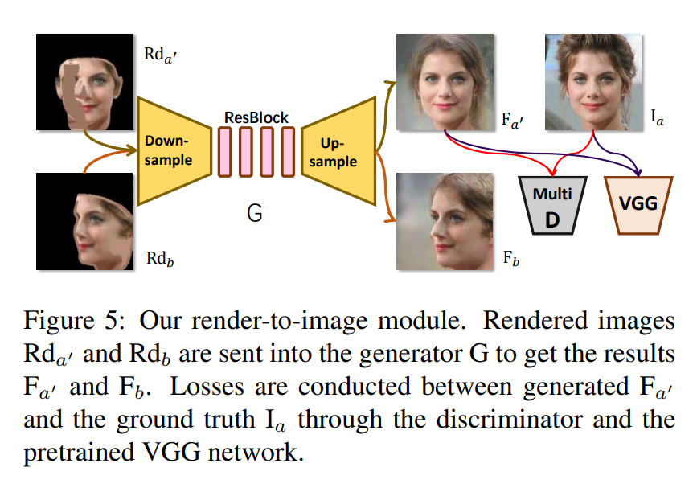
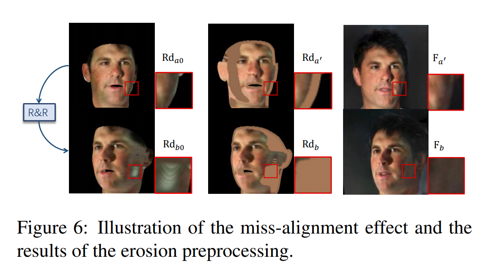

# Rotate and Render

## Abstract
> Our key insight is that rotating faces in the 3D space back and forth, and re-rendering them to the 2D plane can serve as a strong self-supervision
> 
在3D空间内来回旋转人脸并将它重新渲染到2D平面可以作为一种强自监督的手段。
关键在于生成并消除旋转造成的伪影。
给定一个姿态为$P_a$的人脸，首先旋转其3D模型到姿态$P_b$，然后将其渲染至2D空间得到一个2D渲染后的图片$Rd_b$.然后将其旋转回其最初的姿态，并使用从$Rd_b$上提取的纹理渲染得到$Rd_{a'}$.最终使用一个image-to-image的变换网络来填充不可见部分并将图片映射到真实图片的域上(GAN)。如Figure 2所示

## 3. Our Approach
**Overall Framework.** 整个框架分为三部分：3D人脸匹配、准备训练数据的rotate-and-render策略以及render-to-image的变换模块
### 3.1. 3D Face Modeling and Render
**3D Face Fitting.** 
**Acquiring Textures.**
**Rendering.**

### 3.2. Rotate-and-Render Training Strategy
Rotate-and-Render包含两个rotate-and-render操作。核心思想是创建将有遮挡的人脸旋转至正面而引入的伪影并将其消除。整个流程如Figure 4所示。

给定一张输入图片$\textbf{I}_a$，首先通过一个3D人脸拟合模型获取对应的3D模型参数：
$$
\{\textbf{V},\textbf{P}_a\}=\text{Fitting}(\textbf{I}_a),
$$
其中$a$代表该人脸当前的姿态，其参数为$\textbf{P}_a=\{f,\textbf{R}_a,\textbf{h}_{2d}\}$.其顶点的纹理信息为：
$$
\textbf{T}_a=\text{GetTex}(\textbf{I}_a,\{\textbf{V},\textbf{P}_a\})
$$
然后通过将$\textbf{R}_a$乘上一个旋转矩阵$\textbf{R}_{random}$得到$\textbf{P}_b=\{f,\textbf{R}_b,\textbf{h}_{2d}\}$，将这个3D表示旋转到另一个随机的2D视角b.然后渲染当前的3D模型得到$\text{Rd}_b=\text{Render}(\{\textbf{V},\textbf{P}_b,\textbf{T}_a\})$.这就完成了第一个rotate-and-render的操作。
此时，可以获得另一组纹理信息：
$$
\textbf{T}_b=\text{GetTex}(\text{Rd}_b,\{\textbf{V},\textbf{P}_b\})
$$
我们发现视角b中纹理正确的点集是视角a中纹理正确点集的子集。所以与之前其他需要gt图片$\textbf{I}_b$作为监督来复原b视角的方法不同，我们提出将$\textbf{T}_b$作为输入来复原$\textbf{T}_a$
实际上我们将3D姿态$\textbf{P}_b$旋转回$\textbf{P}_a$然后渲染得到其原始的2D姿态：
$$
\text{Rd}_{a'}=\text{Render}(\{\textbf{V},\textbf{P}_a,\textbf{T}_b\})
$$
这个$\text{Rd}_{a'}$中的伪影就是由于在2D空间中将人脸从视角b旋转到视角a造成的。这样就得到了输入和gt数据对$\{\text{Rd}_{a'}, \textbf{I}_a\}$用于训练。
整体流程示意如下：

### 3.3. Render-to-Image Generation
为了去掉伪影并将$\text{Rd}_b$和$\text{Rd}_{a'}$映射到真实图片域，提出render-to-image生成模块，使用生成器$G$生成$\text{F}_{a'}=\text{G}(\text{Rd}_{a'})$和$\text{F}_{b}=\text{G}(\text{Rd}_{b})$,如Figure 5所示。

基础的生成器来自于CycleGAN，足以应付我们数据集中的大多数图片。多层判别器和感知loss则直接借用于Pix2PixHD.判别器的损失函数包含了对抗损失
$$
\mathcal{L}_{\text{GAN}}(\textbf{G,D})=\mathbb{E}_{\text{I}}[\log \textbf{D}(\textbf{I}_a)]+\mathbb{E}_{\text{Rd}}[\log (1-\textbf{D}(\textbf{G}(\textbf{Rd}_{a'})))]
$$
以及一个特征匹配损失。特征匹配损失是通过从判别器的多个层中提取特征并对输入图片和生成图片进行正则化得到的。使用$F_D^{(i)}(\textbf{I})$代表对于输入I，在判别器第i层提取的特征。对于全部$N_D$层，特征匹配损失可以表示为：
$$
\mathcal{L}_{FM}(\textbf{G,D})=\frac{1}{N_D}\sum_{i=1}^{N_D} \lVert F_D^{(i)}(\textbf{I}_a)-F_D^{(i)}(\textbf{G}(\textbf{Rd}_{a'})) \rVert_1
$$

感知loss通过使用ImageNet预训练的VGG网络实现。感知loss用于对生成结果和生成的id进行正则化。它和$\mathcal{L}_{FM}$很相似，用$F_{vgg}^{(i)}$来表示特征，则感知loss可表示为：
$$
\mathcal{L}_{vgg}(\textbf{G,D})=\frac{1}{N_{vgg}}\sum_{i=1}^{N_{vgg}} \lVert F_{vgg}^{(i)}(\textbf{I}_a)-F_{vgg}^{(i)}(\textbf{G}(\textbf{Rd}_{a'})) \rVert_1
$$

完整的目标函数为：
$$
\mathcal{L}_{total}=\mathcal{L}_{\text{GAN}}+\lambda_1\mathcal{L}_{FM}+\lambda_2\mathcal{L}_{vgg}
$$

### 3.4. Building Block Details
**3D Fitting Tool.** 使用3DDFA方法

**Pre-Render and Erosion.** 由于3D拟合方法存在误差，有的时候顶点会错误地出现在人脸边缘以外的地方。当这种3D对齐的错误发生的时候，背景的像素就会被分配到顶点上。在rotate-and-render过程中，这些错误的纹理会渲染到旋转后的$\text{Rd}_b$上，见Figure 6左边。但是这种伪影在$\text{Rd}_{a'}$上通过rotate-and-render过程难以生成，也就意味着这些伪影在训练数据对上并不存在，因此我们的生成器处理不了它。
解决的办法是对拟合的3D表示$\{\textbf{V}, \textbf{P}_a,\textbf{T}_a\}$进行预渲染得到$\text{Rd}_{a0}$,并对渲染得到的图片使用固定像素进行侵蚀操作。侵蚀操作是在$\textbf{V}$的映射的边缘使用所有顶点的平均颜色进行的。然后将纹理$\textbf{T}_a$更新为：
$$
\textbf{T}_a=\text{GetTex}(\text{erode}(\text{Rd}_a),\{\textbf{V}, \textbf{P}_a\})
$$
这样$\text{Rd}_b$中就只包含存在于$\text{Rd}_{a'}$中的伪影了。侵蚀操作之后的输出见Figure 6.

