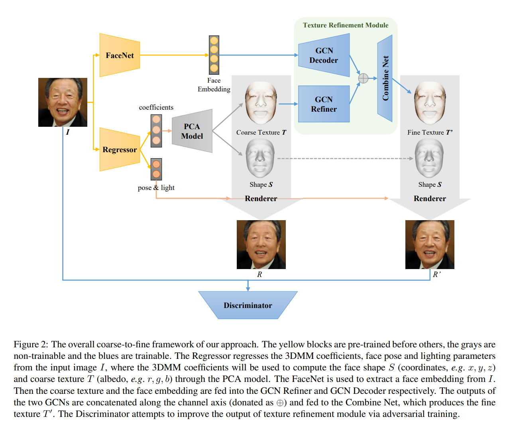
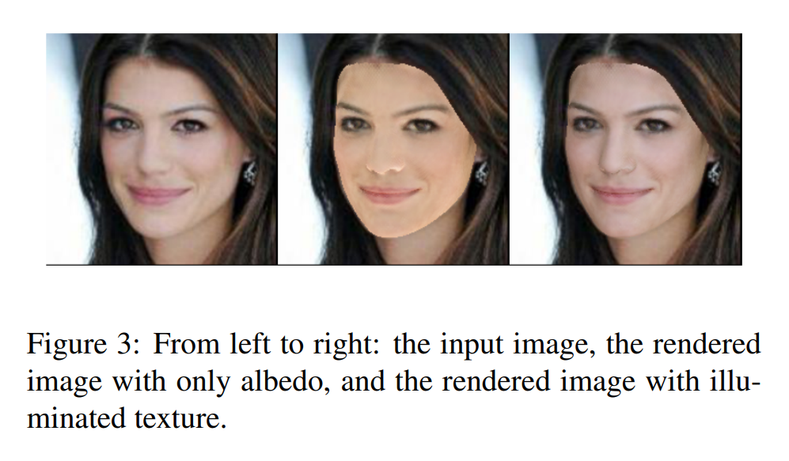
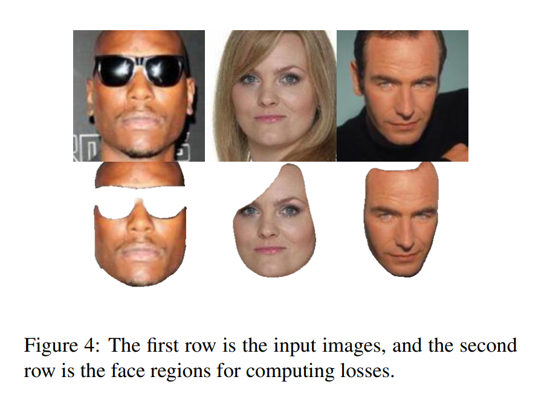

# Towards High-Fidelity 3D Face Reconstruction from In-the-Wild Images Using Graph Convolutional Networks

## Abstract
3DMM方法中涉及的面部纹理复原方法有失真的问题。最近的方法会在大规模的高清UV图上训练一个生成网络来解决这一问题，但是这种方法难以实施。本文介绍一个用从单一图片提取的高清纹理重建3D人脸的方法，而不需大规模的人脸问题数据库。核心思想是根据输入图片的面部细节优化3DMM生成的初始纹理。为此，提出使用图卷积网络来重建mesh顶点的颜色，而非重建UV图。

## 1. Introduction
尽管3DMM方法得到的纹理缺少细节信息，但仍能提供整个人脸全局的合理的颜色。也就可以在这个初始的纹理基础上进行优化。具体使用GCN对图片特征进行解码并将细节RGB值传播到人脸mesh上。
我们的重建框架采用由粗到细的方法，基于3DMM模型和GCN. 训练一个CNN来回归3DMM系数（id、表情、纹理）并根据2D图片渲染参数（姿态、光照）。通过3DMM模型，可以得到面部形状和初始的纹理信息。然后关键一步，使用一个预训练好的CNN来提取面部特征，并传入一个GCN来生成顶点的精细颜色。采用一个微分渲染层来实现自监督训练，并通过GAN loss来提升效果。

## 2. Related Work

## 3. Approach

提出的coarse-to-fine方法如Figure 2所示，框架由3个模块组成。特征提取模块包含一个用于回归3DMM系数、面部姿态、和光照参数的回归器以及一个用来提取特征的FaceNet模型。纹理优化模块由三个GCN组成：一个GCN解码器用于对FaceNet提取的特征进行解码并为mesh顶点生成精细颜色；一个GCN优化器用于优化回归器生成的顶点颜色；以及一个合并器将两个结果进行合并得到最终的顶点颜色。判别器会通过对抗训练的方式提升优化效果。

### 3.1. 3DMM Coefficients Regression
算法的第一步是回归3DMM系数并用CNN根据输入图片渲染参数。使用一个现有的3DMM算法。给定一张2D图片I，算法回归得到一个257维的向量$(c_i,c_e,c_t,p,l)\in \mathbb{R}^{257}$,其中$c_i\in \mathbb{R}^{80},c_e\in \mathbb{R}^{64}, c_t\in \mathbb{R}^{80}$分别代表3DMM身份、表情和纹理系数。$p\in \mathbb{R}^6$是人脸姿态，$l\in \mathbb{R}^{27}$是光照。根据这些预测的系数就可以得到人脸顶点的3D位置S和反射值T
用预训练的FaceNet模型提取的人脸特征有两个用处：1. 解码器用于生成细节颜色；2. 用来衡量id距离

### 3.2. Differentiable Rendering
使用可微渲染层实现自监督训练。将人脸mesh渲染到2D图片，然后计算渲染图与原图的loss.
具体上，根据形状S，纹理T和回归器生成的姿态，可以计算出投影到输入图片上的人脸albedo. 因为投影后的人脸albedo并不是最终结果，所以会加入光照然后渲染得到最终图片R，将它与原图作比较，如Figure 3所示。

### 3.3. Texture Refinement Module
纹理优化模块由三个GCN组成，分别是解码器、优化器和合并网络。与其他使用UV图作为人脸纹理表示的方法不同，我们直接操作albedo RGB值。采用由一组顶点和三角组成的人脸纹理mesh，表示为$M=(V,A)$，其中$V\in \mathbb{R}^{n\times 3}$其中保存顶点颜色，$A\in \{0,1\}^{n\times n}$是邻接矩阵，代表三角。归一化后的拉普拉斯矩阵表示为$L=I-D^{-1/2}AD^{-1/2}$，其中I是单位阵，D是对角度矩阵。谱图卷积操作$*$定义为两个矩阵在傅里叶空间的哈达玛积$x*y=U((U^Tx)\odot (U^Ty))$，其中U是拉普拉斯矩阵的特征向量。
解码器以特征向量为输入，并生成每个顶点的albedoRGB值。结构上由四个谱残差块构成。每两个谱残差块间加入一个谱上采样层。每个谱残差块包含两个切比雪夫卷积层和一个shortcut层。每个切比雪夫卷积层使用K=6的切比雪夫多项式然后再接一个ReLU层。
优化器使用谱卷积层对3DMM模型得到的顶点颜色进行优化。它同样包含与解码器中类似的谱残差块。但是只在网络的顶端和底端各有一个下采样层和上采样层。
为了得到最终包含细节信息的顶点颜色，使用一个合并网络将解码器和优化器的输出沿通道方向拼接到一起，然后传入一个图卷积层+一个tanh激活层。
由于没有用到3D人脸数据，所以对原始图片和根据重建3D人脸渲染得到的图片使用一个判别器。训练的时候采用WGAN中的梯度惩罚。

### 3.4. Losses
#### 3.4.1 Pixel-wise Loss
最直接的目标就是最小化输入图像和渲染图象的差距。但是由于输入图片存在遮挡（如自遮挡、眼镜、口罩等），所以只计算有效人脸区域$M_{face}$的欧几里得距离。人脸区域是通过一个分割网络获取的，并使用面部、眉毛、眼镜、鼻子和嘴来计算loss，如Figure 4所示。

像素loss定义为：
$$
L_{pix}(x,x')=\frac{\sum M_{proj}M_{face}\lVert x-x' \rVert_2}{\sum M_{proj}M_{face}}
$$
其中x是输入图片，x'是带光照的渲染图片，$M_{proj}$代表face mesh的投影区域。

#### 3.4.2 Identity-Preserving Loss
使用像素loss可以保证生成效果大体上不错。但是重建的3D人脸也许看起来不像输入的2D图片。因此用cosine距离作为identity-perserving loss

#### 3.4.3 Vertex-wise Loss
由于遮挡区域的存在，优化模块中的GCN也许无法合理地学习纹理的RGB值。因此构造了一个vertex-wise loss，利用回归器预测的纹理作为优化模块训练早期的辅助，然后逐渐降低vertex-wise loss的权重。为了捕捉到人脸上的细节，还通过将面部顶点投影到2D图片然后将其和3DMM纹理的RGB值一起传入优化器来获取顶点的颜色$T_p$. 则vertex-wise loss定义为：
$$
L_{vert}(x,x')=\frac{1}{N}\sum_{i=1}^N\lVert x_i-x_i' \rVert_2
$$
其中N是顶点数量。$x_i$是$T_p$（回归器生成）的顶点颜色，$x_i'$是优化后的顶点颜色$T'$

#### 3.4.4 Adversarial Loss
对抗训练采用Improved Wasserstein GAN的范式，其对抗损失定义为：
$$
L_{adv}(x,x')=
$$